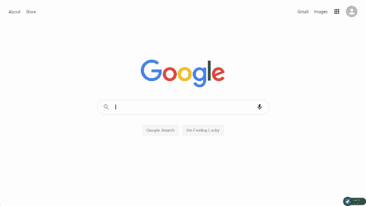
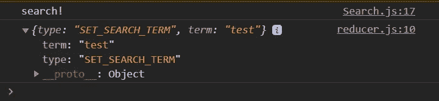

# 构建谷歌克隆——第 2 部分:搜索组件

> 原文：<https://betterprogramming.pub/building-a-google-clone-part-2-the-search-component-945e705d3b87>

## 使用 React 添加搜索图标、功能和可重用组件


马库斯·温克勒在 [Unsplash](https://unsplash.com?utm_source=medium&utm_medium=referral) 上拍摄的照片。

你是想让你的开发者技能更上一层楼，还是想给你未来的雇主留下深刻印象？然后构建这个[谷歌克隆](https://clone-5ebs.web.app/)！

如果你卡住了，不要担心！我将在每一节的结尾为您提供完整的代码。此外，在本教程的最后一期中，我将让您访问我的 GitHub 上的完整源代码。

# 第二部分

在本系列的第 1 部分中，我们设置了 React 项目，安装并设置了 React 路由器，创建了主页标题，并添加和设计了 Google 徽标。

在这一部分，我们将创建`<Search/>` 组件，并完成谷歌主页。


带有搜索组件的最终谷歌主页。

# 1.构建搜索组件

将搜索栏创建为组件的原因是为了以后在`SearchPage`组件中重用它。

*   在`components`文件夹中，创建一个名为`Search.js`的文件。
*   一旦你在文件中，输入`rfce`来使用 ES7 片段*中的片段。*
*   还是在`pages` 文件夹中，做一个`Search.css`文件，导入到你的`Search`组件中。
*   在`Search.js`文件中，用`search`的`className`创建一个`form`。该容器将有一个带有`search__input`的`className`的`<div>`子容器。`search__input`将进一步包含一个`<SearchIcon>`、一个`input`和一个`<MicIcon>`。
*   从 [Material-UI](https://material-ui.com/) 中导入两个图标:

```
import SearchIcon from "@material-ui/icons/Search";
import MicIcon from "@material-ui/icons/Mic";
```

现在我们要创建两个按钮:`Google Search`和`I’m Feeling Lucky` *。*

*   用`search__buttons`的`className`创建一个`<div>`容器。
*   导入并插入两个带有`outlined`变体的`<Button>`组件。这是来自 [Material-UI](https://material-ui.com/) 的一个属性，它将设计按钮的样式。
*   将`Google Search`按钮类型定义为`submit`。这样，谷歌搜索不仅在你点击按钮时有效，在你按下回车键时也有效。
*   至此，您的`Search.js`文件应该如下所示:

*   为了给我们的`Search.js`组件添加一些样式，打开`Search.css`并添加以下代码:

*   回到`Home.js`文件，导入并渲染`<Search/>` 组件。

我们刚刚建立了谷歌主页的用户界面！

# 2.添加搜索功能

是时候给`<Search/>`组件一些功能了。

*   在`Search.js`文件中，给`Search with Google` 按钮添加一个`onClick` 事件。
*   添加一个`{search]`功能，点击按钮时会触发该功能。
*   创建`search`功能。这个箭头函数接受一个事件(`e`)。在这种情况下，这将是我们添加到按钮的`onClick` 事件。
*   添加`e.preventDefault()`方法防止页面刷新。
*   目前，`search` 函数看起来是这样的:

```
const search = (e) => {
e.preventDefault();
console.log(“search!”);
}
```

为了跟踪用户在搜索栏中输入的文本，我们必须使用[反应状态](https://reactjs.org/docs/state-and-lifecycle.html):

*   从 React 导入`useState`:

```
import React, { useState } from “react”;
```

*   `input`的初始值是一个空字符串:

```
const [input, setInput] = useState(‘‘)
```

*   为了映射`input`的值，将`<input>`元素的`value`属性设置为等于`{input}`。这样，`input`的值将是由`useState`定义的值。
*   为了跟踪用户输入的内容，向`<input>`元素*的添加一个`onChange` 事件。*当一个元素的值被改变时，会出现这种情况。
*   `onChange`触发一个事件(`e`，该事件触发`setInput`函数，该函数将把`input`设置为用户输入的任何值。
*   为了在点击搜索按钮时将用户重定向到搜索页面，我们必须使用来自 [React Router](https://reactrouter.com/web/guides/quick-start) 的`useHistory`钩子。
*   定义一个名为`history`的`const`，它等于`useHistory`:

```
const history = useHistory()
```

*   在箭头功能`search`、**、**内添加这行代码:

```
history.push(“/search”)
```

这将把用户重定向到搜索页面:



*   至此，您的`Search.js`文件应该如下所示:

# 3.使搜索组件可重用

为了在搜索页面中使用`<Search/>`组件，我们必须添加一些额外的代码，以便在组件呈现在搜索页面上时隐藏这两个按钮。


搜索页面上的搜索组件

*   转到`Search.js`。
*   在`search`函数中，传递一个名为`hideButtons`的道具，并将其默认值设置为`false`。

我们现在可以使用一个三元运算符来显示按钮，如果我们没有传递隐藏它们的选项(`!hideButtons`)，或者隐藏按钮，如果我们传递了`hideButtons` 属性。

*   要保留搜索功能并隐藏按钮，请将这两个按钮指定为`search__buttonsHidden`的`className`或*。*
*   最后，在`Search.css`文件中，添加这几行代码:

```
.search__buttonsHidden {
display: none !important;
}
```

# 4.上下文 API + React 挂钩

在教程的这一部分，我们将使用React 钩子和上下文 API 为我们的应用程序实现全局状态管理。
这是一个很好的替代方案。要了解更多，我推荐阅读[卢克·霍尔](https://medium.com/simply/state-management-with-react-hooks-and-context-api-at-10-lines-of-code-baf6be8302c)的这篇文章。

[上下文 API](https://reactjs.org/docs/context.html) 是一种通过组件树传递数据的高效方式。有了上下文，我们可以将用户在搜索栏中键入的内容推送到任何组件都可以访问的数据层中，解决了 [prop drilling](https://sebhastian.com/react-prop-drilling/) 的问题。

*   要使用上下文 API，创建一个名为`StateProvider.js`的文件并粘贴以下代码:

我们还将使用 reducer，一个状态管理器。

*   创建一个名为`reducer.js`的文件，并粘贴以下代码:

*   现在，进入`index.js`，导入`initialState`和`StateProvider`:

```
import reducer, { initialState } from “./reducer”;
import { StateProvider } from “./StateProvider”;
```

*   用穿过`initialState`和`reducer`的`<StateProvider/>`作为道具包裹`<App/>`组件。

您的`index.js`现在应该是这样的:

*   在设置了上下文 API 之后，我们终于可以从这个数据层推送和拉取数据了。
*   回到`Search.js`，从`StateProvider.js`文件导入`useStateValue`，从`reducer.js`文件导入`actionTypes`。
*   现在我们可以利用`Search`组件中的`useStateValue`和`dispatch`。为此，我们打开`Search.js`，将内容更改如下:

*   要检查它是否真的工作，只需在搜索栏中键入“test”并按回车键。这将调度一个动作，该动作也将被打印在控制台中。这意味着我们实际上将数据层中的术语更新为字符串`“test”`，一切正常！



谷歌浏览器中的 JS 控制台


眼睛盯着奖品:这将是最终结果。

# 结论

这部分到此为止。让我们总结一下到目前为止我们所做的工作:

1.  构建了 UI 中的`<Search/>` 组件。
2.  增加了搜索功能，完成了主页。
3.  使`<Search/>` 组件可重复使用。
4.  用 [React 钩子](https://reactjs.org/docs/hooks-intro.html)和[上下文 API](https://reactjs.org/docs/context.html) 实现了全局状态管理。

在下一篇文章中，我们将建立一个定制的 Google API，并开始构建搜索结果页面。敬请期待！