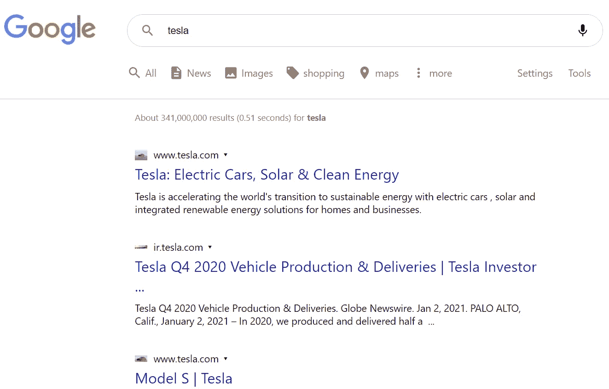
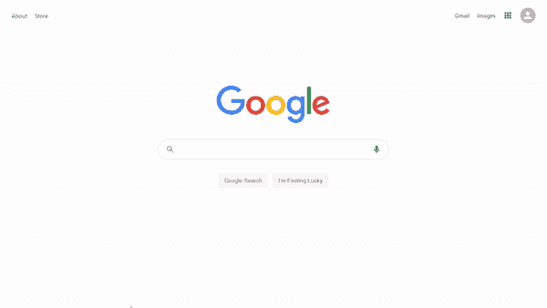
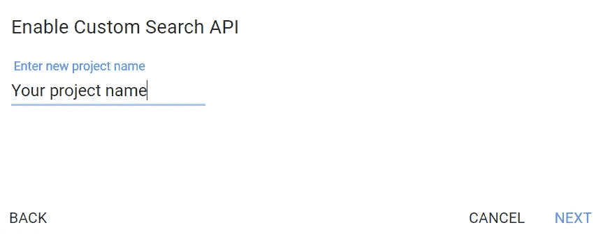
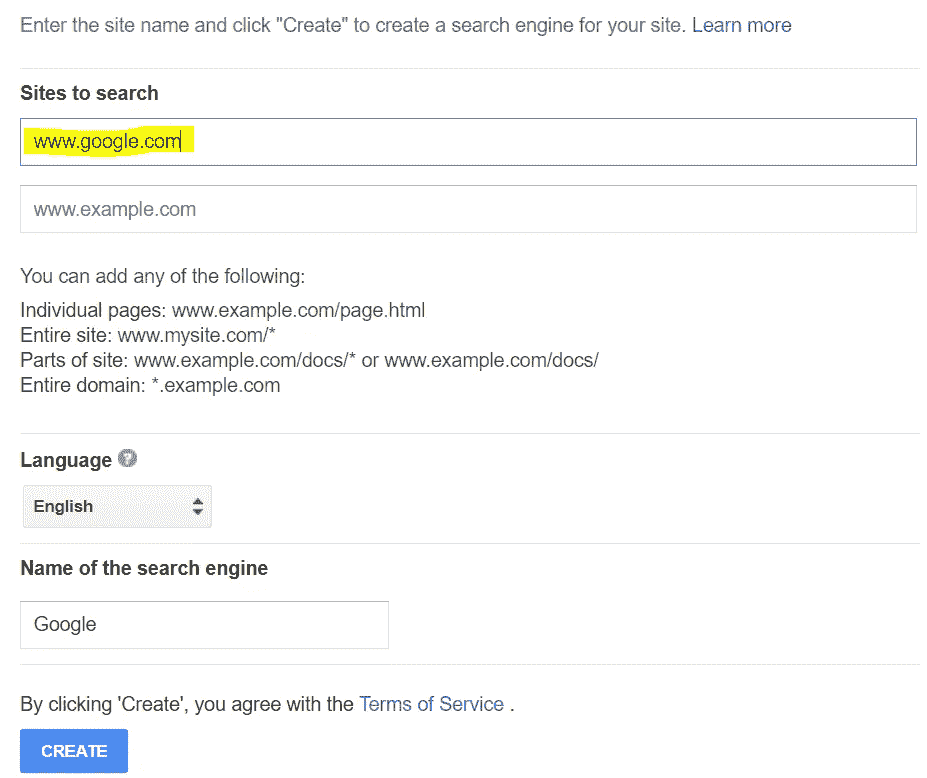
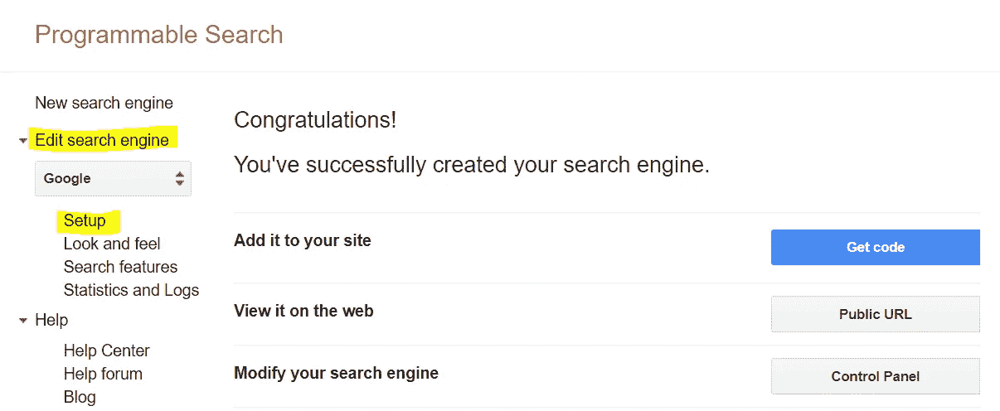
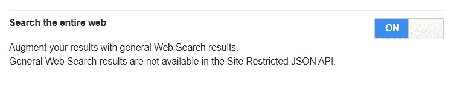
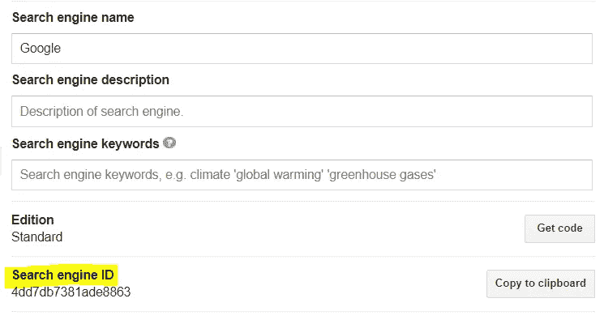
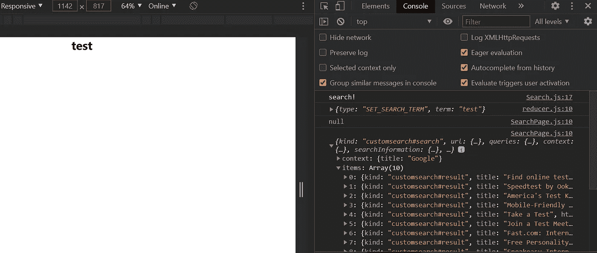
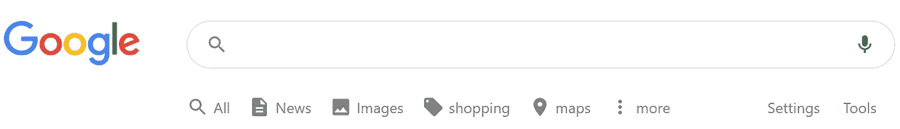

# 构建谷歌克隆—第 3 部分:搜索结果页面

> 原文：<https://betterprogramming.pub/building-a-google-clone-part-3-the-search-results-page-a40e25564cd8>

## 创建一个自定义挂钩，设置 Google 搜索 API，并使用 React 创建搜索结果标题


[Nathana rebou as](https://unsplash.com/@nathanareboucas?utm_source=unsplash&utm_medium=referral&utm_content=creditCopyText)在 [Unsplash](https://unsplash.com/s/photos/google?utm_source=unsplash&utm_medium=referral&utm_content=creditCopyText) 上拍照。

你是想让你的开发者技能更上一层楼，还是想给你未来的雇主留下深刻印象？然后构建这个[谷歌克隆](https://clone-5ebs.web.app/)！

如果你卡住了，不要担心！我将在每一节的结尾为您提供完整的代码。此外，在本教程的最后一期中，我将让您访问我的 GitHub 上的完整源代码。

# 第三部分

在本系列的[第 2 部分](https://medium.com/better-programming/building-a-google-clone-part-2-the-search-component-945e705d3b87)中，我们构建了`<Search/>`组件的 UI，添加了搜索功能，完成了主页，使`<Search/>`组件可重用，并使用 React 钩子和上下文 API 实现了全局状态管理。

在这一部分，我们将设置 [Google 自定义 API](https://developers.google.com/custom-search/v1/introduction) 并开始构建搜索结果页面。



搜索结果页面

# 1.设置搜索结果页面

*   在`pages` 文件夹中，创建一个名为`SearchPage.js`的文件。
*   一旦你在文件中，输入`rfce`来使用 ES7 片段*中的片段。*
*   仍然在`pages`文件夹中，创建一个`SearchPage.css`文件，并将其导入到您的`SearchPage.js`组件中。
*   搜索结果页面将由两个不同的元素组成:标题和结果列表。用`searchPage__header`和`searchPage__results`的`className`制造两个`<div>`。
*   为了检查我们是否可以访问来自数据层的数据，让我们呈现一个包含我们在数据层中推送的术语的`<h1>`。
*   至此，您的`SearchPage.js`文件应该如下所示:

*   回到`App.js`文件，导入并渲染`SearchPage`组件。
*   为了测试这一点，试着在搜索栏中键入任何术语，然后按回车键。这会将您重定向到搜索页面，该术语将出现在屏幕上。



在完成搜索结果页面之前，我们必须设置 [Google 搜索 API](https://developers.google.com/custom-search/v1/overview) 。

# 2.设置 Google 搜索 API

*   导航到[自定义搜索 JSON API](https://developers.google.com/custom-search/v1/overview) 。
*   寻找“API 密钥”，点击“获取密钥”


*   创建一个新项目并同意使用条款。



*   创建一个名为`keys.js`的文件，将您的 API 密匙存储在名为`API_KEY`的`const`中，然后导出它。
*   您的`keys.js`文件应该是这样的:

*   现在，导航到[谷歌的可编程搜索](https://cse.google.com/cse/create/new)。
*   输入“www.google.com”并点击“创建”



*   在左侧栏中，点击“编辑搜索引擎”，然后点击“设置”



*   最后，点击**“**全网搜索”，复制搜索引擎 ID。



*   创建一个名为`useGoogleSearch.js`的文件，并粘贴以下代码:

*   用您之前获得的搜索 ID 替换字符串`“search engine ID”`。

这是一个自定义挂钩，将允许您从谷歌获得搜索结果数据。

*   为了测试这一点，返回到`SearchPage.js`文件，导入`useGoogleSearch`，并将这行代码添加到`SearchPage`函数中:

```
const {data} = useGoogleSearch(term);
console.log(data);
```

*   在搜索栏中键入任何术语，然后按回车键。这将把您重定向到搜索页面，并在控制台上打印一个响应。



Google 自定义搜索 API 响应

当用户在搜索栏中键入一些内容并点击 enter 时，搜索词被推入数据层，由`useStateValue`钩子拉出，并在`useGoogleSearch`定制钩子中传递。这会调用 Google 自定义搜索 API，并将数据作为对象返回。该对象是打印在控制台上的响应。

# 3.完成搜索结果标题

*   回到`SearchPage.js`文件。在带有`SearchPage__header`的`className`的`<div>`中，增加一个`<Link>`组件。然后在里面加上谷歌标志。
*   在`<Link>`组件之后，用`SearchPage__headerBody`的`className`创建另一个`<div>`。这将包含带有`hideButtons`支柱的`<Search/>`组件。
*   要显示搜索栏下的项目，请从 Material-UI 导入并渲染以下图标:

*   至此，您的`SearchPage.js`文件应该如下所示:

*   现在，转到`SearchPage.css`文件并添加以下样式:

干得好。搜索结果标题已完成！



搜索结果标题


眼睛盯着奖品:这将是最终结果。

# 结论

这部分到此为止。让我们总结一下到目前为止我们所做的工作:

1.  设置搜索结果页面。
2.  设置 Google 搜索 API 并创建了`useGoogleSearch`自定义钩子。
3.  已完成搜索结果标题。

在下一篇也是最后一篇文章中，我们将完成搜索结果页面并使用Firebase 部署我们的应用程序。敬请期待！