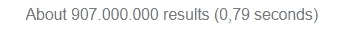
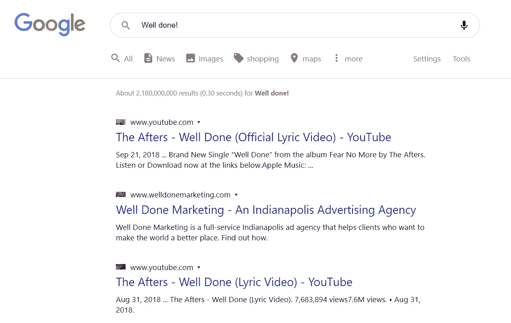
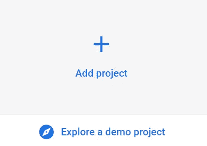
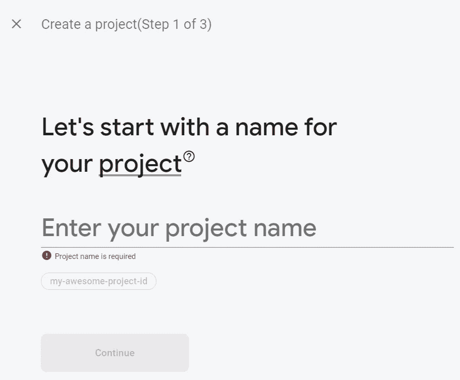
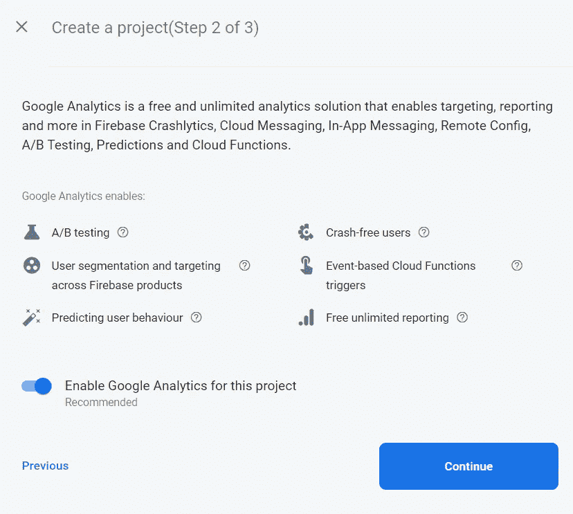
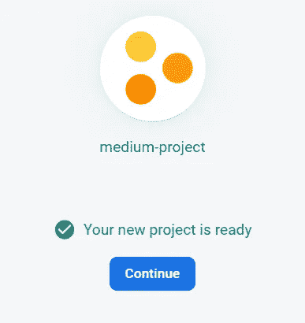
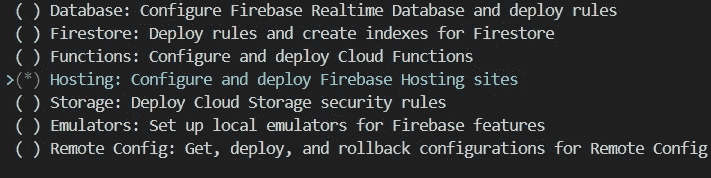
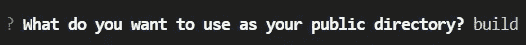
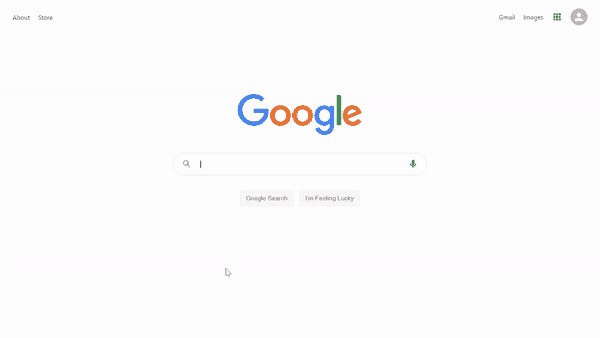

# 构建 Google 克隆—第 4 部分:部署到 Firebase

> 原文：<https://betterprogramming.pub/building-a-google-clone-part-4-deploying-to-firebase-453dee32be48>

## 完成搜索结果页面并部署到 Firebase

Christopher Gower 在 [Unsplash](https://unsplash.com/s/photos/online?utm_source=unsplash&utm_medium=referral&utm_content=creditCopyText) 上拍摄的照片。

你是想让你的开发者技能更上一层楼，还是想给你未来的雇主留下深刻印象？然后构建这个[谷歌克隆](https://clone-5ebs.web.app/)！

# 第四部分

在本系列的 [part 3](/building-a-google-clone-part-3-the-search-results-page-a40e25564cd8) 中，我们设置了 Google 搜索 API，创建了`useGoogleSearch`自定义钩子，完成了搜索结果头。

在这最后一部分，我们将完成搜索结果页面，并使用 Firebase 部署我们的应用程序！

# 1.完成**搜索结果页面**

*   在`SearchPage.js`中，将`
`和`searchPage__results`的`className`用花括号括起来，包括`term`和 JavaScript 逻辑`&&`运算符。这将创建条件呈现——仅当用户提供搜索项时，它才会呈现`searchPage__results` `
`。
*   用`searchPage__resultCount`的`className`添加一个`
`标签。这将显示带有来自 Google API 的实际信息的搜索结果的数量。

搜索结果数量的一个例子

*   要显示结果，映射来自 Google 自定义搜索 API 调用的响应对象。
*   您的最终`SearchPage.js`文件应该如下所示:

最后，让我们给它一些风格。您的最终`SearchPage.css`文件应该如下所示:

干得好！申请终于完成了！

# 2.Firebase 设置

我们终于准备好设置 Firebase 并部署我们的应用程序了。

*   转到[https://firebase.google.com/](https://firebase.google.com/)。
*   一旦你进入 Firebase 控制台，点击“添加项目”

*   为您的项目命名并继续。

*   如果你愿意，打开谷歌分析(但它不会对这个项目有任何影响)。

*   项目现在可以部署了！

# 3.部署

部署前，确保安装好 [Firebase 工具](https://firebase.google.com/docs/cli#install_the_firebase_cli)。

*   现在转到控制台，键入命令`firebase init`。

*   选择“使用现有项目”

*   在要成为的公共目录中键入`build`。

*   将其配置为单页应用程序。
*   现在在控制台中运行`npm run build`。

这将创建您的应用程序的优化版本，该版本将在线托管。

构建完成后，在控制台中键入`firebase deploy`。

一旦你完成了这个，你应该会得到一个你的应用程序在线托管的 URL。[验完矿](https://medium-project-42d34.web.app/)。

恭喜你！你刚刚在 Firebase 上部署了你的谷歌克隆。

你的功能谷歌搜索克隆！

# 结论

你的谷歌克隆完成了！我希望你有乐趣建设这个项目，你设法获得最终结果。

如果你一路上迷路了，看看这个系列的 [part 1](https://medium.com/better-programming/building-a-google-clone-part-1-setting-up-react-fb9c22b9662c) 、 [part 2](https://medium.com/better-programming/building-a-google-clone-part-2-the-search-component-945e705d3b87) 和 [part 3](/building-a-google-clone-part-3-the-search-results-page-a40e25564cd8) 。正如承诺的那样，完整的源代码可以在我的 GitHub 上获得[！](https://github.com/5ebs/Google-Clone)