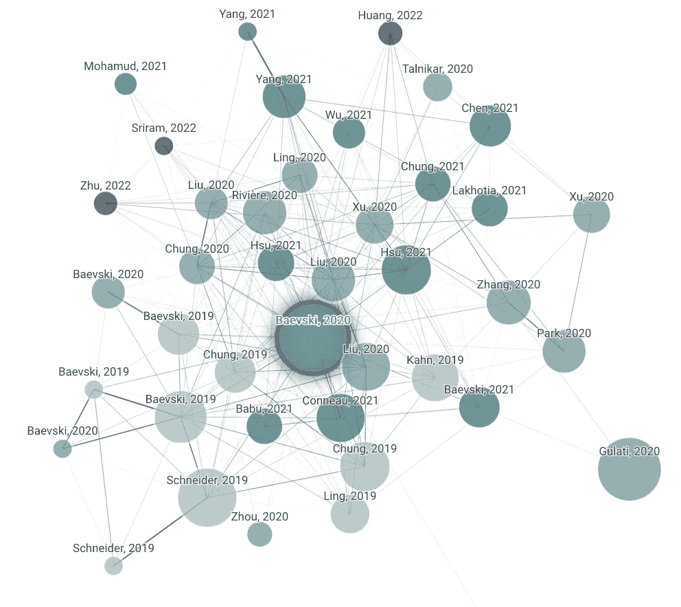
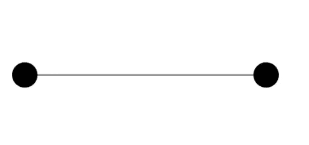
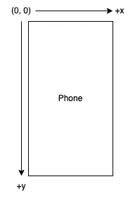
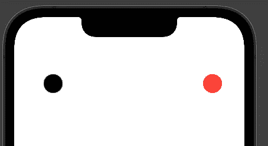
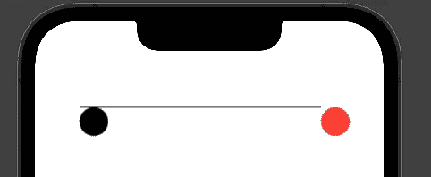
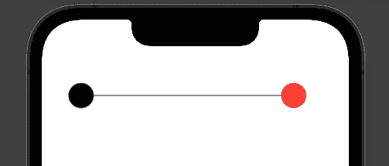

# 使用 SwiftUI 构建图表

> 原文：<https://betterprogramming.pub/building-a-graph-with-swiftui-b16dc48f7fe6>

## 学习图形的基础知识

照片由[алексарцибашев](https://unsplash.com/@lxrcbsv?utm_source=medium&utm_medium=referral)在 [Unsplash](https://unsplash.com?utm_source=medium&utm_medium=referral)

# **先决条件**

*   swift 基础知识(了解如何在 Swift 中编码)
*   SwiftUI 的基础知识(了解 SwiftUI 中的基本组件以及如何使用它们)
*   学习的意愿！

你曾经打开过一个网站，看到过这样的可视化图表吗？

网络图可视化[类似论文](https://www.connectedpapers.com/main/49a049dc85e2380dde80501a984878341dd8efdf/wav2vec-2.0%3A-A-Framework-for-Self%20Supervised-Learning-of-Speech-Representations/graph)

这被称为[网络图](https://en.wikipedia.org/wiki/Network_theory)，通常用于建模许多项目之间的关系。这种图的一些应用是可视化社交网络中的朋友、互联的城市，甚至是你在任何生物学教科书中找到的典型食物链。网络图由两部分组成，顶点和边。顶点代表图形中可视化的项目，边显示相似项目之间的关系。

但是你有没有想过这样的图是怎么做出来的？你如何在图表中排列每一项？我不会对图论和您的应用程序是否需要图论进行过多的详细说明，但我将在本文中向您展示为您的 SwiftUI 应用程序显示这样一个可视化背后的技术细节。

# **好先生图**

在我们深入了解如何构建具有许多顶点和边的复杂图形可视化之前，让我们先从一个基本图形开始。这个简单的图有两个顶点和一条边。它看起来会像这样:

不，这不是大白。这是一个有两个顶点和一条边的图。

首先，我们从我们的背景开始。在 Xcode 中设置一个 SwiftUI 项目(如果你不知道怎么做，可以查看 YouTube 上的教程，比如[这个](https://www.youtube.com/watch?v=tPWUsSELJyY))。你应该从一个空的`ContainerView`开始。

为了给我们的图形提供背景，首先创建一个矩形的`ZStack`作为第一项。对于`ZStack`,我们会给它`topLeading`对齐我们的坐标系(我稍后会解释这一点),对于矩形，给它填充你想要的图形背景颜色。我选择了白色。

我们图表背景的代码片段。

我们的图表通过将每个顶点标绘到`ZStack`中的二维坐标系中来工作。因为我们给了它`topLeading`对齐，坐标(0，0)将从设备屏幕的左上角开始。

设备屏幕上的每个像素代表坐标系中的一个点，向 x 坐标添加一个值会将我们的点向右移动，向 y 坐标添加一个值会将我们的点向下移动。

我们图表的坐标系统。

# 向我的小伙伴们问好。

现在我们有了坐标系，我们可以通过使用 SwiftUI 中的圆形在图形中放置一个顶点(实际上，任何形状都可以，但大多数图形使用圆形来表示顶点)。

我们将修改我们的圆中的两个属性，框架(我们的圆有多高多宽)和偏移量。圆的 offset 属性中的 x 和 y 值决定了圆在图形坐标系中的位置。

例如，如果您为 x 和 y 值输入 50，我们的圆应该出现在设备屏幕左上角附近的某个地方。您可以尝试不同的 x 和 y 值，但您应该记住，x 越大，我们的圆将显示得越靠右，y 越大，我们的圆将放置得越靠下。

画出我们孤独寂寞的顶点的代码片段。

# **在 ZStack** 中，确保我们的圆形(顶点)组件在矩形(背景)组件之后。

现在你应该可以在预览中看到你的顶点了，但是，你可以看到它有点孤单。所以，让我们给它一个朋友，在我们图形的坐标系中的其他地方。对于这个朋友，我将通过给圆的 fill 属性赋予红色值来给她涂上红色。

我们的小顶点朋友的代码片段。:]

您的屏幕现在应该看起来像这样:

两个点。看来你的手机现在有眼睛了。

如果还没有，不要担心，保持冷静，回顾你用上面的代码片段写的代码。

# 感觉急躁。

现在，我们将通过在这两个顶点之间画一条线来使它们看起来像是相互连接的。首先，我们将创建一个新的 Swift 文件，并将其命名为`EdgeShape.swift`。在这个文件中，我们将通过创建一个新的 Struct 并使其符合`Shape`协议并将其命名为`EdgeShape`来向 SwiftUI 添加一个新的 shape 组件。

这个结构有两个属性，start(边的起始坐标)和 end(边的结束坐标)。这些将属于`CGPoint`类型。

为了符合 Shape 协议，这个 struct 必须有一个方法，就是`path(in rect:)`。此方法定义如何在 UI 中绘制此形状。在这个方法的实现中，我们将做四件事:

*   创建路径对象
*   使用`path.move(to:)` 方法将我们的路径移动到起始坐标
*   使用`path.addLine(to:)` 方法从起始坐标添加一条线
*   在方法中返回我们的路径

我们的 EdgeShape 的代码应该是这样的:

我们的边缘形状的代码片段。

现在我们可以回到我们的`ContentView.swift`文件，在`ZStack`中的两个圆形组件之间添加`EdgeShape`组件来绘制一条边。首先，通过创建两个`CGPoint`对象，给`EdgeShape`构造函数一个开始和结束值。

对于起点`CGPoint`，给它的起点 x 和 y 与我们的黑色顶点的坐标相同的值。然后对于末端`CGPoint`，给它的起点 x 和 y 与我们的红色顶点的坐标相同的值。

请注意，即使我们已经使用了 EdgeShape 组件，这条线仍然没有画出来。那是因为我们只画了一条路径，却没有给它任何颜色和粗细。为此，给我们的`EdgeShape`一笔，可选颜色。

第一条边的代码片段。

耶！您已经成功地用一条边连接了两个顶点。但是，您可能会注意到，即使您正确放置了起点和终点坐标，您的边似乎也不在合适的位置。

不在正确位置的顽固边缘。

# 修理它！

不用担心，这种行为是完全可以预料的，因为顶点是通过它的左上角与我们给它的坐标对齐的，而不是中心。我们将解决这个问题，同时为我们的顶点视图重构代码。

首先，创建一个名为`VertexView.swift`的新 Swift 文件。在文件中导入 SwiftUI，然后创建一个新的 struct，该 struct 扩展了名为`VertexView`的`View`,具有类型为 some View 的 body 属性。

这个结构将有另外三个属性，类型为`Double`的`radius`，类型为`Color`的颜色，以及类型为`CGPoint`的坐标。

*   在 body 属性中，我们将定义一个圆，就像我们之前对顶点所做的那样，然后从我们的 color 属性中添加一个 color 属性。
*   然后，给圆一个框架属性，宽度和高度是半径乘以 2，还有一个偏移属性，分别是坐标的 x 和 y 属性。
*   然而，我们现在要用圆的半径减去 x 和 y 值，根据圆的中心来偏移圆。

您的代码应该如下所示:

我们的顶点视图的代码片段。

现在，回到`ContentView.swift`文件，然后用我们新构建的`VertexView`替换我们的每一个 Circle 组件。确保给第一个`VertexView`到我们的`EdgeShape`开始的每一个`CGPoint` x 和 y 值，给第二个`EdgeShape`结束的每一个【顶点视图】。

代码应该如下所示:

我们的内容视图的最终代码片段

现在，我们的用户界面应该是这样的:

图表的起点

接下来，您可以通过添加任意多的顶点和边来试验图形！一旦你这样做了，你就可以尝试从一组`CGPoint`对象中自动显示图形的顶点和边！(提示:在 SwiftUI 中使用带有`ForEach`组件的`CGPoints`数组)。

如果你在教程的任何一点上卡住了，这里是项目的[完整源代码。](https://github.com/m-salman-a/graph-sample)

另外，如果你愿意的话，如果你能看看我用 SwiftUI 从我们学过的图形基础中构建一个力导向图形的项目[那就太好了！](https://github.com/m-salman-a/refgraph)