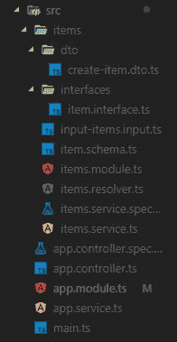
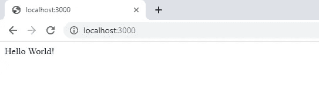
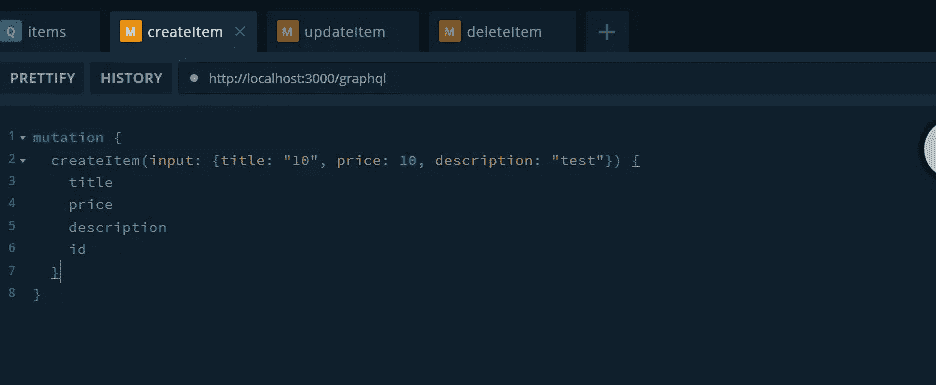
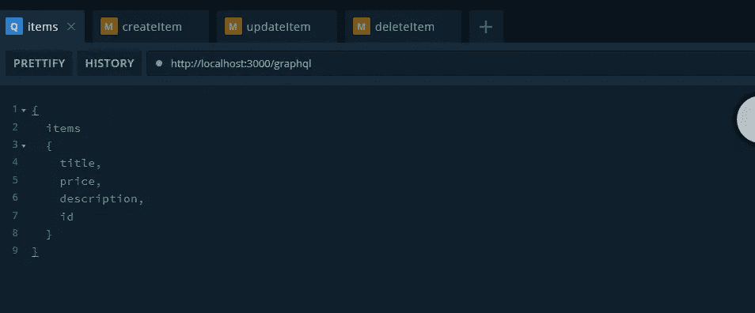
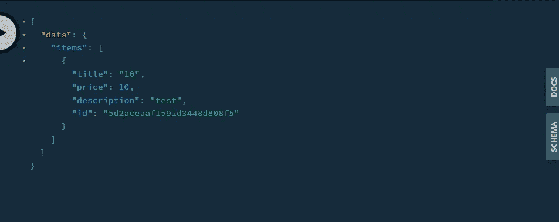
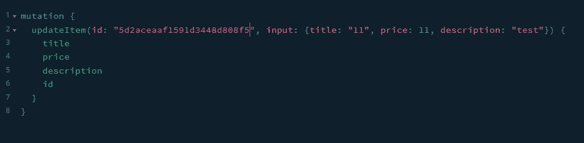
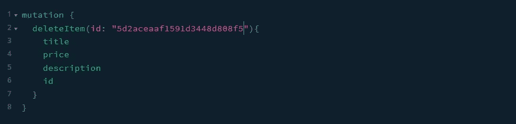

# 在 NestJS 中构建 GraphQL 服务器

> 原文：<https://betterprogramming.pub/building-a-graphql-server-in-nestjs-f9ba34e773a3>

## GraphQL 基础和 NestJS 开发的最佳实践


在 [Unsplash](https://unsplash.com?utm_source=medium&utm_medium=referral) 上由 [Jantine Doornbos](https://unsplash.com/@jantined?utm_source=medium&utm_medium=referral) 拍摄的照片

NestJS 通过为 Node.js 提供开箱即用的适当模块化和可测试的结构，引入了一种使用 node . js 构建后端应用程序的现代时尚方法。默认情况下，它还提供了 TypeScript 和依赖注入支持，这大大提高了我们项目中的代码质量。

今天，我们将通过使用 MongoDB 构建一个简单的数据库 CRUD 应用程序，来深入了解如何使用 NestJS 框架构建一个 GraphQL 服务器。

此外，您将学习 GraphQL 的基础知识和 NestJS 开发的一些最佳实践。

所以，不要再浪费时间了，让我们开始吧。

# 先决条件

要阅读这篇文章，我建议您了解这些技术的基本知识，并安装最新的工具:

*   通过阅读这个[速成班](https://medium.com/free-code-camp/a-crash-course-in-typescript-e6bf9c10946)，你可以获得使用 JavaScript 构建应用程序的合理知识和基本的 TypeScript 知识
*   NestJS 及其构建模块的基础知识，可以在[这篇文章](https://gabrieltanner.org/blog/nestjs-crashcourse)中找到
*   安装在本地系统上的 [Node.js](https://nodejs.org/en/) 和 [MongoDB](https://nodejs.org/en/)
*   GraphQL 基础知识

如果你以前没有使用这些技术的经验，我建议你在继续这篇文章之前，使用列出的资源来获得基本知识。

# GraphQL 基础知识

GraphQL 是一种查询语言和运行时，可用于将 API 构建和公开为强类型模式，而不是杂乱的 REST 端点。用户可以看到该模式，并可以查询他们特别想要的字段。

以下是您需要了解的一些关键概念:

*   模式 GraphQL 服务器实现的核心。描述客户端应用程序可用的功能
*   查询—请求读取或获取值
*   突变—修改数据存储中数据的查询
*   类型—定义 GraphQL 中使用的数据结构
*   解析器—为 GraphQL 查询生成响应的函数集合

NestJS 为我们提供了两种不同的构建 GraphQL 应用程序的方式，分别是模式优先和代码优先。

*   模式优先——在模式优先方法中，事实的来源是 GraphQL SDL(模式定义语言),并且您的 GraphQL 模式的类型定义将由 NestJS 自动生成
*   代码优先—在代码优先方法中，您将只在您的 TypeScript 类中使用声明符来生成相应的 GraphQL 模式

在这篇文章中，我选择了代码优先的方法，因为我个人发现对于没有 GraphQL 经验的人来说，这种方法更容易理解和遵循本教程。

如果您想了解更多关于 GraphQL 及其概念的信息，我强烈建议您查看以下资源:

*   官方[文档](https://graphql.org/learn/)
*   [How to GraphQL](https://www.howtographql.com/) —伟大的初学者学习资源
*   [GraphQL 速成班](https://www.youtube.com/watch?v=ed8SzALpx1Q) —使用 GraphQL 和 React 的完整速成班

# 安装 NestJS 及其依赖项

既然我们知道了我们将要构建什么，以及为什么我们要使用每一种特定的工具和技术，那么让我们从创建项目和安装所需的依赖项开始吧。

首先，让我们安装 Nest CLI 并使用它来创建项目

```
npm i -g @nestjs/cli
nest new nest-graphql
```

之后，让我们进入目录并安装所需的依赖项

```
cd nest-graphql
npm i --save @nestjs/graphql apollo-server-express graphql-tools graphql @nestjs/mongoose mongoose type-graphql
```

现在我们已经安装好了所有的东西，基本的项目设置也已经就绪，让我们来创建要使用的文件。

让我们从使用 NestJS CLI 创建`Module`、`Service`和`Controller`开始

```
nest g module items
nest g service items
nest g resolver items
```

之后，手动创建文件和文件夹，使您的结构如下所示:



你也可以在 [my GitHub](https://github.com/TannerGabriel/Blog/tree/master/nest-graph-ql) 上找到这个结构。

# 启动服务器

设置过程完成后，您现在可以使用以下命令启动服务器:

```
npm run start
```

这将在默认端口 3000 上启动应用程序。现在，您只需在浏览器中导航到 [http://localhost:3000](http://localhost:3000) ，应该会看到类似这样的内容:



NestJS Hello World

# 添加 GraphQL

现在我们已经完成了基本的服务器设置，让我们继续将 GraphQL 依赖项导入到我们的应用程序模块中:

这里我们从`@nest/graphql`导入`GraphQLModule`，我们安装在上面。之后，我们在 imports 语句中使用它，使用的是将一个`option`对象作为参数的`forRoot()`方法。

在`options`文件中，我们指定了启动服务器时自动生成的 GraphQL 文件的名称。这个文件是我们上面讨论的代码优先方法的一部分。

# 与 MongoDB 连接

接下来，让我们通过将`MongooseModule`导入到`ApplicationModule`中来创建一个到应用程序数据库的连接。

这里我们使用`forRoot()`函数，它接受与我们习惯的`mongoose.connect()`函数相同的配置对象。

## 数据库模式

数据模式用于正确构建将存储在应用程序数据库中的数据类型:

这里我们通过导入`mongoose`并使用`mongoose.Schema`创建一个新对象来定义一个模式。

## 连接

接下来，我们将创建一个 TypeScript 接口，用于我们的服务和接收器中的类型检查。

## 数据传输对象

DTO(数据传输对象)是定义数据如何通过网络发送的对象。

## 导入模式

既然我们已经为数据库创建了所有需要的文件，我们只需要将我们的模式导入到我们的`ItemsModule`中。

这里，我们像在`ApplicationModule`中一样导入`MongooseModule`，但是使用了`forFeature()`函数，它定义了将为当前范围注册什么数据库模型。

# 实现 GraphQL CRUD

让我们继续使用 Mongoose 数据库和 GraphQL 端点来实现 CRUD 功能。

## 服务

首先，让我们在服务内部创建数据库 CRUD 功能。

这里，我们首先使用依赖注入在构造函数中导入数据库模型。之后，我们继续使用标准的 MongoDB 函数实现基本的 CRUD 功能。

## 分解器

既然我们已经在服务中实现了 CRUD 功能，我们只需要创建我们的 GraphQL 解析器，在这里我们定义 GraphQL 所需的`Querys`和`Mutations`。

如您所见，我们用不同的方法创建了一个类，这些方法利用了我们之前创建的 ItemService。但是这个类也有一些非常有趣的声明符，所以让我们来看看它们:

*   `@Resolver()` —告诉 Nestjs 这个类知道如何为我们的项目解析动作。
*   `@Query()`—graph QL 中的查询基本上是客户端用来向服务器请求特定字段的结构。在这种情况下，声明符只是说，我们可以使用函数名进行查询，我们稍后会这样做。
*   `@Mutation()`—graph QL 中的突变与 Querys 非常相似，但更多的是对数据进行突变而不是查询。
*   `@Args()` —是一个帮助声明器，用于挖掘输入参数

# E2E 测试应用程序

现在我们已经完成了 CRUD 功能，让我们看看如何使用 Jest 测试库来测试我们的应用程序。

如果您以前从未使用过 Jest，我建议您在继续本节之前先学习基础知识。

首先，我们需要使用下面的命令创建一个新的测试文件。

```
touch test/items.e2e-spect.ts 
```

之后，我们可以继续为我们的模块创建基本的测试设置。

在这个代码块中，我们用测试 AppController 所需的三个模块创建了一个 Nestjs 实例。我们还定义了当所有测试都完成时，实例将被关闭。

接下来，我们创建两个将在 HTTP 请求中使用的 item 对象。

之后，我们可以创建一个 GraphQL 查询来测试项目创建功能，并在我们的 HTTP 请求中使用它。

在这里，我们创建一个查询，并使用 request 函数将其发送到我们的端点，该函数允许我们模拟对服务器的 HTTP 请求。

然后，我们可以使用 expect 函数来验证请求的响应。

这个过程可以对所有端点重复，并留给我们以下结果。

好了，现在我们只需要使用下面的命令来运行测试。

```
npm run test:e2e
```

# 测试应用程序

现在我们已经完成了简单 CRUD 应用程序的构建，让我们使用 GraphQL playground 来测试它。为此，让我们启动服务器，然后导航到我们的游乐场:

```
npm run start
```

启动服务器后，您应该能够在[http://localhost:3000/graph QL](http://localhost:3000/graphql)上看到您的 GraphQL playground。

接下来，让我们继续编写一个创建项目的变异。



创建图表项目

之后，让我们使用这个简单的查询来测试我们的`get`功能:



获取所有项目

现在只剩下更新和删除功能。为此，我们将需要我们之前创建的项目的`id`,您可以通过使用我们的`items`查询来获得它。



获取项目响应

现在让我们在接下来的两个动作中使用这个`id`。



更新现有项目



删除项目

整个项目也可以在我的 Github 上找到:

 [## TannerGabriel/博客

### 我所有博客项目的存储库。在 GitHub 上创建一个帐户，为 TannerGabriel/博客的发展做出贡献。

github.com](https://github.com/TannerGabriel/Blog/tree/master/nest-graph-ql) 

# 推荐阅读

[](https://medium.com/free-code-camp/a-crash-course-in-typescript-e6bf9c10946) [## 打字稿速成班

### Typescript 是 javascript 的类型化超集，旨在简化大型 javascript 应用程序的开发…

medium.com](https://medium.com/free-code-camp/a-crash-course-in-typescript-e6bf9c10946) 

# 结论

你一直坚持到最后！我希望这篇文章能帮助您理解 GraphQL 的基础知识以及如何在 NestJS 中使用它。

如果您发现这很有用，请考虑推荐并与其他开发人员分享。如果你有任何问题或反馈，请在下面的评论中告诉我。

如果你想获得我博客的持续更新，请确保在 Medium 上关注我，并[加入我的时事通讯](https://gabrieltanner.us20.list-manage.com/subscribe/post?u=9d67fc028348a0eb71318768e&amp;id=6845ed3555)。

> 最初发表于 gabrieltanner.org 的[。](https://gabrieltanner.org/blog/nestjs-graphqlserver)