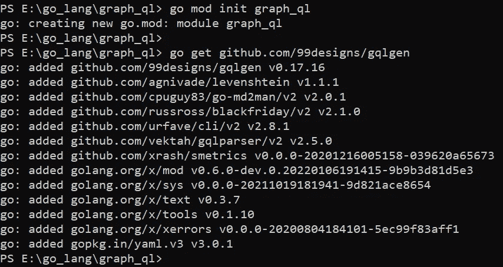
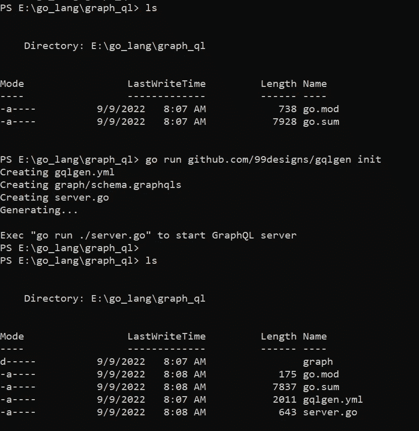
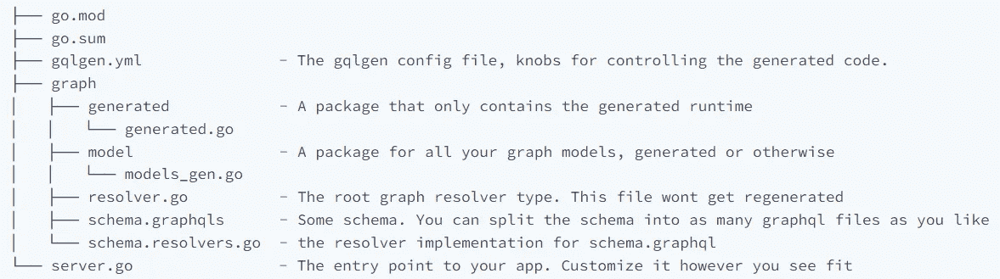
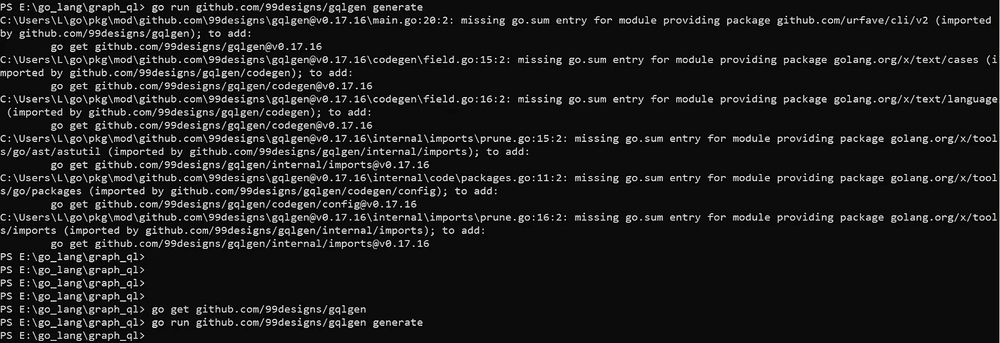
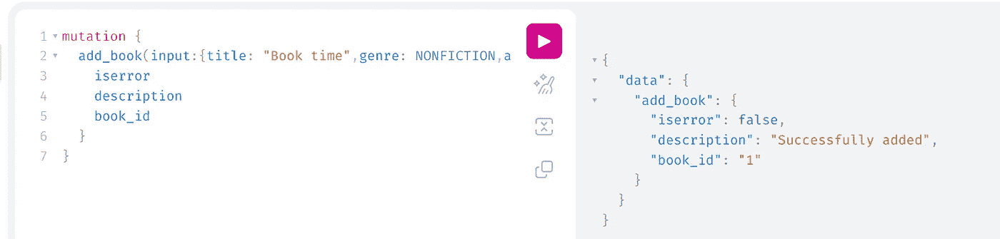
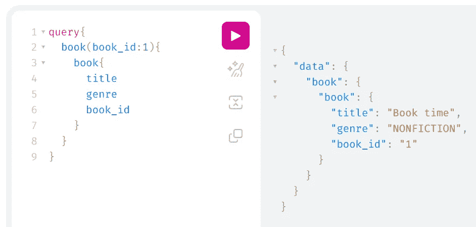
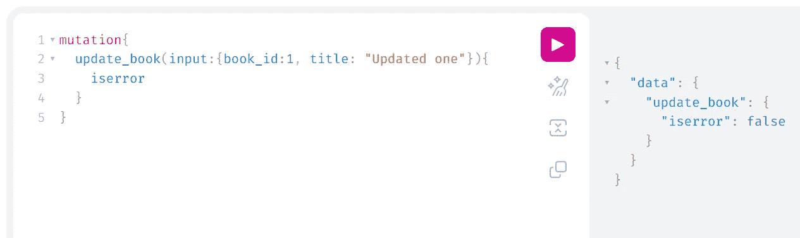
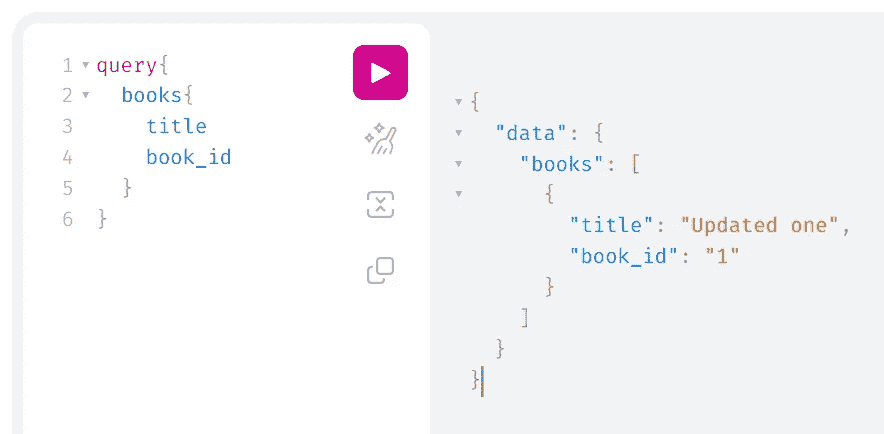
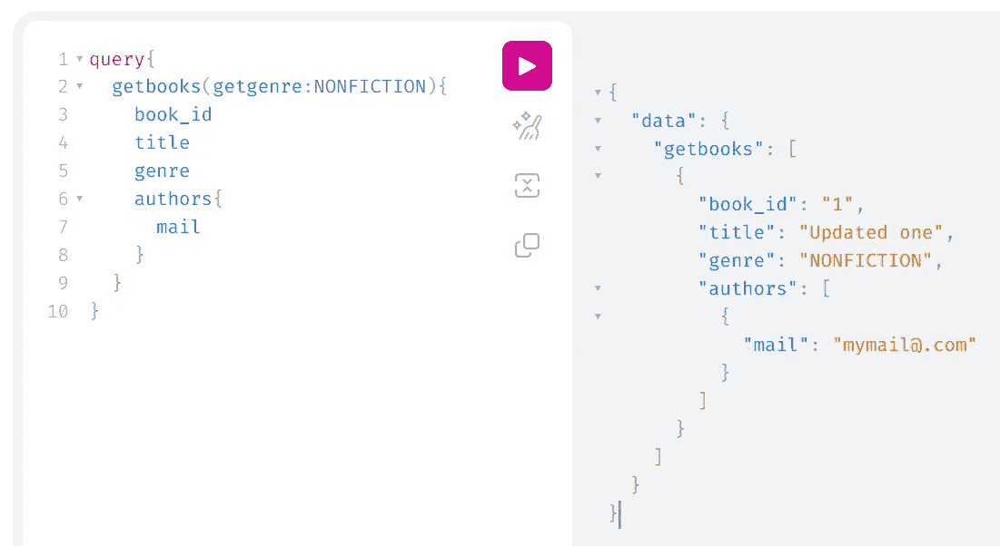
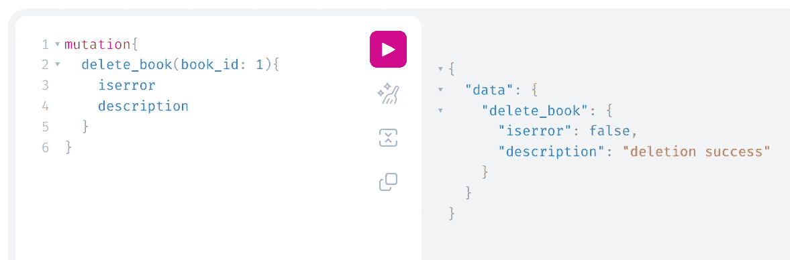

# 在 Golang 中使用模式优先的方法构建 GraphQL 服务器

> 原文：<https://betterprogramming.pub/building-a-graphql-server-using-the-schema-first-approach-in-golang-a8da71d7e5b7>

## 使用 CRUD 操作探索 Golang GraphQL 服务器


照片由[侯赛因·纳斯尔](https://unsplash.com/@nasrphotos?utm_source=medium&utm_medium=referral)在 [Unsplash](https://unsplash.com?utm_source=medium&utm_medium=referral) 上拍摄

这是这篇文章的 Golang 版本— [在 Python 中使用模式优先的方法构建 GraphQL 服务器。](/building-graphql-server-using-schema-first-approach-in-python-68aeee38bcc3)

> 它在 Golang 中使用完全相同的模式实现。

模式优先的方法意味着我们将首先使用 GraphQL 模式定义语言编写我们的模式。在代码优先的方法中，我们将使用库 API 构建我们的模式。

我们将使用`[gqlgen](https://gqlgen.com/getting-started/)`作为 Golang 的模式优先 GraphQL 库。

# 项目概述

我们将构建 GraphQL 服务器来处理`Book Store`中`Book`的 CRUD 操作。

简单地说，我们将把这本书的信息存储在我们的数据库中。为了简化这个项目，我没有使用任何类型的数据库；我只是使用了一个内存存储，并且更加关注 GraphQL 部分。

# 服务器操作

*   添加书籍
*   按 ID 获取图书
*   按流派列出书籍
*   列出所有的书
*   更新图书
*   删除这本书

# 构建 GraphQL 服务器

## 入门指南

*   让我们创建我们的项目目录。
*   用`go mod init <dirname>`初始化 Go 模块。

## `gqlgen`

*   在`go get github.com/99designs/gqlgen`前领取我们的套餐
*   通过`go run github.com/99designs/gqlgen init`初始化 gqlgen
*   运行`go mod tidy`来获得所需的包



Go 模块



gqlgen 初始化

此时，我们可以看到目录 graphql 下的各种文件和文件夹。在我们键入`init`命令后，gqlgen 生成了目录图。



[生成文件](https://gqlgen.com/getting-started/#create-the-project-skeleton)

`model/model_gen.go` —这是一个包含由 gqlgen 生成并由模式文件`schema.graphqls`定义的结构的文件

`generated/generated.go` —这是一个带有生成代码的文件，为每个查询和变异注入上下文和中间件。

> 您不应该修改这些文件中的任何一个，因为当我们更新我们的模式并生成。

`graph/resolver.go` —是根图形解析器类型。该文件不会重新生成。这是我们声明应用程序依赖关系的文件，比如我们的数据库。

`schema.graphqls` —是一个定义类型、查询和变异的 GraphQL 模式文件。模式文件使用模式定义语言(SDL)以人类可读的方式描述数据类型和操作(查询/突变)。

`schema.resolvers.go` —是一个 Go 文件，带有在`schema.graphqls`中定义的查询和突变的包装代码

# 定义我们的模式

> 我邀请您按照自己的方式和要求定义模式并实现代码。

*   删除文件`graph/schema.graphqls`(由 gqlgen 生成)的内容
*   删除`schema.resolvers.go`中的示例代码
*   继续在`graph/schema.graphqls`中定义我们自己的模式

我计划用一些 GraphQL 对象类型来保存关于我们的`Book Store`中的`Books`的一些信息。

这里我用两个对象类型和一个枚举类型来描述一个`Book`。

`Book`类型有以下字段:

*   `title` —字符串类型，不可空
*   `book_id` — ID 类型
*   `genre` —枚举类型
*   `author`—`Author`类型的数组，不可空

`Author`类型:

*   `name` —字符串类型，不可空
*   `mail` —字符串类型

`BookGenre`枚举类型:

*   有两个值(`FICTION`、`NONFICTION`)

以上类型是处理`Books`信息的基本类型。

现在我们继续定义 GraphQL 服务的入口点。

## 查询类型

我有上面的`Query`类型，它有以下三个字段:

*   `book` —通过在参数中提供`book_id`来获取图书详细信息
*   `books` —获取可用书籍列表
*   `getbooks` —获取所请求流派的书籍列表。`getgenre`参数是可选的。它有默认值`FICTION`。

```
type GetBookResult{
    *isexists*: Boolean!
    *book*: Book
}
```

`GetBookResult`类型有两个字段:

*   `isexists` —布尔类型，不可空。它们告诉给定的`book_id`书籍信息是否存在
*   `book` —书籍类型

## 突变类型

突变类型有三个字段:

*   `add_book` —通过提供输入在我们的书店中创建图书资源，响应是请求的状态。
*   `update_book` —更新现有的图书信息，响应是请求的状态。
*   `delete_book` —删除具有给定图书 id 的图书，并返回操作状态。

以上类型用于突变类型的`add_book`字段。

`UpdateInput`和`PutStatus`类型用于`Mutation`类型的`update_book`字段。

```
type DeleteStatus{
    *iserror*: Boolean!
    *description*: String
}
```

`DeleteStatus`类型用于`Mutation`类型的`delete_book`字段。

我们到达了模式定义的末尾。

## 产生

一旦我们完成了我们的模式，我们需要使用`go run github.com/99designs/gqlgen generate`生成 gqlgen 文件。以下是它创建的所有命令:



缺少 go.sum 条目和解析

> 在运行这个命令时，如果你遇到一些错误，比如缺少 go.sum 条目，那么就把这些包添加到 go.sum 中。大多数情况下`*go get github.com/99designs/gqlgen*`会解决这个错误。然后执行生成命令。

至此，我们已经为我们的模式生成了 Go 文件。开始实施我们的解决方案。

# GraphQL 服务器实现

# 内存存储

正如我提到的，我将使用内存中的数据存储(简单地说是一个变量)来存储书的信息。

初始化`resolver.go`中的`BOOKSTORE`变量。

让我们看看`resolver.go`文件的内容:

```
package graph// This file will not be regenerated automatically.
//
// It serves as dependency injection for your app, add any dependencies you require here.type Resolver struct{}
```

现在，让我们将我们的`BOOKSTORE`(列表`Books`)添加到`Resolver`结构中。

所有设置，除了解析器实现。

# 解析器实现

当我们打开文件`graph/schema.resolvers.go`时，我们可以看到 gqlgen generate 命令生成的初始样板代码`generate`。

我们必须修改我们的解析器方法来执行我们的需求。

修改的方法包括以下几种:

*   `AddBook`
*   `UpdateBook`
*   `DeleteBook`
*   `Book`
*   `Books`
*   `Getbooks`

基本上什么都有！

## `AddBook`

在实现我们的`AddBook`方法之前，我们需要一个逻辑来生成唯一的图书 ID。

下面是我在添加新书时查找下一个图书 id 的实现:

现在，我们的`AddBook`的方法实现开始了:

addbook 方法实现

## 更新手册

要更新现有图书，请执行以下操作:

## 删除书籍

要从`BOOKSTORE`中删除一本书，下面是代码:

## 书，书，拿书

要按 ID 获取图书，按流派获取图书列表，或获取所有图书，以下是操作方法:

# 完整的解析器代码

现在我们已经很好地实现了，让我们继续为客户服务。

# 为客户服务

通过`go run server.go`启动服务器。

> server.go 是在初始化 gqlgen 项目时生成的 go 文件。这个 server.go 将为查询和变异指出我们的解析器。


去运行 server.go

## 突变地址簿



## 查询书



## 突变更新手册



## 查询书籍



## 查询 GetBooks



## 突变删除书



我们可以使用任何 GraphQL 客户端来访问这个服务。

# 摘要

在本文中，我们看到了如何使用 gqlgen 库(模式优先方法)在 Golang 中构建我们自己的 GraphQL 服务器。

你可以在我的 [GitHub](https://github.com/LogeshVel/graphql_server_gqlgen) 上找到这个项目。感谢阅读。