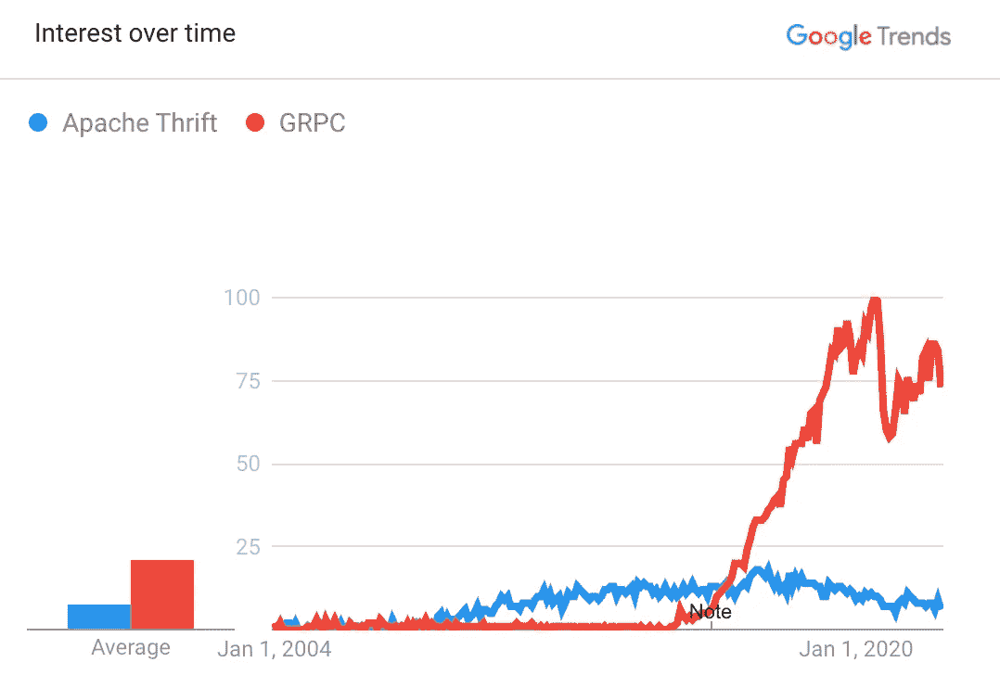
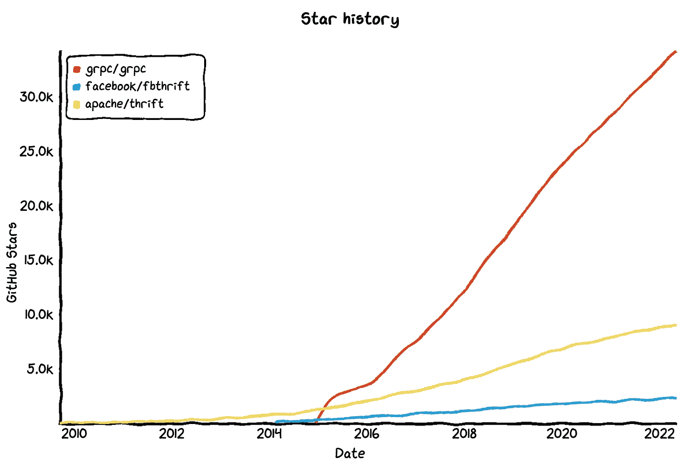

# 用 Rust 构建 gRPC 服务器

> 原文：<https://betterprogramming.pub/building-a-grpc-server-with-rust-be2c52f0860e>

## 一个分步指南


由[弗洛里安·克拉姆](https://unsplash.com/es/@floriankrumm?utm_source=medium&utm_medium=referral)在 [Unsplash](https://unsplash.com?utm_source=medium&utm_medium=referral) 上拍摄的照片

# 背景和导言

## RPC vs JSON vs SOAP

一旦我了解了 [gRPC](https://grpc.io/) 和 [Thrift](https://github.com/facebook/fbthrift) ，就很难再去使用更传统的基于 JSON 的 REST API 或 [SOAP](https://en.wikipedia.org/wiki/SOAP) API。

gRPC 和 Thrift 这两个著名的 [RPC](https://en.wikipedia.org/wiki/Remote_procedure_call) 框架有很多相似之处。前者源于谷歌，后者源于脸书。它们都易于使用，对各种编程语言都有很好的支持，并且都是高性能的。

最有价值的特性是多语言代码生成和服务器端反射。这些使得 API 本质上是类型安全的。有了服务器端反射，探索 API 的模式定义变得更加容易，而不必阅读和理解实现。

## Grpc 与节俭

从历史上看，Apache Thrift 一直是一个受欢迎的选择。然而，近年来，由于缺乏脸书的持续支持，以及与 [fbthrift](https://github.com/facebook/fbthrift) 的分叉，它慢慢失去了人气。

与此同时，gRPC 以更健康的生态系统赶上了越来越多的功能。



*GRPC(蓝色)与阿帕奇节俭(红色)的对比。* [*谷歌趋势*](https://trends.google.com/trends/explore?date=all&q=GRPC,%2Fm%2F02qd4d1)



gRPC、fbThrift 和 Apache Thrift 之间的 GitHub star 历史。[https://star-history.com](https://star-history.com/#grpc/grpc&facebook/fbthrift&apache/thrift&Date)

到今天为止，除非你的应用程序在某种程度上与脸书有关联，否则没有理由考虑节俭。

## GraphQL 怎么样？

GraphQL 是另一个由脸书发起的框架。它与上面的两个 RPC 框架有许多相似之处。

移动 API 开发最大的一个痛点就是有些用户从来不升级自己的 app。因为我们希望保持向后兼容性，所以我们要么在 API 中保留旧的未使用的字段，要么创建 API 的多个版本。GraphQL 的一个动机就是解决这个问题。它被设计成一种“查询语言”,允许客户指定其需要的数据字段。这使得处理向后兼容性变得更加容易。

GraphQL 在开发移动 API 以及面向公众的 API(如 [GitHub](https://docs.github.com/en/graphql) )方面有很大的价值。因为在这两种情况下，我们都不容易控制客户端行为。

然而，如果我们正在为 web 前端构建一个 API，或者为内部后端服务构建一个 API，那么选择 GraphQL 而不是 gRPC 没有什么好处。

## 锈

以上是到目前为止网络框架的一个小概述。除了网络之外，我们还需要决定应用服务器的语言。

基于[栈溢出调查](https://insights.stackoverflow.com/survey/2021#most-loved-dreaded-and-wanted-language-love-dread):“第六年，Rust 是最受喜爱的语言。”它的类型安全、优雅的内存管理、广泛的社区支持和性能，所有这些都使 Rust 成为后端服务开发非常有吸引力和前途的编程语言，尽管学习曲线相对陡峭。


铁锈是最受喜爱的语言。[堆栈溢出调查 2021](https://insights.stackoverflow.com/survey/2021#most-loved-dreaded-and-wanted-language-love-dread)

我们也开始看到 Rust 在业界被越来越广泛的采用:[脸书](https://engineering.fb.com/2021/04/29/developer-tools/rust/)、 [Dropbox](https://www.wired.com/2016/03/epic-story-dropboxs-exodus-amazon-cloud-empire/) 、 [Yelp](https://youtu.be/u6ZbF4apABk) 、 [AWS](https://aws.amazon.com/blogs/opensource/sustainability-with-rust/) 、 [Google](https://opensource.googleblog.com/2021/02/google-joins-rust-foundation.html) 等。很明显，锈菌将会继续生长，并且会一直存在。

这就是我们今天的教程要研究的内容——用 Rust 中的 gRPC 构建一个小型服务器。

# 安装铁锈

用以下材料安装 Rust:

```
$ curl --proto '=https' --tlsv1.2 -sSf <https://sh.rustup.rs> | sh
```

如果您之前安装了 Rust，我们可以通过以下方式进行更新:

```
$ rustup update stable
```

让我们仔细检查一下`rustc`(Rust 编译器)和`cargo`(Rust 包管理器)的安装版本:

```
$ rustc --versionrustc 1.60.0 (7737e0b5c 2022-04-04)$ cargo --versioncargo 1.60.0 (d1fd9fe2c 2022-03-01)
```

有关安装的更多信息，请查看 https://www.rust-lang.org/tools/install。

# 创建 Rust 项目

运行以下命令创建一个新的“Hello World”项目:

```
$ cargo new rust_grpc_demo --bin
```

让我们编译并运行程序:

```
$ cd rust_grpc_demo$ cargo run Compiling rust_grpc_demo v0.1.0 (/Users/yuchen/Documents/rust_grpc_demo)
    Finished dev [unoptimized + debuginfo] target(s) in 1.75s
     Running `target/debug/rust_grpc_demo`
Hello, world!
```

这显示了我们目前拥有的文件结构:

```
$ find . -not -path "./target*" -not -path "./.git*" | sed -e "s/[^-][^\/]*\//  |/g" -e "s/|\([^ ]\)/| - \1/" |-Cargo.toml
  |-Cargo.lock
  |-src
  |  |-main.rs
```

# 定义 gRPC 接口

gRPC 使用[协议缓冲区](https://developers.google.com/protocol-buffers/docs/overview)来序列化和反序列化数据。让我们在一个`.proto`文件中定义服务器 API。

```
$ mkdir proto
$ touch proto/bookstore.proto
```

我们定义了一个书店服务，只有一个方法:提供一个图书 id，并返回关于这本书的一些细节。

我们将用 [tonic](https://docs.rs/tonic/latest/tonic/) 创建我们的 gRPC 服务。将以下依赖项添加到`Cargo.toml`文件中:

为了从`bookstore.proto`生成 Rust 代码，我们在机箱的`build.rs`构建脚本中使用了`tonic-build`。

```
$ touch build.rs
```

将以下内容添加到`build.rs`文件中:

需要特别指出的一点是，我们添加了这个`.out_dir(“./src”)`来将默认输出目录更改为`src`目录，这样我们就可以更容易地看到生成的文件。

在我们准备编译之前还有一件事。`tonic-build`依靠[协议缓冲编译器](https://grpc.io/docs/protoc-installation/)将`.proto`文件解析成可以转换成 Rust 的表示。让我们安装`protobuf`:

```
$ brew install protobuf
```

并再次检查 **protobuf** 编译器是否安装正确:

```
$ protoc --versionlibprotoc 3.19.4
```

准备编译:

```
$ cargo build Finished dev [unoptimized + debuginfo] target(s) in 0.31s
```

这样，我们应该会生成一个文件`src/bookstore.rs`。此时，我们的文件结构应该如下所示:

```
 | - Cargo.toml
  | - proto
  |  | - bookstore.proto
  | - Cargo.lock
  | - build.rs
  | - src
  |  | - bookstore.rs
  |  | - main.rs
```

# 实现服务器

最后，是时候整合服务了。用以下零件替换`main.rs`:

正如我们所看到的，为了简单起见，我们没有真正的图书设置数据库。在这个端点中，我们简单地返回一本假书。

运行服务器的时间:

```
$ cargo run Compiling rust_grpc_demo v0.1.0 (/Users/yuchen/Documents/rust_grpc_demo)
    Finished dev [unoptimized + debuginfo] target(s) in 2.71s
     Running `target/debug/rust_grpc_demo`
Bookstore server listening on [::1]:50051
```

很好，我们的 gRPC 服务器已经启动并运行了！

# 额外收获:服务器反射

正如开头所说，gRPC 最初给我留下的第一印象是因为它能够进行服务器反射。它不仅在服务开发过程中非常方便，而且还使与前端工程师的沟通变得更加容易。因此，如果不解释如何为 Rust 服务器添加这一功能，结束本教程是不完整的。

将以下内容添加到依赖项中:

```
tonic-reflection = "0.4.0"
```

更新`build.rs`。需要修改的行标有`// Add this`注释。

最后，将`main.rs`更新如下。

# 测试 gRPC 服务器

有很多 GUI 客户端可以玩 gRPC 服务器，比如[邮差](https://www.postman.com/)、 [Kreya、](https://kreya.app/) [bloomrpc](https://github.com/bloomrpc/bloomrpc) 、 [grpcox](https://github.com/gusaul/grpcox) 等。为了今天简单起见，我们将使用命令行工具`grpc_cli`。

要安装:

```
$ brew install grpc
```

为了测试我们的第一个 gRPC 端点:

```
$ grpc_cli call localhost:50051 bookstore.Bookstore.GetBook "id: 'test-book-id'"connecting to localhost:50051
Received initial metadata from server:
date : Sun, 08 May 2022 20:15:39 GMT
id: "test-book-id"
name: "Zero to One"
author: "Peter"
year: 2014
Rpc succeeded with OK status
```

看起来有用！我的朋友，这就是我们如何在 Rust 中构建 gRPC 服务器。

今天到此为止。感谢阅读和快乐编码！和往常一样，源代码可以在 [GitHub](https://github.com/yzhong52/rust_grpc_demo) 上获得。