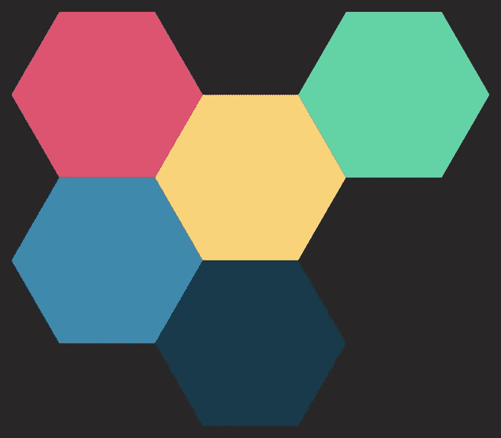
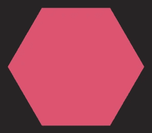

# 使用 SwiftUI 布局协议构建六边形网格

> 原文：<https://betterprogramming.pub/building-a-hexagonal-grid-with-the-swiftui-layout-protocol-f7b0efeeacbf>

## 如何制作一个通用的 SwiftUI 容器，在六边形网格中显示子视图。



我们即将制作的组件以 [Swift 包](https://github.com/ksemianov/HexGrid)的形式提供。

SwiftUI 真的很擅长构建矩形框的层次结构。随着最近`Grid`的加入，它变得更好了。但是，今天我们要建立一个疯狂的六边形布局。当然，这没有专用的布局类型。所以我们用`Layout`协议来构建我们自己的！

# 画一个六角形

让我们首先为网格单元定义一个形状。为此，我们需要实现`func path(in rect: CGRect) -> Path`来满足`Shape`协议要求。我们基本上需要找到适合矩形的六边形的最大尺寸，计算它的顶点并在它们之间画线。这是做一个平顶六边形的完整代码。

```
struct Hexagon: Shape {
    static let aspectRatio: CGFloat = 2 / sqrt(3)

    func path(in rect: CGRect) -> Path {
        var path = Path()

        let center = CGPoint(x: rect.midX, y: rect.midY)
        let width = min(rect.width, rect.height * Self.aspectRatio)
        let size = width / 2
        let corners = (0..<6)
            .map {
                let angle = -CGFloat.pi / 3 * CGFloat($0)
                let dx = size * cos(angle)
                let dy = size * sin(angle)

                return CGPoint(x: center.x + dx, y: center.y + dy)
            }

        path.move(to: corners[0])
        corners[1..<6].forEach { point in
            path.addLine(to: point)
        }

        path.closeSubpath()

        return path
    }
}
```



# 协调

我们需要把六边形放在某个地方。为此，我们需要一个坐标系。最容易理解的是偏置坐标系，但也可以使用其他坐标(如轴向坐标)。我们取偏移坐标的奇 q 变量。它基本上只是将单元格定义为成对的行和列。并且每个奇数列向下移位 1/2。我们需要向布局系统提供这些坐标，这是通过创建一个符合`LayoutValueKey`的键来完成的。

```
struct OffsetCoordinate: Hashable {
    var row: Int
    var col: Int
}

protocol OffsetCoordinateProviding {
    var offsetCoordinate: OffsetCoordinate { get }
}

struct OffsetCoordinateLayoutValueKey: LayoutValueKey {
    static let defaultValue: OffsetCoordinate? = nil
}
```

# 布局协议

该协议有两个要求:

*   `sizeThatFits`控制视图需要多少空间
*   `placeSubviews`控制子视图在可用空间内的位置

并且可选地:

*   为了避免额外的计算

# 贮藏

让我们为布局协议定义缓存数据。首先，我们需要知道网格的左上角坐标，以正确计算从边界左上角的偏移量。然后，我们需要知道单元格的完整行和列的网格有多大。

```
struct CacheData {
    let offsetX: Int
    let offsetY: Int
    let width: CGFloat
    let height: CGFloat
}

func makeCache(subviews: Subviews) -> CacheData? {
    let coordinates = subviews.compactMap { $0[OffsetCoordinateLayoutValueKey.self] }

    if coordinates.isEmpty { return nil }

    let offsetX = coordinates.map { $0.col }.min()!
    let offsetY = coordinates.map { $0.row }.min()!

    let coordinatesX = coordinates.map { CGFloat($0.col) }
    let minX: CGFloat = coordinatesX.min()!
    let maxX: CGFloat = coordinatesX.max()!
    let width = maxX - minX + 4 / 3

    let coordinatesY = coordinates.map { CGFloat($0.row) + 1 / 2 * CGFloat($0.col & 1) }
    let minY: CGFloat = coordinatesY.min()!
    let maxY: CGFloat = coordinatesY.max()!
    let height = maxY - minY + 1

    return CacheData(offsetX: offsetX, offsetY: offsetY, width: width, height: height)
}
```

# `sizeThatFits`

这个很简单。我们只需要取十六进制单元格的宽度，这样它就可以放入提议中。然后根据单元宽度将其乘以网格的相应宽度和高度。

```
func sizeThatFits(proposal: ProposedViewSize, subviews: Subviews, cache: inout CacheData?) -> CGSize {
    guard let cache else { return .zero }

    let size = proposal.replacingUnspecifiedDimensions()
    let step = min(size.width / cache.width, size.height / cache.height / Hexagon.aspectRatio)

    return CGSize(width: step * cache.width, height: step * cache.height * Hexagon.aspectRatio)
}
```

# `placeSubviews`

这里我们计算连续六边形之间的步距。然后将每个六边形以正确的尺寸放置在相应的位置。

```
func placeSubviews(in bounds: CGRect, proposal: ProposedViewSize, subviews: Subviews, cache: inout CacheData?) {
    guard let cache else { return }

    let size = proposal.replacingUnspecifiedDimensions()
    let step = min(size.width / cache.width, size.height / cache.height / Hexagon.aspectRatio)
    let width = step * 4 / 3
    let proposal = ProposedViewSize(width: width, height: width / Hexagon.aspectRatio)
    let x = width / 2 + bounds.minX
    let y = width / Hexagon.aspectRatio / 2 + bounds.minY

    for subview in subviews {
        guard let coord = subview[OffsetCoordinateLayoutValueKey.self] else { continue }

        let dx: CGFloat = step * CGFloat(coord.col - cache.offsetX)
        let dy: CGFloat = step * Hexagon.aspectRatio * (CGFloat(coord.row - cache.offsetY) + 1 / 2 * CGFloat(coord.col & 1))
        let point = CGPoint(x: x + dx, y: y + dy)

        subview.place(at: point, anchor: .center, proposal: proposal)
    }
}
```

# HexGrid

此时，`HexLayout`已经可以使用了。然而，所有子视图都应该有一个坐标的规则并没有被强制执行。所以最好做一个瘦包装器，为组件消费者提供这种编译时保证。在此过程中，我们将用六边形的形状裁剪子视图，使调用点更加清晰。

```
struct HexGrid<Data, ID, Content>: View where Data: RandomAccessCollection, Data.Element: OffsetCoordinateProviding, ID: Hashable, Content: View {
    let data: Data
    let id: KeyPath<Data.Element, ID>
    let content: (Data.Element) -> Content

    init(_ data: Data,
         id: KeyPath<Data.Element, ID>,
         @ViewBuilder content: @escaping (Data.Element) -> Content) {
        self.data = data
        self.id = id
        self.content = content
    }

    var body: some View {
        HexLayout {
            ForEach(data, id: id) { element in
                content(element)
                    .clipShape(Hexagon())
                    .layoutValue(key: OffsetCoordinateLayoutValueKey.self,
                                 value: element.offsetCoordinate)
            }
        }
    }
}
```

```
extension HexGrid where ID == Data.Element.ID, Data.Element: Identifiable {
    init(_ data: Data,
         @ViewBuilder content: @escaping (Data.Element) -> Content) {
        self.init(data, id: \.id, content: content)
    }
}
```

# 使用

现在，我们终于可以定义我们的数据模型，并使用 ready 组件来获得本文开头的图像:

```
struct HexCell: Identifiable, OffsetCoordinateProviding {
    var id: Int { offsetCoordinate.hashValue }
    var offsetCoordinate: OffsetCoordinate
    var colorName: String
}

let cells: [HexCell] = [
    .init(offsetCoordinate: .init(row: 0, col: 0), colorName: "color1"),
    .init(offsetCoordinate: .init(row: 0, col: 1), colorName: "color2"),
    .init(offsetCoordinate: .init(row: 0, col: 2), colorName: "color3"),
    .init(offsetCoordinate: .init(row: 1, col: 0), colorName: "color4"),
    .init(offsetCoordinate: .init(row: 1, col: 1), colorName: "color5")
]

HexGrid(cells) { cell in
    Color(cell.colorName)
}
```

但是你可以把图像或者任何视图放到子视图中！请注意，布局假设子视图填充六边形单元格的内容。

```
HexGrid(cells) { cell in
    AsyncImage(url: cell.url) { image in
        image.resizable().aspectRatio(contentMode: .fill)
    } placeholder: {
        ProgressView().frame(maxWidth: .infinity, maxHeight: .infinity)
    }
}
```


基于从 [PIXNIO](https://pixnio.com/) 下载的公共领域照片。

# 最后的想法

我们已经学习了如何向`LayoutSubview`代理提供值，并构建一个有趣的非平凡的布局。

想了解更多关于六边形网格的信息，请看这个[神奇指南](https://www.redblobgames.com/grids/hexagons/)

在[https://github.com/ksemianov/HexGrid](https://github.com/ksemianov/HexGrid)查看完整代码

*最初发表于*[*https://ksemianov.github.io/articles/hexgrid/*](https://ksemianov.github.io/articles/hexgrid/)