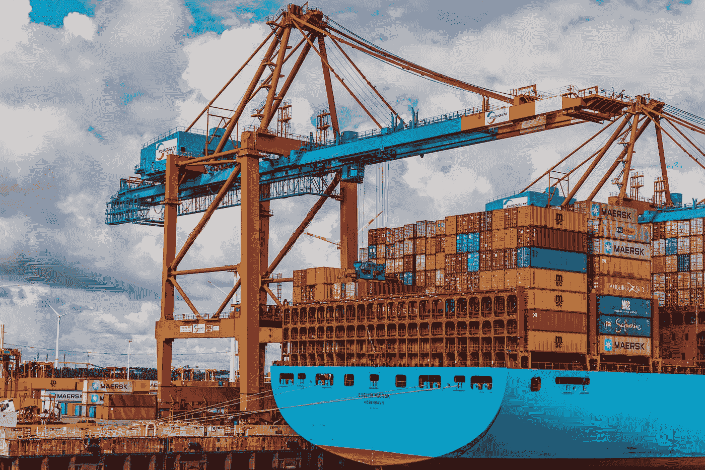
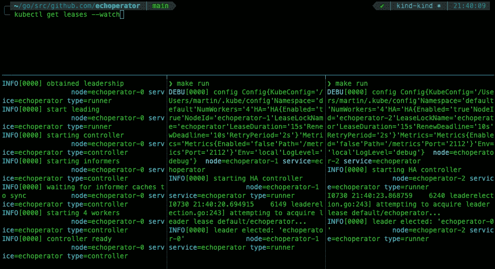
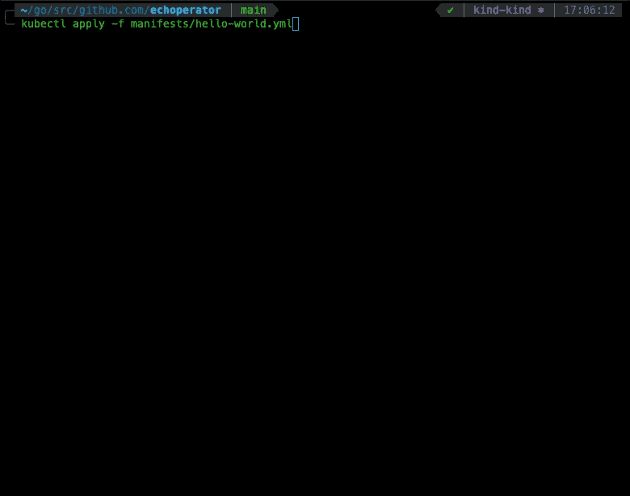

# 使用 Golang 构建高度可用的 Kubernetes 操作符

> 原文：<https://betterprogramming.pub/building-a-highly-available-kubernetes-operator-using-golang-fe4a44c395c2>

## 从头开始开发一个简单的 Kubernetes 操作符



[张秀坤·吕克曼](https://unsplash.com/@exdigy?utm_source=medium&utm_medium=referral)在 [Unsplash](https://unsplash.com?utm_source=medium&utm_medium=referral) 上的照片

当在 Kubernetes 集群中运行的任务变得重复时，这可能意味着我们没有利用 Kubernetes 提供的所有特性，因为它是为自动化而设计的。通常，这些任务由操作员来执行，操作员对系统应该如何运行有深入的了解，知道如何部署应用程序，以及如何解决问题。

在构建操作符之前，我们应该考虑标准的方法，为我们的应用程序选择正确的 Kubernetes 资源。例如，如果我们的应用程序是有状态的，`[StatefulSet](https://kubernetes.io/es/docs/concepts/workloads/controllers/statefulset/)`可能比常规的`[Deployment](https://kubernetes.io/es/docs/concepts/workloads/controllers/deployment/)`更适合我们的需求，因为它提供了额外的特性，比如惟一的网络标识符、持久存储、有序部署等等。

如果这种方法不成功，标准资源不能覆盖我们应用程序的特定领域逻辑，我们将需要扩展 Kubernetes 行为来实现自动化，并实现一个 **Kubernetes 操作符**。

在本文中，我们将使用 [client-go](https://github.com/kubernetes/client-go) 库构建一个 [hello world operator](https://github.com/mmontes11/echoperator) ，对其进行修改以实现高可用性，并使用 Helm 将其部署到 Kubernetes 集群。

# 什么是 Kubernetes 操作员？

操作符是 Kubernetes 的扩展，它处理[自定义资源定义(CRDs)](https://kubernetes.io/docs/concepts/extend-kubernetes/api-extension/custom-resources/) 来处理我们应用程序的特定用例。为此，它们遵循[操作符模式](https://kubernetes.io/docs/concepts/extend-kubernetes/operator/)，特别是[控制循环](https://kubernetes.io/docs/concepts/architecture/controller/)，这是一个非终止循环，确保集群的状态满足用户在 CRDs 中声明定义的要求。

运算符的一些用例可以是:

*   创建一个应用程序`[Deployment](https://kubernetes.io/es/docs/concepts/workloads/controllers/deployment/)`，并根据流量模式和其他指标自动扩展副本的数量。
*   获取和恢复`[StatefulSet](https://kubernetes.io/es/docs/concepts/workloads/controllers/statefulset/)`的备份，例如数据库。
*   扩展标准资源以添加新功能并提供更大的灵活性。例如 [Traefik](https://github.com/traefik/traefik) 定义了`[IngressRoute](https://doc.traefik.io/traefik/routing/providers/kubernetes-crd/#kind-ingressroute)` CRD 来扩展标准`[Ingress](https://kubernetes.io/docs/concepts/services-networking/ingress/)`。

在我们的例子中，由于开发一个操作符可能是复杂的，我们将构建一个非常基本的操作符来观察一些 CRD 并创建它们的`[Job](https://kubernetes.io/docs/concepts/workloads/controllers/job/)`对应资源。

# 运营商的架构

操作员的主要目标是观察 Kubernetes API 的变化并对其做出反应，以确保集群的状态满足 CRDs 中所定义的要求。由于集群中的事件数量可能会很大，因此正确设计您的操作员对于确保其良好的性能和可伸缩性至关重要:


[客户——到引擎盖下](https://github.com/kubernetes/client-go)。图片由 Kubernetes docs 提供。

在本文中，我们将关注以下 [client-go](https://github.com/kubernetes/client-go) 组件:

*   **客户端集**:客户端与不同的 [API 组](https://kubernetes.io/docs/reference/generated/kubernetes-api/v1.21/#-strong-api-groups-strong-)交互
*   **informer** :跟踪 API 中的变化。
*   **索引器**:索引内存中的 API 对象，避免 API 调用。
*   **workerqueue** :内存队列，用于以并发安全的方式处理与 API 对象相关的事件。这样，我们可以确保不会在两个不同的工作人员中同时处理同一个事件。
*   **leaderelection** :在多个副本中选出一个使用 Kubernetes [lease](https://kubernetes.io/docs/reference/kubernetes-api/cluster-resources/lease-v1) 对象的领导者的机制。

# 自定义资源定义

在我们开始编码我们的操作符之前，我们需要定义它将处理的 CRDs。与任何其他 API 一样，Kubernetes 允许您使用 OpenAPI 模式定义其自定义 API 对象。下面是一些代码:

自定义资源定义

这个`[CustomResourceDefinition](https://kubernetes.io/docs/concepts/extend-kubernetes/api-extension/custom-resources/)`资源将由 Helm 在安装我们的图表时创建；我们只需要把它放在 [crds](https://github.com/mmontes11/charts/tree/main/charts/echoperator/crds) 文件夹中。我们将进一步讨论舵轮图的细节。

现在，我们可以在下面的代码中定义运算符使用的类型:

CRD 戈朗类型

这些结构被注释，用于生成与我们的 CRD 相关的客户机集和通知器，以及它们的深度复制方法。为此，我们将使用以下基于[k8s.io/code-generator](https://github.com/kubernetes/code-generator)的脚本:

代码生成脚本

# 控制器

我们需要配置的第一件事是到 Kubernetes API 的连接。这里有两个选项:

*   **KUBECONFIG** :指向 KUBECONFIG 文件的环境变量。适合本地发展。
*   **InClusterConfig** :使用 pod 的服务帐户令牌来访问 API，因此也需要正确配置 [RBAC](https://kubernetes.io/docs/reference/access-authn-authz/rbac/) 。稍后我们将详细解释这一点。

一旦我们创建了连接，我们就可以实例化一个核心 Kubernetes 客户端集，并使用我们的 CRDs 客户端集将它们作为依赖项传递给操作者(即控制器):

创建客户端集并将它们传递给控制器

之后，我们可以配置控制器的通知器，这样我们就可以开始接收关于我们感兴趣的资源的事件。为此，我们将使用`[cache.SharedIndexInformer](https://pkg.go.dev/k8s.io/client-go/tools/cache#SharedIndexInformer)`，并将通知者和索引器的职责集中在同一个对象中。换句话说，该对象维护自己更新的索引，并允许您配置事件处理程序，以便获得有关资源更改的通知。唯一的要求是它需要在启动时同步。

事件将在`[workerqueue.RateLimiterInterface](https://pkg.go.dev/k8s.io/client-go/util/workqueue#RateLimitingInterface)`中排队。这用于将待处理的工作排队，而不是在事件发生后立即执行。这样，我们可以确保一次只处理固定数量的对象，并且我们不会在不同的工作人员中同时处理相同的项目:

控制器

# 工人

worker 的职责是通过执行确保集群处于所需状态的操作来处理队列中的事件。为此，工人实现了一个非终止的控制循环，它根据用户的要求调节状态。在我们的例子中，调节状态意味着创建一个`[Job](https://kubernetes.io/docs/concepts/workloads/controllers/job/)`来响应 add `Echo`事件。

为了以编程方式创建 Kubernetes 资源，我们将使用 k8s.io/api 的，如下所示:

以编程方式创建 Kubernetes 对象

事件类型决定了调用哪个方法，以及我们将在哪里创建或更新相应的对象。值得注意的是，当控制器启动时，出于一致性原因，我们将接收 add 事件，因此我们需要检查我们是否已经创建了对象，以避免创建两次。实现这一点的策略是从对象元获取一个键，并检查它是否已经存在于索引中。代码如下:

工人

# 以高可用性运行控制器

部署控制器之前的最后一件事是根据配置决定使用哪种架构:独立架构还是高可用性架构。这正是运行者的责任，但是在本文中，我们将关注高可用性。

高可用性意味着运行控制器的多个副本，以确保如果领导者失败，另一个副本将获得领导权并开始运行控制循环来处理 CRD。

Kubernetes 是为解决像这样的分布式系统问题而设计的，并提供现成的解决方案来处理这些问题。在这种情况下，一个 [lease](https://kubernetes.io/docs/reference/kubernetes-api/cluster-resources/lease-v1/) 对象会做这件事；它会认为是分布式互斥体，只能有一个副本，表示对应的副本是领导者，在这种情况下。

这看起来很棒，但是 Kubernetes 如何有效地做到这一点呢？

Kubernetes 使用一个名为 [etcd](https://etcd.io/) 的分布式键值存储，与其他键值存储不同，它为[提供了一个本机机制来监视开箱即用的键](https://etcd.io/docs/v3.4/dev-guide/interacting_v3/#watch-key-changes)。这使得消费者无需进行长时间的轮询或消耗额外的网络就能反应性地获得更改。

此外， [client-go](https://github.com/kubernetes/client-go) 包含了 [leaderelection](https://pkg.go.dev/k8s.io/client-go@v0.21.3/tools/leaderelection) 包，该包也使用下面的 [lease](https://kubernetes.io/docs/reference/kubernetes-api/cluster-resources/lease-v1/) 对象为此提供了一个抽象。下面是这段代码的样子:

控制器运行器

让我们看看领导者选举如何与我们的控制器一起工作:



领导人选举

# 部署到 Kubernetes 集群

我们操作员的代码现在可以部署了。下一步将是创建一个舵图。我们将首先定义用于配置 Kubernetes 资源的`values.yml`。代码如下:

舵图的值

如您所见，有一个用于配置高可用性的对象`ha`。完成后，现在我们可以有条件地在我们的`configmap`中创建与高可用性相关的键，如下所示:

配置图

如果启用了高可用性，部署将设置`replicas`键，并引用此`configmap`将其键导出为 pod 中的环境变量。代码如下:

部署

注意，我们在部署`spec`中指定了一个定制`serviceAccountName`。原因是我们需要为该帐户定义安全策略，以便我们可以从 pod 访问 CRDs。否则，我们将使用`default`服务帐户访问它们，该帐户没有访问 CRDs 的权限。

在后台，当在部署中使用服务帐户时，带有令牌(`/var/run/secrets/kubernetes.io/serviceaccount/token`)的卷将被装载到 pod 上，以便它们可以在 Kubernetes API 中进行身份验证。

为了定义令牌的安全策略，我们将使用 Kubernetes [RBAC](https://kubernetes.io/docs/reference/access-authn-authz/rbac/) :

*   **ServiceAccount** :集群中被授予权限的主体。
*   **ClusterRole** :集群中的集群作用域角色，可以对某些资源执行某些操作。
*   **ClusterRoleBinding** :给服务账户分配一个角色。

RBAC

最后，我们可以部署我们的操作员，执行以下命令:

```
helm repo add mmontes https://mmontes11.github.io/charts
helm install echoperator mmontes/echoperator
```

# 创造一个 CRD

最后但同样重要的是，让我们看看我们的操作符如何创建一个[hello world](https://github.com/mmontes11/echoperator/blob/develop/manifests/hello-world.yml)`[Echo](https://github.com/mmontes11/echoperator/blob/develop/manifests/hello-world.yml)`[CRD](https://github.com/mmontes11/echoperator/blob/develop/manifests/hello-world.yml)，如下所示:

你好，CRD 回声报



创建 hello world Echo CRD

# 包扎

构建一个 Kubernetes 操作符是一个定制的解决方案，只有当标准的 Kubernetes 资源不能满足您的应用程序的特定领域的需求时，才应该考虑这个解决方案。原因是解决一个非常具体的问题需要大量的时间和 Kubernetes 对你的团队的了解。

但是，如果您认为您的用例足够先进，并且您已经决定承担成本，那么 Kubernetes 社区中有很好的工具可以支持您:

*   [客户端-go](https://github.com/kubernetes/client-go)
*   [kubebuilder](https://github.com/kubernetes-sigs/kubebuilder)
*   [运营商 sdk](https://github.com/operator-framework/operator-sdk)

作为一种选择，你可以考虑利用这段时间投资自动化你的开发生命周期，使用 [GitOps](https://about.gitlab.com/topics/gitops/) 实践并继续使用标准资源。

黑客快乐！感谢阅读。

# 资源

[](https://github.com/mmontes11/echoperator) [## GitHub-mmontes 11/echo operator:用于处理 echo CRDs 的简单 Kubernetes 操作符🤖

### 处理 echo CRDs 的简单 Kubernetes 算子。Kubernetes 操作符模式实现使用的客户端-go…

github.com](https://github.com/mmontes11/echoperator) [](https://github.com/mmontes11/charts/tree/main/deploy/charts/echoperator) [## 图表/部署/图表/e 主菜单上的操作员 11/图表

### 此时您不能执行该操作。您已使用另一个标签页或窗口登录。您已在另一个选项卡中注销，或者…

github.com](https://github.com/mmontes11/charts/tree/main/deploy/charts/echoperator) 

*   https://github.com/kubernetes/api
*   【https://github.com/kubernetes/apimachinery 
*   [https://github.com/kubernetes/client-go](https://github.com/kubernetes/client-go)
*   [https://github.com/kubernetes/code-generator](https://github.com/kubernetes/code-generator)
*   [https://pkg . go . dev/k8s . io/client-go @ v 0 . 21 . 3/tools/leader election](https://pkg.go.dev/k8s.io/client-go@v0.21.3/tools/leaderelection)
*   [https://kubernetes . io/docs/concepts/extend-kubernetes/operator/](https://kubernetes.io/docs/concepts/extend-kubernetes/operator/)
*   [https://kubernetes . io/docs/concepts/architecture/controller/](https://kubernetes.io/docs/concepts/architecture/controller/)
*   [https://kubernetes . io/docs/concepts/extend-kubernetes/API-extension/custom-resources/](https://kubernetes.io/docs/concepts/extend-kubernetes/api-extension/custom-resources/)
*   [https://kubernetes . io/docs/concepts/workloads/controllers/job/](https://kubernetes.io/docs/concepts/workloads/controllers/job/)
*   [https://kubernetes . io/docs/reference/kubernetes-API/cluster-resources/lease-v1/](https://kubernetes.io/docs/reference/kubernetes-api/cluster-resources/lease-v1/)
*   [https://kubernetes . io/docs/reference/access-authn-authz/RBAC/](https://kubernetes.io/docs/reference/access-authn-authz/rbac/)