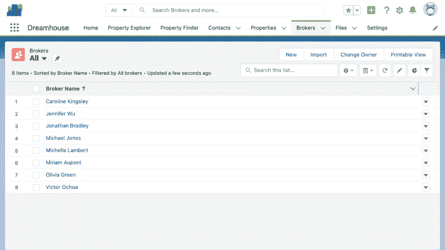
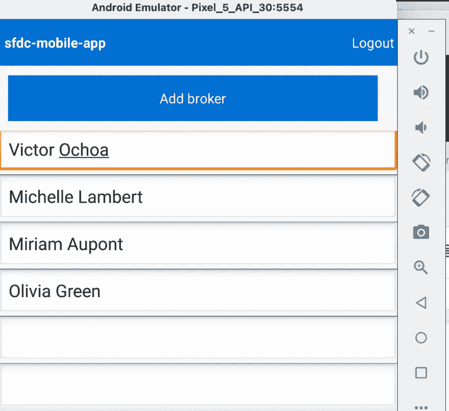

# 使用 Salesforce SDK 构建 Kotlin 移动应用程序

> 原文：<https://betterprogramming.pub/building-a-kotlin-mobile-app-with-the-salesforce-sdk-340f31e2dbf5>

## 在应用程序中显示记录列表


马克·赖歇尔在 [Unsplash](https://unsplash.com?utm_source=medium&utm_medium=referral) 上的照片

如今，用户希望移动应用程序能够充当他们在网络上使用的网站和平台的对等物。移动应用让用户能够随身携带数据，无论他们走到哪里，都可以灵活地与平台进行交互。这种可用性是有意义的，我们都很熟悉。

开发一个与网站功能无缝集成的移动体验可能会令人生畏。首先，如果移动应用失去连接，你应该如何存储和检索数据？当两个移动用户试图同时更新相同的数据时会发生什么？在存储空间有限的情况下，如何确保应用程序的数据同步？

在这个系列中，我们将看一看 [Salesforce Mobile SDK](https://developer.salesforce.com/developer-centers/mobile) ，这是一个为开发人员构建 Android 或 iOS 应用解决许多技术挑战的工具包。Salesforce Mobile SDK 处理数据同步、离线存储、通知、身份验证和许多其他重要细节。为了突出这些功能，我们将构建一个访问真实 Salesforce 数据的应用程序。

在 Salesforce 端，我们将设置一个带有预填充应用程序的组织，该应用程序使用自定义对象。在这个系列的第一篇文章中，我们将讨论如何让我们的移动应用程序显示我们的记录。在第二部分中，我们将介绍如何创建和更新列表中的记录。最后，在第三部分中，我们将了解如何使用 SDK 和 Salesforce APIs 在桌面和移动环境之间同步数据。

虽然这款应用将会用 Kotlin 编写，并在 Android 上运行，但基本概念也适用于 iOS。我们选择 Kotlin 作为[的原因与 Android 平台推荐它](https://developer.android.com/kotlin)的原因相同:它编写速度更快，提供了比 Java 更高的代码安全性，并通过其表现力提高了生产率。

# 先决条件

开始之前，请在您的机器上安装以下软件:

1.  [Salesforce CLI](https://developer.salesforce.com/tools/sfdxcli) —这是由 Salesforce 设计的 CLI，用于简化平台交互。
2.  [科特林](https://kotlinlang.org/docs/command-line.html) ( > = 1.4)
3.  最近版本的[节点](https://nodejs.org/en/) ( > = 12.0)
4.  此处列出了所有 Android 特定要求
5.  [饭桶](https://git-scm.com/)

因为我们现在只是在探索 SDK，所以重要的是我们构建的任何东西都不会影响您的“真正的”生产 Salesforce 组织(也简称为“org”)。因此，我们将创建一个单独的免费开发者版 org，我们的应用程序可以与之交互。

首先，注册[你的开发者版](https://developer.salesforce.com/signup)。记下您的用户名，因为您一会儿会用到它。在您验证了您的电子邮件地址和您的组织可供使用后，继续并[按照这些说明](https://github.com/trailheadapps/dreamhouse-lwc#installing-dreamhouse-using-a-developer-edition-org-or-a-trailhead-playground)将 dreamhouse-lwc 项目克隆到您的计算机上，然后使用 sfdx(sales force CLI)将其上传到您的新组织。

Dreamhouse 应用程序是一个示例 Salesforce 应用程序，它列出了房地产经纪人及其相关的房产。按照上面链接的说明操作后，应用程序将包含我们可以与之交互的样本数据。

要查看该应用程序，请输入以下命令打开您的组织:

```
sfdx force:org:open -u <username-or-alias>
```

**注意:**当您使用命令行授权您的组织时，系统会指示您创建一个别名。这可以与 username 互换，以传入上面的`-u`参数。

这将打开一个浏览器窗口，并将您带到您的 Salesforce 组织。点击左上角的**应用启动器**图标(圆点网格)，选择 Dreamhouse 应用。当您浏览它时，您应该会看到关于房产、经纪人等等的信息。这个应用程序及其相应的自定义对象代表了我们的移动应用程序将与之交互的平台。

# 设置 Android Studio IDE

我们将为这个 Kotlin 应用程序使用 Android Studio IDE。[本页](https://trailhead.salesforce.com/content/learn/projects/mobilesdk_setup_dev_tools/mobilesdk_setup_android)列出了为 Android 开发准备电脑所需的一切。理解这些文档对于构建你的 Android 应用程序来说是必不可少的，但是这里有一个你需要做的事情的简要概述:

首先，[安装 forcedroid](https://developer.salesforce.com/docs/atlas.en-us.mobile_sdk.meta/mobile_sdk/android_requirements.htm) ，这是一个 npm 包，通过在终端中运行以下命令来帮助您开发 Salesforce 移动应用程序:

```
npm install -g forcedroid
```

接下来，运行`forcedroid create`并提供以下值:

*   申请类型为`native_kotlin`
*   申请名称为`sfdc-mobile-app`
*   包名为`com.example.sfdc`
*   组织名称是`Dreamhouse`
*   将输出目录设置为当前目录

打开 Android Studio，导航到您创建此应用程序的目录。[创建一个 Android 虚拟设备](https://trailhead.salesforce.com/content/learn/projects/mobilesdk_setup_dev_tools/mobilesdk_setup_android)——一个仿真器——并将 API 版本 30 (R)系统映像下载到其上。

为了确保一切设置正确，点击**运行**按钮，它是顶部栏的绿色三角形。应该会弹出一个手机模拟器，并使用 Android 启动。您将看到一个 Salesforce 登录屏幕。

让我们测试一下，我们可以与我们的开发者版 org 进行通信。在表格的右上角，点击菜单图标，然后选择**更改服务器**:


之后，点击**添加新连接**。

之前，当我们在命令行中调用`sfdx force:org:open`时，会显示一个 URL。复制显示的整个域，将其用作您的自定义域。例如，它可能看起来像这样:`flow-app-2586-dev-ed.cs4.my.salesforce.com`。将它作为新连接的值粘贴进去。

之后，返回登录屏幕，使用您的用户名和密码登录。您的用户名和密码与您用于登录 Developer Edition org 的用户名和密码相同。一旦认证成功，您就可以开始编写应用程序了！

# 显示数据

由于我们的 Dreamhouse 应用程序已经包含自定义对象，我们的第一步将是在移动应用程序中显示一些相同的数据。为此，我们将向 Salesforce 认证 Salesforce 移动应用程序，然后获取经纪人列表。



让我们简单看看 forcedroid 为我们做了什么。在`app/java/com.example.sfdc`文件夹中，它创建了两个文件:`MainActivity.kt`和`MainApplication.kt`。你可以[阅读这些文件的细节](https://developer.salesforce.com/docs/atlas.en-us.mobile_sdk.meta/mobile_sdk/android_template_deep.htm)。但是，一言以蔽之，MainApplication 设置了 Salesforce Mobile SDKMainActivity 是应用程序的“主页”，负责所有其他 UI、导航和功能。

你可能已经注意到，当你启动应用程序时，可以点击一些按钮并获取数据。虽然 Mobile SDK 建立了一个您可以启动并运行的环境，但如果我们——无畏的开发人员——想要从头构建一些东西，那就没有意思了！让我们对给我们的文件做一些修改，开始探索 SDK。

先从景色说起吧。打开`app/res/layout/main.xml`，然后切换到[代码视图](https://developer.android.com/studio/write/layout-editor)。粘贴以下 XML 布局:

```
<?xml version="1.0" encoding="utf-8"?>
<LinearLayout xmlns:android="http://schemas.android.com/apk/res/android"
  android:orientation="vertical"
  android:layout_width="match_parent"
  android:layout_height="match_parent"
  android:background="?android:colorBackground"
  android:id="@+id/root" > <include layout="@layout/header" /> <ListView android:id="@+id/brokers_list"
     android:layout_width="match_parent"
     android:layout_height="match_parent"
     android:background="?android:colorBackground"
     android:textColor="?android:textColor"/>
</LinearLayout>
```

这里，我们建立了一个 id 为`brokers_list`的简单列表，它将充当我们的经纪人的容器。为了在代码中更容易地访问这些视图，我们将设置一个名为[视图绑定](https://developer.android.com/topic/libraries/view-binding#groovy)的特性。在左窗格中，展开 Gradle scripts 类别，并为您的模块选择 build.gradle 文件。


在 Android 名称空间中，添加以下代码行来启用视图绑定:

```
buildFeatures {
  viewBinding true
}
```

现在，在`MainActivity.kt`中，我们需要做两处修改:我们需要将布局 ID 与一个我们可以在 Kotlin 中使用的变量相关联，并且我们需要发出一个显示经纪人列表的请求。首先，我们需要导入我们的布局；将这些语句添加到文件顶部，靠近其他导入语句:

```
import com.example.sfdc.databinding.MainBinding
```

然后，在`MainActivity`类中初始化一个视图变量:

```
class MainActivity : SalesforceActivity() { // … private lateinit var mainViewBinding: MainBinding // …
```

在`onCreate`功能中，更改最后一行`setContentView(R.layout.main)`

对这些行:

```
mainViewBinding = MainBinding.inflate(layoutInflater)
val view = mainViewBinding.root
// Setup view
setContentView(view)
```

这已经为我们的`mainViewBinding`变量设置了一个值。我们现在可以用代码中定义的逻辑来填充布局。用以下代码行替换现有的`onResume`函数:

```
override fun onResume() {
   // Hide everything until we are logged in
   mainViewBinding.root.visibility = View.INVISIBLE // Create list adapter
   listAdapter = ArrayAdapter(this, android.R.layout.simple_list_item_1, ArrayList<String>())
   mainViewBinding.brokersList.adapter = listAdapter super.onResume()
}override fun onResume(client: RestClient) {
   // Keeping reference to rest client
   this.client = client // Show everything
   mainViewBinding.root.visibility = View.VISIBLE
   sendRequest("SELECT Name FROM Broker__c")
}
```

`mainViewBinding`使用我们在布局中定义的 id，而`sendRequest`查询 Salesforce 以获取记录。继续并启动应用程序；您将会收到这些经纪人的名单——前台和中间！



注意这里我们*没有*做的事情。我们没有编写任何代码来进行 Salesforce 身份验证，并且我们获取记录的业务逻辑已经被 Mobile SDK 抽象出来。我们所要做的就是设计布局，并创建一个新的查询来匹配我们想要从数据库中得到的内容。

# 未完待续…

这是反思我们所做的事情的一个很好的切入点:

*   我们建立了一个新的开发者版组织，并推出了一个名为 Dreamhouse 的示例应用程序(包含示例数据)
*   我们设置了一个 Android 模拟器和 Salesforce Mobile SDK
*   我们建立了一个应用程序，登录到我们的组织，并从中获取数据

在本系列的第二部分中，我们将学习如何编辑应用程序中的数据并将其插入到我们的组织中。敬请期待！