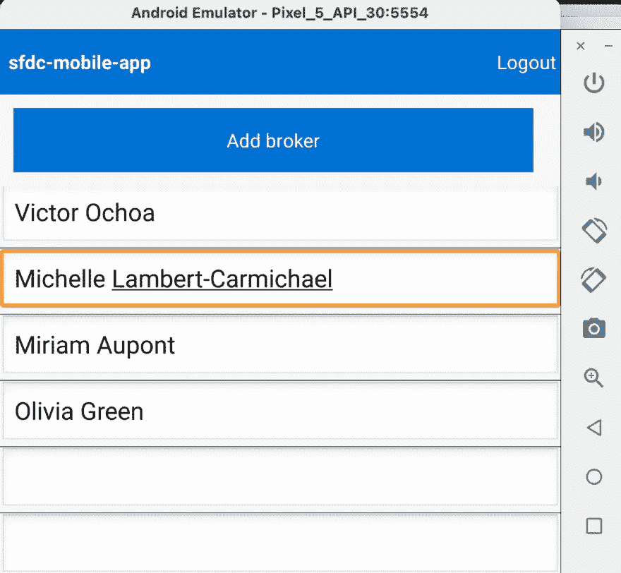

# 使用 Salesforce SDK 构建 Kotlin 移动应用程序:同步数据

> 原文：<https://betterprogramming.pub/building-a-kotlin-mobile-app-with-the-salesforce-sdk-synchronizing-data-72c041a5605c>

## 在我的系列文章的最后部分利用 Salesforce SDK


资料来源:undraw.co

这是我们演示如何使用 Salesforce Mobile SDK 构建与 Salesforce 平台配合使用的 Android 应用程序的三部分系列的最后一篇文章。在我们的第一篇文章中，我们向你展示了如何连接到你的组织。[我们的第二篇文章](/building-a-kotlin-mobile-app-with-the-salesforce-sdk-editing-and-creating-data-45916b0cc2bb)向您展示了如何从您的应用程序编辑数据并将数据添加到您的组织。本文将向您展示如何将数据从您的 Salesforce 组织同步到您的移动设备，以及如何处理网络中断等情况。让我们开始吧！

# 使用移动同步

移动开发最困难的方面之一是处理数据同步。当您需要添加一个新的代理，但是您处于离线状态时，您如何处理这种情况？或者，如果两个代理正在更新同一个代理，您如何处理这两个变更的合并呢？

借助 Salesforce Mobile SDK，这些现实世界中的问题将由一个名为[移动同步](https://developer.salesforce.com/docs/atlas.en-us.mobile_sdk.meta/mobile_sdk/entity_framework_native_using.htm)的系统为您处理。移动同步让您将手机的本地数据映射到 Salesforce 中的数据；它还要求您定义获取和推送数据的操作——它称之为`syncDown`和`syncUp`。

# 定义要同步的数据的形状

要开始使用移动同步，在`res/raw`中创建一个名为`brokerstore.json`的文件:

```
{
 "soups": [
   {
     "soupName": "brokers",
     "indexes": [
       { "path": "Id", "type": "string"},
       { "path": "Name", "type": "string"},
       { "path": "Title__c", "type": "string"},
       { "path": "Phone__c", "type": "string"},
       { "path": "Mobile_Phone__c", "type": "string"},
       { "path": "Email__c", "type": "string"},
       { "path": "Picture__c", "type": "string"},
       { "path": "__local__", "type": "string"},
       { "path": "__locally_created__", "type": "string"},
       { "path": "__locally_updated__", "type": "string"},
       { "path": "__locally_deleted__", "type": "string"},
       { "path": "__sync_id__", "type": "integer"}
     ]
   }
 ]
}
```

该文件定义了手机上数据的形状，以及同步所需的一些附加元数据。

接下来，创建一个名为`brokersync.json`的文件:

```
{
 "syncs": [
   {
     "syncName": "syncDownBrokers",
     "syncType": "syncDown",
     "soupName": "brokers",
     "target": {"type":"soql", "query":"SELECT Name, Title__c, Phone__c, Mobile_Phone__c, Email__c, Picture__c FROM Broker__c LIMIT 10000"},
     "options": {"mergeMode":"OVERWRITE"}
   },
   {
     "syncName": "syncUpBrokers",
     "syncType": "syncUp",
     "soupName": "brokers",
     "target": {"createFieldlist":["Name", "Title__c", "Phone__c", "Mobile_Phone__c", "Email__c", "Picture__c"]},
     "options": {"fieldlist":["Id", "Name", "Title__c", "Phone__c", "Mobile_Phone__c", "Email__c", "Picture__c"], "mergeMode":"LEAVE_IF_CHANGED"}
   }
 ]
}
```

这些是移动同步将在向下和向上同步数据时使用的操作。

完成移动同步过程的代码取决于几个因素，例如当您想要执行同步时，以及当设备失去(和恢复)连接时挂钩到 Android 事件周期。

下面的代码示例将向您展示一个完整的例子，说明同步工作需要做些什么，但是它们应该被视为高级概念，而不一定是生产就绪的企业级代码。

# 设置定期同步

说了这么多，让我们看看如何实现同步。首先，将这一行添加到我们在`MainActivity.kt`中的`onResume(client: RestClient)`方法的末尾:

```
setupPeriodicSync();
```

接下来，我们将向`MainActivity`类添加一个新变量和一个新函数:

```
private val SYNC_CONTENT_AUTHORITY =
   "com.salesforce.samples.mobilesyncexplorer.sync.brokersyncadapter"private fun setupPeriodicSync() {
   val account = MobileSyncSDKManager.getInstance().userAccountManager.currentAccount ContentResolver.setSyncAutomatically(account, SYNC_CONTENT_AUTHORITY, true)
   ContentResolver.addPeriodicSync(
       account, SYNC_CONTENT_AUTHORITY,
       Bundle.EMPTY, 10
   )
}
```

因为我们在函数中使用了`ContentResolver`，所以让我们确保通过在靠近`MainActivity.kt`顶部的其他导入语句旁边添加这一行来导入它:

```
import.android.content.ContentResolver
```

我们已经定义了两种触发同步的方法。`setupPeriodicSync`将每隔`10`秒运行一次同步。这对于生产环境来说太频繁了，但是出于演示的目的，我们将这样设置。

# 将同步操作映射到我们的数据和 UI

我们将一次展示接下来的几个代码样本，然后讨论它们在做什么。

在`app/java/com.example.sfdc`中，创建一个名为`BrokerSyncAdapter.kt`的新文件，并将这些行粘贴到其中:

```
package com.example.sfdcimport android.accounts.Account
import android.content.AbstractThreadedSyncAdapter
import android.content.ContentProviderClient
import android.content.Context
import android.content.SyncResult
import android.os.Bundle
import com.salesforce.androidsdk.accounts.UserAccount
import com.salesforce.androidsdk.accounts.UserAccountManager
import com.salesforce.androidsdk.app.SalesforceSDKManager
import com.example.sfdc.BrokerListLoaderclass BrokerSyncAdapter
   (
   context: Context?, autoInitialize: Boolean,
   allowParallelSyncs: Boolean
) :
   AbstractThreadedSyncAdapter(context, autoInitialize, allowParallelSyncs) {
   override fun onPerformSync(
       account: Account, extras: Bundle, authority: String,
       provider: ContentProviderClient, syncResult: SyncResult
   ) {
       val syncDownOnly = extras.getBoolean(SYNC_DOWN_ONLY, false)
       val sdkManager = SalesforceSDKManager.getInstance()
       val accManager = sdkManager.userAccountManager
       if (sdkManager.isLoggingOut || accManager.authenticatedUsers == null) {
           return
       }
       if (account != null) {
           val user = sdkManager.userAccountManager.buildUserAccount(account)
           val contactLoader = BrokerListLoader(context, user)
           if (syncDownOnly) {
               contactLoader.syncDown()
           } else {
               contactLoader.syncUp() // does a sync up followed by a sync down
           }
       }
   } companion object {
       // Key for extras bundle
       const val SYNC_DOWN_ONLY = "syncDownOnly"
   }
}
```

现在，在同一个文件夹中，用下面几行创建`BrokerListLoader.kt`:

```
package com.example.sfdcimport android.content.AsyncTaskLoader
import android.content.Context
import android.content.Intent
import android.util.Log
import com.salesforce.androidsdk.accounts.UserAccount
import com.salesforce.androidsdk.app.SalesforceSDKManager
import com.salesforce.androidsdk.mobilesync.app.MobileSyncSDKManager
import com.salesforce.androidsdk.mobilesync.manager.SyncManager
import com.salesforce.androidsdk.mobilesync.manager.SyncManager.MobileSyncException
import com.salesforce.androidsdk.mobilesync.manager.SyncManager.SyncUpdateCallback
import com.salesforce.androidsdk.mobilesync.util.SyncState
import com.salesforce.androidsdk.smartstore.store.QuerySpec
import com.salesforce.androidsdk.smartstore.store.SmartSqlHelper.SmartSqlException
import com.salesforce.androidsdk.smartstore.store.SmartStore
import org.json.JSONArray
import org.json.JSONException
import java.util.ArrayListclass BrokerListLoader(context: Context?, account: UserAccount?) :
   AsyncTaskLoader<List<String>?>(context) {
   private val smartStore: SmartStore
   private val syncMgr: SyncManager
   override fun loadInBackground(): List<String>? {
       if (!smartStore.hasSoup(BROKER_SOUP)) {
           return null
       }
       val querySpec = QuerySpec.buildAllQuerySpec(
           BROKER_SOUP,
           "Name", QuerySpec.Order.ascending, LIMIT
       )
       val results: JSONArray
       val brokers: MutableList<String> = ArrayList<String>()
       try {
           results = smartStore.query(querySpec, 0)
           for (i in 0 until results.length()) {
               brokers.add(results.getJSONObject(i).getString("Name"))
           }
       } catch (e: JSONException) {
           Log.e(TAG, "JSONException occurred while parsing", e)
       } catch (e: SmartSqlException) {
           Log.e(TAG, "SmartSqlException occurred while fetching data", e)
       }
       return brokers
   } @Synchronized
   fun syncUp() {
       try {
           syncMgr.reSync(
               SYNC_UP_NAME
           ) { sync ->
               if (SyncState.Status.DONE == sync.status) {
                   syncDown()
               }
           }
       } catch (e: JSONException) {
           Log.e(TAG, "JSONException occurred while parsing", e)
       } catch (e: MobileSyncException) {
           Log.e(TAG, "MobileSyncException occurred while attempting to sync up", e)
       }
   } /**
    * Pulls the latest records from the server.
    */
   @Synchronized
   fun syncDown() {
       try {
           syncMgr.reSync(
               SYNC_DOWN_NAME
           ) { sync ->
               if (SyncState.Status.DONE == sync.status) {
                   fireLoadCompleteIntent()
               }
           }
       } catch (e: JSONException) {
           Log.e(TAG, "JSONException occurred while parsing", e)
       } catch (e: MobileSyncException) {
           Log.e(TAG, "MobileSyncException occurred while attempting to sync down", e)
       }
   } private fun fireLoadCompleteIntent() {
       val intent = Intent(LOAD_COMPLETE_INTENT_ACTION)
       SalesforceSDKManager.getInstance().appContext.sendBroadcast(intent)
   } companion object {
       const val BROKER_SOUP = "brokers"
       const val LOAD_COMPLETE_INTENT_ACTION =
           "com.salesforce.samples.mobilesyncexplorer.loaders.LIST_LOAD_COMPLETE"
       private const val TAG = "BrokerListLoader"
       private const val SYNC_DOWN_NAME = "syncDownBrokers"
       private const val SYNC_UP_NAME = "syncUpBrokers"
       private const val LIMIT = 10000
   } init {
       val sdkManager = MobileSyncSDKManager.getInstance()
       smartStore = sdkManager.getSmartStore(account)
       syncMgr = SyncManager.getInstance(account)
       // Setup schema if needed
       sdkManager.setupUserStoreFromDefaultConfig()
       // Setup syncs if needed
       sdkManager.setupUserSyncsFromDefaultConfig()
   }
}
```

我们刚刚做了什么？每个文件都有一个特定的角色，虽然您的应用程序的对象和字段肯定会有所不同，但这些类的功能和原理是相同的:

*   `BrokerListLoader`负责将您在`brokersync.json`中定义的同步操作映射到实际执行工作的 Kotlin 代码。注意，有`syncUp`和`syncDown`方法使用移动 SDK 的`SyncManager`加载 JSON 文件并与 Salesforce 来回通信。
*   `BrokerSyncAdapter`也许最好被认为是负责调度同步的代码。也就是说，它是`BrokerListLoader`的入口点，可以被 UI 元素(比如在刷新按钮点击期间)或 Android 系统事件(比如连接丢失)调用。

最后，我们需要在我们的`AndroidManifest.xml`文件中添加一行(在`app/manifests`中)。我们新的同步功能将需要特殊的 Android 权限，我们要求用户在运行时安装应用程序时允许。将以下带有`WRITE_SYNC_SETTINGS`的行添加到清单的末尾:

```
<uses-permission android:name="com.example.sfdc.C2D_MESSAGE" />
  <uses-permission android:name="android.permission.WRITE_SYNC_SETTINGS" />
</manifest>
```

# 测试同步

我们的最后一步是测试移动同步工作。随着模拟器的运行，您应该登录并看到一个代理列表。这个列表应该反映您在本地机器上的 web 浏览器中看到的代理列表。在您的 web 浏览器中，编辑其中一个代理名称，并保存更改。


然后，在您的模拟器中，您可以关闭手机或切换到另一个应用程序，然后切换回您的`sfdc-mobile-app`。您应该会看到您的经纪人姓名列表随着您在浏览器中所做的更改而更新:



仅此而已！同样，这只是一个供您学习的基础构件。在大约 150 行代码中，我们为一系列相当复杂的运动部件设计了一个解决方案:

*   将 Salesforce 自定义对象映射到 JSON
*   设置计时器以定期在 Salesforce 组织和移动设备之间来回同步数据
*   处理网络连接方面的错误(并从问题中恢复)

# 结论

Salesforce Mobile SDK 使移动设备与 Salesforce 数据的连接变得非常容易。在这篇文章中，您学习了如何从您的手机查询和操作数据，并看到结果即时反映在 Salesforce 上。您还了解了移动同步及其在预测连接问题方面的作用。

然而，有了所有这些信息，Salesforce Mobile SDK 还可以做更多的。看看[关于与 SDK 合作的完整文档](https://developer.salesforce.com/docs/atlas.en-us.noversion.mobile_sdk.meta/mobile_sdk)。或者，如果你喜欢做更多的编码，有足够的教程让你忙起来。我们迫不及待地想看看你的作品！