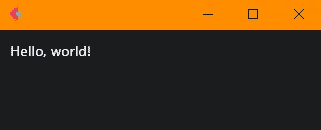
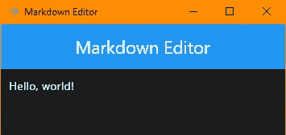
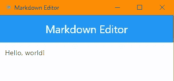
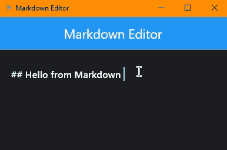
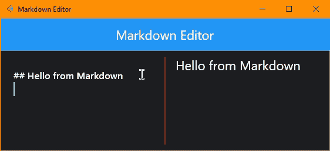
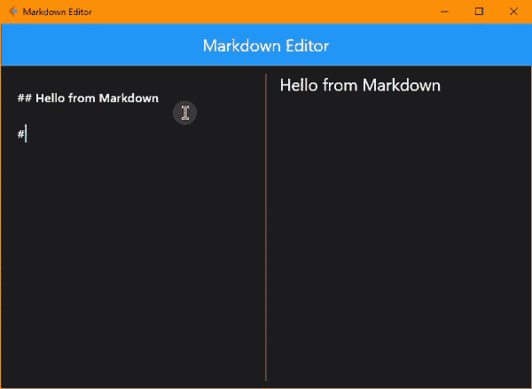

# 使用 Flet Python 框架构建 Markdown 编辑器 Flutter 应用程序

> 原文：<https://betterprogramming.pub/building-a-markdown-editor-previewer-with-flet-7d9b06d6dc4b>

## 使用 Python 构建 Flutter 应用程序


由[凯利·西克玛](https://unsplash.com/@kellysikkema?utm_source=medium&utm_medium=referral)在 [Unsplash](https://unsplash.com?utm_source=medium&utm_medium=referral) 上拍摄的照片

Flet 仅仅是一个 python 框架，它提供了用你喜欢的编程语言构建跨平台应用的可能性。在撰写本文时，它仅针对 Python 实现，但支持其他语言，如 JavaScript/TypeScript、Go 和 C#(。NET)已经按照他们的路线图进行了规划。

Flet 基于 [Flutter](https://flutter.dev/) ，这意味着你可以使用 Flet 控件来构建你的 UI，而 Flet 控件是基于 Flutter 小部件的。

# 快速介绍

这是一个有趣且容易制作的项目。我喜欢它，因为你可以把它变成你自己的——而且它也很有用。本文中讨论的编辑器将在本地运行，并在您键入时实时更新。太棒了，对吧？请随意向下滚动到最后一部分，查看最终输出。

我会尽最大努力一步一步地移动，尽可能保持初学者友好的状态。

我同样会确保在各种代码块中添加必要的注释，以便更好地理解。

# 安装 Flet —“你好，世界！”

Flet 以 python 包的形式提供，这意味着它的安装与其他包非常相似。只需确保您安装了 Python，然后从您的终端运行这个命令来获取最新版本:

```
pip install flet
```

建议在虚拟环境中执行此操作。

安装完成后，创建一个新文件，并按照您的意愿命名它(例如:my-editor)并运行这个基本的“Hello，World！”使用您最喜欢的 IDE 来编写代码，以确保一切就绪。

```
import flet as ft

def main(page: ft.Page):
    page.add(ft.Text(value="Hello, world!"))

ft.app(target=main)
```



你好世界——黑暗模式


Hello World —灯光模式

在本文中，我将用别名`ft`导入 Flet，就像 Numpy 通常的别名`np`或熊猫`pd`一样。好吧！让我们开始吧。

该代码块的执行会打开一个包含呈现输出的本机窗口。如果您愿意，您可以告诉 Flet 在您的浏览器中呈现该输出，只需将最后一行代码修改为:

```
ft.app(target=main, view=ft.WEB_BROWSER)  # a port could also be specified
```

# 应用程序基础

首先，让我们给我们的应用程序一个标题并添加一个`Appbar`。

```
import flet as ft

def main(page: ft.Page):
    page.title = "Markdown Editor"   # title of application/page

    page.appbar = ft.AppBar(
        title=ft.Text("Markdown Editor", color=ft.colors.WHITE),    # title of the AppBar, with a white color
        center_title=True,          # we center the title
        bgcolor=ft.colors.BLUE,     # a color for the AppBar's background
    )
    page.add(ft.Text(value="Hello, world!"))    # some placeholder content (nothing will be shown without this line)

ft.app(target=main)
```

您应该会看到类似于下图之一的内容:



带 Appbar 的 Hello World 黑暗模式



带 Appbar 的 Hello World 灯光模式

我说“其中一张图片”是因为默认情况下 [Flet 使用你系统的主题](https://flet.dev/docs/controls/page#theme_mode)。为了保持一致，我们使用黑暗主题。所以，让我们显式地设置`theme_mode`。

```
# ...
page.title = "Markdown Editor
page.theme_mode = "dark"    # there are only 3 possible values(self-explanatory): "dark", "light" and "system"
# ...
```

我省略了一些代码行(使用#…)以节省空间。

# 用户界面(UI)结构

现在，在我们继续之前，让我解释一下我们的 UI 的结构。我个人讨厌复杂的 ui，当然是因为普通用户(初学者)很难理解。所以我们会选择一个简单的。

在编辑器的左侧(LHS)，我们将有一个降价输入区。

正如你可能已经发现的，我们将在编辑器的右侧(RHS)有一个预览区。

让我们从 LHS 开始。

# 编辑的左手边(LHS)

当我们在应用程序开发中谈论“文本输入”时，我们想到的第一个控件/小部件最终是输入控件/小部件。Flet 有一个名为 [TextField](https://flet.dev/docs/controls/textfield/) 的工具，我们将在工作中使用它。

我们将创建一个`TextField`并将它存储在一个名为 text_field 的变量中，如下所示。

```
text_field = ft.TextField(
        value="## Hello from Markdown",  # the initial value in the field (a simple Markdown code to test)
        multiline=True,  # True means: it will be possible to have many lines of text
        expand=True,  # tells the field to 'expand' (take all the available space)
        border_color=ft.colors.TRANSPARENT,  # makes the border of the field transparent(invisible), creating an immersive effect
    )
```

以下是到目前为止的全部代码:

```
import flet as ft

def main(page: ft.Page):
    page.title = "Markdown Editor"  # the title of our app
    page.theme_mode = "dark"

    page.appbar = ft.AppBar(
        title=ft.Text("Markdown Editor", color=ft.colors.WHITE),  # title of the AppBar with a white color
        center_title=True,  # we center the title
        bgcolor=ft.colors.BLUE,  # a color for the AppBar's background
    )

    text_field = ft.TextField(
        value="## Hello from Markdown",  # the initial value in the field (a simple Markdown code to test)
        multiline=True,  # True means: it will be possible to have many lines of text
        # on_change=md_update,
        expand=True,  # tells the field to 'expand' (take all the available space)
        border_color=ft.colors.TRANSPARENT,  # makes the border of the field transparent(invisible), creating an immersive effect
    )

    page.add(text_field)    # replaced the placeholder with our TextField (the LHS content)

ft.app(target=main)
```



编辑的左手边(LHS)

# 编辑的右手边(RHS)

我们让 LHS 工作，现在让我们移动到 RHS。回想一下，这将是一个包含输入降价预览的部分。我们将利用 Flet 的降价控制。我们将为此创建一个变量，并将其添加到页面中。

```
def main(page: ft.Page):
    # ...

    text_field = ft.TextField(...)
    md = ft.Markdown(
        value=text_field.value,  # make its value be equal to the content of our text_field
        selectable=True,    # to make the rendered markdown selectable
        extension_set="gitHubWeb",  
        on_tap_link=lambda e: page.launch_url(e.data),  # what happens when a link is clicked: a browser tab is opened up, with the link's URL 
    )

    page.add(
        ft.Row(  # we use the row here, so everything fits on a line
            controls=[
                text_field, 
                ft.Container(  # we use the container here, to take advantage of its content alignment property
                    ft.Column(  # we use the column here, to take advantage of its scroll property
                        [md],
                        scroll="hidden",  # we make the Markdown scrollable
                    ),
                    expand=True,  # we make it fill up all the available space
                    alignment=ft.alignment.top_left,  # align the column
                )
            ],
            vertical_alignment=ft.CrossAxisAlignment.START,
            expand=True,  # we make it fill up all the available space
        )  # a row containing our text_field on the LHS and Markdown on the RHS
    )
```

您可能已经注意到，我将两个部分(LHS 和 RHS)添加到一个[行](https://flet.dev/docs/controls/row)中。这是因为我们希望结果在一行上。如果没有该行，markdown 将位于 TextField 的下方！

*一些控件主要用于利用它们的一些属性。*

执行您的代码。

你不认为我们应该把 LHS 和 RHS 分开吗？也许只要在它们之间加一条线就可以了？在 Flet 中，这可以通过使用[垂直分割器](https://flet.dev/docs/controls/verticaldivider)控制来实现。

让我们更新我们的行，插入这个控件。

```
# ...
    page.add(
        ft.Row(  # we use the row here, so everything fits on a line
            controls=[
                text_field, 

                ft.VerticalDivider(color=ft.colors.RED),  # a red vertical line of seperation

                ft.Container(  # we use the container here, to take advantage of its content alignment property
                    ft.Column(  # we use the column here, to take advantage of its scroll property
                        [md],
                        scroll="hidden",  # we make the Markdown scrollable
                    ),
                    expand=True,  # we make it fill up all the available space
                    alignment=ft.alignment.top_left,  # align the column
                )
            ],
            vertical_alignment=ft.CrossAxisAlignment.START,
            expand=True,  # we make it fill up all the available space
        )  # a row containing our text_field on the LHS and Markdown on the RHS
    )
```

这两个区域现在更容易区分了。很好，对吧？



编辑的 LHS 和 RHS

但是你注意到什么了吗？如果没有，在 LHS 中输入一些文本对 RHS 没有影响。

*这是因为我们没有听到 TextField* 中的变化。

为了监听变化，我们需要一个回调函数，当`TextField`发生变化时，就会调用这个函数。

下面是我们简单的回调:

```
def update_preview(e):
        """
        Updates the RHS(markdown/preview) when the content of the textfield changes.
        :param e: the event that triggered the function
        :type e: ControlEvent
        """
        md.value = text_field.value
        page.update()
```

但这不是我们需要的全部！我们必须告诉 text_field 我们将监听它的变化。这可以通过将其 on_change 属性设置为我们的回调来实现。

```
text_field = ft.TextField(
        # ...
        on_change=update_preview
)
```

如果你在路上迷路了，请查看这个[要点以获得完整的代码](https://gist.github.com/ndonkoHenri/922a5e80005b73480d5e9919cf397ec4#file-md-editor-py)。以下是最终结果的截图:



最终输出

仅仅用了 *60 行代码*(算上文档字符串和空白)*，*我们就构建了一些令人敬畏的东西！

请注意，您最终可以[将这个应用打包成一个独立的可执行文件](https://flet.dev/docs/guides/python/packaging-desktop-app)，或者[将它部署到 web 上](https://ndonkohenri.medium.com/deploying-a-flet-app-for-free-on-cloudflare-pages-e56ecc6ce450)。这就是 Flet 的跨平台特性。

你想试试吗？我在这里 *部署了一个网络版 [*。*](https://md-editor.fly.dev)*

# 轮到你了！

我们已经到了本文的末尾，但是您可以尝试通过以下方式对此项目进行更深入的研究:

*   给 RHS/preview 一个顶部[填充](https://flet.dev/docs/controls/container#padding)，这样它可以更好地与 TextField 的内容对齐；
*   在 AppBar 中添加一个按钮来改变页面的 theme_mode(从亮到暗，反之亦然)；
*   使用`[FilePicker](https://flet.dev/docs/guides/python/file-picker-and-uploads)`保存文本字段的内容(可能是。txt 或者。md)到用户的设备中；
*   使用 [FilePicker](https://flet.dev/docs/guides/python/file-picker-and-uploads) 控件将用户设备中所选文本文件的内容直接导入/加载到文本字段中；
*   …( *你的想象力是无限的！* )…

卡住了可以用[这个](https://github.com/ndonkoHenri/Flet-Samples/tree/master/Markdown%20Editor)作为解决方案/参考。请让我知道你是否尝试过或者你是否有任何问题。我很乐意帮忙。

# 接下来呢？

请关注我的下一篇文章，我们将构建一个 URL Shortener 应用程序。那里见！

感谢阅读。