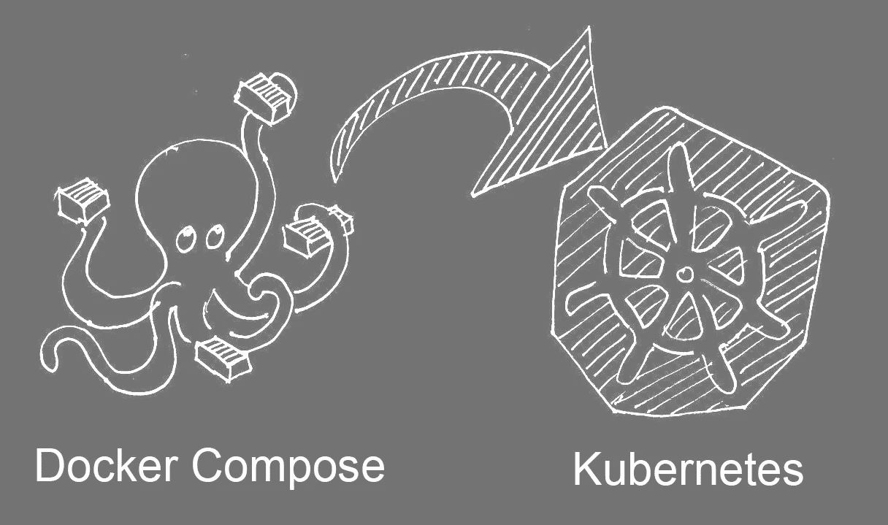
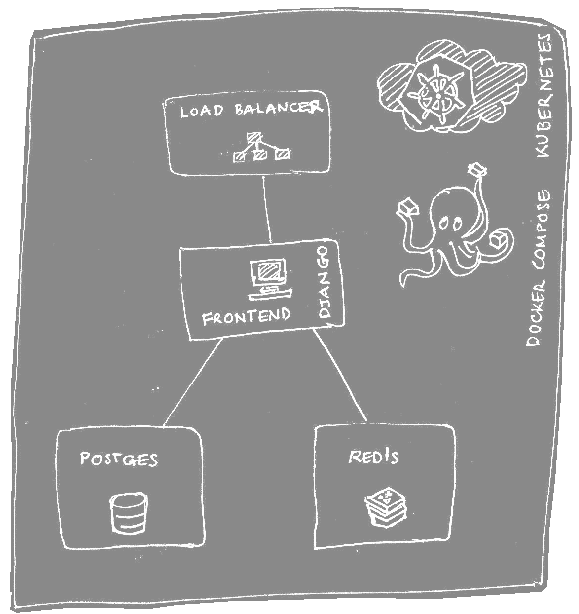
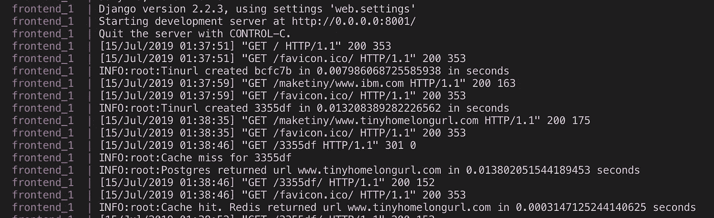

# 构建可伸缩的 Tinyurl 应用程序

> 原文：<https://betterprogramming.pub/building-a-massively-scalable-tinyurl-application-with-python-docker-compose-and-kubernetes-90ff5d4d7f91>

## 使用 Python、Docker Compose 和 Kubernetes



假设您有一个应用程序，它可以在您的笔记本电脑或一些只有几个用户的服务器上很好地运行。你如何将它扩展到数百万用户？

可伸缩性对于用户体验来说是绝对重要的:不管系统中有多少用户，我们如何维持合理的用户体验？这些是我们将在这篇博客中通过一个具体的例子逐步解决的问题。

读完这篇博客后，你应该能够:

*   组织您的应用程序功能以实现可伸缩性
*   使用 Docker Compose 在您的笔记本电脑上快速开发和迭代分布式应用程序
*   通过 Kubernetes，在几分钟内将该应用程序部署到云中，面向更多用户！

此外，Python 是开发人员生产力的绝佳选择。

## 概观

我们将讨论众所周知的 *Tinyurl* 应用程序的设计，我们将从头开始构建它。

Tinyurl 应用程序也是一个流行的系统设计主题，它的功能是将一个长的 url 转换成一个较短的版本。尽管这个应用程序从功能方面看起来很简单，但我们仍然可能会遇到在更复杂的应用程序中可能会发现的所有可伸缩性缺陷。这让我们有机会在设计主题上工作，而不会被功能细节所困扰。

我们将在 Docker Compose 中部署该应用程序进行本地测试，稍后在 [Kubernetes](https://kubernetes.io) 中进行公共云中的可扩展部署。

具体来说，我们将创建一个 REST 服务，它将提供 API 来创建一个微小的 url 并检索原始 url。

我们将从高级架构以及软件堆栈和计划的部署选项开始。将向您介绍 Docker 和容器管理软件，特别是 Docker Compose 和 Kubernetes，它们构成了构建可伸缩/分布式应用程序的有用工具集。

我们将把应用程序分解成多个自治服务，这有助于应用程序各部分的独立扩展。Kubernetes 是这种基于微服务的应用程序的可伸缩性的强大推动者。此外，简单易懂的设计对于构建可伸缩性可以随着时间的推移而提高的软件大有帮助。我们的核心逻辑大概是 50 行左右的 Python！

与此同时，Docker Compose 使本地开发变得简单而有趣。

让我们从我们需要的 API 开始:

*   给定一个 url，返回短 url
*   给定一个短 url，返回原始 url

[bit.ly](http://bit.ly) 是一个流行的在线网址缩短服务，你可以尝试一下，感受一下我们在这里想要实现的目标。

在我们详细讨论单个服务之前，让我们列出 API 的性能和可伸缩性需求。

# 要求和 API

API: url 缩短

*   响应时间应少于 1 秒
*   每秒缩短 100 个 URL
*   主动管理的“大量”URL

API:返回原始 url

*   响应时间应少于 100 毫秒
*   每秒返回 10000 个 URL

对 API 检索原始 url 的性能期望更高，因为它会被频繁请求，因此对最终用户体验至关重要。此外，服务应该是“弹性的”,并且随着流量的增加，通过将更多的节点投入服务来自动扩展。

我们希望达到的性能和吞吐量是系统设计和硬件的函数。一个完全可扩展的系统可以通过增加硬件来扩展；从而使上面列出的任意吞吐量成为可能。

然而，在现实中，当试图扩展系统时，应用程序中的子系统可能会成为瓶颈。我们将反复定位并消除这样的瓶颈。

# 体系结构

现在，让我们从一个高级设计开始，我们将应用程序分成独立的服务，并为它们选择合适的软件堆栈。

我们有一个实现 REST APIs 的前端服务器，它需要一个数据库来存储和获取 URL。前端服务器是无状态的，在多台机器上启动以处理增加的负载。相比之下，我们选择的 Postgres 数据库在默认情况下是有状态的，很快就会成为瓶颈。因此，我们添加了一个 Redis 缓存来保护 Postgres。



如上图所示，简单的架构应该有助于我们在遇到瓶颈时轻松定位。

负载平衡器在云环境中的多个前端实例之间分派传入的请求。

# 服务

*   Postgres 数据库:URL 的持久存储。有许多其他的选择，我们将从一个熟悉的 RDBS 开始，暂时保持事情简单。
*   Redis 缓存:我们可以考虑使用高读(为了获得原始 url)写(创建微小的 url)比率的缓存
*   API server/'frontend': API server 将编排 Postgres 和 Redis 服务来实现 REST 端点。我们选择一个 Django，一个生产级 web 服务器，来托管 REST 端点。还有许多其他选项，如带有快速/哈比神或 Java Spring Boot 的节点。我们喜欢 Python/Django，因为它能产生可伸缩且易于理解的代码，这就是我们的目的。此外，Django 附带了许多基本元素，比如内置的用户管理和模板。从这里开始，你可以很容易地过渡到一个高效的系统。

# 部署

我们将容器化我们的服务，并在本地开发期间将应用程序部署在 [Docker Compose](https://docs.docker.com/compose/overview/) 中，这允许我们用一个命令启动和停止所有服务。这也为更快地开发和迭代代码提供了便利。

最后，我们将在不修改代码的情况下在 cloud/Kubernetes 中部署我们的应用程序。

# 概念

现在我们已经有了一个大致的计划，下面简单介绍一下 Docker、Docker Compose 和 Kubernetes。

## 码头工人

Docker 类似于 VMware 和 VirtualBox 等虚拟机技术，只是它更加高效和轻量级，因为 Docker 容器直接在底层主机操作系统内核上工作。另一方面，VMware 和 VirtualBox 技术在主机操作系统的基础上增加了一个客户操作系统(更多差异见[这里](https://blog.netapp.com/blogs/containers-vs-vms/))。

## Docker 图像和容器

Docker *镜像*是一个操作系统镜像的声明，上面有你想要的用于特定目的的软件层。例如节点/快速网络服务器。运行 docker 映像时，您得到的是一个 Docker *容器*。

## Dockerfile 文件

[*Dockerfile*](https://docs.docker.com/engine/reference/builder/) 是一个文本文件，包含描述如何构建一个 Docker 镜像的指令，该镜像应该作为一个容器运行(例如，一个带有 Python 3 的 Ubuntu 镜像，Django +你的应用代码)。我们将为我们的每个服务创建一个 docker 文件。

## Docker 撰写

[*Docker*](https://docs.docker.com/engine/docker-overview/) 提供构建和运行应用程序的工具，通过 Dockerfile 声明为容器实例。

[*Docker-compose*](https://docs.docker.com/compose/overview/)*帮助部署和运行在文本文件/YAML 中声明配置的**多**容器应用程序。YAML 依次引用应用程序所需的各个 docker 文件。*

*现在让我们来看看代码，逐个服务。从 g it 克隆应用程序后，首先安装所有需要的软件并运行它是一个好主意。这将有助于我们了解应用程序的各个部分。*

## *先决条件*

*   *安装 docker: [Mac](https://docs.docker.com/v17.12/docker-for-mac/install/) 或 [Windows](https://docs.docker.com/docker-for-windows/install/)*
*   *安装 [Docker-compose](https://docs.docker.com/compose/install/) (通常 Docker Compose 应与之前步骤中的 Docker 安装一起安装；仅当您无法在终端上运行命令' *docker-compose -version* '时才执行此步骤)*
*   *安装 [git](https://git-scm.com/book/en/v2/Getting-Started-Installing-Git)*
*   *在一个合适的文件夹里，比如说<tinyroot>，克隆一个小小的网址 git repo[https://github.com/irnlogic/tiny](https://github.com/irnlogic/tiny)，然后运行这个应用程序。</tinyroot>*

```
*<tinyroot> git clone [https://github.com/irnlogic/tiny.git](https://github.com/irnlogic/tiny.git)
<tinyroot> cd tiny/dockercompose/
<tinyroot> docker-compose upVisit [http://localhost:3000](http://localhost:3000/867nv/), tinyurl app should be running. Hit Ctrl-C on the command line to stop the app.*
```

*‘docker-compose up’命令构建所需的 docker 映像并启动容器实例，如 [docker-compose.yaml](https://github.com/irnlogic/tiny/blob/master/dockercompose/docker-compose.yml) 中所配置的。可以在浏览器上访问 [http://localhost:3000](http://localhost:3000) 与端点进行交互。*

*控制台日志还应该显示一些性能数据，这些数据让您对 Redis 之类的缓存和 Postgres 之类的 RDBMS 所涉及的响应时间范围有所了解。*

**

*Docker 编写控制台输出*

## *代码和实现*

***文件夹结构***

*请参见下面的文件夹结构。每个服务在 dockercompose 文件夹下都有自己的子目录。kubernetes 包含在 Kubernetes 中部署我们的应用程序所需的描述符。*

```
*<tinyroot> - dockercompose      # Docker-compose and Dockerfiles
             -- db              # Dockerfile Postgres
             -- redis           # Dockerfile Redis
             -- django          # Dockerfile and source for Django
             -- docker-compose.yml
           - kubernetes      # Deployment, service descriptors* 
```

***Postgres 数据库***

*我们只是在 docker hub 使用基于 Postgres 映像的 Dockerfile。您可以在 https://hub.docker.com[的 docker hub](https://hub.docker.com)上搜索可用图像，以找到其他图像和版本。*

*[db/Dockerfile](https://github.com/irnlogic/tiny/blob/master/dockercompose/db/Dockerfile)*

```
*FROM postgres:11.1-alpine* 
```

*这里来自命令的[设置了一个基础映像，在本例中，它安装了 Postgres。我们没有在基础图像上添加更多的层——我们还不如直接使用基础图像呢！](https://docs.docker.com/engine/reference/builder/#from)*

*该 docker 文件使用版本'*11.1-阿尔卑斯山*'的'*postgres*' image**。从该映像实例化的容器将在端口 5432 上运行 Postgres。省略版本将绘制图像的最新版本。我们指定了一个显式版本，以避免在发布图像的新版本时出现潜在的不兼容性。***

***恭喜，您已经有了一个基本的 Postgres 服务器映像！***

*****Redis 缓存*****

***[redis/Dockerfile](https://github.com/irnlogic/tiny/blob/master/dockercompose/redis/Dockerfile)***

```
***FROM redis
CMD [“redis-server”]***
```

***我们获取标准 Redis 映像，并在启动容器时使用 CMD 启动 Redis 服务器。同样，我们还没有对 Dockerfile 做太多的工作。***

*****Django 网络服务器*****

***Django web 服务器实现 rest API 端点，并与 Postgres 和 Redis 服务交互。***

***让我们回顾一下[tiny/docker compose/Django/tiny app](https://github.com/irnlogic/tiny/tree/master/dockercompose/django/src/tinyapp)下的 Django 源代码，它被组织成如下图所示的文件夹结构。***

```
***tinyapp/
├── web/
│   ├── __init__.py
│   ├── settings.py
│   ├── urls.py
│   └── wsgi.py
└── **tinurl**/
│   ├── **lib/tiny.py** 
|   ├── **migrations** │   ├── **views.py**
│   └── **urls.py**
│
└── manage.py***
```

***上面的许多文件夹和文件都是 Django“管道”的一部分，你可以通过查看[这个](https://docs.djangoproject.com/en/2.2/intro/tutorial01/)教程来了解。现在只需要关注文件夹‘tinyurl’下用**粗体**显示的项目就足够了，其中包含相关代码。该文件夹作为一个独立的 Django“应用程序”,包含路由、视图、迁移和核心应用程序逻辑。***

*   ****migrations/models.py* —声明“Url 模型”，它也转换成 Postgres 表结构来存储 Url***
*   ****lib/tiny.py* —包含使用 Postgres/Redis 读写 URL 的核心逻辑的模块***
*   ****views.py* —用于呈现 url 端点的简单视图，使用 lib/tiny.py***
*   ****urls.py* —指向上图的路线***

***当调用一个 API 时，urls.py 在 views.py 中触发一个特定的“视图”,该视图调用 tiny.py 中的相关函数，其输出与一个用于呈现响应的模板相融合。即使对 Django 框架没有很深的理解，您也应该能够很容易地跟踪到这一点。***

***让我们从 URL 的数据库模式开始。***

***我们的模型在 [models.py](https://github.com/irnlogic/tiny/blob/master/dockercompose/django/src/tinyapp/tinyurl/models.py) 中声明，这是一个 Python 类:***

```
***from django.db import models
class Url(models.Model):
    shorturl = models.CharField(max_length=10, primary_key=True)
    originalurl = models.CharField(max_length=300)***
```

***模型 *Url* 用两个属性声明，这将产生一个简单的关系表，用于存储由两列组成的 Url。***

*   ****shorturl* —我们的应用程序生成的 url 的短代码，标记为主键。主键充当索引，因此有助于快速查找原始 url。***
*   ****原网址* —原网址***

***下面的[命令](https://github.com/irnlogic/tiny/blob/master/dockercompose/django/start_django.sh):***

*   ***生成迁移，描述如何从一个版本的数据库模式迁移到另一个版本，反之亦然***
*   ***基于这些迁移生成 Postgres 表。这些包括在内***

***Django [Dockerfile](https://github.com/irnlogic/tiny/blob/master/dockercompose/django/Dockerfile) 中引用的 [start_django.sh](https://github.com/irnlogic/tiny/blob/master/dockercompose/django/start_django.sh) :***

```
***python tinyapp/manage.py makemigrations
python tinyapp/manage.py migrate***
```

***下面是我们案例中生成的迁移:***

***好的—我们的高级算法如下:***

***生成微小的 url-对于给定的 url，生成散列短代码，并且生成的短代码元组和原始 url 保存在 Url 表中。***

***检索原始 url —给定一个 url，可以通过在 url 表中进行简单的查询来获取原始 url，并在 WHERE 子句中使用短 url，然后缓存该 Url。后续请求将从 Redis 缓存中得到响应。***

***继续到 [tiny.py](https://github.com/irnlogic/tiny/blob/master/dockercompose/django/src/tinyapp/tinyurl/lib/tiny.py) …***

***下面的[行](https://github.com/irnlogic/tiny/blob/6a9bae0aa084697d3ecc4950f3449f78d76f0d2e/dockercompose/django/src/tinyapp/tinyurl/lib/tiny.py#L12)设置了一个到 Redis 的连接，其中 6379 是 Redis 基础映像中设置的 Redis 端口，它在我们的 [docker-compose.yml](https://github.com/irnlogic/tiny/blob/6a9bae0aa084697d3ecc4950f3449f78d76f0d2e/dockercompose/docker-compose.yml#L7) 中公开，供其他容器访问。***

```
***g_redis = redis.Redis(host=’redis’, port=6379, db=0, decode_responses=True)***
```

****注意:连接 redis 服务请参见主机名'* ***redis*** *'的使用。每个服务容器加入由 Docker-compose 设置的默认* [*网络*](https://docs.docker.com/compose/networking/) *，该网络可由主机名与容器名相同的其他容器访问。请参考我们的*[*docker-compose . yml*](https://github.com/irnlogic/tiny/blob/30715f81c5f362b64b00417a8f4ff7770fad5c75/dockercompose/docker-compose.yml#L5)*文件，其中服务/容器名声明为“*[*redis*](https://github.com/irnlogic/tiny/blob/2bba2e61aca63674d6dd6e24eb22d955f7ce9d87/dockercompose/docker-compose.yml#L4)*”。****

```
****services: 
 redis: 
 **build:* ***./redis****
  ports: 
     — 6379:6379****
```

***接下来，以下简单明了的帮助器函数包装 Redis 的 set (key/value)和 get(key):***

***下面是生成并持久化短 url 的核心逻辑: *get_tinyurl* ，其中真正的作品 get in*_*[*get _ or _ create _ in _ db*](https://github.com/irnlogic/tiny/blob/2bba2e61aca63674d6dd6e24eb22d955f7ce9d87/dockercompose/django/src/tinyapp/tinyurl/lib/tiny.py#L44):***

*   ***使用 [*hashlib*](https://docs.python.org/2/library/hashlib.html) 模块生成 32 个字符的 md5 散列，并选择其最后 6 个字符作为 url 短代码。这限制了我们可以生成的 URL 的数量。如果我们取整个散列，我们的 url 就不再“微小”了。下面的 while 循环检查所选择的散列段是否被分配给不同的 url，如果是，我们向左滑动 md5 散列并选择一个新的 6 字符窗口作为候选 tinyurl 代码。我们任意地进行最多 10 次尝试来解决散列冲突，尽管我们永远不会达到这种情况。一件好事是生成的散列具有这样的属性，即对于相同的 URL，生成相同的散列。***
*   ***然后使用 Django ORM 接口将生成的短 url 和原始 url 保存到 Postgres 数据库中。***

***拼图中的最后一块是 *get_originalurl，*，它检索给定小 url 的原始 url。首先，尝试从 Redis 缓存中获取原始 url。如果它没有被缓存，那么我们从 Postgres 获取原始 Url，缓存它并返回原始 Url。***

***Django docker 文件生成包含上述 Python/Django 代码的图像。***

## ***[django/Dockerfile](https://github.com/irnlogic/tiny/blob/master/dockercompose/django/Dockerfile)***

```
***FROM python:3
RUN mkdir /code
WORKDIR /code
ADD requirements.txt /code/
RUN pip install -r requirements.txt
ADD src/ /code/
ADD start_django.sh /code/
CMD ./start_django.sh***
```

*   ***'【T8 FROM python:3'中的第一行从 [docker hub](https://hub.docker.com) 获取标准的 Python 映像，我们通过它安装软件和代码。***
*   ***运行命令运行一个命令，即在基础图像上添加一个层。*运行 mkdir /code* 创建目录“代码”***
*   ****WORKDIR /code* '将'/code '设置为下面后续 docker 命令的工作目录。***
*   ***“ADD requirements.txt /code/”将 requirements.text 从包含“Dockerfile”的目录复制到“/code/”目录。Requirement.txt 列出了我们的应用程序所需的 Python 模块。例如 psycopg2 — Postgres 客户端、Redis — redis 客户端***
*   ***后续添加命令将' src '文件夹和' start_django.sh '复制到'/code '文件夹***
*   ***最后' *CMD。/start_django.sh* '在容器运行期间执行' *start_django.sh* '中的命令，即每次容器启动时(相比之下， *RUN* 命令将在构建映像时运行一次！).Shell 脚本' *start_django.sh* '允许我们运行多个命令，例如创建、运行迁移和启动 Django web 服务器。***

## ***Docker 撰写***

***启动多个 docker 容器并设置它们相互通信是一件相当麻烦的事情。这就是 Docker Compose 的用武之地——它允许您在一个配置中定义所有服务，并使用一个命令启动所有服务。***

***在我们的例子中[tiny/docker compose/docker-compose . YAML](https://github.com/irnlogic/tiny/blob/master/dockercompose/docker-compose.yml)定义了组成 Tinyurl 应用程序的所有服务:***

******

***docker-compose.yaml***

***在文件的顶部‘version:3’声明了我们正在使用的 Docker compose yaml 文件的**格式**的版本。***

***在 yaml 文件中的服务下，您可以注意到四个服务:redis、postgres、adminer 和 frontend。你现在可以忽略“管理员”。***

## *****雷迪斯*****

***服务的名称是' redis '，构建规范是' *build:。/redis* 告诉我们在启动这个服务时要构建哪个映像，在本例中是目录下的 Dockerfile。/redis。或者，docker hub 中的图像也可以使用“image”标签调用，但我们选择不在这里调用。***

***“ports”部分 *"6379:6379"* 将把容器上的一个端口(冒号右边的数字)映射到主机上的一个端口(这里是 localhost ),在这种情况下两者是相同的。***

***Docker Compose 中的服务名充当访问 Redis 服务的端点。例如，在 Docker Compose 网络中运行的另一个服务可以使用主机名' redis '和 6379 作为端口来引用 Redis。***

## *****Postgres*****

***同样，Postgres 服务链接到 Dockerfile。/db 目录。“environment”部分用于声明 Postgres 用户名和密码，然后可以在生成的 Postgres 容器中访问它们。有问题的 Postgres 映像识别这些环境变量来配置自己。***

*****前端*****

***这是 Django 中的 REST 服务器，设置类似。 *depends_on* 声明一个依赖关系，使 Redis 和 Postgres 容器在 Django 服务之前被实例化。***

***关于 Docker Compose yaml 文件的更正式的文档，请参见[这里的](https://docs.docker.com/compose/compose-file/)。***

## *****在 Kubernetes 的部署*****

***现在，你可以按照这里的一步一步的指示，在 Google Cloud Kubernetes 中部署我们的 Tinyurl 应用程序。Kubernetes 值得一个更详细的治疗比可以容纳在这个博客。尽管如此，到目前为止，您应该能够使用 Docker Compose。Kubernetes 的服务定义类似于 Docker Compose 中的服务定义，除了它还提供了“部署”，这提供了对计算单元、内存、CPU 等扩展方面的精细控制。Kubernetes 的“服务”本质上为其他服务与部署通信提供了稳定的端点。***

***简而言之， [Kubernetes](https://kubernetes.io/docs/concepts/overview/what-is-kubernetes/) 将在云环境中做 Docker compose 在我们的开发机器中为我们做的事情:管理容器。***

## ***结论和下一步措施***

***在本主题的下一期中，我们希望更详细地讨论 Kubernetes。***

***同时，该应用程序当前版本的一些限制值得一提:***

*   ***没有为 Postgres 装载卷，重新启动后 URL 可能会丢失***
*   ***HTTP GET 用于实现 REST 端点，这有助于在浏览器上进行简单的测试，但是某些 URL 可能会中断功能。这可以通过使用 HTTP POST 很容易地解决***
*   ***其他人***

***此外，需要进行性能测试，以了解我们的应用程序如何扩展，并探索进一步扩展的方法。***

***此时:***

*   ***您已经使用 Docker 和 Docker Compose 在笔记本电脑上构建并运行了一个分布式架构 Tinyurl 应用程序***
*   ***将它部署在公共云中的 Kubernetes 上，以供更多用户通过互联网访问***

## ***更新***

***对于库伯内特斯更详细的治疗，见我的后续[片](https://medium.com/better-programming/a-practical-step-by-step-guide-to-understanding-kubernetes-d8be7f82e533)。***