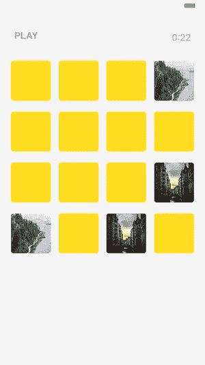
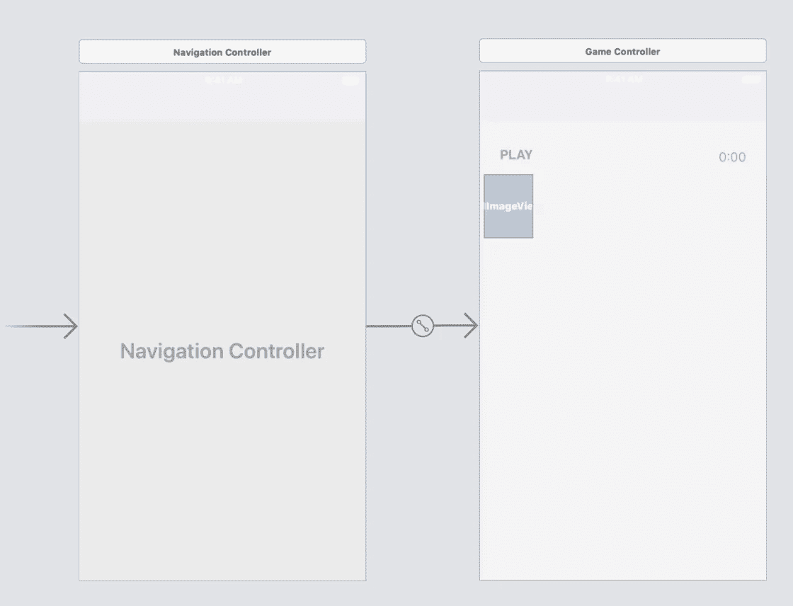
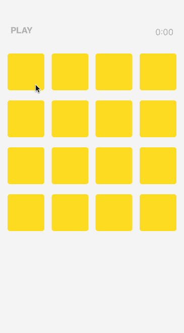

# 用 Swift 写的存储卡游戏教程

> 原文：<https://betterprogramming.pub/building-a-memory-card-game-6513f34dd25c>

## 协议简介


杰夫·谢尔登在 [Unsplash](https://unsplash.com/?utm_source=unsplash&utm_medium=referral&utm_content=creditCopyText) 上拍摄的照片

我们将构建一个简单的记忆卡游戏，我觉得玩起来非常简单有趣。希望我们能在这个过程中了解一些关于类和 Swift 协议的知识。

在跳到编码部分之前，我们先来看看这个游戏怎么玩。

# 记忆卡怎么玩



我们的记忆卡游戏有一个 4x4 的格子。最初，所有单元格都显示出来，但它们的图像是隐藏的。当你点击一个单元格时，它会显示其背后的图像。

玩家的任务是找到匹配的单元格。如果他们点击的下一个单元格包含相同的图像，那么它是匹配的，两个单元格仍然可见。

如果下一个单元格不包含相同的图像，那么它就是未命中，两个单元格都回到隐藏状态。玩家继续，直到找到所有匹配的单元格。

直爽又好玩！

# 项目结构

为了构建这个游戏的简单版本，我们需要以下组件:

*   一个控制器:`GameController.swift`。
*   一种观点:`CardCell.swift`。
*   两款:`MemoryGame.swift`和`Card.swift`。
*   和`Main.storyboard`来实现我们游戏的网格视图。

让我们从这个游戏最简单的组成部分开始——一张牌。

# Card.swift

我们的卡模型将具有以下三个属性:

*   一个`id`用来识别每张卡，
*   一个布尔变量`shown`来知道卡片的状态(是显示还是隐藏)。
*   一个`artworkURL`用于卡片图像。

```
class **Card** {        
    var id: String    
    var shown: Bool = false    
    var artworkURL: UIImage!
}
```

我们还需要实现以下方法来管理我们与卡的交互:

1.  一种用图像初始化卡片的方法。这是将所有属性初始化为默认 val 的地方。对于卡的`id`，我们通过调用`NSUUIS().uuidString`生成一个随机 id。

```
**init**(image: UIImage) {        
    self.id = NSUUID().uuidString        
    self.shown = false        
    self.artworkURL = image    
}
```

2.一种通过比较两张卡的 id 来检查它们是否相等的方法。

```
func **equals**(_ card: Card) -> Bool {
    return (card.id == id)    
}
```

3.一种为每张卡片创建一个副本的方法，目的是使匹配的卡片数量为偶数。这个方法将返回另一个具有相同值的`Card`实例。

4.每次我们开始新游戏时随机洗牌的方法。我们将使它成为`Array`类的一个扩展，这样我们就可以从游戏网格中的卡片数组中调用它。我们会讨论这一点。

下面是我们的`Card`模型的最终实现及其属性和方法。

# 记忆游戏

我们的第二个模型是`MemoryGame`，这里我们将定义我们游戏的 4x4 网格。

它将具有以下属性:

*   网格上所有牌的数组:`cards`。
*   正在显示的卡片的数组:`cardsShown`。
*   一个 bool 变量:`isPlaying`，用来跟踪游戏的状态。

```
class **MemoryGame** {        
    var cards:[Card] = [Card]()    
    var cardsShown:[Card] = [Card]()    
    var isPlaying: Bool = false
}
```

我们还需要实现一些方法来管理我们与网格的交互。他们将会是:

1.  一种方法来**洗牌**我们格子里的牌。

```
func **shuffleCards**(cards:[Card]) -> [Card] {        
    var randomCards = cards        
    randomCards.shuffle()                    return randomCards    
}
```

2.创建新游戏的方法。这里我们需要调用我们的 **shuffle** 方法来初始化我们的卡组，并将我们的`isPlaying`变量初始化为`true`。

```
func **newGame**(cardsArray:[Card]) -> [Card] {        
    cards = **shuffleCards**(cards: cardsArray)        
    isPlaying = true                return cards    
}
```

2.如果我们想要**重新开始**游戏，我们需要将我们的`isPlaying`变量设置为`false`，并删除我们的卡牌数组，这样我们就可以开始一个新的游戏。

```
func **restartGame**() {        
    isPlaying = false                
    cards.removeAll()        
    cardsShown.removeAll()    
}
```

3.一种知道哪张卡被按下的方法。我们将使用这个索引来标识`collectionView`(游戏的网格)中的每个单元格。稍后将详细介绍。

4.返回特定卡片位置的方法。

5.`unmatchedCardShown`方法指示选择的牌是否不匹配(当前回合中选择的第一张)。

```
func **unmatchedCardShown**() -> Bool {
    return cardsShown.count % 2 != 0
}
```

6.`unmatchedCard`方法读取** `cardsShown` **数组中的最后一个元素，返回不匹配的卡片。

```
func **unmatchedCard**() -> Card? {
    let unmatchedCard = cardsShown.last

    return unmatchedCard
}
```

7.当玩家点击卡片时将被调用的方法。

这看起来有很多代码，但实际上很简单。

我们只是定义了游戏中需要的两个主要的类——一张卡片和一个格子。

现在，让我们继续我们的故事板和控制器。

# 主故事板和游戏控制器

我们的`Main.storyboard`会是这样的:



最初，在控制器中，我们需要在`viewDidLoad`中设置一个新游戏，包括为我们的网格获取图像。在我们的游戏中，这将由一个 4x4 `collectionView`组成。

我们将把`GameController`设置为单视图应用程序的根视图控制器，在`GameController`中，我们将有一个`collectionView` ，我们将把它称为`IBOutlet`。

这里，我们还将引用一个`IBAction`按钮`onStartGame()`，也就是你在我们标题为`PLAY`的故事板中看到的`UIButton`。

# 我们的控制器实现中的亮点

1.  我们首先初始化我们的两个主要对象——网格:`game = MemoryGame()`，以及我们的卡片集:`cards = [Card]()`。
2.  我们在`viewDidLoad` **、**中设置游戏的初始变量，这是我们的应用程序运行后第一个被调用的方法。
3.  `collectionView` 最初设置为`hidden`，因此在用户按下`PLAY`之前，屏幕上看不到任何卡片。
4.  一旦用户按下`PLAY`，就会调用`onStartGame` `IBAction`，我们将`collectionView`的`isHidden`属性设置为`false`，使其可见。
5.  每当用户选择一个项目，就会调用`collectionView`*的方法`didSelectItemAt:`。在这个方法中，我们调用自己的`didSelectCard:`来传递游戏的主要逻辑。*

*下面是我们的`GameController`的最终实现:*

*让我们暂时停留在`CollectionView`的委托方法或者**协议**上。*

# *协议*

*使用协议是 Swift 最基本的编程模式之一。*

*使用协议，您可以为类、结构或枚举器定义要采用和实现的规则。这个原则允许我们编写解耦的、模块化的和可扩展的 Swift 代码。*

*事实上，这是我们已经为`GameController`中的`collectionView`实现的模式。现在我们要做我们自己的了。语法如下所示:*

```
*protocol **MemoryGameProtocol** {
    //protocol definition goes here}*
```

*既然我们已经知道协议是我们定义一个类要实现的规则或指令的地方，我们现在可以考虑我们游戏的指令应该是什么。*

*我们基本上需要知道 4 件事:*

1.  *何时开始游戏:`memoryGameDidStart`。*
2.  *何时显示一张牌反面朝上:`memoryGameShowCards`。*
3.  *什么时候倒着出一张牌:`memoryGameHideCards`。*
4.  *何时结束游戏:`memoryGameDidEnd`。*

*一旦我们声明了我们的协议，我们需要在我们的主类中实现所有四个方法，在本例中，我们的主控制器:`GameController`。*

# ***memoryGameDidStart***

*当这个方法被触发时，意味着游戏应该开始(在我们的游戏中，这发生在玩家点击播放按钮时)。*

*我们将简单地通过调用`collectionView.reloadData()`来重新加载内容，现在是一组洗牌。*

```
*func **memoryGameDidStart**(_ game: MemoryGame) {
    collectionView.reloadData()
}*
```

# *记忆游戏显示卡*

*我们从`collectionView`的`didSelectItemAt:`中调用这个方法。*

*首先，它显示选定的卡片。然后，它检查我们的`cardsShown`数组中是否存储了不匹配的牌(如果`cardsShown`计数为奇数)。如果我们有一张不匹配的卡，那么我们将选择的卡与不匹配的卡进行比较。*

*如果它们相等，两张卡都被附加到`cardsShown`上，它们仍然可见。如果它们不相等，我们从`cardsShown`列表中移除不匹配的卡并隐藏两张卡。*

# ***记忆卡***

*如果牌不相等，这个方法被调用，所以它们返回到隐藏状态，`shown = false`。*

# ***记忆游戏结束***

*当这个方法被调用时，意味着所有的卡片都是可见的——我们已经将所有的初始卡片移动到我们的`cardsShown`列表中:`cardsShown.count = cards.count`，所以游戏结束了。*

*在我们调用了`endGame()`将`isPlaying`变量设置为`false`之后，这个方法会被专门调用。从这里我们显示一个警告，让用户知道游戏已经结束，我们也使用这个`alertController`作为控制器的指示器。*

*当警报解除时，`viewDidDisappear`被调用，它重置游戏，这样用户可以再次玩游戏。*

*在我们的`GameController`中，这四个方法看起来像这样:*

**

*这是一个功能性的项目，所以你可以克隆它，用它来玩。*

*[](https://github.com/Xiomara7/Memory/blob/master/README.md) [## xiomara 7/内存

### 在 GitHub 上创建一个帐户，为内存开发做贡献。

github.com](https://github.com/Xiomara7/Memory/blob/master/README.md)*