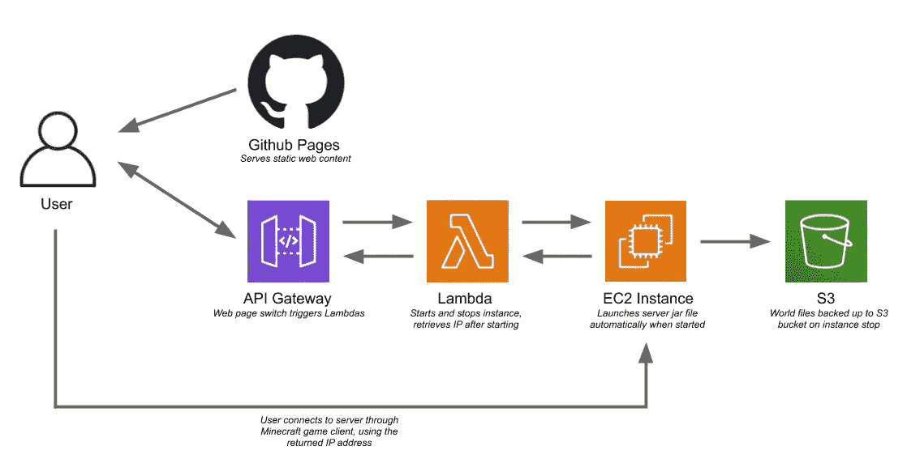
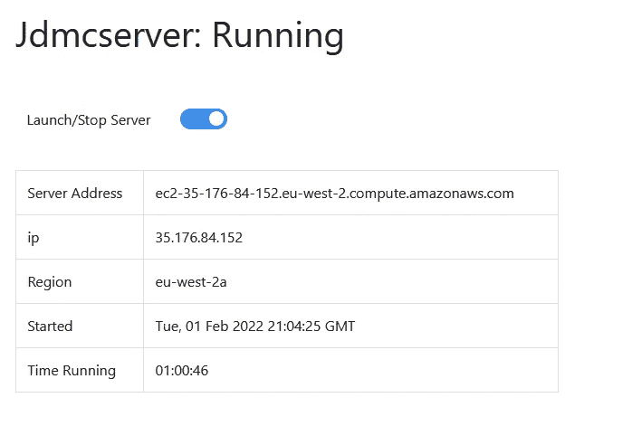

# 以每月 2 美元的价格在云中构建一个《我的世界》服务器

> 原文：<https://betterprogramming.pub/building-a-minecraft-server-in-the-cloud-for-2-a-month-530ed0340800>

## 我们如何将总定价从每月 17 美元降至 2 美元的故事

照片由[你好我是 Nik](https://unsplash.com/@helloimnik?utm_source=medium&utm_medium=referral) 上 [Unsplash](https://unsplash.com?utm_source=medium&utm_medium=referral)

挑战:我的朋友亚当和我正在进行一次怀旧之旅，想一起玩《我的世界》——就像 10 年前放学后我们一起做的那样。

大多数从个人电脑上运行过游戏服务器的人都会证明这有多烦人——要求主机同时在线，以便任何人都能连接。现在我们都有成年人的责任了。所以我们想支付托管费用，避免这种情况。

我们很便宜，《我的世界》领域(Mojang 的第一方服务器产品)在英国每月 5.59 英镑。利用我们的 AWS/JS 技能，我们认为我们可以使它更便宜。

我们提出的架构:

服务器运行在一个`t3.small` EC2 实例上，在安全组和 NACL 级别打开了必要的端口，以便用户能够从公共互联网与它通信。

这是第一个问题:AWS EC2 是按服务器运行的时间计费的——对于伦敦地区，一个`t3.small`实例每小时的费用是 0.0236 美元，这意味着如果服务器持续运行，总价格大约是每月 17 美元。为了降低成本，我们需要停止不使用的服务器。

为此，我们需要《我的世界》服务器可执行文件在实例启动时自动启动。我们使用了一个`systemd`服务，它在启动时简单地执行`server.jar`文件，并分配了所需的内存量。

从这一点来看，我们可以在每次想玩的时候登录 AWS 管理控制台，并启动实例——但是我们设计了一个更优雅的解决方案。

Adam [使用 React](https://github.com/werzl/) 构建了一个 web 前端，它触发了对 Lambda 函数的请求。这个用 Python 编写的 Lambda 函数使用 boto3 启动实例，Linux 服务从那里启动 Java 可执行文件。

对 AWS 更有经验的人会注意到这里遗漏了一些东西——EC2 实例在停止和启动时当然会改变它们的 IP，除非分配了一个弹性 IP(AWS 对静态 IP 的名称)。

这导致了我们的下一个问题:弹性 IP 只有在没有分配给正在运行的实例时才会产生费用。在我们使用 EC2 的情况下，大部分时间实例不会运行。这将意味着每月 6-7 美元的费用，使我们在价格上超过目标。

为了解决这个问题，我们更新了 Lambda，以便在启动时返回实例的公共 IP，整齐地显示在前端:

那么我们在成本上击败了服务器吗？是的。

在高峰期，该帐户的总成本仅在一个月内达到 2.33 美元。服务器增加到大约 5-6 个玩家，t3.small 实例可以在没有明显减速的情况下处理所有问题。然而，这是在该帐户的免费等级期间，因此您的里程可能会有所不同。

# 潜在的改进

这是同时构建和测试的——与其说是一个完美的平台，不如说是一个原型。因此，一切都是手动设置的。我真的很想重新审视这个项目，让它依赖于短暂的实例，断开 lambda 函数停止和启动特定实例的连接。

相反，它会在停止时终止一个实例，启动一个全新的实例，并从保留的 EBS 卷或 S3 存储桶中检索服务器文件。

另一个方便的功能是自动更新服务器镜像——当新版本的《我的世界》发布时，新的`server.jar`文件会自动安装在旧文件的位置，而不是手动上传。

自动备份是该系统的自然发展，在当前的设计中，在实例关闭之前进行基本的 S3 备份。

为了实现所有这些并使其更容易更新，我还将它构建到 CloudFormation 模板中，允许通过源代码控制跟踪代码更改，并从单一权威来源管理更改。

手动管理云资源是一件痛苦的事情，并且无法扩展，不要这样做。

 [## GitHub - werzl/jdmcserver: Lambda 和 python 用于 AWS EC2 中托管的《我的世界》服务器。

### 此时您不能执行该操作。您已使用另一个标签页或窗口登录。您已在另一个选项卡中注销，或者…

github.com](https://github.com/werzl/jdmcserver)