# 为 Adobe After Effects 构建现代扩展

> 原文：<https://betterprogramming.pub/building-a-modern-extension-for-after-effects-eea269544b50>

## 我长达 17 个月的从代码假人到构建产品的旁门左道之旅

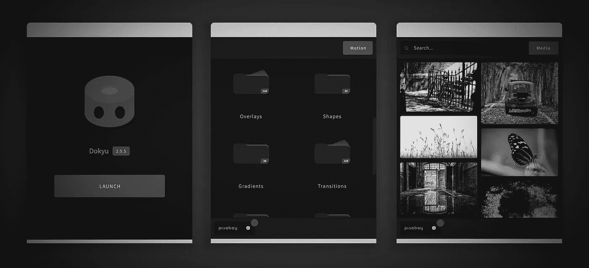

我从来没有认真考虑过为 Adobe After Effects(T1)开发一个插件。我的衡量标准是安德鲁·克雷默令人惊叹的[元素](https://www.videocopilot.net/products/element2/)插件，它非常复杂，而且(据我所知)有一个比我聪明得多的团队在开发它。

但是当我在编码悬崖的边缘修修补补时，我发现这只是相对简单但有用的第三方应用的海洋中的一个异类。

这一天一定过得很慢，我最终采取了行动，对 Adobe 开发进行了更多的研究。我的发现让像我这样的代码傻瓜感到安心。

经过多次启动和停止，我现在已经建立了一个有着可怕符号墙的东西，直到最近，它还让我出冷汗。这很难，我学到了很多东西，当然也有很多失败。

但是，我发现这非常值得。回顾过去，我认识到这也不是你需要一个四年的计算机科学学位才能做的事情——尽管在基础知识上领先一步会有所帮助。

不过，我有的是耐心。如果你也是，请继续阅读。

这篇文章是关于我 17 个月的 side hustle 之旅，我现在认为这是一个相当全面的产品，对任何通过视频为自己或作为他人服务建立在线品牌的人都有用。

前面的案例研究有望为设计师提供实用的见解，但更具体地说，是为那些想为自己或他人将 Adobe 应用程序提升到一个新水平的人。

# 语义学

我知道像 Element 这样的程序被归类为*插件*。它们是带有 GUI(图形用户界面)的低级应用程序，用 C 或 C++或其他令人生畏的极客语言编写。

然而，大多数涉及代码的第三方插件实际上并不是插件。它们是脚本、表达式和 HTML 扩展，这是本文的重点。

在 HTML 扩展之前，除了插件之外，唯一的其他游戏是用 Adobe 的 [ExtendScript](https://www.adobe.com/devnet/scripting.html) 编写的脚本(我们将在后面讨论)。JSX 剧本很受欢迎。我最喜欢的是[大毒蛇](https://aescripts.com/ouroboros-2/)、[比较设置器](https://aescripts.com/rd-compsetter/)和[运动](https://www.mtmograph.com/motion)。

它们通常是为了节省在任务上的时间而构建的，否则这些任务可以通过更多的步骤手动完成。

*   大毒蛇可以让你快速设计路径并制作动画。
*   CompSetter 允许您快速地对一组乐曲进行项目范围的更改，无论是分辨率、长度等。
*   Motion 是快捷方式的瑞士军刀，允许您通过点按按钮来创建有趣的动画，以及更改关键帧的插值和锚点的位置。

然而，他们的不足之处在于设计部门。

没有 HTML 和 CSS，美学仍然是同质的黑暗主题/基本按钮后效果宇宙。当然，这不一定是件坏事，但它让设计师们渴望更多。

ExtendScript 也是 JavaScript 的旧版本，所以现代代码可能不会产生您期望的结果。Adobe 现在将 ExtendScript 视为传统语言。

对于 AE 2019，Adobe 宣布了新的 JavaScript 表达式引擎，以取代基于 ExtendScript 的遗留引擎。我的扩展 Dokyu 中的几个表达式必须用 yoinked 删除，并更新为现代语法，以避免在新引擎中标记错误。

说到表达式，这在技术上是另一种形式的脚本。本质上，表达式一次只能应用于一个图层，并且是手动编写、粘贴或通过脚本应用的。

# 什么是扩展？

在我们继续之前，您可能有兴趣[演示一下扩展](https://3dmybusiness.com/)。

Adobe 应用程序中的扩展是可停靠的面板，就像您停靠用原生 GUI 编写的 JSX 脚本一样。

然而，扩展不是专门用 ExtendScript 编写的，存在功能和美学上的限制，而是通过 Google 的 CEP 引擎运行；一系列技术在一个受支持的 Adobe 应用程序中生成一个工作面板。

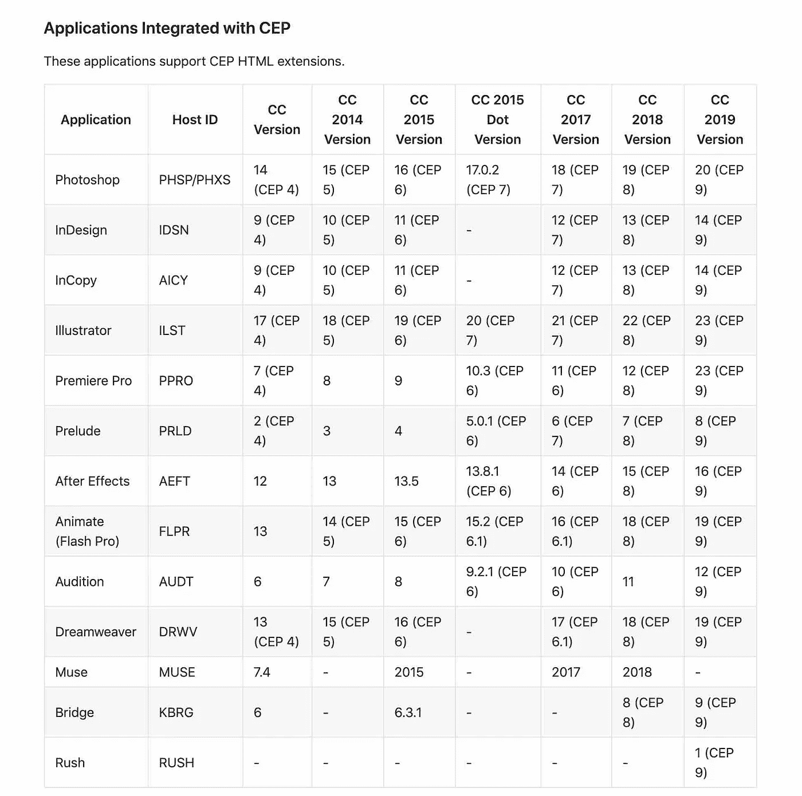

# CEP 引擎(堆栈)

2013 年，Adobe CC 第一版发布。随之而来的是 HTML 支持。(从技术上来说，Adobe Flash extensions 在 HTML 之前就受到支持，但在这一点上，这有点多余。)

这种 HTML 支持的引入是由于一种新形式的第三方应用程序框架:CEP 引擎。

把它想象成你的 Adobe 应用程序中的一个 web 应用程序或网站。CEP 代表通用扩展平台。它是一个 web 技术的集合，集成这些技术是为了扩展 Adobe 产品套件的有用性。

如果没有 App Store，苹果将一无是处，所以你可能会认为这是这个想法的一个小众版本。世界各地的开发者可以自由扩展 Adobe 的软件套件，为设计师和 Adobe 改进平台。

# CEF —铬嵌入式框架

想想你的 Adobe 应用程序中的谷歌 Chrome 浏览器。它支持您在浏览器中看到的大多数功能。比如音频、视频、拖放、网络存储和 API 框架。

下面是一个全面的[列表](https://github.com/Adobe-CEP/CEP-Resources/wiki/CEP-6-HTML-Extension-Cookbook-for-CC-2015#browser-features-supported-by-cep)，尽管它值得检查一下[最新的 CEP 版本](https://github.com/Adobe-CEP/CEP-Resources)的新功能，因为新版本每年都会发布。(由于这个原因，Chrome 更新可能不会像只通过浏览器那样频繁地出现在 Adobe 应用程序中。CEP 版本每年只更新一次。)

为了省心，Adobe 在[文档](https://github.com/Adobe-CEP/CEP-Resources/blob/master/CEP_9.x/Documentation/CEP%209.0%20HTML%20Extension%20Cookbook.md#external-javascript-libraries)中说:

> CEP HTML 引擎不限制使用任何扩展 JavaScript 库。只要一个库能在 CEF 客户端或 Chrome 浏览器中使用，就应该能在 CEP HTML 引擎中使用。”

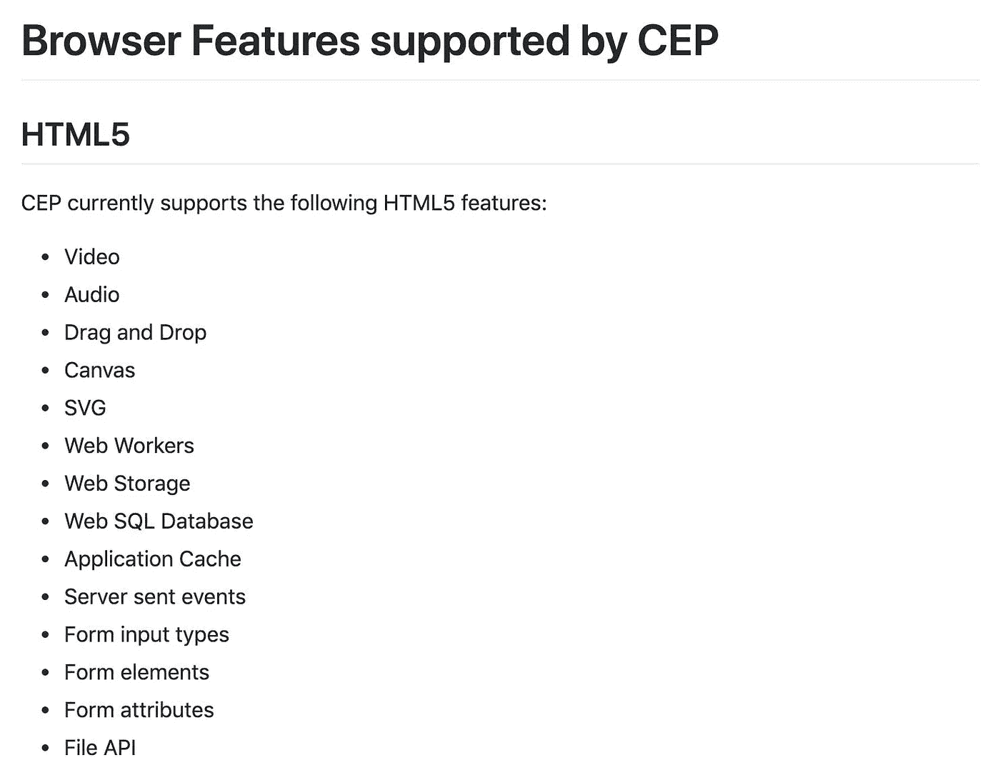

# HTML、CSS 和 JavaScript

这个 [Chromium](https://www.chromium.org/) 框架运行在熟悉的 web 技术上:HTML 标记、CSS & JavaScript。这预示着美好的未来，因为你不仅有 Adobe 的新的原生扩展(稍后会有更多的介绍)，而且底层框架也是现代的和动态的。

它也被普遍采用，不像 Flash 是由 Adobe 公司生产的，但已经不再开发了。(现在在大多数现代浏览器中被默认拒绝。)这是一个相当安全的赌注。

HTML 构建了应用程序的核心框架，CSS 根据你的喜好设计了一些基本的动画，JavaScript 则提供了大脑。

# 节点. js

更令人兴奋的是，还支持 [Node.js](https://nodejs.org/) 。(节点实际上由与 CEP 面板相同的引擎驱动。)

您可能会认为 Node.js 是 jQuery，但它不是客户端的，而是服务器端的。

预制软件的丰富生态系统意味着应用程序中的许多功能可能已经有了解决方案。查看预安装的 [npm](https://www.npmjs.com/) 包管理器，看看有什么可用的。

Dokyu 的一个例子是使用 ADM-ZIP，这是一个流行的 ZIP 压缩库。它使用户能够从 Dokyu 服务器下载文件到用户机器上服务器指定的目录，并自动解压缩，这样应用程序就会自动找到刚刚下载的内容。

说了这么多，我最终为 Dokyu 的最终版本提供了一个更简单的解决方案。

我尝试的另一个例子是将扩展构建到全栈应用程序中。也就是说，一个通过 Node.js 后端服务器交付服务的应用程序会在用户可以看到的面板(前端 HTML、CSS 和 js)旁边静默启动。

服务器上的信息不必与用户共享。这使得它非常适合敏感信息或传送文件。对于需要随使用而扩展的服务来说，这也是一个很好的实践。

最后，我花了太多时间来试验亚马逊的 Polly API T2(文本到语音)，它可以自动生成 VOs。Polly 提供了支持 Alexa 的技术。

它很容易启动和运行，但我很快意识到这是不够的，所以我把它重新命名为定时动画和向人类 VO 艺术家提供样本的代理 VO。

然后我决定等到更好的服务出现，我可以更快地测试需求。(谷歌的 [WaveNet](https://cloud.google.com/text-to-speech/) 看起来很有趣，但目前还不可用，也不划算。)

Adobe 团队在这里写了一个[简洁的教程](https://medium.com/adobetech/how-to-build-a-node-js-server-in-a-panel-ba1d63ea67e2)，如果你认为你的应用会从中受益。

# 扩展脚本

最后，我们有[extend script](https://www.adobe.com/devnet/scripting.html)；也称为 JSX 或语法上称为 EcmaScript 3。

这是一个旧版本的 JavaScript(语法上称为 EcmaScript 5 ),它已经被改编以提供 Adobe apps 中的功能，这在当时的 JavaScript 版本中是不可用的。例如，ExtendScript 的一个特性是文件系统。

它用于将扩展中的用户操作转换为 Adobe 应用程序中的编程操作的任何脚本。例如，移动锚点、创建文本层、分配效果等。

然而，为了在扩展和 Adobe 应用程序之间进行通信，需要有一个在两种语言之间进行翻译的桥梁。

JS 可以使用 JSX 兼容的代码与 JSX 通信，然后返回一个值。相反，JSX 可以监听 JS 事件并触发回调。

例如，您可以使用扩展中需要的`csInterface.js`。这实际上是 Adobe 为扩展/应用程序通信创建的 API。

可以在您的面板的 JS 中使用呼叫`CSInterface.evalScript()`与 JSX/Adobe 应用程序通话。但这是一个额外的步骤，当有大量来自 panel 的调用与 Adobe 应用程序交互时，可能会占用您的短期记忆。

从积极的一面来看，正如您会记得新的 JS 表达式引擎一样，有很好的理由想象 Adobe 很快会在脚本和表达式方面过渡到 JS，这将极大地简化开发。

如果你想深入这个话题，我鼓励大卫·巴兰卡的[训练](https://www.htmlpanelsbook.com/)。(无隶属关系，只是在论坛帖子之外的话题培训稀缺时推荐一款好的产品。该培训针对 Photoshop，但大部分信息适用于任何支持 CEP 面板的 Adobe 应用程序。)

# 不带 ExtendScript 的 HTML 面板

尽管大多数 HTML 面板都可以与 Adobe 应用程序交互，但没有人说你不能拥有一个只预览的面板。这样，网站的类比就更加清晰了。

实际上，用户可以从 Adobe 应用程序中访问一些有用的信息。一个不切实际的例子可能是天气应用程序。更有用的可能是团队聊天应用程序。

在团队聊天的例子中，一个孤立的扩展可以插入到您的服务器或 API 中，甚至可以提供更高级的功能，而无需接触任何 ExtendScript。

# HTML 面板示例

正如所料，Adobe 自己也在设计 HTML 格式的新面板。

在启动你的应用程序时，你很有可能会看到一个欢迎屏幕，它看起来与传统的面板用户界面截然不同。这包括图像和视频元素，如果你熟悉 HTML 标记、CSS 或者一点 JavaScript，这些元素很容易制作。

如果你的应用程序包括一个“库”面板，你会注意到它看起来比其他原生 Adobe 面板更新鲜。

展望未来，期望 Adobe 套件的大部分完全过渡到 CEP 并不太大胆，因为这将为在云中使用他们的应用程序提供机会。就像现在不用下载安装程序就可以在浏览器中访问谷歌地球一样。

毫无疑问，这是一项技术壮举，需要重写大量的遗留代码，如果 Adobe 希望保持对新进入者的优势，如 [Canva](https://www.canva.com/) 和 [Animoto](https://animoto.com/) ，他们真的没有选择。

# Dokyu —头脑风暴

2018 年 1 月 30 日—2018 年 2 月 28 日

2018 年 1 月 30 日，Dokyu 的头脑风暴正式开始。这是我在[苹果笔记](https://support.apple.com/en-au/guide/notes/welcome/mac)和[特雷罗](https://trello.com/)开始写笔记的时候，也是我接受巴兰卡 [HTML 面板课程](https://gumroad.com/l/DTkXd)的日子。

那就不玩了。

在苹果笔记中，有一些不同的想法。我提出了一个现在引起我共鸣的问题:“我能成为动画中的 [Frame.io](https://frame.io/after-effects/) 吗？”

在特雷罗，我问了这样一个问题:“包括 Adobe 股票/替代产品吗？”因为 Adobe Stock 是我想到的第一个媒体解决方案。尽管如此，由于 Adobe Stock 是一项付费服务，我甚至在发现它是否可行之前就不再考虑它了。

我在 Adobe 网站上列出了一个关于创意云图书馆的链接。据推测，我正在研究 Adobe 是如何在他们的扩展中使用云的，但我现在不记得了。

我还捕捉到了下面的截图，这是 Dokyu 的“预览-顶部，文本-底部”卡片格式的用户界面的灵感来源之一:

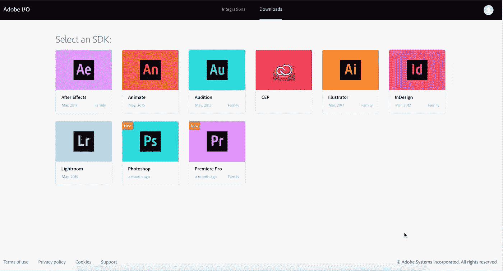

我想在这里指出的一点是，我真的不确定这将向哪个方向发展。我几乎是不加选择地从 20，000 英尺的高空收集可能的想法。

商业模式、设计、功能、营销和其他我认为有用的东西。

只是收集一大堆东西，不给自己施加压力，这样我就可以开始更简单、更有条理的编辑工作，让想法在脑海中循环。(我还每天散步，这对从不同角度看待问题和解决方案非常有帮助。)

整个二月份，我都在研究当前的进入者，以了解需求、消费者预期和可能的定价模式。这里有一个例子:

> *“GoAnimate 是一个基于云的动画视频创作平台。通过 GoAnimate，您可以使用代表数百个行业的数千个道具、资产和角色为您的企业创建动画视频。使用简单的拖放工具以较低的月成本制作专业视频。开始 14 天免费试用。”— GoAnimate*

我还考虑是否要求用户在访问这些好东西之前通过面板登录。这是 Getty Images 扩展采用的一种方法。(见下面的概念艺术图片库。)

由于时间的原因，我就讲到这里，但是如果你有更多的想法，请随时联系我，如果你感到有点没有方向或者不知所措，我很乐意帮助你。

关于头脑风暴，我要说的另一件事是关于我购买的课程。它并不便宜，尽管对内容的定价并不公平；28 个工作 HTML 演示和视频培训。尤其是当没有可比的选择时。

Barranca 课程最有价值的方面之一是你可以安装和使用的 28 个 HTML 面板。这让我了解到你可能想用 Adobe apps 中的面板做什么，更重要的是，什么是可能的。

我假设扩展仅限于缩短在 After Effects 中完成某项任务的路线；将锚点置于中心是 After Effects 中的一个经典例子。

工作演示并不复杂，这意味着我可以深入了解如何从一个基本的“Hello World”面板到用基本的 CSS 对其进行样式化，以及基本的工作流技巧，如在开发时管理缓存问题。

我的一个私人建议。(可能有更好的缓存方法，但这为我节省了很多时间。)在 Adobe apps 中查看最新版本的扩展尤其具有挑战性。

我试着删除了几个缓存文件夹，但没有用。将 `— disable-application-cache`添加到`manifest.xml`文件对我来说也不起作用。我发现最好的方法是通过在我放置散列的地方添加一个数字来重命名`com.###.panel`文件夹。然后确保更新`manifest.xml`以反映这些变化。

确保调试模式也已启用。(默认在终端中写`com.adobe.CSXS.9 PlayerDebugMode 1`。“9”对应于 CEP 版本。末尾的“0”禁用调试模式。)这会强制 Adobe 应用程序加载新的扩展。

在学习了基础知识之后，插入后端 API 的更高级的演示扩展，如天气应用程序，就不那么令人生畏了，并真正为我所能创造的东西开辟了令人兴奋的可能性。

头脑风暴是一个超级有趣的话题，但这篇文章太长了，无法公正地讨论它。我要说的是，为了磨练我的应用程序概念，我看了看什么是可能的，感谢培训中提供的 28 个 HTML 面板示例。以及我有一些经验的地方:创建模板。

我问自己:“我怎样才能创造出让我与众不同，又能让人们大吃一惊的东西？”我了解到在 AE 中拥有一个“网站”打开了许多大门，但是一旦新鲜感消失，如果它没有用处，看起来漂亮也没什么。

我知道我可以创建模板；我已经做了好几年了。

问题是竞争激烈，盗版猖獗，模板本身并不能真正解决必须手动安装某些东西和将有限的屏幕空间用于。

我可以利用通过 HTML 面板实现的哪种功能/优势——我希望这种技能能够让我在竞争中获得优势并保护我的工作——同时将产品的各种功能补充到一个连贯的包中？

在头脑风暴开始的时候，就有了提供股票媒体访问和模板的想法，许多模板是围绕股票媒体设计的。正如我前面提到的，是 Adobe Stock。但我不想在用户购买 Dokyu 后将此作为额外成本进行推广。

在参加课程的同时，我在培训中安装并研究了免费的 [Flickr](https://www.flickr.com/) 应用程序，以了解其背后的编码。这向我介绍了图像 API 的概念，同时保留了对扩展外观的完全控制。

然后我想知道 [Pixabay](https://pixabay.com/) ，一个我使用过很多次的流行的免费股票图片网站，是否会为他们的社区提供一个 API。

幸运的是，他们做到了。我联系了网站，让他们知道我的计划，得到他们的同意后，我开始工作。

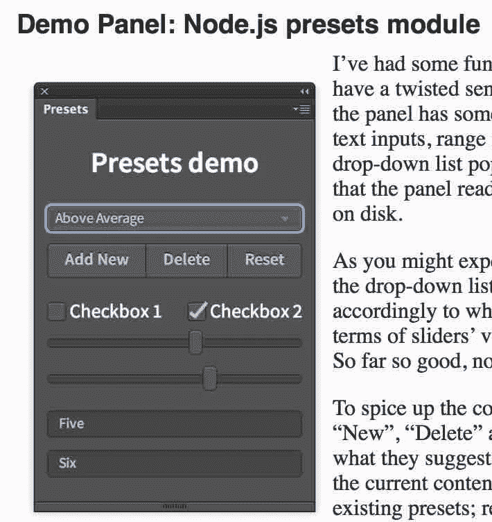

早期的灵感来自 Adobe，Barranca 的培训和看到什么 HTML 面板扩展已经在那里。

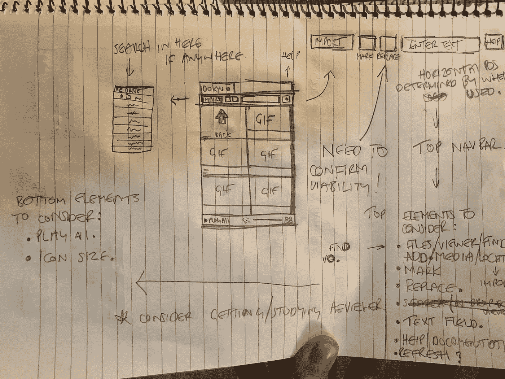

*(非常)粗略的在笔记本上画出概念*

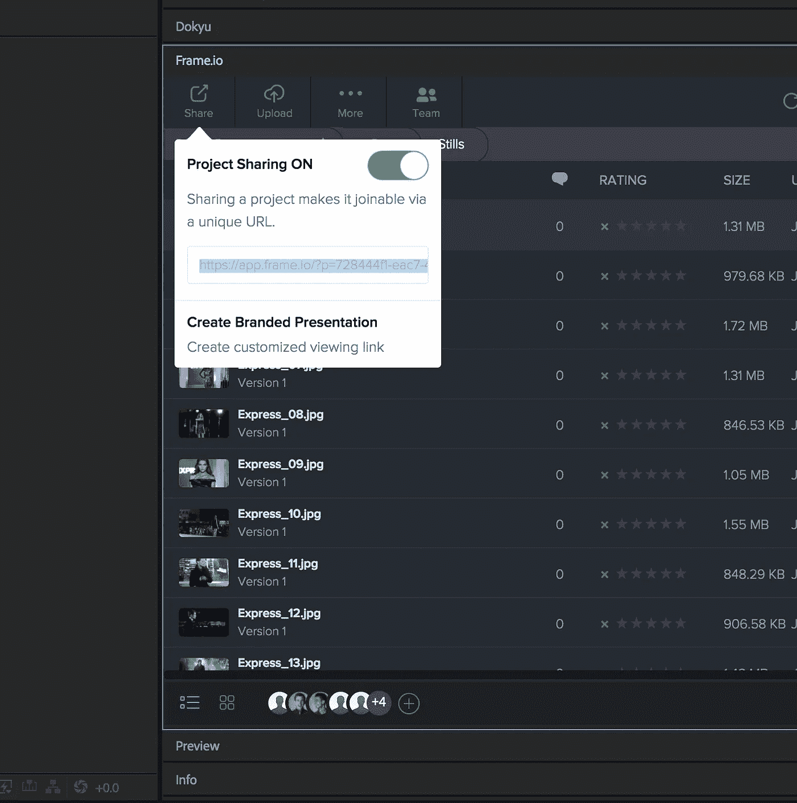

*漂亮的 Frame.io 用户界面让我对可定制的扩展有了一个概念*

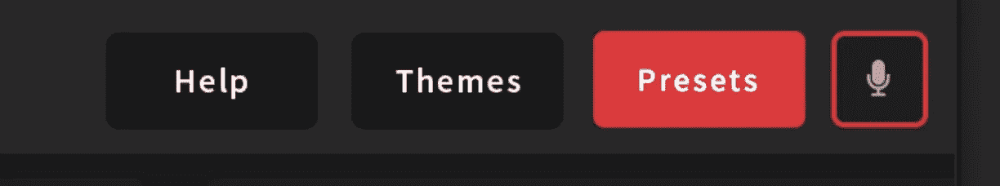

*Dokyu 的早期版本，包括亚马逊 Polly API 的文本到语音转换功能。由于质量不太好，它最终被放弃了。*

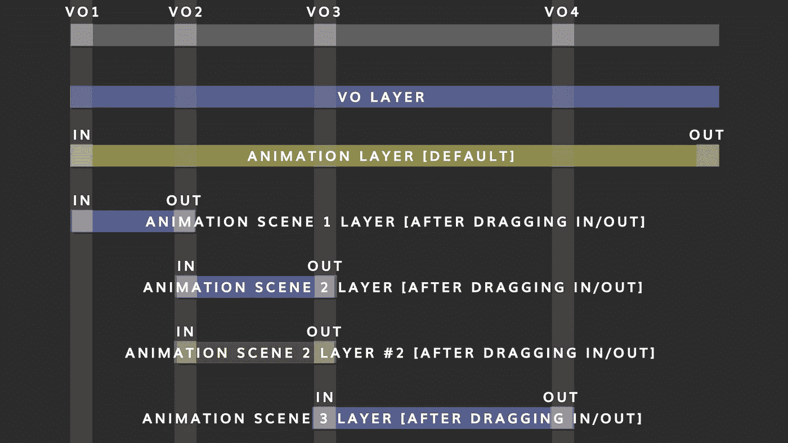

*Photoshop 中拼凑的早期时间轴概念*

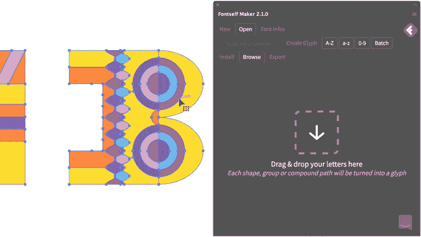

*为插画师制作的美丽字体*

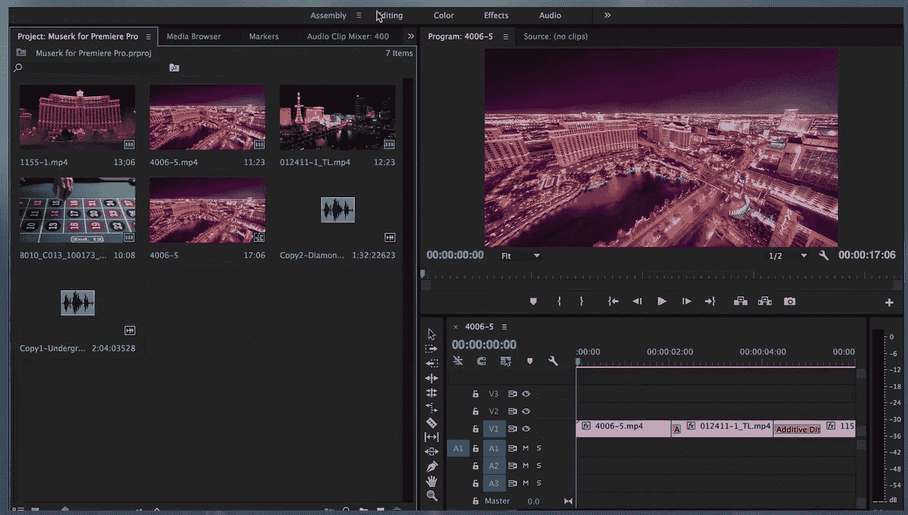

*为 Premiere Pro 研究 Muserk。(只需编辑 CSXS 文件夹中的 manifest.xml 文件，Web 应用程序就可以在所有 CEP 面板的 Adobe 应用程序中运行。您可以选择允许打开您的应用程序的 Adobe 应用程序和版本。*

# Dokyu —发展

2018 年 2 月 28 日—2019 年 7 月 14 日

我已经支付并开始了培训。现在我有了大量的笔记，并对核心功能进行了一点分类。无论如何，我可以开始工作了。

在这一点上，扩展的未来仍然悬而未决。我甚至不确定我是否能解决这个问题。要接受的信息太多了，我几乎肯定是在自己的舒适区之外。

我不愿意承认，但是你知道吗？这是一个侧面的骗局，一个有趣的小实验。此时唯一能做出判断的人就是我。

如果你发现自己正在应对冒名顶替综合症，或者只是怀疑自己的编码能力，我推荐马尔科姆·格拉德威尔的书*。它把我的固定心态转变成了成长心态，我非常感激我读了它。*

*我有时仍然会自我批评。TLDR:这与“固定”基因关系不大，更多的是把时间投入进去。*

*下面的图片库可能会比我在这里写的任何东西更好地传达开发过程中的进展。我还在本文末尾列出了我在整个开发过程中使用的资源。*

*对我来说，关键的动力点是:*

1.  *支付学费的价格高到足以让我怀疑自己是否有足够的决心坚持这个学期。我不会在这里说费用，以免巴兰卡改变他的定价，但它是三位数，这是我很少花在网上学费的金额。*
2.  *尽可能快地开始写第一篇笔记，不要过多地判断我用这些信息做任何事情的能力。从开发的角度来看，人们可能愿意为你感兴趣的东西付费，在现有的基础上，什么是现实可行的，你只需要了解这些。(不过，如果你有专业知识来证明重新发明轮子是正确的，你的情况可能会有所不同。)*
3.  *从那以后，它就慢慢地，但肯定地，一步一步地发展，当我遇到障碍或新信息时，重温头脑风暴的过程。*

*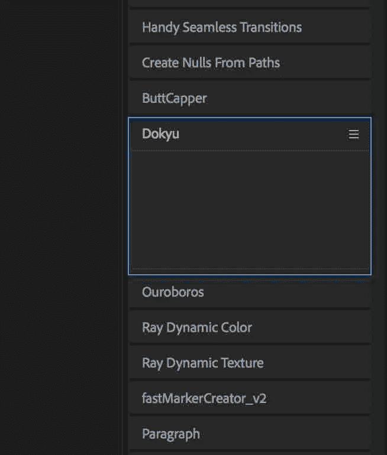**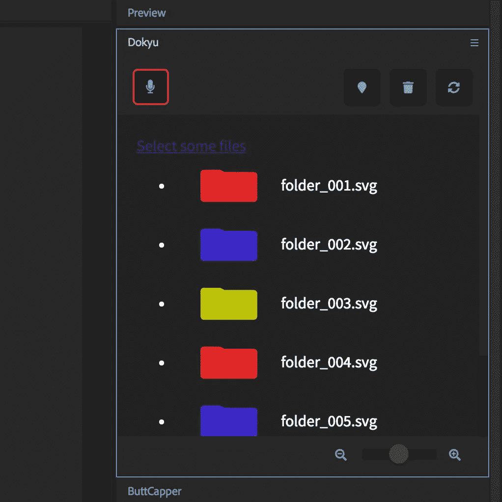**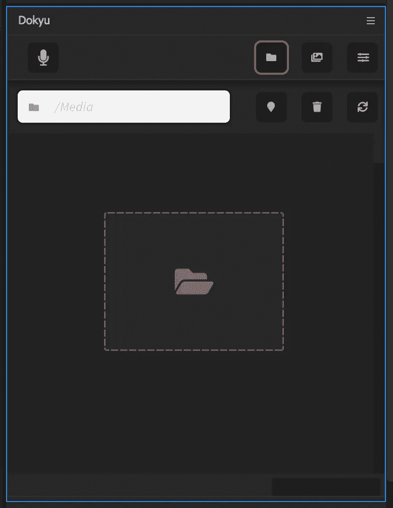*

**一个更加清晰的概念**

*多奎还活着！算是吧。当我相信 Dokyu 将需要文件系统访问时，进行了非常粗略的实验。*

*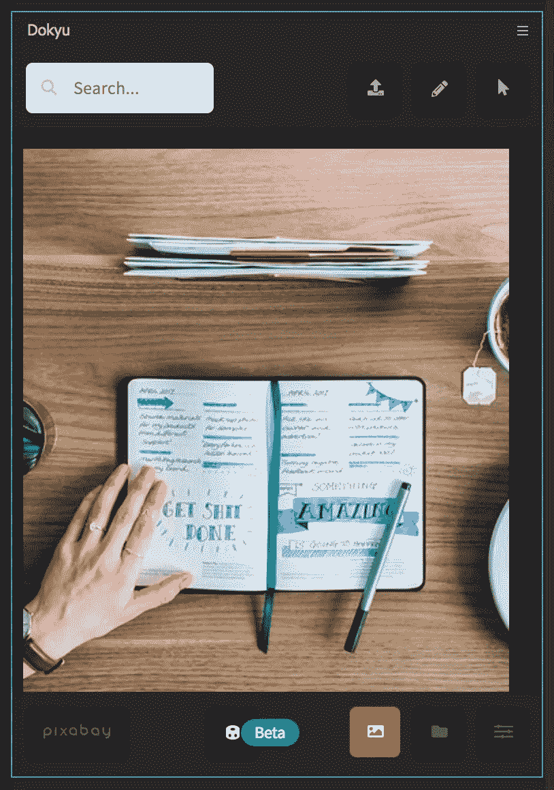*

**Dokyu 二合一包含两个 apps 运动和媒体。前两张图片是它的早期实现。**

*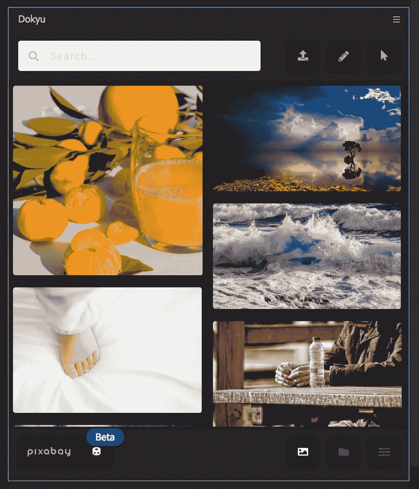*

**Dokyu 二合一包含两个 apps 运动和媒体。前两张图片是它的早期实现。**

*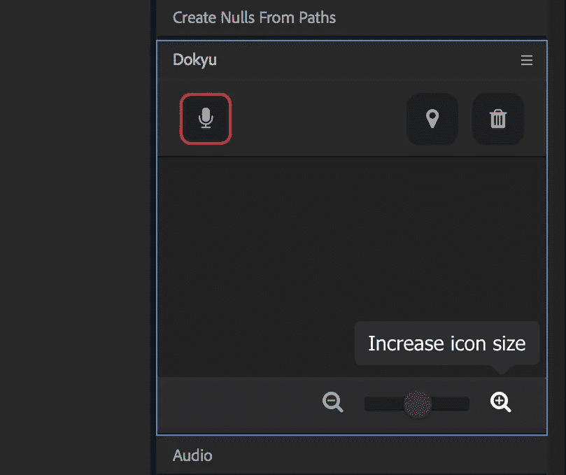*

**Dokyu Motion 的早期版本，带有非常棒的提示工具！**

****

*Dokyu Media 的早期工作版本，旁边是 Gumroad 的快速在线结账。从 UX 的角度来看，这不是最好的格式(太小了)，而且对大多数人来说这很奇怪，因为我以前从未见过 AE 内部的支付。因此，用户现在被引导到他们的默认浏览器进行支付。*

# *结束语*

*如果您有任何问题，请随时联系我们。如果你很想看看 Dokyu 的出版版本，在我的主页上有一个网络演示:[https://3dmybusiness.com/](https://3dmybusiness.com/)*

*最后，我将重申在最初几周和几个月传递个人判断的重要性。那只是对我有帮助的事情。*

*关键是，一开始很容易感到不知所措。如果你在自我批评中挣扎，试着把这个活动降级为一个有趣的小项目，它可能永远不会被公开。那很好。*

*策划鼓舞人心的内容，思考你认为其他人会为之付费的问题和解决方案。作为一名设计师，如果你还没有这样做，策展的习惯无疑会对其他项目有用。*

*广泛使用谷歌，看看别人对你心目中的解决方案有什么看法。在社交媒体帖子中提及它，不要歪曲结果，说你想用它赚钱。(“有人知道我怎么在 After Effects/Photoshop/Illustrator 里做 *xyz* 吗？”)*

*投资于你自己，这样也许有一天你会有足够的时间和资源来回馈社会。我想不出更好的方式来度过你的职业生涯。*

# *资源*

*请记住，ExtendScript 现在是一种遗留语言，所以尽可能更新到现代的交叉兼容语法。*

*如果我还记得更多的资源，我会添加到这个列表中，我欢迎大家的建议。*

## *付费资源*

*   *大卫·巴兰卡的 [Adobe Photoshop CEP (HTML)面板开发](https://www.htmlpanelsbook.com/)*

*虽然 Photoshop 是本次培训的重点，但大部分内容适用于所有接受 CEP 面板的 Adobe 应用程序。正如巴兰卡自己所说:*

> **“HTML 面板在各种 Adobe Creative Cloud 应用中实现；该课程基于 Adobe Photoshop，但面板的架构在他们之间是共享的。”**

*   *Davide Barranca 的“本机安装程序和自动化构建系统终极指南”*

***重要提示**:当我在 Windows ZXP 安装程序中遇到问题时，我用这个培训来产生一个后备方案`.exe`。*

*zxp 基本上是 Adobe 程序的安装程序，但仍然存在相当多的错误。坦率地说，只要你的应用低于 500mb，ZXP 通常都能正常工作。*

*当 Dokyu 在这个尺寸以下时，我对它没有意见。不过，我只在 ZXP 上遇到过问题。*

*即使你想让你的应用程序有一个 exe 后备，Barranca 最初的 CEP 培训(见上)确实包括了 exe 创建，但是没有高级的自动化功能，这种功能通过编程的方式简化了 exe 的创建。*

## *免费资源*

*   *特雷罗。Trello 非常适合管理信息和快速检索信息。在开发的早期阶段，它对于构建我的扩展的结构是非常宝贵的。*
*   *苹果待办事项笔记。*
*   *[如何通过 6 个简单的步骤创建您的第一个 Adobe 面板](https://medium.com/adobetech/how-to-create-your-first-adobe-panel-in-6-easy-steps-f8bd4ed5778)*
*   *[After Effects CS6 脚本指南](http://blogs.adobe.com/wp-content/blogs.dir/48/files/2012/06/After-Effects-CS6-Scripting-Guide.pdf?file=2012/06/After-Effects-CS6-Scripting-Guide.pdf)*
*   *[After Effects ExtendScript 培训完整系列](https://www.provideocoalition.com/after-effects-extendscript-training-complete-series/)*
*   *六小时免费 JavaScript 培训——“[绝对初学者 JavaScript 教程](https://www.youtube.com/watch?v=XL9Ri8pO68w)”*
*   *大卫·巴兰卡的[网站](https://www.davidebarranca.com/)*
*   *[声发射增强器](http://docs.aenhancers.com/)*
*   *大卫·托尔诺的 [ExtendScript 培训](https://www.provideocoalition.com/after-effects-extendscript-training-complete-series/)*
*   *创意牛[后效表达论坛](https://forums.creativecow.net/adobe_after_effects_expressions)(丹·埃伯茨的任何东西一般都很有用！).*
*   *丹·艾伯茨的网站*
*   *[Adobe 论坛](https://forums.adobe.com/community/aftereffects/ae_scripting)*
*   *[如何在面板中构建 Node.js 服务器](https://medium.com/adobetech/how-to-build-a-node-js-server-in-a-panel-ba1d63ea67e2)*
*   *出现一般开发问题时，堆栈溢出。*
*   *[原子](https://atom.io/)编辑为编码*
*   *ExtendScript 工具包，用于生成混淆的 JSX [ExtendScript]文件。*
*   *[https://obfuscator.io/](https://obfuscator.io/)混淆 JavaScript。(但是，要有选择性，因为这会影响性能。)*