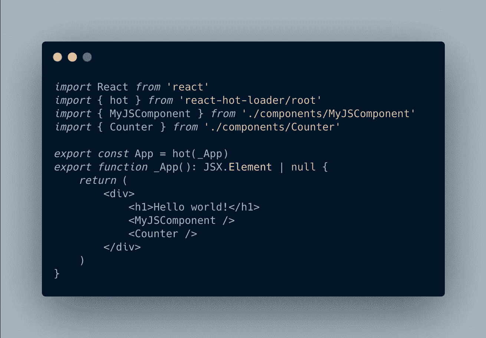

# 在 2021 年从头开始构建一个现代的 React 应用程序

> 原文：<https://betterprogramming.pub/building-a-modern-react-app-from-scratch-in-2021-d2071c31c98>

## 一步一步的教程，关于建立一个没有样板的现代 React 应用程序



➡️ [***你可以在 GitHub 上访问整篇文章和所有相关代码。***](https://github.com/yakkomajuri/react-from-scratch#readme)

# 动机

本教程的主要目的是让我自己更好地理解使 React 应用程序工作的多个移动部分，而不仅仅是接受那里许多模板/样板的“魔力”(例如 [create-react-app](https://create-react-app.dev/) 和[React-样板](https://www.reactboilerplate.com/))。

它的灵感很大程度上来自于[从头开始创建工具链](https://medium.com/u/8de87b6cc577#creating-a-toolchain-from-scratch)告诉我我需要什么:

> “一个**包管理器**，比如 Yarn 或者 npm。它让你可以利用第三方软件包的庞大生态系统，并轻松地安装或更新它们。
> 
> 一个**捆扎机**，如网袋或包裹。它允许您编写模块化代码，并将其打包成小的包，以优化加载时间。
> 
> 一个**编译器**比如巴别塔。它允许您编写现代的 JavaScript 代码，这些代码仍然可以在旧的浏览器中工作。"

这个简短的片段告诉了我很多关于我需要什么以及我为什么需要它的信息。所以我做出了选择:

*   包装经理:[纱线](https://yarnpkg.com/)
*   捆绑者:[网络包](https://webpack.js.org/)
*   编译器:[巴别塔](https://babeljs.io/)

这些都是非常标准的选择。即使你自己以前没有设置过这些，你也可能和它们打过交道，或者至少在某个时候听说过它们。

但是，基于我的要求，我还缺少一样东西:一个状态管理库。

Redux 是最直接的选择，但是我选择了 Kea 。Kea 实际上是建立在 Redux 之上的*，所以我将有效地使用 Redux，但是它使状态管理变得更加容易。*

为了充分披露，我肯定是有偏见的。选择 Kea 的原因很简单，我在工作中使用，它的[作者](https://github.com/mariusandra)是我的同事。

# 入门指南

我们首先需要的是一个新的目录。设置好，然后在里面运行`yarn init`就可以开始了。

当它询问您“入口点”时，使用`src/index.tsx`。你马上就会知道为什么了。

在你的目录中，再创建两个:`src`和`public`。

`src`将托管我们项目的全部源代码，而`public`将是我们放置静态资产的地方。

# 设置

这不是一个一刀切的教程，而是一个学习过程，处理出现的问题不可避免地是其中的一个重要部分。

因此，我不会在安装上标记版本号。如果你想把它作为样板文件，你可以检查在`package.json`中使用的版本。

例如，我决定在本教程中使用 webpack v5，这带来了一些与我最初在 webpack v4 项目中使用的配置的兼容性问题。像往常一样，有了足够多的文档、文章和堆栈溢出帖子，我熬过来了，并在这个过程中学到了更多。

## 巴比伦式的城市

让 Babel 工作需要相当多的软件包。您可以像这样安装它们:

```
yarn add --dev \
  @babel/core \
  @babel/cli \
  @babel/preset-env \
  @babel/preset-typescript \
  @babel/preset-react
```

编译器是我们需要的主要东西。

`babel-cli`将让我们通过 CLI 使用编译器。

后三个包是处理各种用例的巴别塔“模板”(预置)。`preset-env`是用来防止我们头疼的，允许我们写现代的 JS，同时确保输出可以跨客户端工作。`preset-typescript`和`preset-react`是不言自明的:我们同时使用了 TypeScript 和 React，所以我们会需要它们。

最后，我们需要建立一个`babel.config.js`文件，向编译器指定我们正在使用的预置:

## 以打字打的文件

我们希望在我们的项目中使用 TypeScript，这样它就有了自己的设置，超越了 Babel 预设。

首先，我们需要`typescript`包:

```
yarn add --dev typescript
```

然后，积极主动地，我建议你也得到下面的包，如果你将跟随这个教程直到结束的话:

```
yarn add --dev @types/react @types/react-dom @types/react-redux
```

这些包包含我们将在整个项目中使用的模块的类型声明。

我们还需要一个`tsconfig.json`文件。我使用的[是我们在生产中使用的 PostHog 中的配置](https://github.com/PostHog/posthog.com/blob/master/tsconfig.json):

请随意更改上面的一些配置，以更好地满足您的需求。但是，保留以下选项很重要:

```
"noEmit": true, 
"jsx": "react",
```

`"jsx": "react"`不言自明。至于`noEmit`，我们应该把它作为`true`的原因是 Babel 正在为我们编译类型脚本，所以我们只是希望`typescript`被用来检查错误(例如，当我们写代码的时候)。

*旁注:*[](https://github.com/Microsoft/TypeScript/pull/5450)*`[*tsconfig.json*](https://github.com/Microsoft/TypeScript/pull/5450)`[*文件*](https://github.com/Microsoft/TypeScript/pull/5450) *中允许有注释。**

## *网络包*

*Webpack 也需要很多东西才能工作。本质上，对于我们想要捆绑的每种类型的文件，我们都需要一个特定的加载器。*

*因此，我们需要的是:*

```
*yarn add --dev \
    webpack \
    webpack-cli \
    webpack-dev-server \
    style-loader \
    css-loader \
    babel-loader*
```

*`webpack`和`webpack-cli`遵循和巴别塔一样的原理。一个是核心包，另一个让我们可以从 CLI 访问这些工具。*

*是我们当地发展所需要的。您会注意到`package.json`实际上从未从脚本中引用过它，但它是运行`webpack serve`所必需的:*

```
*[webpack-cli] For using 'serve' command you need to install: 'webpack-dev-server' package*
```

*最后，加载程序是我们处理不同文件所需要的。一个`ts-loader`也存在，但是因为我们使用 Babel 来编译我们的 JS 文件，我们实际上并不需要它。*

*而且，像巴别塔一样，我们需要一个`webpack.config.js`文件:*

## *反应*

*鉴于这是一个 React 应用程序，我们也需要一些 React 包！*

*这应该足够了:*

```
*yarn add react react-dom react-hot-loader*
```

*`react`不言自明。`react-dom`将用于在`index.tsx`上渲染我们的 app，`react-hot-loader`用于开发。它会根据文件变化自动更新我们的应用程序。*

## *Kea*

*最后，我们需要建立我们的国家管理图书馆 Kea。*

*从 [Kea 文档](https://kea.js.org/docs/installation/instructions)中，您需要以下内容:*

```
*yarn add kea redux react-redux reselect*
```

*我们在这里也将提前考虑，并获取在用 TypeScript 编写 Kea 逻辑时使用的一个单独的包:*

```
*yarn add --dev kea-typegen*
```

## *package.json*

*有了所有这些设置，我们应该向我们的`package.json`文件添加一些有用的脚本:*

```
*...
"scripts": {
   "start": "webpack serve --mode development",
   "typegen": "kea-typegen write ./src"
},
...*
```

*`start`将用于运行我们的服务器，而`typegen`用于为我们的 Kea 逻辑文件生成类型。*

# *最后，一些 React 代码*

*相当多的设置，是吧？我想我们应该感谢样板文件，尤其是当它们为我们管理所有的依赖项和版本时(* cough***[react-scripts](https://github.com/facebook/create-react-app/tree/master/packages/react-scripts))。*

*然而，我们现在已经完成了设置，接下来是一些代码！*

## *但是首先，一些普通的 HTML*

*我们需要的第一件事是 React 将用来呈现我们的应用程序的一个`index.html`文件。这是我们仅有的`.html`文件。这也是我们在本教程的`public/`中唯一的文件。*

*这是我的`index.html`:*

*这里发生了一些事情:*

*   *我们正在为我们的网站设置一些默认的元标签和标题。*
*   *我们指定了一个`root` div，我们将使用它来呈现我们的应用程序(这实际上是 React 动态生成内部 HTML 的起点)。*
*   *我们为那些禁用 JavaScript 的人添加了一条消息，因为我们的应用程序对他们不起作用。*
*   *我们导入了尚未实际生成的成品 webpack 包。*
*   *这将包含我们在单个文件中编写的所有代码。*

## *入口点*

*还记得前面提到的入口点吗？好吧，现在我们已经开始了。进入`src/`子目录，创建一个名为`index.tsx`的新文件。*

*以下是我的记录:*

*这里发生了三件关键的事情:*

1.  *我们正在设置 Kea，它像 Redux 一样，使用`Provider`使任何嵌套组件(在本例中，是我们的整个应用程序)都可以使用商店。*

*   *这里实际上不需要`resetContext`调用，因为我们没有向它传递任何东西。然而，我把它留在这里，这样你就知道在哪里添加，例如，你的 Kea 插件，因为你可能会用到它们。*

*2.我们正在导入和渲染我们的`App`组件(我们还没有构建)。*

*3.我们告诉 React 使用来自`index.html`的`root` div 作为“绑定点”来呈现我们的应用程序。*

## *我们的应用！*

*现在，同样在`src/`中，用下面的代码创建一个名为`App.tsx`的文件:*

*如果您只想看到您的应用程序在这一点上工作，您可以删除对`MyJSComponent`和`Counter`的导入和引用，并运行`yarn start`。这将启动您的服务器，您应该能够在`localhost:3000`访问您的 React 应用程序，接收您的“Hello world！”来自它的问候。*

*我包含这两个额外组件的原因是为了测试我们有一些东西在工作:*

1.  *我们可以在编写 TypeScript 的同时编写 JavaScript。*
2.  *我们的国家管理运作良好。*
3.  *我们的捆绑器处理`.css`文件没有问题(`Counter`有一些最小的样式)。*

*因此，如果你想的话，你可以停在这里。但是如果你想看到这三件事的实际效果，请继续阅读。*

## *并排写 JS 和 TS*

*正如您在我们的`App.tsx`文件中看到的，我们有一个导入 JavaScript 文件的 TypeScript 文件，没有任何问题。*

*这样做的原因是因为我们在`webpack.config.js`中有这条规则:*

```
*{
    test: /\.[jt]sx?$/,
    loader: 'babel-loader',
    exclude: /node_modules/,
},*
```

*如果我们将`j`从`test`中移除，我们将无法将 JS 文件与 TS 文件一起使用。*

*为了测试一切是否正常，我简单地创建了一个小小的 JS 组件，并将其导入到应用程序中。*

*我在一个名为`components/`的新目录中创建了它，下面是它包含的内容:*

## *计数器*

*我在这个项目中添加的最后一个东西是传统的 React 计数器组件，虽然它仍然保持最小化。*

*这里的目标是测试我们的 Kea 设置是否有效——以及导入 CSS 文件是否有效。*

*所以，我首先在`components/`内部创建了一个名为`Counter`的子目录。在这里，我添加了三个文件:*

*1.`index.tsx` —包括实际组件。这是:*

*很简单的东西。点击`+`，计数上升。`-`倒计时开始。使用输入设置任何数字，计数也会更新。*

*另外，请注意`style.css`导入。*

*2.`counterLogic.ts` —托管用于操作我们的`Counter`组件所使用的状态的逻辑。我不会在这里解释 Kea 是如何工作的，但是下面的内容是不言自明的:*

*3.`style.css` —在这里，我使用了我能想到的最简单的样式来测试 CSS 是否按预期工作:*

```
*h3 {
    color: blue;
}*
```

# *就是这样！*

*如果你已经走到这一步，希望你已经有了一个闪亮的新 React 应用程序、一个现代样板文件和一些额外的知识。老实说，这只是我记录的一点我的学习过程，但我希望你也有所收获！*