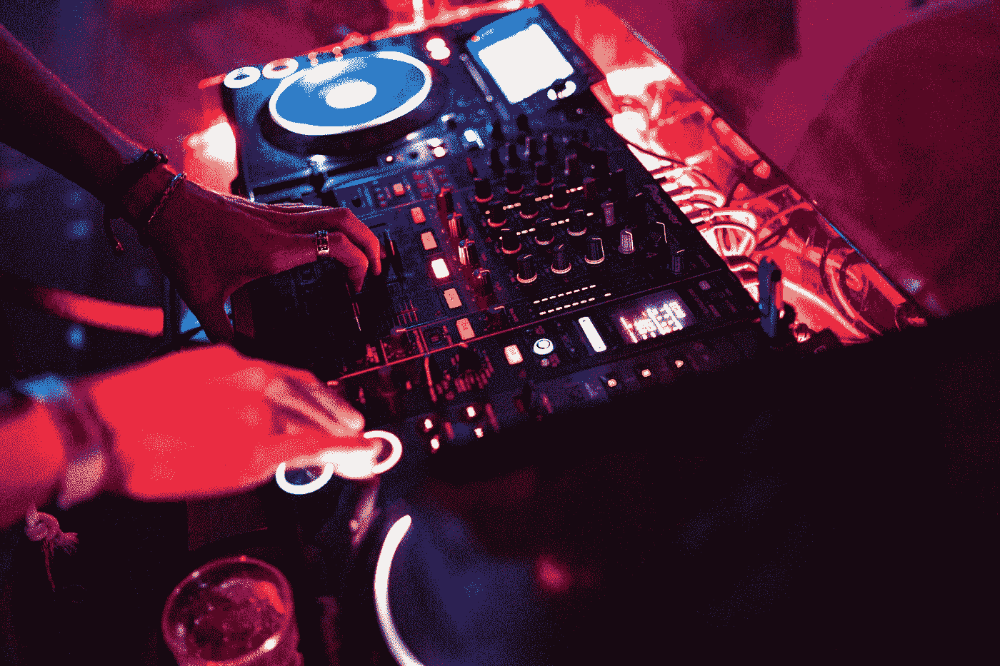

# 用 JavaScript 构建音乐游戏:第 2 部分

> 原文：<https://betterprogramming.pub/building-a-music-game-in-javascript-part-2-ec21d37be2d8>

## 增加游戏化、评分和互动



照片由 [Unsplash](https://unsplash.com/s/photos/dj-pad?utm_source=unsplash&utm_medium=referral&utm_content=creditCopyText) 上的 [Zorik D](https://unsplash.com/@justzorik?utm_source=unsplash&utm_medium=referral&utm_content=creditCopyText) 拍摄

在第 1 部分的[中，我描述了如何在 JavaScript 中使用异步函数以特定的间隔播放一系列声音，所有这些都由 pad 控制。在每个间隔之后，循环再次遍历声音并播放打开的声音。](https://medium.com/better-programming/building-a-beatbox-game-in-javascript-bd9c2d06e1b2)

现在让我们来看一下游戏的逻辑，并探索分数、计时器、输赢机制是如何实现的。

当用户玩游戏时，他们会听到电脑发出的节拍，然后他们有有限的时间来重新创建它。在此期间，他们可以尝试不同的模式，再次听示例节拍，并再次尝试，直到他们得到完全匹配或直到时间结束。

分数是根据在正确位置打开的键盘键的百分比计算的。

完整的代码可以在我的 GitHub 中找到[。](https://github.com/iourisorokine/The-Beat-Battle)

有相当多的函数相互调用，但是如果我们把问题分成更小的块，我们有:

*   存储游戏每一轮的数据。
*   让电脑设定并开始每一轮。
*   将用户密码与他们必须猜测的内容进行比较。
*   计算分数，当分数达到 100%时结束这一轮。
*   更新时间，时间到了就结束。
*   向玩家提供视觉反馈。
*   确保玩家不能通过多次按下同一个按钮来使机器崩溃。

# 玩家对抗电脑游戏机制

为了创建计算机对手，我们需要复制我们为玩家构建的`playBeat`和`playMusic`函数。我们称它为`playDJ`:

```
playDJ = (soundsArr, partition, tempo, measures) => { 
   let counter = 0; 
   let countTimes = 0; 
   stopPlaying(); 
   djPlaying = setInterval(()=> { 
      playBeat(soundsArr, partition[counter]); 
      counter++; 
      countTimes++; 
      if (counter === partition.length) counter = 0; 
      if (countTimes === measures) clearInterval(djPlaying); 
   }, tempo);}
```

这个函数将在另一个我们命名为`listenToTheDJ`的函数中被调用，它将由玩家在按下“Play”按钮时触发:

```
listenToTheDJ = (measures) => { // the play button gets removed to avoid crashing the app by 
// pressing it several times let listenButton = document.getElementById(‘listen-button’); 
   startOrListenButton.removeChild(listenButton) // The playDJ function is called, playing the model beat playDJ(soundsDJ, partitionDJ, timeoutTempo, measures); 
   setTimeout(()=> { 
      if (!document.contains(document.getElementById(‘btn-start-round’))) 
      createListenButton(); 
   }, timeoutTempo * measures);
}
```

现在，这个函数的内容是存储在对象数组中的数据，称为`easyPartitions`(也有一个硬模式)。每个对象看起来像这样:

```
{ 
   name: ‘“Funky”’, 
   tempo: 150, 
   time: 60, 
   difficulty: 4, 
   notes: [ 
      [true, false, true, false, false, true], 
      [false, false, true, false, false, false], 
      [true, false, true, false, true, false], 
      [false, false, true, false, true, true] 
   ] 
}
```

`notes`部分很容易辨认，因为对用户来说它是完全相同的模型:4 次 6 个声音的阵列。

速度用于计算以正确速度播放节拍所需的超时时间，然后将其传递到`playDJ`函数的`timeoutTempo`参数中。

`difficulty`是用户分数的乘数，如果猜的节奏变得更难，分数会变得更高。

`time`是用户必须猜测节拍的秒数。将显示倒计时，一旦时间到了，这一轮将结束。

注意:可以将整个 notes 数组转换成一系列二进制值，然后进一步压缩成一个十进制数。

在上面的例子中，它会给我们 101001 001000 101010 001011，然后是 10783371，但它使笔记更难阅读，所以我把它放在一边。

# 评分机制—检查用户的输出

这一轮的得分是通过比较游戏者在 pad 上所做的事情与所玩的分区来计算的，这意味着比较两个二维数组，并给出它们之间的准确率百分比。

为此，我们使用函数`compareMusic`，它将两个数组作为参数，并返回分数:

```
compareMusic = (modelPartition, userPartition) => { 

   const modelPartFlat = modelPartition.flat(2); 
   const userPartFlat = userPartition.flat(2); 

   const compareLength = modelPartFlat.reduce((acc, value) => { 
      if (value) acc++ return acc; 
   });

   let compareScore = 0; 
   userPartFlat.forEach((note, index) => { 
      if (modelPartFlat[index] && note === modelPartFlat[index]){
         compareScore++;
      } 
      if (!modelPartFlat[index] && note && compareScore > 0){
         compareScore —- ; 
      }
   });    let score = (compareScore / compareLength) * 100; 
   return score ;
}
```

首先，我们使用 [array flat](https://developer.mozilla.org/en-US/docs/Web/JavaScript/Reference/Global_Objects/Array/flat) 方法将数组展平到一维，这种方式使得数据易于比较。

其次，我们确定应该切换到`true` 的音符的数量，并将其存储在变量`compareLength`中。

最后，对于每个正确打开的音符，我们添加分数，对于每个错误打开的音符，分数减少，总数转换为百分比。

比如有 10 注要猜，每猜对一注带来 10%，每猜错一注扣除 10%。

此外，分数最低不得超过 0%。

为了增加一层乐趣，时间和难度都包括在该轮的得分中:

```
updatePlayerScore = (score, difficulty, remainingTime) => {    const roundScore = (score * difficulty); 
   const timeBonus = Math.round(remainingTime * 10); 
   playerScore = playerScore + (roundScore + timeBonus);    
   showScoreBoard(roundScore, timeBonus,  
   playerScore, remainingTime); 
   document.getElementById(‘score-span’).innerText = `Score: ${playerScore}`;}
```

难度是分数的倍增器，剩下的时间会增加一些分数，让猜得快的人受益。

`showScoreBoard`函数使结果出现在每一轮结束时，但我不会在这里深入讨论它的细节。

# 时间力学——让时钟滴答作响

如上所述，每一轮都是计时的，并且`time`键的值决定了用户完成这一轮的秒数。

这基本上是通过创建一个`setInterval`函数来完成的，该函数在每次执行时递增一个计数器:

```
playRound = () => {    clearInterval(musicPlaying); 
   moveToNextRound(); 
   clearFeedbackZone(); //this cleans the current status roundIsStarted = true; 
   let counter = partitionsToPickFrom[roundNb].time; 
   let timeSpan = removeStartButton(); 
   listenToTheDJ(16); // plays one time the music to guess let roundPlaying = setInterval(()=> { 
      timeSpan.innerText = `Time: ${counter} sec`; 
      counter —- ;

      if (counter === -1 || currentScore === 100) { 
         clearInterval(roundPlaying); 
         endCurrentRound(counter + 1); 
      } // if this condition is entered, the round ends   }, 1000);
}
```

计数器设置限制，但是如果之前达到 100%的分数(意味着所有音符都被猜中)，则无论如何循环都会被中断，因为玩家赢得了这一轮。

如果发生这种情况，剩余时间将作为`updatePlayerScore`中的`remainingTime`来计算奖金。

# 给出视觉反馈

构建这个游戏给了我一个很容易玩的错误印象，但是在我周围的人身上做的第一次测试带来了真相:猜测音符极其困难！

为了提高 UX，我移除了速度条(用户最初也必须猜测速度)，增加了时间，降低了难度，最重要的是:专注于视觉反馈。

有一个函数通过调用其他三个函数来管理反馈:一个用于乐谱，一个用于相应的反馈，一个用于风格:

```
giveFeedbackToPlayer = () => { 
   currentScore = giveScore(partitionDJ, partitionUser); 
   const comment = generateComment(currentScore); 
   styleFeedback(currentScore); 
   feedbackZone.innerHTML = `${currentScore}% correct <br> ${comment}`; 
   return currentScore;
}
```

反馈功能，这里没有火箭科学，简单的`if` / `else`语句。样式功能的工作方式相同:

```
// generating a comment depending on the current score
generateComment = (score) => { 
   let comment = “”; 
   if (score < 25) { 
      comment = “Not quite there”; 
   } else if (score < 50) { 
      comment = “Keep trying, padawan”; 
   } else if (score < 70) { 
      comment = “getting closer”; 
   } else if (score < 85) { 
      comment = “Wow, nice!”; 
   } else if (score < 100) { 
      comment = “Almost there!”; 
   } else { 
      comment = “Perfect! Bravo!”; 
   } return comment;
}
```

# “防撞”系统:添加和移除按钮

运行许多同步和异步循环的一个大危险是，它可能导致重叠声音的可怕噪音，并最终使浏览器崩溃。

为了避免这种情况，我们将通过简单地删除不再需要的命令来防止用户多次启动同一个循环。

这是通过以下方式实现的:

*   有一个全局变量告诉我们音乐是否在播放。
*   具有拨动按钮的功能:按下*播放*变为*停止*，反之亦然。
*   回合开始后,*开始回合*按钮变为*再次收听*。一旦按下，按钮会重新出现，延迟会阻止用户多次按下按钮。

当`playMusic`被调用时，用*停止*按钮代替*播放*按钮；

```
// plays the music and replaces by a stop buttonplayUserMusic = () => { 
   userMusicIsPlaying = true; 
   playMusic(soundsPlayer, partitionUser, timeoutTempo); 
   if (document.contains(document.getElementById(‘btn-play’))) {
      removeButton(‘#btn-play’); 
      createStopButton(); 
   }
}
```

用户按下*停止*按钮，或者当不同的节拍将要重叠时，调用下面的`stop`功能。去掉*停止*按钮，代之以*播放*；

```
// stops the player music from playing, replaces by a play buttonstopPlaying = () => { 
   clearInterval(musicPlaying); 
   userMusicIsPlaying = false; 
   if (document.contains(document.getElementById(‘btn-stop’))) {
      removeButton(‘#btn-stop’); 
      createPlayButton(); 
   }
}
```

为了遵循这一原则，开始每一轮的*开始*按钮在该轮开始时被移除，并在该轮结束时被添加:

```
createStartButton();
removeStartButton();
```

# 结论

这是最重要的机制，使这个节拍制造商成为一个游戏:挑战玩家互动，计算分数，并执行游戏回合。

欲了解更多信息:

*   [代码](https://github.com/iourisorokine/The-Beat-Battle)
*   [本系列第一部](https://medium.com/better-programming/building-a-beatbox-game-in-javascript-bd9c2d06e1b2)。