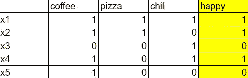
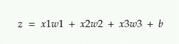
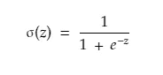
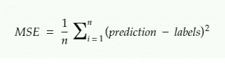
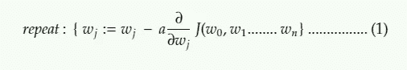
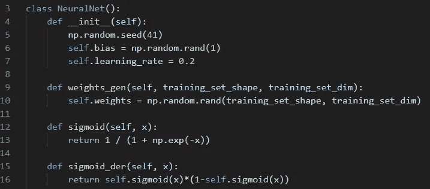
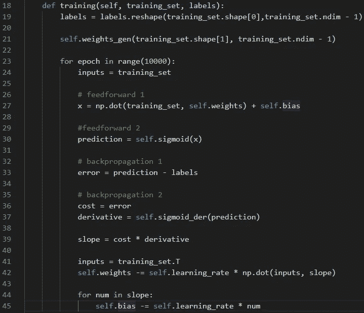
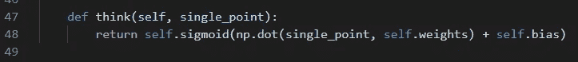
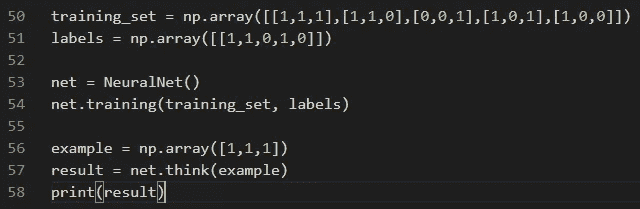

# 从头开始构建神经网络

> 原文：<https://betterprogramming.pub/building-a-neural-network-from-scratch-71533fc6e8bb>

## 第二代和优化我们的神经网络


图片来自[维基媒体](https://commons.wikimedia.org/wiki/File:Artificial_Neural_Network_with_Chip.jpg)

在我们的[上一篇文章](https://medium.com/better-programming/build-your-first-neural-network-from-scratch-c5d5490a3f76)中，我们从头开始构建了一个简单的神经网络，它能够学习并执行一个非常简单的任务。今天我们将优化我们的网络，使其面向对象，并引入学习率和偏差等概念。让我们添加一个简单但真实的例子，这样 0 和 1 就变成了故事的一部分。

# 先决条件

和上次一样，我们将只需要一个外部库来执行计算， [NumPY](https://numpy.org/) ，当然，还有 Python 本身。

## 输入



这是我们输入的样子。我们将训练一个神经网络来确定我是否快乐，基于我生活中的元素，如咖啡、披萨和辣椒。

要教会神经网络识别模式，我们就要走强化学习的道路。这意味着我们将在一个标记的数据集上训练神经网络。我们将有两层，输入和输出。输入是我们的训练数据，输出由对应于输入数据的标签集合组成。

输入:

```
training_set = np.array([[1,1,1],[1,1,0],[0,0,1],[1,0,1],[1,0,0]])
```

标签:

```
labels = np.array([[1,1,0,1,0]])
```

神经网络存在两个阶段:*前馈*和*反向传播*。给我们的超级 AI 前馈一些数据吧！

# 正向输送

在前馈阶段，神经网络将根据输入数据集的值、权重和偏差进行预测。

如果我们查看输入数据，我们可以看到每个样本都有三个数字，分别代表咖啡、披萨和辣椒。权重是输入样本和标签之间的联系。为了做出正确的预测，我们必须调整这些权重。

前馈过程的第一步是将每个输入样本乘以相应的权重，对其求和，并向和中添加偏差。

下面是这个公式的样子:



b 在这里代表偏差，这是我们在第一篇文章中遗漏的一个非常重要的元素。假设我们有咖啡、披萨和辣椒，这意味着我们有一个类似这样的数组:[1，1，1]。我们期望的结果是 1，但是，无论我们对神经网络进行多少训练，结果都将是 0。偏差将允许我们训练神经网络，即使我们在训练样本中有所有相同的值。

前馈阶段的下一步是激活函数。我们将需要它将输入和标签相乘的结果矩阵转换为 0 或 1，因为这是数据在输出层(标签)中格式化的方式。

有几种类型的激活功能。对于我们的例子，我们将使用乙状结肠。如果输入为 0，sigmoid 函数将返回 0.5。在大正数的情况下，它返回一个接近 1 的值。如果该值为负，则返回一个接近于 0 的值。正值或负值越大，输出越接近 1 或 0。

以下是 sigmoid 函数的数学表示:



# 反向传播

在第一次迭代中，神经网络将做出远非正确的预测。没关系，我们都会犯错。为了实现学习过程，我们需要通过比较实际预测和标签值来调整最初的随机预测。我们微调权重和偏差，使实际输出更接近标签。

首先让我们计算一下预测的成本。成本是实际预测和标签之间的差异。差价越大，成本越高。我们将借助[均方误差](https://en.wikipedia.org/wiki/Mean_squared_error)来计算成本。

该公式如下所示:



下一步将是最小化预测的成本。为了做到这一点，我们需要找到成本函数将返回最小可能值的权重和偏差。这被称为*优化问题*，其中*T5 我们必须找到函数极小值。*

梯度下降可以帮助我们找到函数的极小值。这是算法的数学表示:



这里的 *J* 代表一个常量函数。该等式的作用是找到与每个权重和偏差相对应的成本函数的偏导数，然后从现有权重中减去结果以获得更新后的权重。

导数的作用是给出给定时刻的斜率。如果成本增加，那么导数给我们一个正值，这个值将从最近的值中减去。

这个公式中的 alpha 符号代表*学习率*，这完全是另外一个故事。简而言之，学习率定义了神经网络学习的速度。

我们需要重复这个等式的执行，直到我们对成本函数将返回最接近 0 的值的权重和偏差进行赋值。

现在是时候全部用 Python 实现了。

# 履行

我们将以面向对象的方式来实现这一点，这意味着我们首先创建类。下面是我们类中的 helper 函数:



最初，我们声明偏差和学习率。然后，我们基于输入数据的形状和维度生成权重。我们也使用之前讨论过的 sigmoid 和导数函数。

这是训练功能，神经网络的核心:



首先，我们将借助于 sigmoid 激活函数进行预测。然后我们计算预测的成本、导数和斜率。最后，我们调整权重和偏差。

最后一个功能是在训练后进行思考:



最后，这是神经网络的执行过程:



完整代码:

# 结论

在这个人工智能的帮助下，现在你可以确定什么让我快乐了！与[第一次尝试](https://medium.com/better-programming/build-your-first-neural-network-from-scratch-c5d5490a3f76)相比，我们对神经网络进行了重大改进，增加了偏差和学习率等内容，并使其面向对象。在下一篇文章中，我将尝试添加更多的隐藏层，这样我们就可以处理更复杂的数据集，做一些更有趣的事情。

不断学习，不断成长！