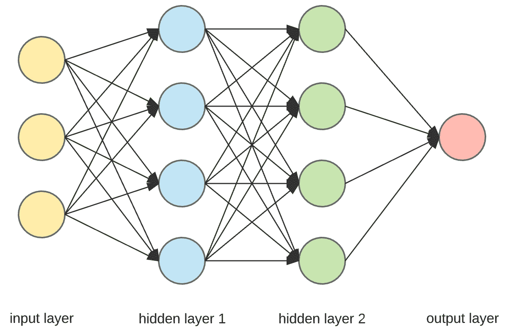
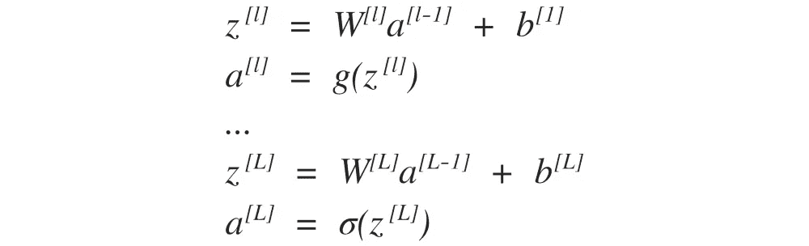
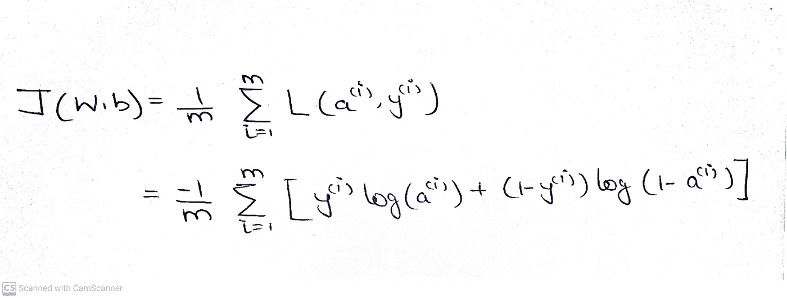
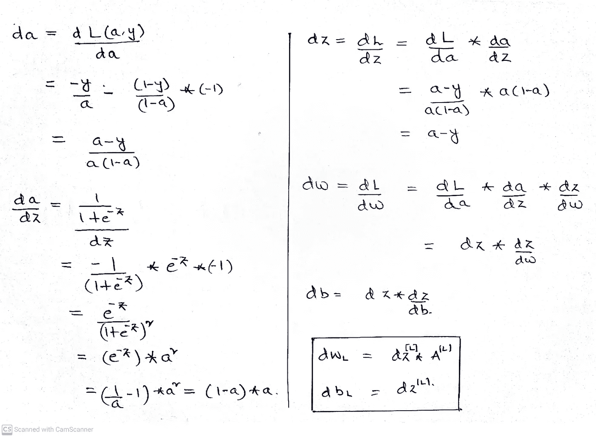
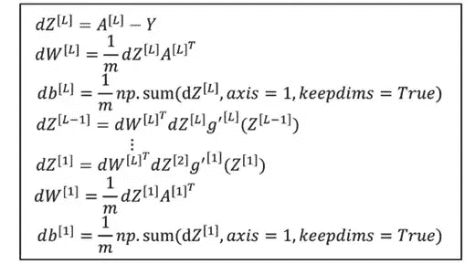
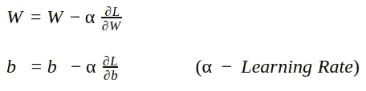
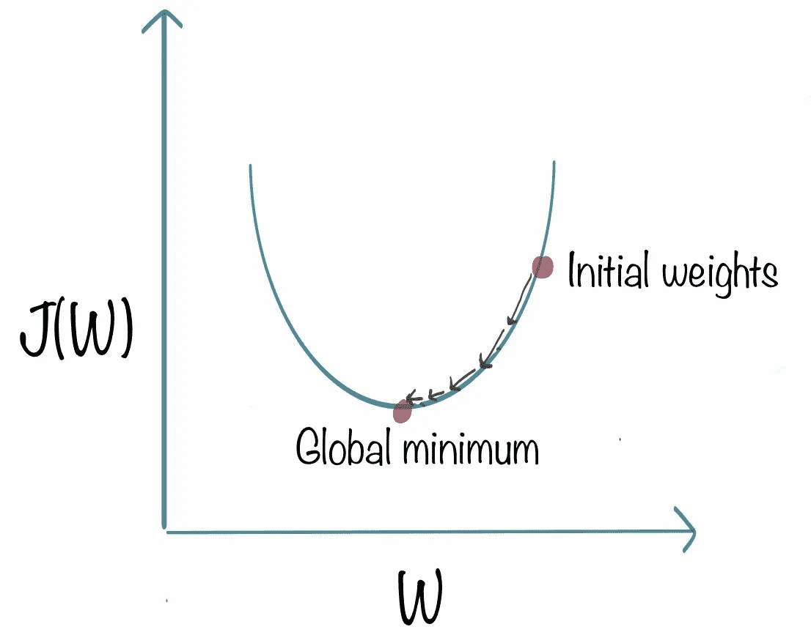
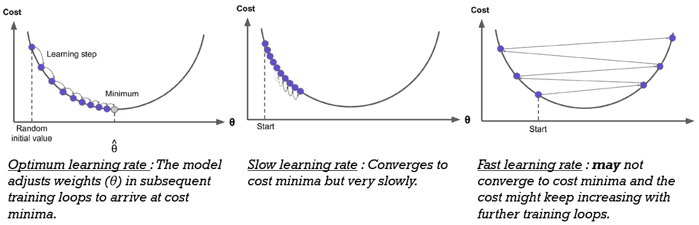

# 从头开始构建神经网络

> 原文：<https://betterprogramming.pub/building-a-neural-network-from-scratch-without-frameworks-61a7ac225e82>

## 对神经网络的更深入理解

亚历山大·米洛在 [Unsplash](https://unsplash.com?utm_source=medium&utm_medium=referral) 上拍摄的照片

# **什么是神经网络？**

神经网络是神经元层的集合，它将数据作为输入，训练自己识别数据中的模式，并预测相似类型数据的输出。

人工神经网络是生物神经网络的松散模型。

通俗地说，就像生物神经网络中极少量的信息从一个神经元传递到另一个神经元一样，人工神经网络中信息在不同层的神经元之间传递。

每个人工神经网络都有以下组件:

***输入层:*** 在结构化数据中，输入层的节点数将等于特征数。在非结构化数据中，例如图像，节点的数量将等于图像的大小。

***权重和偏差:*** 使用权重修改每个神经元/节点的输入，并与偏差相加。

***隐藏层:*** 隐藏层的大小(隐藏层的数量和每个隐藏层中神经元的数量)将根据我们正在处理的数据类型而定。隐藏层中的神经元是神经网络的核心处理单元。隐藏层中的每个神经元保存关于数据的特定子成分的信息。例如，在图像识别任务中，网络中的每个神经元都有一些关于图像边缘的信息。

***输出层:*** 输出层中的节点数取决于标签列中的类数。

***激活函数:*** 这些是应用于隐藏层和输出层中每个神经元的数学函数。有许多可用的激活功能，其中我们将使用*和 ***ReLU*** 。*

# *让我们建立我们的神经网络*

*让我们考虑一个三层神经网络(两个隐藏层和一个输出层)。*

**

*三层神经网络*

*我们必须为我们的神经网络创建一个类，并为所有三层随机初始化权重和偏差。*

****注:*** 开机前导入 ***NumPy*** 。*

## ***正向传播***

*使用相应层的权重和偏差来修改每个层的输入。然后将结果输入激活函数，并转发到下一层。*

**

*正向传播*

*对于所有隐藏层，我们将使用 ***ReLU*** 激活函数，对于输出层，我们将使用***sigmoid****激活函数，因为它是一个二进制分类。我们可以用***soft max*******回归*** 的例子进行多类分类。***

*****注:tanH*** 和***leaky relu****是其他可以使用的激活功能。***

******注:*** 我们对图层的权重和输入执行点积。所以，我们总是要跟踪矩阵的维数。在需要的地方调换输入。***

## ****损失函数****

**使用随机初始化的权重，我们将预测输出，然后计算预测中的误差。这种预测值与真实值的误差/偏差称为神经网络的成本/损失。**

**下面是神经网络的损失函数( ***)二元交叉熵*** )。**

****

**作者图片**

**有许多损失函数可用。既然我们在处理分类， ***二元交叉熵*** 用于二元分类， ***稀疏分类交叉熵*** 用于多类分类。**

## ****反向传播****

**我们现在将反向传播，找出成本函数的斜率，以更新我们的权重和偏差。**

**我们不能根据权重和偏差直接计算成本函数的斜率。我们需要按顺序进行，如下图所示。**

*****注:*** 在下面的推导中我已经使用了 ***sigmoid*** 激活函数。您可以更改激活功能。**

****

**作者图片**

****

**反向传播**

## ****梯度下降****

**我们必须不断更新神经网络的权重和偏差，直到神经网络的成本最小。技术上来说，直到成本达到全球最低。**

****

**更新权重和偏差**

****

**梯度下降**

*****注:*** 代价达到全局最小值的速率由学习速率(alpha)决定。如果学习率很高，那么步长将很大，并且成本可能永远不会达到全局最小值。如果学习率低，达到全局最小值需要很多时间。所以，学习速度应该是最佳的。**

**下图对此进行了解释。**

****

**调整学习率**

**在全局最小值时，我们将拥有最佳的权重和偏差集，并且成本也将是最小的。**

**我们的目标是找出可用于进一步预测的最佳权重和偏差集。**

# **如何知道全局最小值？**

**对一些迭代运行正向传播、反向传播函数，并计算每次迭代的成本。成本低的迭代是全局最小值。**

# **接下来呢？**

**尝试编写一个函数来预测测试集的输出。**

**了解超参数并尝试调整超参数以提高精度。**

**了解正规化。它有助于您概括您的模型，并防止过度拟合数据。**

*****过得愉快。*****