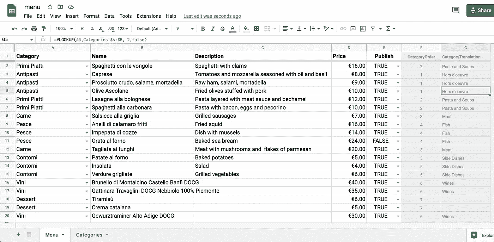
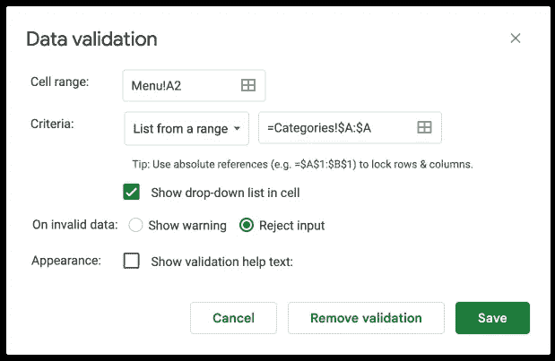
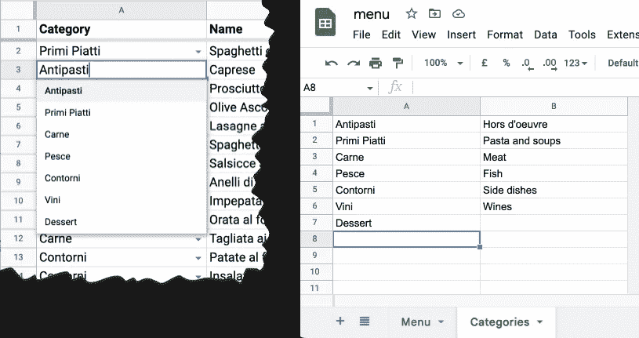
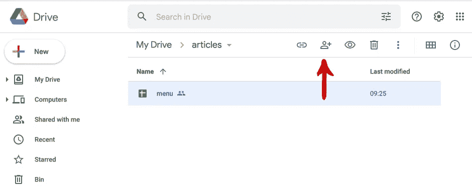
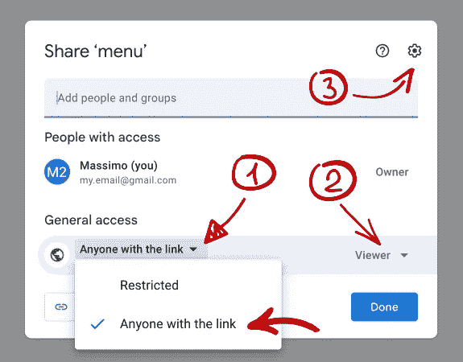
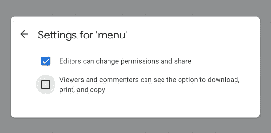
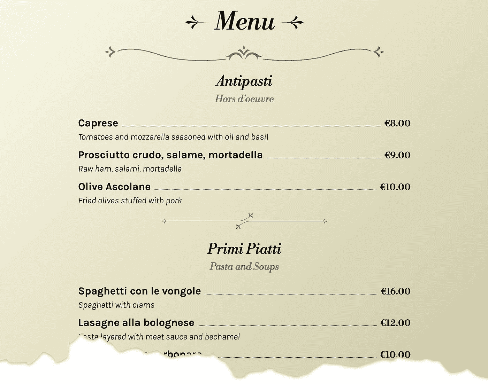

# 用 Google Sheets 和 React 构建一个单页数据驱动的网站

> 原文：<https://betterprogramming.pub/building-a-one-page-data-driven-site-with-google-sheets-and-react-68a50a00a2e6>

## 使用 Google Sheets 构建可编辑的网站

## 一种快速建立有用的单页网站的方法，该网站包含餐厅菜单、上课时间和其他可以使用数据表编辑的内容


[马修·史密斯](https://unsplash.com/@whale?utm_source=medium&utm_medium=referral)在 [Unsplash](https://unsplash.com?utm_source=medium&utm_medium=referral) 上拍照

首先:这并不像看起来那样是一个新的和创新的想法。我不知道是谁先想到的，但是你可以在网上找到很多这样的例子。我只是试着把一些事情放在一起…

基本思想是将 Google 工作表导出为 JSON 的可能性(如[实现图表工具数据源协议](https://developers.google.com/chart/interactive/docs/dev/implementing_data_source)中所述)。

因此，Google Sheets 将成为我们的后端接口和网页的数据提供者。

本文的目标是使用现代工具构建一个快速的站点页面:

*   [Google Sheets](https://www.google.com/intl/en-US/sheets/about/) 用于存储和编辑数据。
*   [反应](https://reactjs.org/)建立站点。

我会假设你已经有一个谷歌帐户，至少有一个谷歌表和 React 的基本知识。

开始吧！

# 创建数据手册

对于我的示例，我将创建一个意大利餐厅菜单，因此我创建了一个数据表，如下所示:



“菜单”表

我们的文档包含两个表:**菜单**和**类别**。

第一个是主数据库，第二个是*菜单*表的*类别*列的值列表。使用**数据**菜单的**数据验证**命令，我们可以将*类别*列表绑定到第一列:这将确保每条记录都与现有的*类别*相关。



谷歌表单中的数据验证窗口

现在可以通过弹出菜单编辑*类别*栏。



目录弹出菜单

此外，最后的灰色列(`CategoryOrder`和`CategoryTranslation`)会自动连接到*类别*表，这样当我们选择一个类别时，它们会填充相应的行号和翻译列的值。

我们可以使用第一列的公式:

```
=MATCH(A2,Categories!$A:$A, false)
```

最后是以下内容:

```
=VLOOKUP(A2,Categories!$A:$B, 2,false)
```

我们将使用这些行号来显示我们的记录，使用与**类别**表行相同的顺序(我们将在后面介绍)。

我们的目标是通过第一张表上的一个独特的 ajax 调用获取所有数据。效率不是很高，但是由于我们必须获得有限数量的记录，这个系统绰绰有余(而且简单)。

其他栏目没什么特别的。

# 共享

为了让您的应用程序阅读我们的文档，我们需要共享它。

然后点击文档左上角的绿色**共享**按钮或文档列表中的共享图标。



Google Drive 文档列表

这将向您显示**共享**窗口:



Google Drive 共享窗口

1.  在**一般访问**部分，选择*任何具有链接*的人:这允许任何具有正确链接的人阅读您的文档，而不需要密码。
2.  在右侧的**角色**弹出框中，选择*查看器*。这样，任何人都可以阅读您的文档，但不能编辑它。
3.  如果您想进一步降低共享权限，请单击左上方的齿轮图标并取消选择第二个选项，这样您的文档就无法打印或下载。



Google Drive 共享选项

最后，点击 **Done** :现在你已经为下一步做好了准备。

# 解析数据

下一步是创建我们的数据提供者脚本。它将获得 Json 格式的电子表格数据，并按照我们需要的方式解析它。

为此，我们需要我们文档的文档 ID 。

来自[谷歌文档开发者指南](https://developers.google.com/docs/api/how-tos/overview):

> *文档 id 引用文档，可以从 URL 中导出:*
> 
> `*https://docs.google.com/document/d/__documentId__/edit*`
> 
> *_ _ documentId _ _*是包含字母、数字和一些特殊字符的唯一字符串。**

*您可以从您的电子表格 url 获取您的*文档 Id* ，并将其插入 url `https://docs.google.com/spreadsheets/d/<DocumentId>/gviz/tq?tqx=out:json`，如[实现图表工具数据源协议](https://developers.google.com/chart/interactive/docs/dev/implementing_data_source)中所述。*

*这将返回一个为 Google Chart 数据程序优化的 JSONP 文档。通过更改一些 url 参数，可以有其他输出格式，但是 JSON 是实现我们目标的最简单的解决方案。*

*url 返回一个`txt`文件(JSONP 内容),如下所示:*

```
*/*O_o*/
google.visualization.Query.setResponse({
    "version":"0.6",
    "reqId":"0",
    "status":"ok",
    "sig":"642849398",
    "table":{
        "cols":[...],
        "rows":[...],
        "parsedNumHeaders":1
    }
});*
```

*这个项目是我们需要的。它包含了`cols`(电子表格标题)和`rows`(数据)元素。`cols`元素的第一行是`rows.c`元素的第一行的标题，依此类推:*

```
*"cols":[
    {"id":"A","label":"Category","type":"string"}, 
    {"id":"B","label":"Name","type":"string"},
    ...
],

"rows":[
    {"c":[
        {"v":"Primi Piatti"},
        {"v":"Spaghetti con le vongole"},
        {"v":"Spaghetti with clams"},
        {"v":16.0, "f":"\u20AC16.00"},
        {"v":true, "f":"TRUE"},
        {"v":2.0, "f":"2"},
        {"v":"Pasta and Soups"}
    ]}, 
    ...
]*
```

*每个行元素又有一个`v`元素(原始值)，如果需要，还有一个`f`元素(格式化值)。*

*我们的脚本需要解析 JSONP 文本，提取并解析 JSON 数据，然后重新排列结果:*

```
*export default async function getData() {

  // https://stackoverflow.com/questions/31765773/converting-google-visualization-query-result-into-javascript-array
  // https://developers.google.com/chart/interactive/docs/dev/implementing_data_source#responseformat

  const spreadsheetId = '1lipvFbBqi0PhyeNMik6rhgYnBRlg4aJFX6LdjXvwBTQ',

    response = await fetch(`https://docs.google.com/spreadsheets/d/${spreadsheetId}/gviz/tq?tqx=out:json`),
    result = await response.text(),
    json = JSON.parse(result.replace(/.*google.visualization.Query.setResponse\({(.*?)}\);?/s, '{$1}'));

  // console.log(json);

  // `table.cols` element contains headings
  // we will use them to build our data array
  const headings = json.table.cols.map(item => item.label);

  // console.log(headings);

  // data of each row is associated to the headings
  let data = json.table.rows.map(item => {
    // console.log(item);
    let row = {};
    item.c.forEach((cell, idx) => {
      row[headings[idx]] = cell?.v?? null;
    });
    return row;
  });

  // filtering and sorting
  data = data.filter(item => item.Publish === true);
  data.sort((a, b) => a.CategoryOrder > b.CategoryOrder);

  // console.log(data);

  /*
    Fields:
    -------------------
    Category
    Name
    Description
    Price
    Publish
    CategoryOrder
    CategoryTranslation
  */

  // aggregating data by category
  data = [...new Set(data.map(item => item.CategoryOrder))].map(categoryIndex => {
    return data.filter(item => item.CategoryOrder === categoryIndex);
  });

  return data;
}*
```

*   *首先，使用`fetch`检索远程内容。JSONP 回调函数名(`google.visualization.Query.setResponse`)被删除，生成的 JSON 被解析(其他信息请看 Stackoverflow 上的[将 Google 可视化查询结果转换成 JavaScript](https://stackoverflow.com/questions/31765773/converting-google-visualization-query-result-into-javascript-array) 数组问题)。*
*   *然后解析标题:它们将被用作返回的 JSON 的键。*
*   *解析 JSON 行并创建一个新的 JSON。*
*   *最后，删除未发布的项目，剩余的数据按`CategoryOrder`排序。*

*现在我们有了一个规范化的 JSON:*

```
*[
  {
    "Category": "Primi Piatti",
    "Name": "Spaghetti con le vongole",
    "Description": "Spaghetti with clams",
    "Price": 16,
    "Publish": true,
    "CategoryOrder": 2,
    "CategoryTranslation": "Pasta and Soups"
  },
  {
    "Category": "Antipasti",
    "Name": "Caprese",
    "Description": "Tomatoes and mozzarella seasoned with oil and basil",
    "Price": 8,
    "Publish": true,
    "CategoryOrder": 1,
    "CategoryTranslation": "Hors d'oeuvre"
  }
  // ...
 ]*
```

*但是我们需要通过`Category`来聚集行，以便更好地显示它们。*

*在脚本的最后几行，我们使用[集合构造函数](https://developer.mozilla.org/en-US/docs/Web/JavaScript/Reference/Global_Objects/Set/Set)获得了一个唯一的`CategoryOrder`项数组，然后构建了一个新数组。现在所有项目都由`Category`汇总:*

```
*[
  [
    {
      "Category": "Antipasti",
      "Name": "Caprese",
      "Description": "Tomatoes and mozzarella seasoned with oil and basil",
      "Price": 8,
      "Publish": true,
      "CategoryOrder": 1,
      "CategoryTranslation": "Hors d'oeuvre"
    }
    //...
  ],
  [
    {
      "Category": "Primi Piatti",
      "Name": "Spaghetti con le vongole",
      "Description": "Spaghetti with clams",
      "Price": 16,
      "Publish": true,
      "CategoryOrder": 2,
      "CategoryTranslation": "Pasta and Soups"
    }
    //...
  ],
  //...
]*
```

*每个记录都包含`Category`、`CategoryOrder`和`CategoryTranslation`条目——这确实是多余的，但是我们处理的是少量的记录，所以我们可以忽略这一点。*

# *发展中的*

*由于我们的目标是构建一个非常简单的页面，所以我们不会使用任何 CSS 框架(我们只会使用像 [Normalize.css](https://necolas.github.io/normalize.css/) 这样的 CSS 重置表)。*

*总的来说，我尽可能地简化了一切，这样我们就可以专注于工作流程。*

*`App.jsx`脚本完成了所有的工作:*

```
*import './App.scss';
import React from 'react';
import getData from './google-sheets-data-provider';

import deco1 from './imgs/deco1.svg';
import deco2 from './imgs/deco2.svg';
import deco3 from './imgs/deco3.svg';
import deco4 from './imgs/deco4.svg';

function App() {
  const [content, setContent] = React.useState(null),
    [json, updJson] = React.useState(null);

  React.useEffect(() => {

    try {
      getData().then(result => updJson(result));

    } catch(e) {
      updJson(null);
      setContent('Error on data loading...');
    }

  }, []);

  React.useEffect(() => {

    if(json?.length) {

      setContent(json.map((item, idx) => {
        // We get Category and CategoryTranslation from the first item
        return <React.Fragment key={idx}>
          <h2>{item[0].Category}</h2>
          {item[0].CategoryTranslation && <p lang="en" className='subtitle'>{item[0].CategoryTranslation}</p>}
          <ul>
            {item.map((row, idx) => {
              return <li key={idx}>
                <div className="name-wrapper">
                  <span className='name'>{row.Name}</span>
                  <span className='dotted-line'></span>
                  <span className='price'>{row.Price.toLocaleString('en-UK', {
                    minimumFractionDigits: 2,
                    maximumFractionDigits: 2,
                    currency: 'EUR',
                    style: 'currency'
                  })}</span>
                </div>
                {row.Description && <div className="description">{row.Description}</div>}
              </li>;
            })}
          </ul>
          {idx < json.length -1 &&
            <div className="deco small"></div>
          }
        </React.Fragment>;
      }));
    }
  }, [json]);

  return (<>
    <div className="menu">
      <h1>
        
        Menu
        
      </h1>
      <div className="deco"></div>

      {content? content : <p className='big'>Loading...</p>}

      <div className="deco"></div>
      <p className='small'><a href="https://www.freepik.com/free-vector/decorative-lines_4249919.htm">Images by rawpixel.com</a> on Freepik</p>
    </div>
  </>);
}

export default App;*
```

*我们首先使用之前描述的脚本获取并解析 Google Sheet 数据，然后构建菜单。*

*这是结果:*

**

*如果您更改电子表格中的数据，菜单将会更新。这不是一个非常快速有效的解决方案，但对于小需求来说可能足够了。*

*你可以在我的 GitHub 库上找到完整的[源代码](https://github.com/massimo-cassandro/area-test/tree/main/2022-10-google-sheets-react)和一个[工作演示](https://massimo-cassandro.github.io/area-test/2022-10-google-sheets-react/build/index.html)。*

```
***Want to Connect?**Check out [my other development-related articles](https://medium.com/@massimo.cassandro/my-dev-publications-eacf6727e4a).*
```