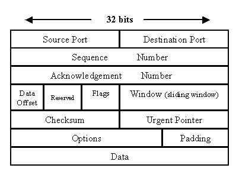

# 用 Python 构建数据包嗅探工具

> 原文：<https://betterprogramming.pub/building-a-packet-sniffing-tool-with-python-58ea5d65ace2>

## 网络安全实践方法


不，不是这种嗅探。来源:[https://www.avg.com/en/signal/what-is-sniffer](https://www.avg.com/en/signal/what-is-sniffer)

# 什么是嗅探

网络嗅探器是网络管理员和黑客使用的软件工具。也称为嗅探器，这些工具监视设备、协议和不同数据包中捕获的各种信息的网络流量。嗅探器可以识别使用过多带宽的人，跟踪网络瓶颈，捕获网络使用的统计数据，并确保网络上的数据是加密的。

然而，黑客和安全专业人员可以通过不安全的 WiFi 网络使用嗅探器来识别网络中的安全缺陷，从而窃取密码和其他私人信息。主动嗅探器与目标交互，而被动嗅探器获取额外的数据。

# 数据包嗅探器如何工作

在我们了解数据包嗅探器如何工作之前，我们必须了解网络。网络最好理解为一系列相互连接的节点。对于那些学过计算机科学的人来说，想想图表。每个节点代表一个连接互联网的设备，如智能手机或笔记本电脑。这些节点通过称为数据包的数据包在网络中发送数据。嗅探器可以通过监视传输中的数据或通过主动嗅探以被动模式收集数据，在主动嗅探中，它们向目标发送特制的请求。

# 网络数据包的结构



来源:[https://www . techrepublic . com/article/exploring-the-anatomy-of-a-data-packet/](https://www.techrepublic.com/article/exploring-the-anatomy-of-a-data-packet/)

在我们继续之前，了解数据包的结构是很重要的。每个数据包将包含关于源、目的地、标志和数据的数据，以及其他选项。上图显示了一个基本的视觉效果。在本教程中，我们不会深入探讨包的结构，但是理解基础知识是很重要的。

# 编写网络嗅探器代码

本教程将涵盖被动嗅探器的创建。我们将从打开 VS 代码并创建一个名为`main.py`的文件开始。我们将从三个导入开始，它们帮助我们打开一个套接字来捕获网络数据并解包格式化的数据。这些进口如下:

```
import socketimport structimport binascii
```

接下来，我们将打开一个套接字并获取最长为`2048`位的变量。在 socket 函数中，我们将需要传递三个变量:第一个指定一个 windows 数据包接口(`AF_INET`)；第二个指定我们正在打开一个原始套接字，第三个指定我们感兴趣的协议，在本例中是 IP 协议。然后，我们将依靠`recvfrom`函数在无限循环中接收大小为`2048`的数据包。代码如下:

```
s = socket.socket(socket.AF_INET, socket.SOCK_RAW, socket. htons(0x0800)) #Creating socketwhile True:
    packet = s.recvfrom(2048)
```

然而，我们仍然需要打印格式化的包数据，我们将使用上面的 struct 和 binascii 导入来使用它。鉴于在本教程中，我们将打印源和目标 IP 作为嗅探器的一部分，我们只关心包中的第一行(如图所示)。我们将获取该头的前 16 个字节，并按如下方式打印它们:

```
ethernet_header = packet[0][0:14] # Get Ethernet Headereth_header = struct.unpack("!6s6s2s", ethernet_header)print ("Destination MAC:" + binascii.hexlify(eth_header[0]) + " Source MAC:" + binascii.hexlify(eth_header[1]) + " Type:" + binascii.hexlify(eth_header[2]))
```

以管理员身份运行这段代码(或者在 Linux 上使用 sudo)应该会显示终端中的所有数据包。试试看，如果需要帮助，可以看看我的 GitHub 上的代码。

[](https://github.com/AleksaZatezalo/sniffer) [## GitHub — AleksaZatezalo/sniffer

### 此时您不能执行该操作。您已使用另一个标签页或窗口登录。您已在另一个选项卡中注销，或者…

github.com](https://github.com/AleksaZatezalo/sniffer)