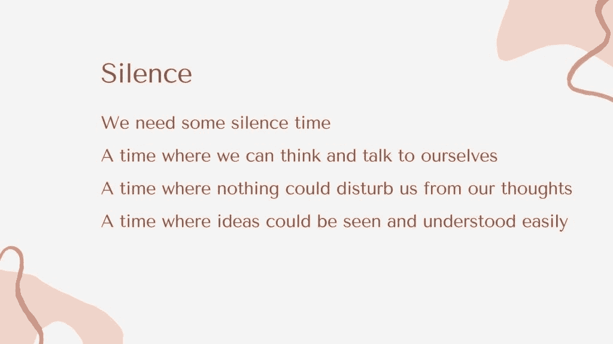
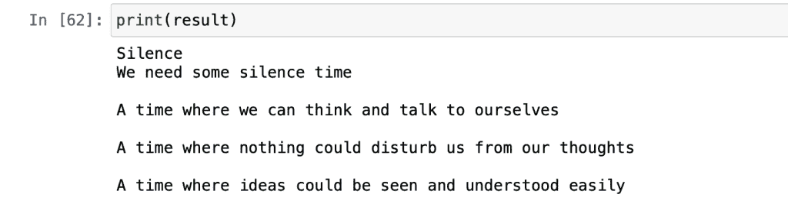
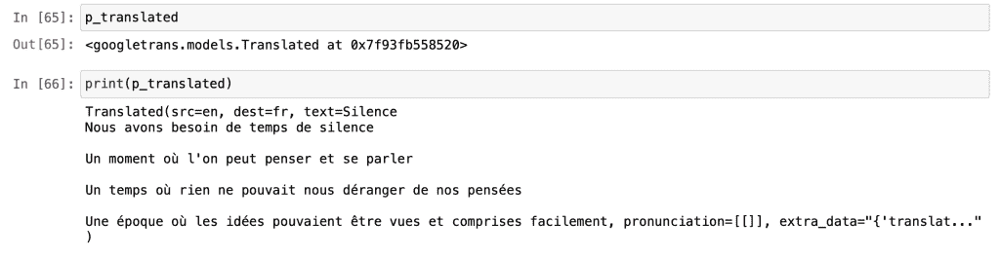
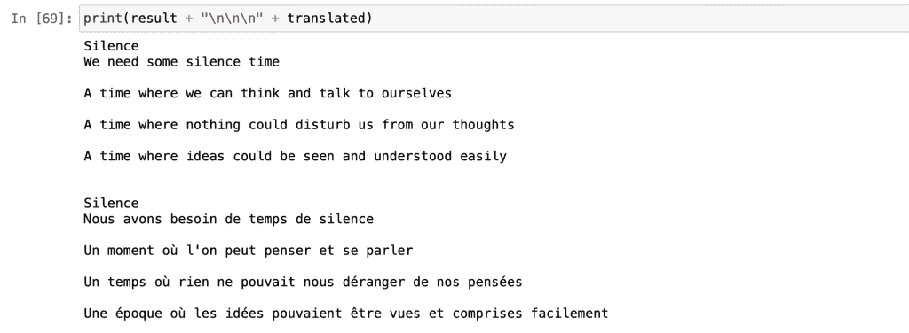
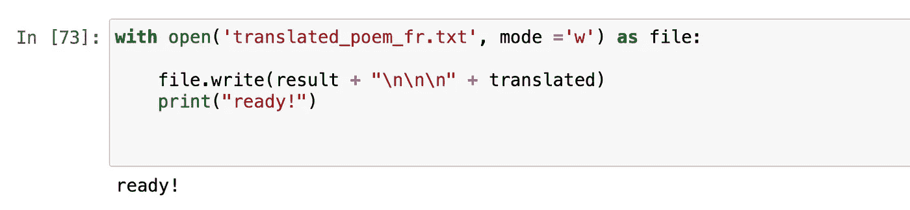
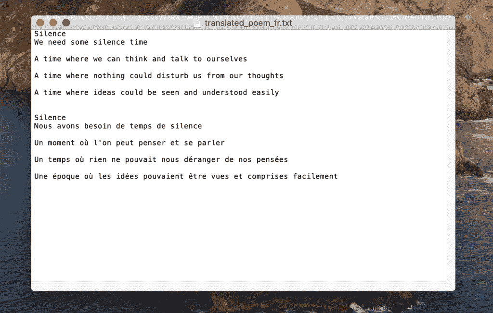

# 使用 Python 和 Google Translator API 构建照片翻译器

> 原文：<https://betterprogramming.pub/building-a-photo-translator-using-python-with-the-google-translator-api-94b8da75f7f8>

## 一个实践机器学习项目，结合了文本识别和语言翻译


照片由 [Pexels](https://www.pexels.com/photo/man-sitting-in-front-of-three-computers-4974915/?utm_content=attributionCopyText&utm_medium=referral&utm_source=pexels) 的 [olia danilevich](https://www.pexels.com/@olia-danilevich?utm_content=attributionCopyText&utm_medium=referral&utm_source=pexels) 拍摄

本文将向您展示如何构建一个可以为您进行文本识别和语言翻译的程序。我以前做过一个[文本识别程序](https://towardsdatascience.com/building-a-simple-text-recognizer-in-python-93e453ddb759)，我对它的出色表现感到惊讶。我一直用它来把我的手写笔记和一些我喜欢的书上的句子转换成数字文本文档。然后，我决定给我的程序增加一点功能。为什么不把好的事情变成完美的事情呢？

由于我已经有了一个文本识别器，我认为智能照片翻译器将是一个很好的项目。在做了一点研究后，我发现谷歌的翻译 Ajax API 是可用的。在这个项目中，我们将把文本识别与[语言翻译库](https://pypi.org/project/googletrans/)结合起来。将两个机器学习科目合并成一个项目会很有趣。不过，介绍到此为止。我们开始工作吧！

## **目录**

```
#1\. [Getting Started](#8048)
#2\. [Step 1: Define the Photo](#bf10)
#3\. [Step 2: Text Recognition](#efe9)
#4\. [Step 3: Google Translator](#b864)
#5\. [Final Step: Exploring the Result](#e16b)
#6\. [Conclusion](#44f4)
```

# 入门指南

在这个项目中，我们将使用三个 Python 库。我将使用我的终端窗口来安装它们。建议:在安装它们之前创建一个环境。我个人会选择 Anaconda——它有一个很好的界面，并且简单易用。不管怎样，回到图书馆。这里是我们需要的三个库:

*   **Pillow** :强大的图像处理库。我们将使用它来打开和编辑图像文件。(枕头也被称为 PIL。)
*   [](https://python-pillow.org/)**:我们将用来识别图像中文本的库。**
*   ****Googletrans** :你可以从库名中猜到，我们将用它来翻译识别的文本。此外，快速注意:由于谷歌端的一些更新，这个包在一些版本中给出了错误信息。这就是为什么，在安装时，我们将使用它的 3.1.0 alpha 版本。你可以从[栈溢出](https://stackoverflow.com/questions/52455774/googletrans-stopped-working-with-error-nonetype-object-has-no-attribute-group)中了解更多关于这个问题的信息。**

**让我们使用 PIP 来安装它们，PIP 是一个 Python 包管理器。我们可以在一行中安装它们，如下所示:**

```
pip install pillow pytesseract googletrans==3.1.0a0
```

**库将被安装并准备就绪。如果你有任何关于库安装的问题，请随意谷歌“如何安装 x 库用于 macOS 或 Windows 或 Linux”我相信你会找到一些资源。不要忘记，所有的程序员在需要帮助的时候都会在网上搜索。寻求帮助没有错。**

**既然我们的库已经准备好了，我们将导入它们以便使用它们。首先，我将在 Jupyter 中创建一个新的笔记本。如果你是 Jupyter 的新手，这里有一个来自他们官方网站的很好的定义:**

> **“Jupyter Notebook 是一个开源的 web 应用程序，允许您创建和共享包含实时代码、公式、可视化和叙述性文本的文档。用途包括:数据清理和转换、数值模拟、统计建模、数据可视化、机器学习等等。”—[Jupyter 项目](https://jupyter.org/)**

**让我们导入库。**

```
from PIL import Image 
import pytesseract 
from googletrans import Translator
```

# **第一步:定义照片**

**这将是一个简单的步骤。我们将拍摄一张照片并将其导入到我们的程序中。因为我们要识别文本，所以要确保照片中有文本。**

**这是我打算使用的图像。这是我写的一首诗的一部分。**

****

**沉默 —贝希克·居文的诗**

**现在，让我们继续导入它。(我的图像文件保存为`silence_poem.jpg`。)**

```
img = Image.open('silence_poem.jpg')
```

**完美！我们定义了一个新的变量，并将图像赋给它。让我们进入下一步。**

# **步骤 2:文本识别**

**是时候表演魔术了。在这一步中，我们将识别图像中的文本。为此，我们将使用我们之前安装和导入的 Pytesseract 包。代码如下:**

```
result = pytesseract.image_to_string(img)
```

**让我们打印结果，看看有多少文本被识别。顺便说一下，文本格式是字符串。这就是为什么我们调用的函数是`image_to_string`。**

```
print(result)
```

****

**作者图片**

# **第三步:谷歌翻译**

**我们快完成了。我们目前所做的叫做文本识别。这也是一个很好的工作程序。但是既然我们想做一些比那更酷的东西，让我们给它添加一些表演。在这一步中，我们将使用 Google Translator Ajax API 的免费版本将识别的文本翻译成另一种语言。你不会相信翻译会有多容易。**

**我现在将与你分享翻译代码块。**

```
p = Translator() p_translated = p.translate(result, dest='french') translated = str(p_translated.text)
```

**所以上面发生的事情如下:**

*   **首先，我们要定义译者。**
*   **在第二行中，我们在函数中传递识别的文本和我们想要翻译的语言。我在目的地参数中传递了`french`。你可以传递你想翻译的语言。**
*   **最后，我们将转换后的变量转换成字符串格式。**

**在我们进入下一步之前，我想向您展示一下`p_translated`作为一个变量及其参数的样子。**

****

**作者图片**

# **最后一步:导出结果**

**我们目前所做的是在笔记本内部运行。如果我们想全部完成，我们必须重新运行它。相反，我们将把我们所做的工作导出到一个文本文档中。这样，我们可以在不运行任何代码的情况下访问我们的翻译作品。**

**在导出之前，让我们打印出来看看它是什么样子的:**

```
print (result + "\n\n\n" + translated)
```

****

**看起来很不错。翻译过程后连格式都保留下来，是不是很酷？是时候将它导出到文本文档中了。下面是允许我们这样做的代码块:**

```
with open('translated_poem_fr.txt', mode ='w') as file: 
   file.write(result + "\n\n\n" + translated) 
   print("ready!")
```

**当导出过程完成时，我们将在笔记本中看到一条`ready!`消息。**

****

**作者图片**

**现在，让我向你们展示我导出的最终作品。它被保存为一个新的文本文档。**

****

**作者图片**

# **结论**

**恭喜你。如果你读到这句话，你已经完成了这个项目。在这个项目中，我们将文本识别与谷歌翻译结合起来。这帮助我们创建了一个有用的程序，可以识别图像中的文本并将其翻译成另一种语言。你可以通过把你的教授最喜欢的一本书的一页翻译成另一种语言来打动他。**

**我热爱编程，因为极限是天空。我们可以在不到一个小时的时间里创造出惊人的东西，这将为我们节省大量的时间。从事像这样的实践项目是提高编程技能的好方法。我已经分享了很多像这样的实践项目。如果您在实施该计划时有任何问题，请随时联系我。**

# **提到的资源**

*   **[“用 Python 构建一个简单的文本识别器”](https://towardsdatascience.com/building-a-simple-text-recognizer-in-python-93e453ddb759)**
*   **["](https://stackoverflow.com/questions/52455774/googletrans-stopped-working-with-error-nonetype-object-has-no-attribute-group) [googletrans 停止工作，出现错误“NoneType”对象没有属性“group”](https://stackoverflow.com/questions/52455774/googletrans-stopped-working-with-error-nonetype-object-has-no-attribute-group)**
*   **【Jupyter 项目**