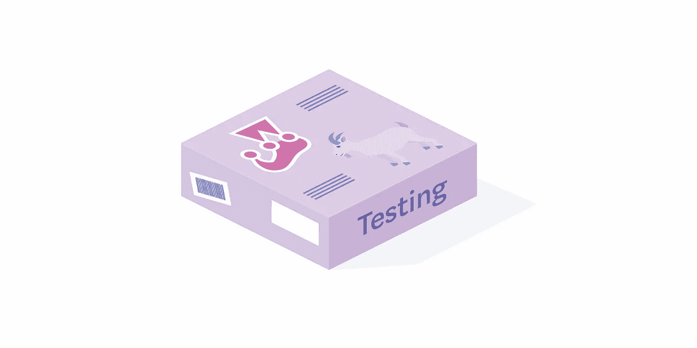

# 构建 React 组件库

> 原文：<https://betterprogramming.pub/building-a-react-components-library-6a05c2bca538>

## 第 2 部分—测试组件



笑话和反应测试库

这是本系列的第二部分。在[第一部分](https://medium.com/@tomasz.fiechowski/building-a-react-components-library-f5a390d5973d)中，我们构建了库的框架，设置了开发环境，并添加了第一个基本组件。没有测试就没有好的库，现在就来添加吧。

# 测试库

为了测试我们的组件，我们将使用 [Jest](https://jestjs.io/) 和 [React 测试库](https://github.com/testing-library/react-testing-library)。

让我们安装它们:

```
npm install --save-dev @testing-library/react jest
```

现在，将`"test": "jest"`脚本添加到`package.json`中，这样我们可以轻松地运行测试。

# 基本测试

编写一个简单的基本测试不需要任何配置。默认情况下，扩展名为`*.test.js`的文件被认为是测试套件。

让我们直接开始创建一个测试文件:

src/components/按钮. test.js

在这个简单的测试中，我们检查传递给`Button`的文本是否被呈现。

如果没有找到期望的文本，`getByText`函数将抛出一个错误，从而使测试用例失败。这种情况下我们不需要任何`expect`。

让我们第一次进行测试。

```
$ npm testPASS  src/components/Button.test.js
  Button
    ✓ should display text (23ms)Test Suites: 1 passed, 1 total
Tests:       1 passed, 1 total
Snapshots:   0 total
Time:        1.945s
Ran all test suites.
```

是的，测试通过了！

# 与组件交互

我们编写的第一个测试非常简单。现在让我们与组件进行一些交互！

让我们做一些测试驱动的开发，并在使`Button`真正可点击之前编写测试:

src/components/按钮. test.js

这里发生了什么？首先，我们创建了`onClickMock` Jest mock 函数，并将其作为`onClick` prop 传递给`Button`。我们稍后将检查它是否被真正调用。

与第一个测试相反，我们不能直接使用从`render`函数返回的`container`。[顾名思义，它只包含我们的组件](https://testing-library.com/docs/react-testing-library/api#container)。

我们从`container.firstChild`获得它，然后使用`fireEvent`来模拟组件上的点击。

最后，我们检查是否真正调用了`onClickMock`函数。如果是，这意味着我们的`Button`组件响应点击事件。

现在让我们检查测试的输出:

```
● Button › should handle click events expect(jest.fn()).toBeCalled() Expected mock function to have been called, but it was not called.
```

不出所料，测试现在失败了。

是时候修复`Button`并使其可点击了。系好安全带，前方极限编程。

让我们用一个疯狂的`onClick`处理程序来扩展我们的按钮:

src/components/Button.js

重新运行测试:

```
$ npm testPASS  src/components/Button.test.js
  Button
    ✓ should display text (25ms)
    ✓ should handle click events (9ms)Test Suites: 1 passed, 1 total
Tests:       2 passed, 2 total
Snapshots:   0 total
Time:        1.212s
Ran all test suites.
```

绿色！TDD 为了胜利！

# 测试样式规则

在某些情况下，我们可能希望检查给定的组件是否应用了正确的 CSS 规则。为了方便和易用，我们将安装暴露`toHaveStyleRule`助手[匹配器](https://jestjs.io/docs/en/using-matchers)的`jest-emotion`插件。

让我们用`npm install --save-dev jest-emotion`安装它并创建两个配置文件:

src/setupTests.js

这使得`toHaveStyleRule`在每次测试中都可以在全球范围内使用。

jest.config.js

第二个将 Jest 指向测试环境设置后需要运行的设置文件(基本上，当`expect`可用时)。

配置 Jest 后，让我们向按钮测试添加一个测试:

src/components/按钮. test.js

我们通过查找给定的文本并检查它的`text-transform` CSS 属性是否有合适的值来获取组件。

运行测试:

```
$ npm test          

 PASS  src/components/Button.test.js
  Button
    ✓ should display text (25ms)
    ✓ should handle click events (8ms)
    ✓ should make text uppercase (5ms)Test Suites: 1 passed, 1 total
Tests:       3 passed, 3 total
Snapshots:   0 total
Time:        2.045s
Ran all test suites.
```

完美！

# 摘要

我们将测试库添加到我们的项目中，并使用它们为`Button`组件编写几个测试。

我们检查了`Button`是否被正确渲染，以及它是否可点击。最后，我们添加了`toHaveStyleRule`助手来轻松检查 CSS 规则，并使用它来检查`Button`是否使文本大写。

干得好！这部分到此为止！

完整的代码可以在 [GitHub 资源库](https://github.com/tfiechowski/react-sample-components-library)中找到。您可以查看`part2`标签(`git checkout part2`)来查看本部分的完整示例。

# 下一个

在接下来的部分中，我们将把这个库发布到 [npm](https://www.npmjs.com/) 中，然后将文档的自动部署添加到 GitHub 页面中。

关于出版图书馆的部分可以在这里找到。