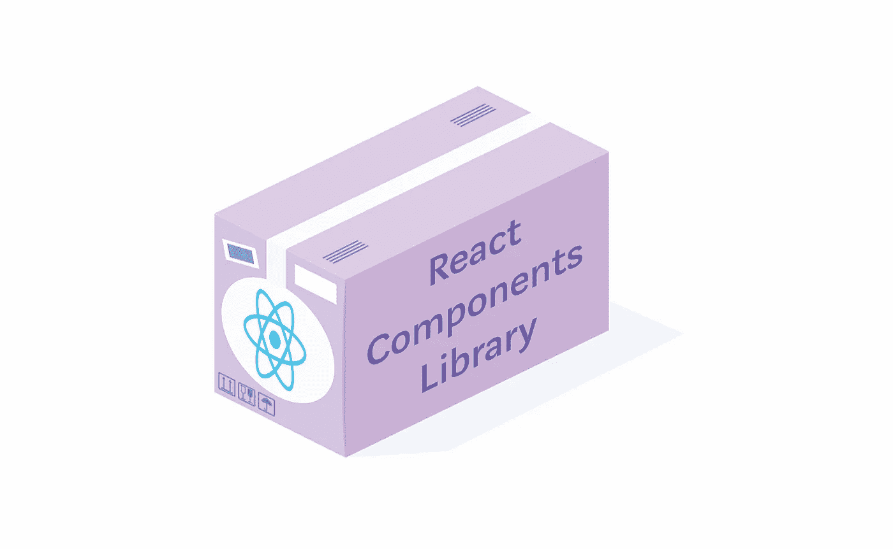
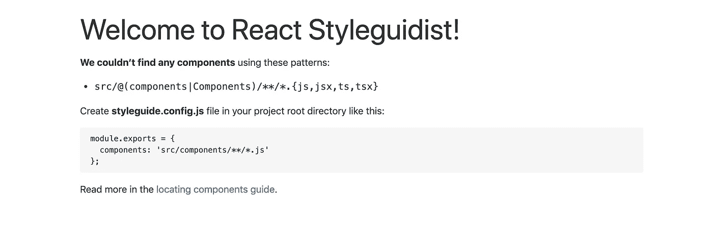
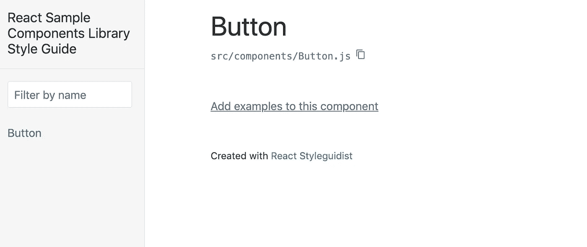
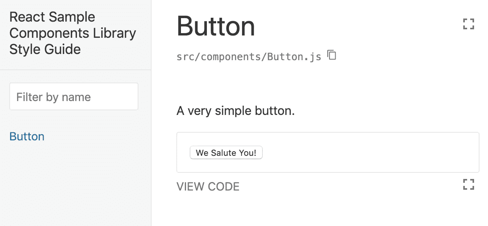
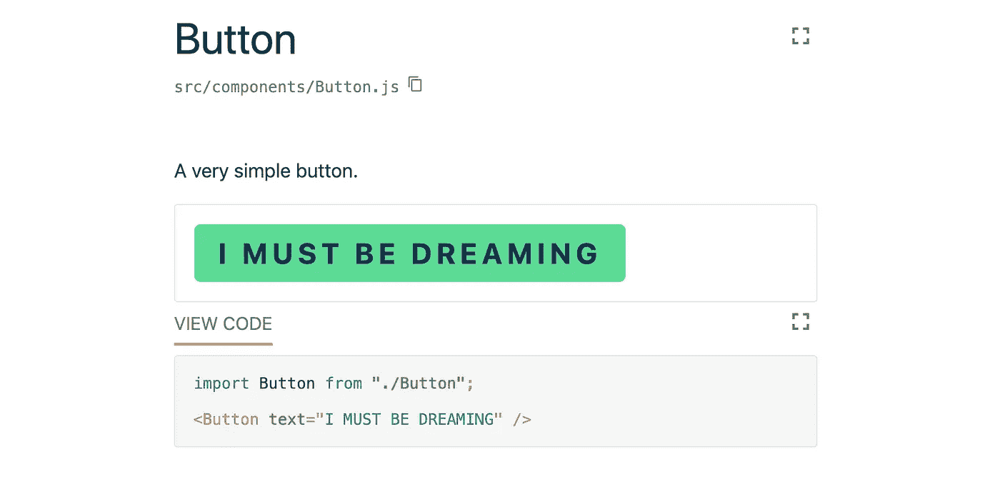

# 构建 React 组件库

> 原文：<https://betterprogramming.pub/building-a-react-components-library-f5a390d5973d>

## 第 1 部分—库本身和本地开发设置



分享是关怀。在软件中，共享也会导致…解耦！

*   你的代码库有没有被如此多的组件淹没，以至于它们基本上都在尖叫着要被提取出来？
*   你有一个很酷的 UI 库的想法，或者想要在多个项目中共享你的组件吗？
*   或者你只是想学习如何创建组件库并将它们发布到 [npm](https://www.npmjs.com/) ？

所有这些情况都包含在本教程中。这将是一个由四部分组成的系列，每一部分都涵盖了流程的不同部分。

# **教程部分**

*   第一部分----建立地方发展项目
*   [第二部分-测试](https://medium.com/better-programming/building-a-react-components-library-6a05c2bca538)
*   [第三部分——配置模块捆绑器并将我们库的第一个版本发布给 npm](https://medium.com/better-programming/lets-build-react-components-library-part-3-b2e7aec478a2)
*   第四部分-自动将配置项添加到部署文档中

注 **:** 敬请期待下一篇。他们一出来，列表就会更新相应的链接。

我们将从零开始，从最基本的东西开始建造它。这远比听起来容易！

# 技术栈

让我们看一下我们将在项目中使用的技术的完整列表:


*   React 用于创建组件，而 [Emotion](https://emotion.sh/docs/introduction) 用于设计它们
*   用于实时开发和生成文档
*   [Jest](https://jestjs.io/) 与 [React 测试库](https://github.com/testing-library/react-testing-library)进行测试
*   [Rollup](https://rollupjs.org/) 和 [Babel](https://babeljs.io/) 用于捆绑库以发布到 npm
*   [Travis CI](https://travis-ci.org/) 用于将文档自动部署到 GitHub 页面

# 准备项目

我们从最基本的开始，所以让我们设置一些基础来为项目创建一个框架。

## package.json

首先，为库创建一个目录。进入内部并初始化 npm 包:

```
mkdir react-sample-components-library
cd react-sample-components-library
npm init -y
```

耶，`npm init`。

我告诉过你我们是从零开始建造的！通过运行带有`-y`标志的`npm init`，无需回答所有那些无聊的设置问题就可以创建`package.json`。包名将默认为目录名。

## 核心依赖:反应和情感

我们将在我们的库中使用 React 和 Emotion，所以让我们安装并添加它们为`peerDependencies`。

为什么是`peer`？它告诉`npm/yarn`我们的依赖项的[兼容性，也帮助我们以后防止它们被捆绑到最终的包中。相信我，将整个`React`捆绑到你的库中是一个非常糟糕的主意。](https://docs.npmjs.com/files/package.json#peerdependencies)

让我们运行以下命令来安装核心依赖项:

`npm install --save-dev react react-dom @emotion/core @emotion/styled`

稍后，手动更新`peerDependencies`，替换库的版本以匹配[主版本](https://semver.org/)。我们的`package.json`现在应该是这样的:

package.json

## 使用 Styleguidist 进行实时开发

让我们添加 Styleguidist，因为我们将使用它进行组件的实时重新加载和预览开发:

`npm install --save-dev react-styleguidist webpack`

为了让 Styleguidist 工作，我们需要安装带有一些预置的 Babel，并为 Babel 和 Styleguidist 创建配置文件。

要安装所有 Babel 必需的软件包，请运行:

```
npm install --save-dev \
            babel-loader \
            @babel/core \
            @babel/preset-env \
            @babel/preset-react
```

现在，我们需要在项目的根目录下创建 Babel 配置文件`.babelrc`。让我们在那里添加已安装的预设:

。巴伯尔克

最后一步是设置 Styleguidist 的内部`webpack`实例，以使用我们的`Babel`配置来正确加载组件。

让我们用以下内容创建`styleguide.config.js`:

`styleguide.config.js`

我们现在已经准备好启动 live development 服务器了！

将`”start”: “styleguidist server”`脚本添加到您的`package.json`并运行`npm start`。

输入`[http://localhost:6060](http://localhost:6060/)`，您应该会看到类似这样的内容:



它在跑！但是等等，是空的…

# 创建组件

我们已经完全建立了项目和开发环境的框架，现在可以创建一些组件了。

组件的源代码将被放置在`src/components`目录中。非常简单。

让我们在项目中创建以下结构:

```
src/
└── components/
    └── Button.js
```

我们将从制作一个非常简单的按钮开始。

将以下代码复制到`src/components/Button.js`:

`src/components/Button.js`

再次输入`[http://localhost:6060](http://localhost:6060)`……*鼓声*……我们看到按钮已经找到了！



它还没有显示任何东西，但是 Styleguidist [使预览和描述组件](https://react-styleguidist.js.org/docs/documenting.html)变得很容易。

让我们在`Button.js`旁边添加`Button.md` markdown 文件，并在里面键入:

`src/components/Button.md`

我们可以在这里将 Markdown 与 JavaScript/React 代码混合使用，以便于展示示例和描述。

添加完`Button.md`后，让我们重启 Styleguidist `(npm start)`并刷新文档(仅在添加`.md`文件时需要，否则会热重新加载)，我们现在应该看到:



我们已经创建了我们的第一个组件，拥有一个带有实时预览的开发环境，同时还拥有可以导出的文档。

#组件-库-目标。

# 让我们添加一些风格

我们的按钮很普通，也很无聊。用纯 CSS 写不方便；让我们使用 Emotion 拥有一些 CSS-in-JS 功能来轻松编写样式。

*注意:如果要使用* [*组件选择器*](https://emotion.sh/docs/styled#targeting-another-emotion-component) *，需要安装一个* `*Babel*` *插件来处理* `*Emotion*` *样式的预处理。*

为此，运行`npm install --save-dev babel-plugin-emotion`并将插件添加到`.babelrc` : `“plugins”: [“emotion”]`。

现在让我们在按钮上撒一些 CSS:

`src/components/Button.js`

我叫巴顿，巴顿。



# 添加更多组件和实用程序

当库增长时，最好在组件之间共享公共部分。

让我们从`Button`组件中提取一些样式，放入一个单独的文件:`src/config/styles.js`。

为了创建可以跨组件共享的 CSS，我们将使用 Emotion 的`css`函数。

`src/config/styles.js`

我们现在可以将样式导入并添加到按钮中:

src/components/Button.js

我们改进了一件事，但现在另一件变坏了…

看到那个`from '../config/styles'`了吗？想象一下有更多层次的嵌套…

# 绝对进口

让我们把相对进口改为绝对进口。

`Babel`模块解析器插件再次拯救了我们。

让我们用`npm install babel-plugin-module-resolver`安装它，然后像这样把它添加到`.babelrc`的插件中:

。巴伯尔克

对我的朋友 FatFisz ( [@GitHub](https://github.com/fatfisz) )为那个插件贡献良多大声喊出来！

`root`选项告诉`Babel`在哪里寻找模块。

这就像指定一个额外的`node_modules`目录。现在，我们可以从`src`导入东西。`Button`中的丑`'../config/styles'`变成了:

src/组件/按钮。

同样，我们可以直接从其他组件导入组件。

例如，如果我们想在不同的组件中导入`Button`，我们会这样做(因为`components`目录是`src`的直接子目录):

```
import Button from 'components/Button';
```

# 摘要

我们已经从头开始创建了 React 组件库！

我们添加了 Styleguidist 来设置开发环境，并添加了 Babel 来适当地转换我们的 React 代码。然后我们创建了我们的第一个组件，用情感设计了它，并提取了一些共享的 CSS。

最后，我们通过启用绝对导入提高了代码的可读性。

我们做得很好！这部分到此为止。

完整的代码可以在 [GitHub 库](https://github.com/tfiechowski/react-sample-components-library)中找到。您可以查看`part1`标签(`git checkout part1`)来查看该零件的完整示例。

# 下一个

在下一篇文章中，我们将关注测试。