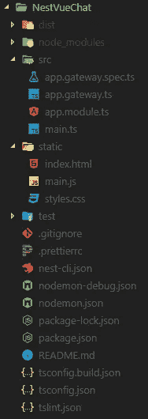
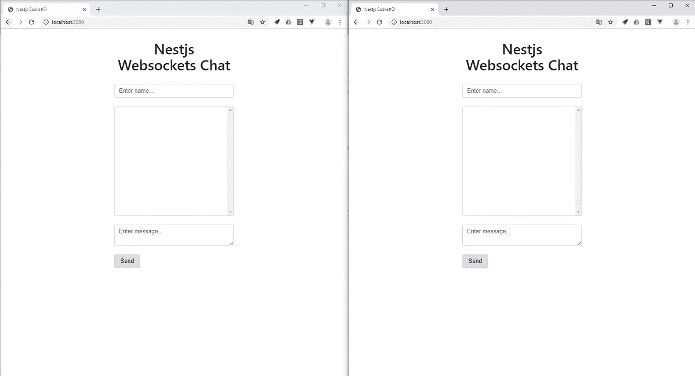
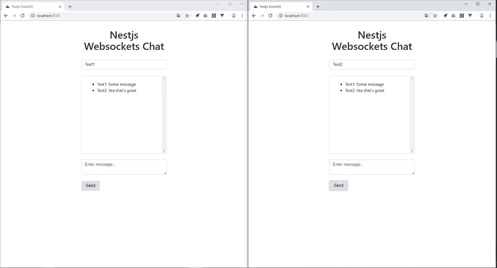

# 在 NestJS 中构建实时聊天

> 原文：<https://betterprogramming.pub/building-a-realtime-chat-in-nestjs-9c0b680be33f>

## 循序渐进的指南


由 [Fab Lentz](https://unsplash.com/@fossy?utm_source=medium&utm_medium=referral) 在 [Unsplash](https://unsplash.com?utm_source=medium&utm_medium=referral) 上拍摄的照片

[Websockets](https://en.wikipedia.org/wiki/WebSocket) 是一种通信协议，它在 web 浏览器和 web 服务器之间建立的单一 TCP 连接上提供全双工通信通道。这允许服务器发送到浏览器，而不被客户端调用。

今天，我们将通过在 [NestJS](https://nestjs.com/) 中构建一个聊天应用程序，来看看如何使用 Websockets 实现不同浏览器之间的实时通信。

所以事不宜迟，让我们开始吧。

# Websockets 简介

Websockets 是 web 应用程序中 HTTP 通信的替代方案。它们在客户机和服务器之间提供了一个持久的连接，双方可以随时使用这个连接开始发送数据。

这可以带来以下好处:

*   服务器可以向客户端发送消息，而无需客户端明确请求某些内容
*   低延迟通信
*   客户端和服务器可以同时相互通信

这就是 Websockets 在实时和长期通信方面优于 HTTP 的原因。

# 项目设置

在我们开始编码之前，让我们首先设置我们的项目并安装必要的依赖项。为此，您需要打开终端并运行以下命令。

首先，创建项目并移动到它的目录中。

```
nest new nestchat
cd nestchat
```

之后，我们只需要使用节点包管理器(npm)安装依赖项。

```
npm i --save @nestjs/websockets @nestjs/platform-socket.io
```

现在我们已经安装好了所有的东西，基本的项目设置也已经就绪，让我们创建将要使用的文件。

让我们从使用 NestJS CLI 创建模块、服务和控制器开始。

```
nest g gateway app
```

之后，您只需要在 src 目录中创建一个名为 static 的文件夹，其中包含三个文件:

*   index.html——为我们的聊天而设计
*   main.js —客户端 websockets 逻辑
*   styles.css —我们的 HTML 文件的样式

现在你的项目结构应该看起来像这样。



现在我们已经完成了初始设置，我们可以通过运行下一个命令来启动我们的服务器。

```
npm run start:dev
```

瞧，初始设置已经完成，现在让我们开始实现 Websockets 配置。

# Websockets 服务器

首先，让我们通过实现我们之前安装的 Websockets 工具来创建我们的 web sockets 服务器。这是一个非常简单的过程，只需要我们上面创建的 AppGateway。

```
*import* {
 SubscribeMessage,
 WebSocketGateway,
 OnGatewayInit,
 WebSocketServer,
 OnGatewayConnection,
 OnGatewayDisconnect,
} *from* '@nestjs/websockets';
*import* { Logger } *from* '@nestjs/common';
*import* { Socket, Server } *from* 'socket.io';@WebSocketGateway()
*export* class AppGateway implements OnGatewayInit, OnGatewayConnection, OnGatewayDisconnect { @WebSocketServer() server: Server;
 private logger: Logger = new Logger('AppGateway'); @SubscribeMessage('msgToServer')
 handleMessage(client: Socket, payload: string): void {
  *this*.server.emit('msgToClient', payload);
 } afterInit(server: Server) {
  *this*.logger.log('Init');
 } handleDisconnect(client: Socket) {
  *this*.logger.log(`Client disconnected: ${client.id}`);
 } handleConnection(client: Socket, ...args: any[]) {
  *this*.logger.log(`Client connected: ${client.id}`);
 }
}
```

这基本上是我们处理应用程序通信所需的全部内容，所以让我们来分解一下。

首先，您会注意到我们用`@WebsocketGateway()`声明符来修饰我们的类，它让我们可以访问 socket.io 功能。

我们还实现了三个接口`OnGatewayInit`、`OnGatewayConnection`和`OnGatewayDisconnect`、*、*，用于记录应用程序的一些关键状态。例如，当一个新的客户端连接到服务器或者当一个当前的客户端断开连接时，我们记录日志。

接下来，我们创建了一个名为 server 的成员变量，用`@WebsocketServer()`修饰，让我们可以访问 Websockets 服务器实例。

我们利用了`handleMessage()` 函数中的实例，其中我们使用`emit()`函数向连接到服务器的所有客户端发送数据。`handleMessage()`函数也用`@SubscribeMessage()`修饰，这使得它可以监听名为`msgToServer`的事件。

在我们进入项目的客户端之前，我们只需要将网关添加到模块的提供者中。

```
*import* { Module } *from* '@nestjs/common';
*import* { AppGateway } *from* './app.gateway';@Module({
 imports: [],
 controllers: [],
 providers: [AppGateway],
})
*export* class AppModule {}
```

# Websockets 客户端

服务器完成后，现在让我们继续这个项目的客户端。为此，我们将在我们的 NestJS 项目中直接使用静态资产。为了使布局和状态保存更容易处理，我们还将使用 [Vue.js](https://vuejs.org/) 。

首先，我们需要通过向我们的`main.js`文件添加几行代码来告诉我们的 NestJS 应用程序我们想要使用静态资产。

```
*import* { NestFactory } *from* '@nestjs/core';
*import* { AppModule } *from* './app.module';
*import* { NestExpressApplication } *from* '@nestjs/platform-express';
*import* { join } *from* 'path';async function bootstrap() {
 const app = *await* NestFactory.create<NestExpressApplication>(AppModule);
 app.useStaticAssets(join(__dirname, '..', 'static'));
 *await* app.listen(3000);
}
bootstrap();
```

在这里，我们告诉 express 静态目录将用于存储我们的静态资产，我们只能通过导入和使用 NestExpressApplication 来实现。

接下来，我们将在我们的`main.js`文件中创建客户端 javascript 代码，稍后我们将在布局中使用它。

```
const app = new Vue({
 el: '#app',
 data: {
  title: 'Nestjs Websockets Chat',
  name: '',
  text: '',
  messages: [],
  socket: null
 },
 methods: {
  sendMessage() {
   *if*(*this*.validateInput()) {
    const message = {
    name: *this*.name,
    text: *this*.text
   }
   *this*.socket.emit('msgToServer', message)
   *this*.text = ''
  }
 },
 receivedMessage(message) {
  *this*.messages.push(message)
 },
 validateInput() {
  *return* *this*.name.length > 0 && *this*.text.length > 0
 }
},
 created() {
  *this*.socket = io('http://localhost:3000')
  *this*.socket.on('msgToClient', (message) => {
   *this*.receivedMessage(message)
  })
 }
})
```

在这里，我们创建一个新的 Vue.js 实例，并创建一些基本变量，我们稍后将在我们的布局中使用。

接下来，您可以看到`created()` 函数，每当创建前端时都会执行该函数。在这个方法中，我们使用 [socket.io](https://socket.io/) 库实例化我们的 socket 变量，稍后我们将把这个库导入到我们的前端。我们还在我们的套接字上添加了一个事件监听器，它监听我们之前在服务器中创建的`msgToClient`事件。

接下来，我们有了`sendMessage()`函数，它从我们的布局中获取输入，如果输入是正确的，就使用相同的事件将它发送到我们的服务器。

这就是我们的客户端——现在我们只需要为我们的应用程序创建布局。

# 应用程序布局

为了创建布局，我们只需要在应用程序中添加一些简单的 HTML 和 CSS。

这里，我们使用脚本标签导入 socket.io 和 vue.js 依赖项，然后创建一个简单的布局，包含两个输入字段、一个消息区域和一个发送消息的按钮。

您还可以注意到，我们导入了上面使用的 main.js 文件和一个我们现在将创建的自定义样式表。

```
*#messages*{
 height:300px;
 overflow-y: scroll;
}*#app* {
 margin-top: 2rem;
}
```

# 测试应用程序

现在我们已经完成了我们的聊天应用程序，是时候通过在两个或更多的浏览器标签中打开它并相互聊天来测试它了。为此，让我们启动应用程序并在浏览器中打开它。

```
npm run start
```

启动之后，我们应该可以在 http://localhost:3000 上看到我们的布局。



然后你只需要输入名字和信息，然后点击发送。发送后，消息应该出现在第二个窗口中，看起来应该像这样。



就是这样！我们已经使用 Websockets 完成了我们的 NestJS 聊天应用程序。该项目的完整代码也可以在我的 Github 上找到。

[](https://github.com/TannerGabriel/Blog/tree/master/NestVueChat) [## TannerGabriel/博客

### 一个渐进式 Node.js 框架，用于构建高效且可伸缩的服务器端应用程序，其灵感主要来自…

github.com](https://github.com/TannerGabriel/Blog/tree/master/NestVueChat) 

## 推荐阅读

[](https://medium.com/better-programming/building-a-graphql-server-in-nestjs-f9ba34e773a3) [## 在 NestJS 中构建 GraphQL 服务器

### GraphQL 基础和 NestJS 开发的最佳实践

medium.com](https://medium.com/better-programming/building-a-graphql-server-in-nestjs-f9ba34e773a3) 

# 结论

你一直坚持到最后！我希望这篇文章能帮助你理解 Websockets 的基础知识以及如何在 NestJS 中使用它们。

如果您发现这很有用，请考虑推荐并与其他开发人员分享。如果您有任何问题或反馈，请在下面的评论中告诉我！