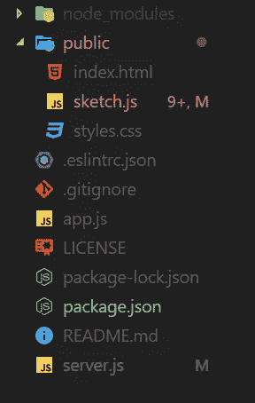

# 使用 Socket 构建实时绘图应用程序。IO 和 p5.js

> 原文：<https://betterprogramming.pub/building-a-realtime-drawing-app-using-socket-io-and-p5-js-86f979285b12>

## 构建一个实时绘图应用程序，使用户能够在一个项目上一起绘图


由[凯利·通盖](https://unsplash.com/@kellitungay?utm_source=medium&utm_medium=referral)在 [Unsplash](https://unsplash.com?utm_source=medium&utm_medium=referral) 上拍摄的照片

在本教程中，我们将构建一个实时绘图应用程序，使用户能够在一个项目中一起绘图。

该应用程序是使用一个 [Express js](https://expressjs.com/) 服务器和 [p5.js](https://p5js.org/) 构建的，用于绘图功能。客户端通信通过 WebSockets 处理，即[套接字。IO](https://socket.io/) 。

所以，不要再浪费时间了，让我们开始吧。

# 设置

在我们开始编码之前，我们首先需要设置我们的项目并安装所有需要的依赖项。为此，您需要打开终端并运行以下命令。

首先，我们需要创建一个目录并放入 cd。

```
mkdir drawingapp
cd drawingapp
```

之后，我们可以开始安装依赖项并创建所需的文件。

```
npm init
```

[Npm](https://www.npmjs.com/) 会问你一些问题——回答它们，然后继续阅读指南。

```
npm install express p5 socket.io --save
```

现在，您需要创建项目所需的文件夹结构和文件。这是我的文件夹结构的图像。



你也可以在 [my Github](https://github.com/TannerGabriel/DrawingApp) 上找到这个结构。

[](https://github.com/TannerGabriel/DrawingApp) [## TannerGabriel/绘图 App

### 使用 SocketIO 和 p5.js 的实时绘图应用程序。通过创建一个…

github.com](https://github.com/TannerGabriel/DrawingApp) 

瞧，初始设置已经完成，所以我们可以开始创建布局，并实现绘图功能。

# 应用程序布局

现在我们已经建立了项目，让我们开始在我们的`index.html`文件中创建布局。

这里，我们只创建一个带有两个输入字段的基本 HTML 文件。我们稍后将使用这些来改变我们的笔画的颜色和宽度。

让我们在应用程序中添加一些基本的 CSS 样式，使导入字段和按钮看起来更好。

之后，我们可以开始使用 p5.js 库实现我们的绘图功能。

# 绘图功能

P5.js 是一个 JavaScript 处理库，目标是让艺术家和设计师能够访问编码。

它提供了全套的绘图功能，甚至还有自己的 dom(文档对象模型)。在本教程中，我们将使用它来创建和管理我们的绘图画布，以及添加事件侦听器到我们上面添加的两个按钮。

## 添加画布

首先，您需要在您的公共文件夹中创建一个`sketch.js`文件，如果您还没有这样做的话。然后我们可以从实现基本的 p5 `setup()`函数开始。

之后，我们可以开始创建一个绘图画布，并将其放置在我们的页面上。

## 实施绘图

现在，我们继续实现`mouseDragged()`功能，这样我们就可以在用户点击画布时进行绘制。

在这里，我们设置笔画的颜色和宽度，然后使用通过 p5 库获得的坐标画一条线。

## 添加按钮监听器

我们只需要使用 p5.js dom 从输入字段中获取颜色和笔画宽度。为此，我们需要向我们的两个按钮添加一个 *onclick 监听器*，然后从字段中获取输入。

我们首先在脚本上创建两个变量来保存颜色和笔画宽度，并给它们分配一个默认值。

我们使用 p5.js dom 提供的`select()`函数获得按钮和输入。

之后，我们在按钮上添加了一个`mousePressed`监听器，每当按钮被点击时就会被执行。然后，我们验证当前的输入值，如果有效，就将其保存到变量中。

# Sketch.js 的完整源代码

这是我们到目前为止写的完整源代码。

# 添加服务器端

现在让我们看看如何使用 Express js 在浏览器中运行我们的绘图应用程序。

首先，我们需要创建一个基本的 express 服务器，并在我们 PC 的一个端口上监听它。我们将在我们的`server.js`文件中这样做。

现在，我们只需要告诉我们的应用程序使用位于公共文件夹中的资源。

之后，我们可以通过在命令行中运行`node server`命令来测试我们的应用程序。

运行它之后，当您在浏览器中访问 [http://localhost:3000/](http://localhost:3000/) 时，您应该会在屏幕中间看到一个黑色的绘图画布，并且您应该能够在上面绘图。

# Server.js 的完整源代码

# 插座。超正析象管(Image Orthicon)

现在我们已经完成了绘图功能和服务器的构建，让我们来看看如何使用 Socket。IO，实现用户之间的实时通信。

## 插座。IO 设置:

首先，让我们看看如何在我们的项目中设置 Socket IO，以及如何监听我们自己的事件。

为此，我们需要导入 Socket。IO，并将服务器变量传递给它。

之后，我们需要向我们的套接字添加一些侦听器，这样我们就可以对发送数据之类的事件做出反应。

注意，鼠标事件是一个自定义事件，我们稍后将在我们的`sketch.js`文件中创建它。`Socket.broadcast.emit`用于向当前在线的所有套接字发送数据，发送数据的套接字除外。

## 使用插座。sketch.js 中的 IO

接下来，我们需要创建 Socket.IO 的客户端实现。

为此，我们需要创建一个套接字变量来保存我们的套接字。IO 客户端。

然后，我们通过调用 IO 对象上的`connect()`函数来初始化一个套接字，并向其传递网站运行的 URL(在本例中为 localhost:3000)。

我们现在可以开始将我们的数据发送到当前在线的所有其他套接字，通过使用`emit()` 函数获取并发送我们的绘图数据。

Emit 采用它应该发送到的事件的参数 ID。在我们的例子中`mouse`是我们在 `server.js`文件中定义的)和我们想要发送的数据。

现在，我们只需要在绘制`mousDragged()`函数时调用该函数。

之后，我们只需要获取数据，这些数据是由其他套接字发送的。我们可以通过监听我们的`mouse`事件来做到这一点，每当套接字发送数据时都会调用该事件。然后我们只需要用收到的数据画线。

就是这样！现在，您只需要通过在多个窗口中打开应用程序并在其中绘图来测试它。

# 完全码

## Sketch.js:

## Server.js:

整个项目也可以在我的 Github 上找到:

[](https://github.com/TannerGabriel/DrawingApp) [## TannerGabriel/绘图 App

### 使用 SocketIO 和 p5.js 的实时绘图应用程序。通过创建一个…

github.com](https://github.com/TannerGabriel/DrawingApp) 

# 结论

我希望这篇文章能帮助您理解 SocketIO 的基础知识，以及如何在您的项目中使用它。

如果你有任何问题或反馈，请在下面的评论中告诉我。