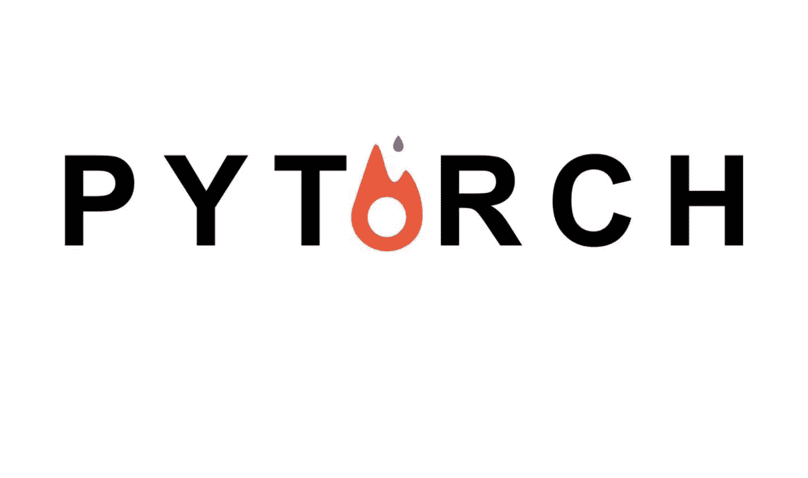
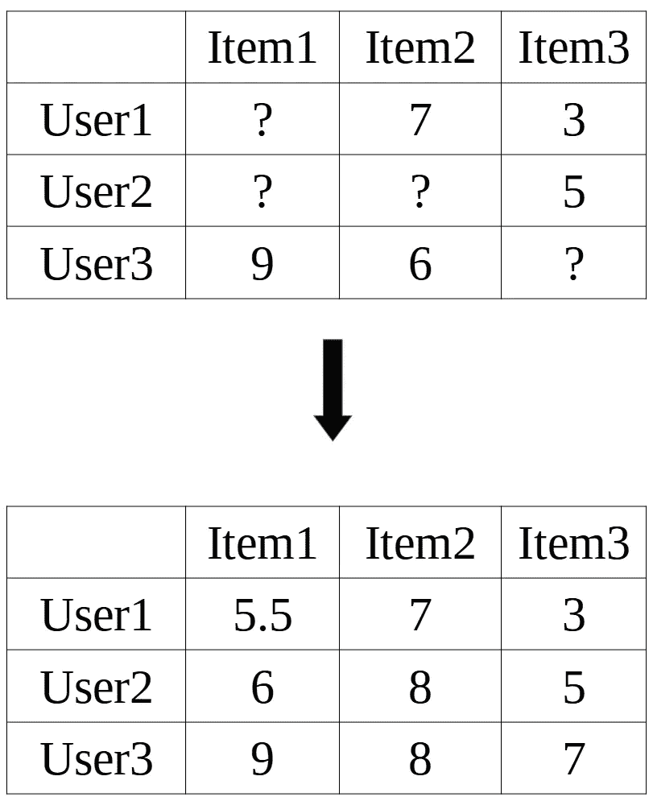
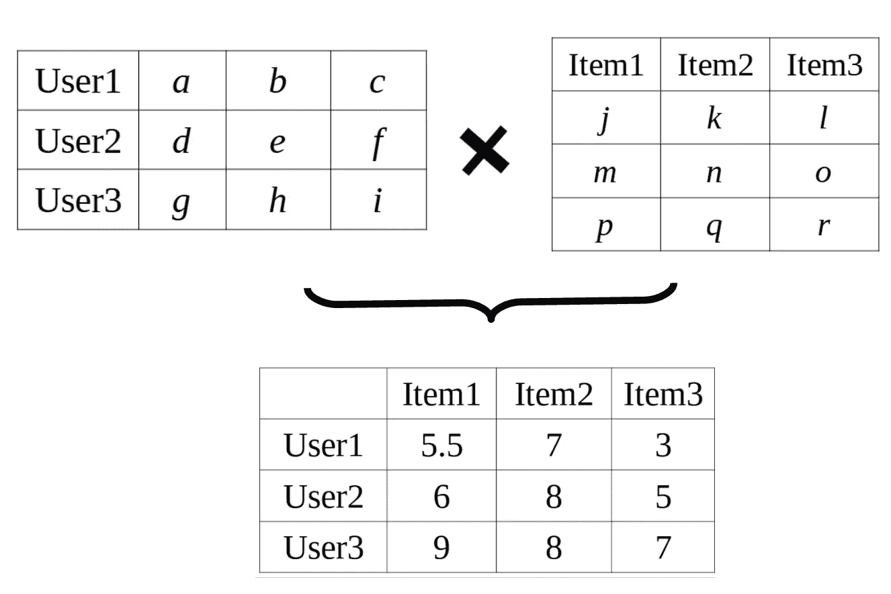
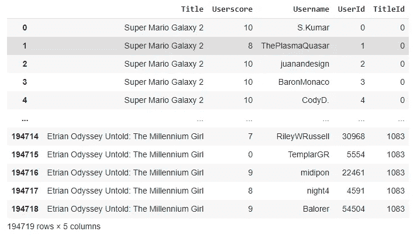
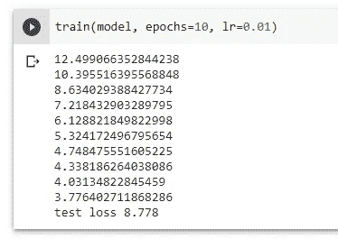

# 用 PyTorch 构建推荐引擎

> 原文：<https://betterprogramming.pub/building-a-recommendation-engine-with-pytorch-d64be4856fe7>

## 理解推荐引擎的内部



照片来自 [Pytorch](https://pytorch.org) 。

# 为什么是推荐引擎？

作为一个对 ML(机器学习)几乎一无所知的开发人员，我发现构建一个推荐引擎是 ML 入门最容易的项目之一。对于没有机器学习背景的初学者来说，这很实用，也不难理解。

# 入门指南

在开始实际实现之前，我将简要回顾一些概念，您可能会发现这些概念有助于构建推荐引擎。

在向用户推荐商品时，推荐引擎基本上可以使用三种算法:

## 1.人口统计过滤

这种类型的筛选基于具有相似人口统计的用户来查看项目的一般趋势和受欢迎程度。这意味着具有相似人口统计的用户被推荐相同的项目，并且个性化推荐非常有限。

## 2.基于内容的过滤

这种类型的过滤的基本算法基于项目的元数据来查看项目的相似性。例如，对于游戏，元数据可以是平台、类型和发行商之类的东西。因此，如果用户喜欢由 Valve 发布的 PC 动作 RPG 游戏，那么他们很可能会喜欢具有类似元数据的另一个游戏(即，由 Valve 发布并且是动作 RPG PC 游戏的游戏)。这意味着现在涉及到个性化推荐，因为用户喜欢的游戏被用来确定用户可能也喜欢的游戏。

## 3.协同过滤

最后一种过滤可以分为两种类型。

*   基于用户:将用户与基于其他用户的项目相匹配。具体来说，算法确定与该用户相似的其他用户。这意味着给定一个用户和与该用户相似的另一个用户，将该另一个用户喜欢的推荐给该用户。
*   基于项目:根据项目与用户已评级项目的相似性，将用户与项目匹配。这意味着如果用户喜欢项目 X，并且项目 X 被发现与项目 Y 高度相似，那么项目 Y 将被推荐给用户。

最佳类型的推荐引擎显然会集成所有这三种类型，但在本教程中，我们将专注于最后一种类型(协同过滤),因为它无疑是最强的类型。

# 矩阵分解

我们将看到的一类协作过滤算法叫做矩阵分解。矩阵分解的最终目标基本上是建立一个用户和项目的矩阵，其中填充了已知和预测的评级。



作者照片。

从只有已知评级的原始矩阵开始，我们想要确定将产生原始矩阵的两个因素矩阵。这两个矩阵将依次表示用户、项目以及它们之间关系的信息。一个是定量表示用户的矩阵(用户矩阵)，其中矩阵的每一行是表示单个用户的大小为 *k* 的向量，另一个是项目矩阵，其中每一列是表示单个项目的大小为 *k* 的向量。



作者照片。

*k* 称为嵌入大小，是在矩阵分解模型中调整的超参数。较大的嵌入大小将允许模型捕捉更复杂的关系和信息，但是它可能导致过度拟合。

# PyTorch 中的矩阵分解模型

采用矩阵分解的思想，让我们在 [PyTorch](https://pytorch.org/) 中实现它。

首先，让我们导入一些必要的模块:

```
import torch
import torch.nn as nn
import torch.nn.functional as F
from sklearn.model_selection import train_test_split
```

接下来，让我们构建我们的`Matrix Factorization Model`类:

要实例化我们的模型，我们可以像这样简单地调用它:

```
model = MF(num_users, num_items, emb_size=100)
```

其中`num_users`代表唯一用户的数量，`num_items`代表数据集中唯一项目的数量。

为了便于说明，这里有一个我正在使用的样本数据集:



作者截图。

这里的项目是我们想推荐给用户的游戏。

一旦模型被实例化，我们就可以继续分割数据集来训练和测试我们的模型。一般分成是 20%测试，80%培训。

```
train_df, valid_df = train_test_split(dataset, test_size=0.2)# resetting indices to avoid indexing errors
train_df = train_df.reset_index(drop=True)
test_df = valid_df.reset_index(drop=True)
```

现在，我们要创建训练函数来训练模型:

在每次迭代中，训练函数基本上更新我们的模型，以接近更小的 MSE(均方误差)。这就是梯度下降的思想。最后，我们的测试函数，将在训练完成后立即调用:

我们可以看到，尽管我们的模型在训练数据集中的最低 MSE 约为 3.776，但基于我们的测试数据集的实际 MSE 约为 8.778。一般来说，这是一个正常的结果，但训练和测试 MSE 之间的巨大差异可能表明我们的模型过度拟合。



作者照片。

# 模型预测法

现在，我们准备使用我们的模型进行预测！例如，为了预测`userId 10`用户的游戏评分，我们可以运行下面几行:

```
user = torch.tensor([10])
games = torch.tensor(game_ratings['TitleId'].unique().tolist())
predictions = model(user, games).tolist()
print(predictions)
```

请注意，一些预测超过了`10`。要解决这个问题，我们可以像这样简单地标准化我们的结果:

```
normalized_predictions = [i/max(predictions)*10 for i in predictions]
print(normalized_predictions)
```

最后，我们可以通过对我们的预测列表进行排序来推荐一些游戏:

```
sortedIndices = predictions.argsort()
recommendations = dataset['Title'].unique()[sortedIndices][:30]  # taking top 30
print(recommendations)
```

显然，仍然有进一步改进这个模型的方法，但是我现在就把它留在这里。感谢阅读！

另外，请查看 [Gameo](https://steffy-lo.github.io/Gameo/) ，这是一个使用这种算法和框架为今年的脸书开发者圈社区挑战赛而构建的项目！