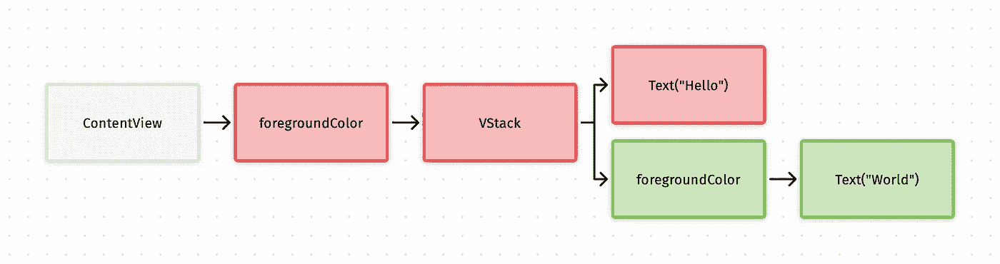
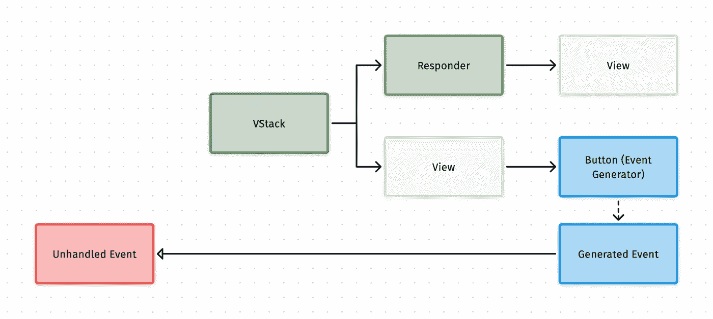

# 使用 SwiftUI 视图层次结构构建响应者链

> 原文：<https://betterprogramming.pub/building-a-responder-chain-using-the-swiftui-view-hierarchy-2a08df23689c>

## 利用环境价值轻松响应视图层次结构中生成的事件

照片由 [Mael BALLAND](https://unsplash.com/@mael_balland?utm_source=medium&utm_medium=referral) 在 [Unsplash](https://unsplash.com?utm_source=medium&utm_medium=referral) 上拍摄

在过去的 10 年里，我花了很多时间在 StackOverflow 中回答问题，我经常看到的一个问题是:

> 我如何从类`B`中的函数触发类`A`中的事件？

对于一个经验丰富的开发人员来说，这似乎是一个简单的问题，毕竟我们有多种方法可以做到这一点，我们可以使用委托、回调、通知等。，但这仍然是我们经常遇到的情况，两个对象相距越远，它们之间的通信就越复杂。

挑战的一部分是以可扩展和可维护的方式实现这一点。你*可以*创建一个应用程序，通过`NotificationCenter`发送每一个事件，但是你很快就会把头撞到桌子上。

# 输入响应者链

响应者链是一种设计模式，其中响应者对象形成一个“链”。事件在链的“链接”或“节点”之一中生成，节点确定它是否能够处理事件。如果它不能处理该事件，则该事件被发送到链中的下一个节点。这个过程一直持续到一个节点可以处理该事件，或者到达链的末端。

`object-delegate`关系是这种模式的一个简单例子。`object`创建了一个它自己不能处理的事件，因此该事件被发送到链中的下一个节点，也就是`delegate`。更复杂的例子是`UIResponder`链。

显式响应器链在 iOS 开发中并不常见，可能是因为大多数`UIKit`的核心构建块，如`UIViewController`及其子类，使得构建起来非常容易。

然而，使用 SwiftUI，每个对象都通过视图层次结构*链接*到根视图，这意味着我们构建响应者链所需的整体结构已经就绪，我们需要添加的只是响应者和事件。

# SwiftUI 视图层次结构

SwiftUI 视图层次结构的一个有趣的特性是，它的一些值，比如`Environment`和`EnvironmentObjects`，会沿着层次结构向下传递，直到它们被替换。我们可以用这个，尤其是`Environment`，来记录我们的响应者。

为了让事情更加直观，这是从这个简单的视图中生成的层次结构。注意像`foregroundColor`这样的修改器是如何创建一个节点的，这个节点是它们正在修改的视图的父节点。

# SwiftUI 环境

环境值起初看起来令人生畏，因为它们经常被用于系统动作，比如删除一个表，添加我们自己的需要扩展一个系统类型，`EnvironmentValues`。尽管这样做非常安全，而且因为它们可以是任何类型，所以它们的`Type`可以是一个闭包。

因为我们对事件需要的对象类型没有任何限制，所以我们将使用任意类型的对象。

有了这个值，任何视图都可以读取我们的自定义环境值，并为它设置一个新值。由于我们添加的值是一个闭包，所以我们的视图也可以称之为闭包。

# 创建响应者

前面我们提到过，响应者有责任确定它是否能够处理一个事件。我们的视图将通过在环境中注册自己的`eventClosure`来注册自己为响应者。

任何调用`eventClosure`的子视图都将触发我们视图的处理程序，只要中间视图没有替换它。如果我们的视图确定它不能处理该事件，它可以使用它从环境中读取的闭包，这将来自一个父响应器，以允许该事件继续通过该链。

两名注册响应者。黄色**不能**处理事件，因此事件继续其路径并到达绿色，绿色**可以**处理它。

由于这将是一个常见的模式，我们将创建一个`ViewModifier`来封装这个功能。

我们新的`handler`闭包有一个返回类型`Any?`，因为这是我们决定事件是否被处理的方式。如果返回值是`nil`，事件将被视为已处理，如果返回值是其他任何值，该值将被发送到链上。

视图现在可以通过调用我们的修饰符并传递一个处理程序闭包来将自己注册为响应者。

# 发送事件

触发事件要简单得多，我们所需要做的就是从环境中读取`eventClosure`并用任何值调用它。

一个简单但完整的示例如下所示:

一个重要的细节是，对于能够接收事件的响应者，事件的源必须是响应者的直接后代。

实际上，这意味着我们的响应者通常会在每个特性或屏幕的根节点注册。

# 可扩展和可维护

在 SwiftUI 中，从子视图触发事件的一种更常见的方式是将闭包作为参数传递，就像使用`Button`一样。当负责调用闭包的视图在视图层次结构中变得更深时，这个闭包必须由多个中间视图*携带*。

我们的方法更具有**可维护性**，因为只有响应者和触发器视图需要知道事件。这意味着我们的层次结构可以被修改，而不必通过多个层次“携带”这个闭包。

得益于此，我们的方法也是**可扩展的**，创建一个事件就像定义一个新类型一样简单。不需要为每个事件添加新的环境值。

# 创建一个框架

按照这个模式，我创建了框架 [HierarchyResponder](https://github.com/EmilioPelaez/HierarchyResponder) ，用于处理事件和错误。

该框架采用了这一概念，并通过添加特定的修饰符来接收、处理或转换事件或错误，以及捕捉错误，从而扩展了这一概念。

1.  通过接收事件或错误，您可以决定是否处理该事件。
2.  处理事件或错误意味着它将被消费，没有其他选择。
3.  转换修饰符允许您用不同的值替换接收到的事件或错误。

另一个特性是每个修改器都有一个带有`Type`参数的通用版本，它会自动过滤任何与你提供的类型不匹配的值。