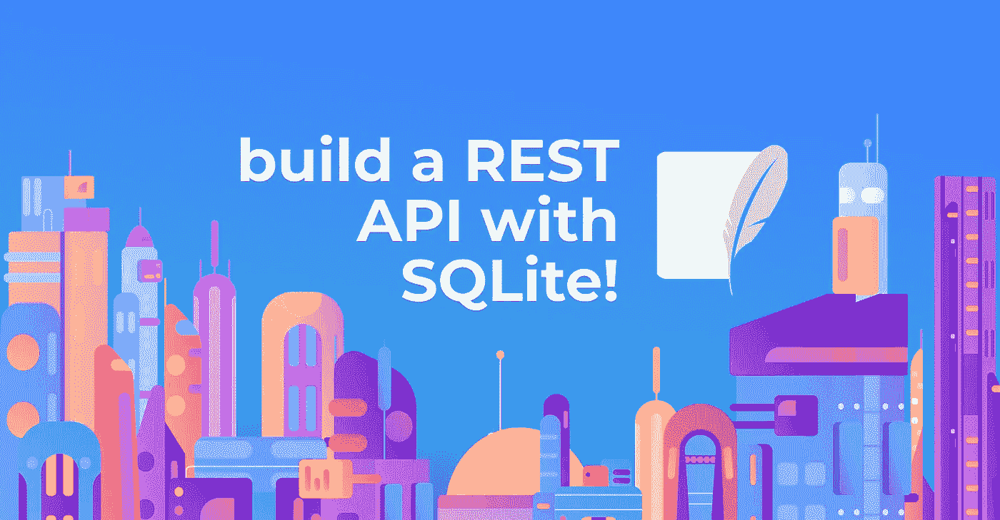
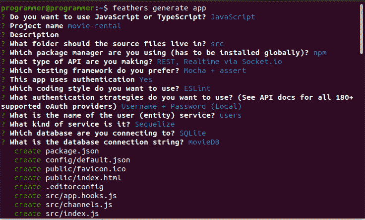
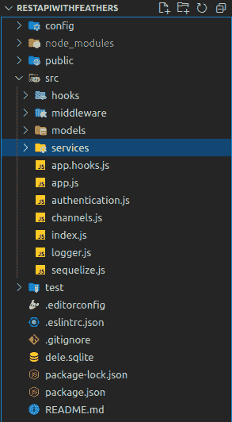
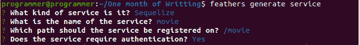
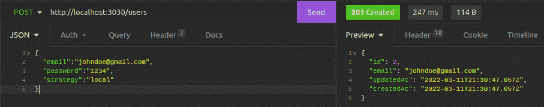
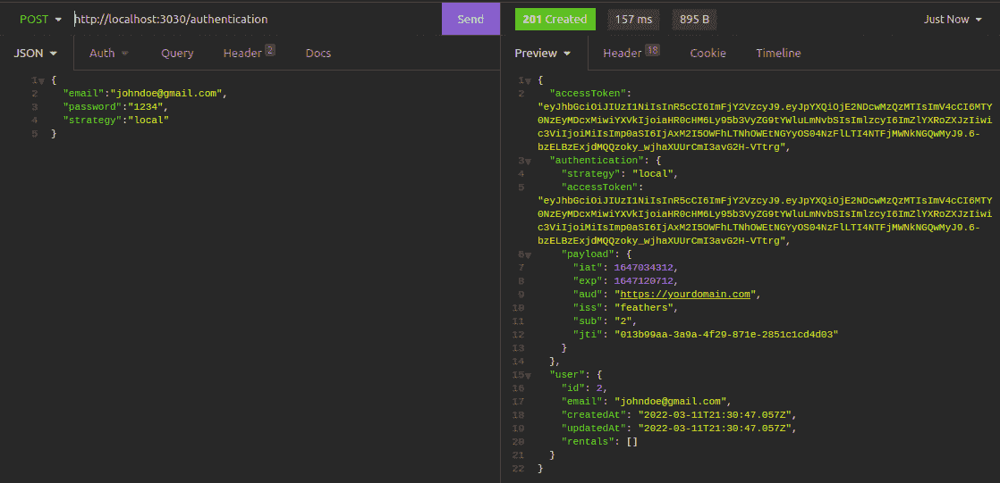
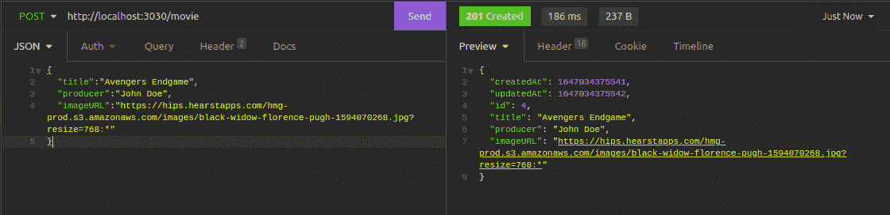
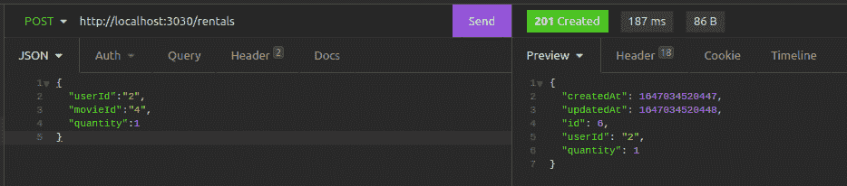
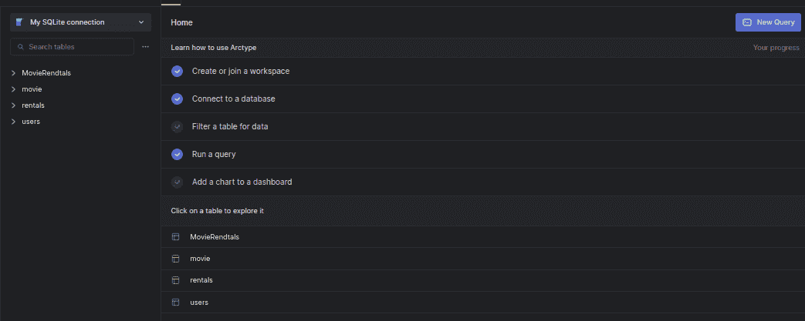

# 用 Feathers.js 和 SQLite 构建 REST API

> 原文：<https://betterprogramming.pub/building-a-rest-api-with-feathers-js-and-sqlite-603ec4c15ba5>

## 使用轻量级 web 框架用 JavaScript 或 TypeScript 开发实时应用程序和 REST APIs



作者图片

正在寻找一种方法来构建具有身份验证、数据库设置和授权等功能的 web 应用程序，而无需编写大量代码和配置？曾经想要在几天内创建一个生产就绪的应用程序吗？

信不信由你，这是可能的！本教程将向您展示如何使用 Feathers.js 在几分钟内创建一个 REST API。我们将了解 Feathers.js，实现一个示例 API，并分享一些想法和注意事项。我们开始吧。

# 什么是 Feathers.js

[Feathers](https://feathersjs.com/) 是一个轻量级的 web 框架，用于用 JavaScript 或 TypeScript 开发实时应用和 REST APIs。

Feathers 可以与任何后端技术交互，支持十几个数据库，并且可以与任何前端技术协同工作，比如 React、VueJS、Angular 和 React Native。

Feathers.js 以其易用性、交付速度和丰富的文档而闻名。使用 Feathers，您只需运行一个简单的命令就可以添加一个特性。

# 先决条件

本教程是一个实践演示。首先，我假设您具备以下条件:

*   [Node.js](https://nodejs.org/en/) 安装完毕
*   [弧形](https://arctype.com/)安装完毕
*   [失眠](https://insomnia.rest/download)装
*   之前了解 Node.js 和 Express.js

# 我们将会建造什么

您将创建一个电影租赁应用程序来演示 Feathers.js 和 Arctype 数据库可视化工具的功能。管理员将在这个程序中生成电影，经过认证的用户将能够租赁它们。您将学习使用 Sequelize 关联 Feathers.js 中的表，限制对特定路径的访问，以及将数据库链接到 Arctype。

# 入门指南

首先，打开命令行界面，使用下面的命令创建本教程的文件夹:

```
npm install @feathersjs/feathers --save
```

等待安装完成，并使用以下命令确认安装:

```
feathers -V
```

如果安装一切顺利，您会在控制台上看到打印出来的版本号。

# 创建应用程序

在您的计算机上安装了 Feathers 后，使用以下命令为该应用程序创建一个文件夹:

```
Mkdir RestWithFeathers && RestWithFeathers
```

然后，使用下面的命令生成一个新的 API 应用程序:

```
feathers generate app
```

上述命令将提示您为您的应用程序选择配置。对于本教程中的演示，您的选择应该类似于如下所示的屏幕截图:



在上面的截图中，我们做了以下选择:

*   选择 JavaScript 作为首选编程语言
*   指定应用程序的名称(`movie-rental`)
*   选定`src`项目样板文件的位置
*   选择`npm`作为包管理器
*   启用用户验证
*   选择 Eslint 来分析我们的代码
*   选择用户名和密码验证策略。
*   选择`user`作为我们实体的名称
*   选择 Sequelize 作为应用程序的 ORM
*   选择 SQLite 作为我们的数据库
*   指定`movieDB`作为我们的数据库名称

一旦选择完成，该命令将生成一个类似 express 的项目结构。现在让我们看看通过运行上面的命令生成的文件夹结构。



对于本教程，我们将立即查看以下内容:

*   `config`:包含应用程序的配置文件
*   `node_modules`:存储运行应用程序所需的已安装软件包列表的文件夹。
*   `public`:包含可以提供给客户端的静态文件。
*   `src`:包含 Feathers.js 应用程序的服务器代码
*   `src/hooks`:包含应用定制钩子。
*   `src/middleware`:包含快递中间件
*   `src/service`:包含我们的应用服务
*   `src/index.js`:运行应用程序的入口文件
*   `src/app.js`:配置我们的 Feathers 应用程序
*   `src/app.hook.js`:包含适用于每个服务的挂钩
*   `src/channels.js`:设置 Featherjs 事件通道
*   `test`:包含应用程序的测试

现在用下面的命令在开发模式下运行服务器:

```
npm run dev
```

运行开发中的服务器会激活热重装和控制台错误记录。此时，服务器应该在端口`3030` **、**上运行，并且应该在项目的根目录中创建一个`moviedb.sqlite`文件。

# 创建服务

服务是实现某些方法的类的对象或实例。服务为与任何数据的交互提供了一致的、独立于协议的接口。在 Feathers 中，你只需要运行一个命令，所有的东西都为你建立了一个服务。使用下面的命令创建一个`movie`服务:

```
feathers generate service
```

上面的命令将提示您为您的服务选择配置。您的选择应该类似于如下所示的屏幕截图:



这里，您为您的`movie`表选择了 ORM、服务名、路由 URL，并在电影路由上启用了身份验证。一旦这些选择完成，该命令将在下面的`src/service` 文件夹中生成一个文件夹结构。

📦电影
┣📜`movie.class.js`
┣📜`movie.hooks.js`
┗📜`movie.service.js`

在您的`movie.hook`文件中，Feathers 添加了下面的代码片段，它确保在请求通过这个路由到达电影服务之前，它必须确认用户登录时发送的用户访问令牌。

```
before: {
   all: [],
   find: [ authenticate('jwt') ],
   get: [ authenticate('jwt') ],
   create: [ hashPassword('password') ],
   update: [ hashPassword('password'),  authenticate('jwt') ],
   patch: [ hashPassword('password'),  authenticate('jwt') ],
   remove: [ authenticate('jwt') ]
 },
```

接下来，使用下面的命令创建一个`rental`服务:

```
feathers generate service
```

以上对该电影服务执行相同的操作，但这次生成不同的文件夹名称和文件，如下所示:

📦┣的租金📜`rentals.class.js`
┣📜`rentals.hooks.js`
┗📜`rentals.service.js`

它还将调用所有路由中的 jwt `authenticate(‘jwt’)`函数。此外，该命令将为您刚刚创建的服务生成各自的`models`,并带有一些样板文件，如下所示:

📦车型
┣📜`movie.model.js`
┣📜`rentals.model.js`
┗📜`users.model.js`

# 创建数据库表

创建服务和模型后，修改模型的属性，使其具有电影和租赁表所需的属性。对于电影模型，将下列属性添加到属性中。

```
title: {
	type: DataTypes.STRING,
	allowNull: false,
},
producer: {
	type: DataTypes.STRING,
	allowNull: false,
},
imageURL: {
	type: DataTypes.STRING,
	allowNull: false,
},
createdAt: { type: DataTypes.DATE, defaultValue: Date.now },
     updatedAt: { type: DataTypes.DATE, defaultValue: Date.now },
```

然后，在租赁模型中，添加以下属性。

```
quantity: {
       type: DataTypes.INTEGER,
       allowNull: false,
     },
     createdAt: { type: DataTypes.DATE, defaultValue: Date.now },
     updatedAt: { type: DataTypes.DATE, defaultValue: Date.now },
```

我们仍然需要在用户、电影和租赁模型之间创建一个关联，这将把我们带到下一部分。

# 数据关系

数据库关系是使用 join 语句检索数据时表之间形成的关联。关系通常是用 ERD 图来规划的。

[](https://arctype.com/blog/erd-builder/) [## 在 5 分钟内创建一个 ER 图[免费协作 ERD 模板]

### 在 Figma 中使用这个免费的 ERD 模板和你的团队一起设计一个数据库模式。实体关系图是一个…

arctype.com](https://arctype.com/blog/erd-builder/) 

我们的应用程序有一个用户、一部电影和一张租赁表。电影归出租方所有，用户归出租方所有。在每个数据库中维护这些数据的最直接的方法是建立它们之间的关系，将表 id 作为外键保存在与它们相关的表中。因此，让我们继续创建三个表之间的关系。在`models/user.models.js`中，找到注释:

```
// Define associations here
// See https://sequelize.org/master/manual/assocs.html
```

并添加下面的代码片段。

```
const { rentals } = models;
   users.hasMany(rentals);
```

您在代码片段中创建了与租赁表的一对多关系。这意味着一个用户可以有许多租赁。

然后，我们还会将下面的代码添加到`models/movie.model.js`文件中。

```
const { rentals, movie } = models;
   movie.belongsToMany(rentals, { through: 'MovieRendtals' });
```

在上面的代码片段中，我们在租赁表之间创建了一个[多对多关系](https://en.wikipedia.org/wiki/Many-to-many_(data_model))，这意味着一部电影可以有多个租赁。在多对多关系中，创建一个连接表来跟踪两个表的 id，在本例中是`**MovieRentals**`。

最后，将下面的代码片段添加到`models/rentals.model.js`文件中。

```
const { users, movie } = models;
   rentals.belongsTo(users);
   rentals.belongsToMany(movie, { through: 'MovieRentals' });
```

此时，这两个表之间已经有了关系。现在，当您从任何服务创建或获取数据时，可以将数据加载到表中。这让我们想到了羽毛上的钩子。

# 添加自定义挂钩

钩子是可插入的中间件函数，可以在服务方法出错之前、之后或之时注册。你可以注册一个钩子函数或者创建一系列的钩子函数来创建复杂的工作流。您将创建一个钩子来装载与每个表相关的数据。在你的`service/rentals`文件夹中，创建一个`get-related.js`文件和下面的代码片段:

```
module.exports = function (options = {}) {
	return async (context) => {
		const sequelize = context.app.get('sequelizeClient');
		const { users, movie } = sequelize.models;
		context.params.sequelize = {
		include: [{ model: users }, { model: movie }],
		raw: false,
	};
	return context;
	};
};
```

在上面的代码中，代码片段告诉 Feathers 在租借电影时加载用户和电影模型。现在用下面的代码片段更新您的`service/rentals/rental.hooks.js`文件。修改`before` 对象内部的代码。

```
all: [authenticate('jwt')],
find: [getRelated()],
get: [getRelated()],
create: [getRelated()],
update: [],
patch: [],
remove: []
```

# 测试应用程序

现在让我们用失眠来测试应用程序。我们将从`users`路线开始。

## 创建用户

在`/users`路线上创建一个用户。



## 验证用户身份

在`/authentication`路径上验证用户。



## 创作电影

在`/movie`路线上创作电影。



## 租部电影

租一部`/rentals` 路线上的电影。您将指定该路线中的`userId`、`movieId`和数量字段。



这些看起来不错！现在继续测试每条路线上的其他请求方法，比如`GET`、`UPDATE`和`DELETE`。

# 连接到 Arctype

将数据库连接到 [Arctype](/arctype.com) 以查看应用程序中创建的表和数据。您可以通过以下步骤连接到 Arctype:

1.  运行 Arctype
2.  点击 **SQLite** 选项卡。
3.  点击**选择 SQLite 文件**按钮
4.  导航到项目文件夹并选择`moviedb.sqlite`文件
5.  测试连接并**保存**更改

一旦您的数据库连接到 Arctype，您将看到`users`、`movies`、`rentals`和`MovieRentals`表，如下图所示:



此时，您的数据库已成功连接到 Arctype。您可以单击每个表来显示其中保存的数据。

# 结论

在本教程中，您已经通过构建一个演示应用程序探索了 Feathers.js。您已经学习了如何设置 Feathers.js 应用程序、创建服务、实现身份验证/授权、创建自定义挂钩以及连接到 Arctype。

现在你已经获得了这些知识，你打算如何在你的下一个项目中使用羽毛呢？也许你甚至可以通过分叉或者克隆 Github 库来为这个项目添加一个额外的特性。