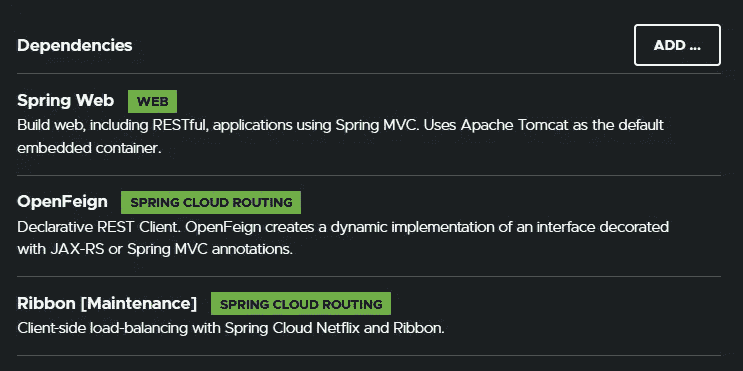
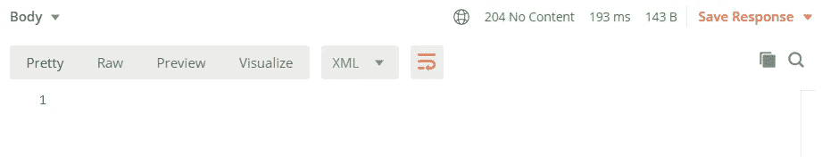
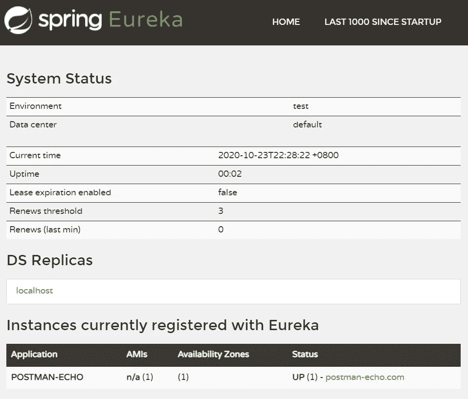

# 用 Spring Cloud OpenFeign 和网飞 Ribbon 构建 REST 客户端

> 原文：<https://betterprogramming.pub/building-a-rest-client-with-spring-cloud-openfeign-and-netflix-ribbon-44734c7dfaa7>

## 了解如何构建一个声明性的、高度可读的 REST 客户机，而无需编写样板代码来通过 HTTP 调用服务


乔恩·泰森在 [Unsplash](https://unsplash.com?utm_source=medium&utm_medium=referral) 上的照片

用 Java 在服务之间发出 HTTP 请求非常简单。有了很多知名的开源 HTTP 客户端，比如 Spring 中的 OkHttp 和 RestTemplate，选择一个合适的候选对象似乎并不困难。真正的问题在于未来。

在服务器来来去去的云中，分布式服务的数量越来越多，服务端点是动态的，事先是未知的。我们的 REST 客户端需要集成到服务注册中心，以便在发出请求之前查找服务端点。

我们还需要处理请求-响应序列化，并实现负载平衡以在服务器之间分配负载。然后需要容错来实现弹性。所有这些都是分布式系统中的交叉问题。

这就是 Spring Cloud OpenFeign 介入的地方。Spring Cloud OpenFeign 不仅仅是一个 HTTP 客户端，还是一个解决现代 REST 客户端相关问题的解决方案。Spring Cloud OpenFeign 通过自动配置和绑定到 Spring 环境，为 Spring Boot 提供 OpenFeign 集成。

OpenFeign 最初被称为 Feign，由网飞发起，旨在允许开发人员通过创建带注释的接口，使用声明性的方式构建 HTTP 客户端，而无需编写任何样板代码。Spring Cloud OpenFeign 使用 Ribbon 来提供客户端负载平衡，并与其他云服务很好地集成，例如用于服务发现的 Eureka 和用于容错的 Hystrix。这些都是现成的，无需编写任何代码。

在本文中，您将了解如何使用 Spring Cloud OpenFeign 构建一个声明性的、高度可读的 REST 客户端来通过 HTTP 调用服务。在后面的部分中，您还将学习在 OpenFeign 中为负载平衡配置带有端点的 Ribbon。最后，我们将使您的 Spring REST 服务中的 Eureka 客户机能够与 Eureka 服务器集成。

# 创建一个 Maven 项目

您可以使用 Spring Initializr 网站来生成一个带有 Spring Boot 2.x 的 Maven 项目。向您的项目添加 Spring Web、OpenFeign 和 Ribbon 依赖项。



Spring Initializr:添加依赖项

如果您从一个空的 Maven 项目开始，导入 Spring Cloud Dependencies POM，这样您的项目可以继承 Spring Cloud 家族中的所有工件版本。

```
<!-- spring-cloud -->
<dependency>
  <groupId>org.springframework.cloud</groupId>
  <artifactId>spring-cloud-dependencies</artifactId>
  <version>Hoxton.SR6</version>
  <scope>import</scope>
  <type>pom</type>
</dependency>
```

接下来，将 Spring Boot 启动器 Web、Spring Cloud Starter OpenFeign 和 Spring Cloud Starter 网飞功能区模块添加到项目的依赖项中。

```
<!-- spring -->
<dependency>
  <groupId>org.springframework.boot</groupId>
  <artifactId>spring-boot-starter-web</artifactId>
</dependency><dependency>
  <groupId>org.springframework.cloud</groupId>
  <artifactId>spring-cloud-starter-openfeign</artifactId>
</dependency><dependency>
  <groupId>org.springframework.cloud</groupId>
  <artifactId>spring-cloud-starter-netflix-ribbon</artifactId>
</dependency>
```

或者，您可以从 [GitHub](https://github.com/getstarted-spring/feignclient) 下载完整的项目。

# 创建一个应用程序启动类

与任何其他 Spring Boot 应用程序一样，我们需要一个主类来启动 Spring `ApplicationContext`。用`@SpringBootApplication`注释创建一个应用程序类，主入口方法调用 Spring Boot 的`SpringApplication.run()`来启动应用程序。

```
@SpringBootApplication
@EnableFeignClients
public class Application {

  public static final void main(final String[] args) {
    SpringApplication.run(Application.class, args);
  }
}
```

`@SpringBootApplication`在我们的应用中启用组件扫描和自动配置。我们将`@EnableFeignClients`注释添加到我们的应用程序类中，以便对用`@FeignClient`注释的接口进行组件扫描。

# 创建一个 REST 客户端接口

创建一个`PostmanEchoClient`接口，用`@FeignClient`注释对其进行注释，命名为`postman-echo`。Spring 会自动扫描我们的接口，并在运行时为我们的 REST 客户端构建一个实现。

```
@FeignClient(name = "postman-echo")
public interface PostmanEchoClient {
}
```

Spring 使用与`@FeignClient`注释一起提供的名称`postman-echo`作为标识符，为客户端负载平衡器创建一个`RibbonClient`。

有几种方法为创建的`RibbonClient`提供服务器端点以实现负载平衡，比如使用 Java 配置、Spring 应用程序属性，或者集成到 Eureka Server 来查找服务器端点。

为了超越硬编码的服务器端点 URL，实现负载平衡的解决方案，让我们为 bow 设置一个带有静态`listOfServers`的 Ribbon。在`application.yaml`文件中的`src/main/resources/`下，添加以下属性:

```
postman+echo:
  ribbon:
    listOfServers: [https://postman-echo.com/,](https://postman-echo.com/,) https://postman-echo.com/
```

Postman Echo 是一个服务，我们可以用它来测试我们的 REST 客户机并进行示例 API 调用。它为`GET`、`POST`和`PUT`的端点提供各种认证机制。

端点的文档以及示例响应可以在[邮递员回声](https://docs.postman-echo.com/?version=latest)官方网站上找到。

# 添加 GET-Request 客户端方法

接下来，在 Postman Echo 客户端接口中添加一个`getEcho`客户端方法，该方法接受`String foo`和`String bar`请求参数并返回一个`EchoGetResponse`对象。使用这个方法上的`@GetMapping`注释将`path` / `get`附加到这个 GET 请求上。这个客户端方法在被调用时将调用 Postman Echo GET-request 端点。

```
@GetMapping(
    path = "/get", 
    consumes = "application/json")
EchoGetResponse getEcho(
    @RequestParam("foo") String foo, 
    @RequestParam("bar") String bar
    );
```

Postman Echo GET-request 端点将相应地将所有提供的请求参数作为响应体在`args`元素中进行回显。关于 Postman Echo GET 请求的文档可以在[这里](https://docs.postman-echo.com/)找到。

```
{
  "args": {
    "foo": "abc",
    "bar": "123"
  }
}
```

创建一个新的`EchoGetResponse`类来表示 JSON 响应。`EchoGetResponse`是一个普通的旧 Java 对象(POJO)类。JSON 响应将在我们的 Postman Echo GET 请求客户端方法中被反序列化为`EchoGetResponse`。

```
public class EchoGetResponse {

  private Args args;

  public Args getArgs() {
    return args;
  }

  public void setArgs(Args args) {
    this.args = args;
  }

  public static class Args {

    private String foo;

    private String bar;

    public String getFoo() {
      return foo;
    }

    public void setFoo(String foo) {
      this.foo = foo;
    }

    public String getBar() {
      return bar;
    }

    public void setBar(String bar) {
      this.bar = bar;
    }
  }
}
```

# 使用“SpringBootTest”测试 GET-Request 客户端方法

我们使用`SpringBootTest`来单元测试我们对远程 Postman Echo GET-request 端点的 GET request 客户端方法调用。为此，创建一个`PostmanEchoClientTests`类。使用带有`@SpringBootTest` 注释的随机端口设置测试上下文。

```
@SpringBootTest(
    webEnvironment = WebEnvironment.RANDOM_PORT)
class PostmanEchoClientTests {
}
```

将 Spring 创建的`PostmanEchoClient` bean 自动连接到我们的单元测试类中。创建的 bean 应该使用已配置的功能区服务器列表进行客户端负载平衡。

```
@Autowired private PostmanEchoClient client;
```

创建一个`getEcho` `@Test`方法，该方法使用自动连接的`PostmanEchoClient` bean 来调用 Postman Echo GET-request 端点。

```
@Test
void getEcho() throws Exception {

  final EchoGetResponse response = 
      client.getEcho("abc", "123");

  assertThat(
      response.getArgs().getFoo()
      ).isEqualTo("abc");
  assertThat(
      response.getArgs().getBar()
      ).isEqualTo("123");

}
```

在调用远程端点之后，确保返回的`EchoGetResponse`响应与提供的请求参数匹配，注意它是否如预期的那样正确地从预期的 JSON 内容反序列化。

# 添加请求后客户端方法

既然我们已经测试了一个简单的 GET 请求，那么让我们尝试一个 POST 请求。在接受`String foo`和`String bar`请求参数的`PostmanEchoClient`接口中添加一个`postEcho`客户端方法。它应该有一个`EchoPostRequest`对象请求体，并返回一个`EchoPostResponse`对象。

使用这个方法上的`@PostMapping`注释将`path` / `post`附加到这个 POST 请求。这个客户端方法在被调用时将调用 Postman Echo POST-request 端点。

```
@PostMapping(
    path = "/post", 
    consumes = "application/json")
EchoPostResponse postEcho(
    @RequestParam("foo") String foo,
    @RequestParam("bar") String bar,
    @RequestBody EchoPostRequest body);
```

Postman Echo POST-request 端点将回显所提供的请求参数，并相应地请求`body`作为`args`和`data`元素中的响应。

```
{
  "args": {
    "foo": "abc",
    "bar": "123"
  },
  "data": {
    "message": "hello"
  }
}
```

创建一个新的`EchoPostRequest`类来表示 JSON-request 主体。`EchoPostRequest`是一个普通的旧 Java 对象(POJO)类，包含一个单独的`String`消息属性。当调用 Postman Echo POST-request 端点时,`EchoPostRequest`对象将被序列化为 JSON-request 主体。

```
public class EchoPostRequest {

  private String message;

  public String getMessage() {
    return message;
  }

  public void setMessage(String message) {
    this.message = message;
  }
}
```

创建另一个新的`EchoPostResponse`类来表示 JSON 响应。`EchoPostResponse`类包含一个具有`foo`和`bar`属性的`args`和一个具有`message`属性的`data`。在我们的 Postman Echo POST-request 客户端方法中，JSON 响应将被反序列化为`EchoPostResponse`。

```
public class EchoPostResponse {

  private Args args;

  private Data data;

  public Args getArgs() {
    return args;
  }

  public void setArgs(Args args) {
    this.args = args;
  }

  public Data getData() {
    return data;
  }

  public void setData(Data data) {
    this.data = data;
  }

  public static class Args {

    private String foo;

    private String bar;

    public String getFoo() {
      return foo;
    }

    public void setFoo(String foo) {
      this.foo = foo;
    }

    public String getBar() {
      return bar;
    }

    public void setBar(String bar) {
      this.bar = bar;
    }
  }

  public static class Data {

    private String message;

    public String getMessage() {
      return message;
    }

    public void setMessage(String message) {
      this.message = message;
    }
  }
}
```

# 使用“SpringBootTest”测试请求后客户端方法

同样，我们将在先前添加的`PostmanEchoClientTests`类中为新添加的`postEcho`客户端方法添加一个`postEcho`测试方法。同样，使用 autowired `PostmanEchoClient` bean 来调用 Postman Echo POST-request 端点。

```
@Test
void postEcho() {

  final EchoPostRequest request = 
      new EchoPostRequest();
  request.setMessage("xyz");

  final EchoPostResponse response = 
      client.postEcho("abc", "123", request);

  assertThat(
      response.getArgs().getFoo()
      ).isEqualTo("abc");
  assertThat(
      response.getArgs().getBar()
      ).isEqualTo("123");
  assertThat(
      response.getData().getMessage()
      ).isEqualTo("xyz");

}
```

在调用远程端点之后，确保返回的`EchoPostResponse`响应与提供的请求参数和请求体匹配，确保它正确地从预期的 JSON 内容反序列化。

# 与 Eureka 服务器集成

通过简单的注释和配置，您可以在 Spring REST 服务中快速启用网飞尤里卡发现客户端。

在此之前，将依赖关系`spring-cloud-starter-netfliix-eureka-client`模块添加到您的项目中。

```
<dependency>
  <groupId>org.springframework.cloud</groupId>
  <artifactId>spring-cloud-starter-netflix-eureka-client</artifactId>
</dependency>
```

接下来，将`@EnableDiscoveryClient`注释添加到您的应用程序类中，以激活网飞尤里卡发现客户端实现。然后，它将向服务注册中心网飞尤里卡服务器注册自己，并使用 Spring Cloud `DiscoveryClient`抽象来询问包含服务端点的服务元数据，功能区客户端将使用这些服务端点进行负载平衡。

```
@SpringBootApplication
@EnableFeignClients
@EnableDiscoveryClient
public class Application {

  public static final void main(final String[] args) {
    SpringApplication.run(Application.class, args);
  }
}
```

最后，在`application.yaml`中为您的 Eureka 服务器配置一个应用程序名称和端点 URL。

Eureka 客户端使用您的应用程序名称注册到 Eureka 服务器。如果不配置应用程序名称，您的服务将在 Eureka 服务器上显示为未知。

```
spring:
  application:
    name: feignclienteureka:
  client:
    serviceUrl:
      defaultZone: [http://localhost:8761/eureka](http://localhost:8001/eureka)
```

通过这几个步骤，您已经将 Spring REST 服务集成到了 Eureka 服务器上。

既然您的 REST 服务已经准备好连接到 Eureka 服务器，那么您需要从`application.yaml`中移除或注释 Ribbon 的`listOfServers`属性。

```
# postmanEcho:
#   ribbon:
#     listOfServers: https://postman-echo.com/
```

# 创建尤里卡服务器

使用 Spring Initializr 网站为 Eureka Server 生成另一个具有 Eureka Server 依赖项的项目。


Spring Initialzr:添加依赖项

如果您从一个空的 Maven 项目开始，导入 Spring Cloud Dependencies POM 并将 Spring Cloud Starter 网飞尤里卡服务器依赖项添加到您的项目中。

```
<dependency>
  <groupId>org.springframework.cloud</groupId>
  <artifactId>spring-cloud-starter-netflix-eureka-server</artifactId>
</dependency>
```

或者，从 [GitHub](https://github.com/getstarted-spring/eureka-server) 下载 Eureka 服务器项目。

您需要创建一个带有`@SpringBootApplication`注释的标准主入口类。将`@EnableEurekaServer`注释添加到您的类中，以激活 Eureka 服务器实现。

```
@SpringBootApplication
@EnableEurekaServer
public class EurekaServer {

  public static final void main(final String[] args) {
    SpringApplication.run(EurekaServer.class, args);
  }
}
```

接下来，将您的服务器端口改为`8761`。

```
server:
  port: 8761
```

最后，关闭`application.yaml`中的自注册和获取注册特性。

```
eureka:
  client:
    serviceUrl:
      defaultZone: http://localhost:8761/eureka
    registerWithEureka: false
    fetchRegistry: false
```

有了这个，你的尤里卡服务器就准备好了。启动它。

由于 Postman Echo 是一个外部服务，您需要手动将其注册到您的 Eureka 服务器。你可以在这里获得一个 Eureka 支持的 REST 操作列表[。您将只使用 API 注册一个新的应用程序。](https://github.com/Netflix/eureka/wiki/Eureka-REST-operations)

使用 Postman 向您的 Eureka 服务器发送请求。


邮递员:请求尤里卡服务器

将 Postman Echo 注册到 Eureka 服务器的 URL 如下:

```
http://localhost:8761/eureka/apps/POSTMAN-ECHO
```

请求内容以将邮递员 Echo 注册到 Eureka 服务器，如下所示:

```
{
  "instance": {
    "app": "POSTMAN-ECHO",
    "hostName": "postman-echo.com",
    "vipAddress": "postman-echo",
    "secureVipAddress": "postman-echo",
    "ipAddr": "54.90.58.153",
    "status": "UP",
    "port": {"$": "80", "[@enabled](http://twitter.com/enabled)": "true"},
    "securePort": {"$": "443", "[@enabled](http://twitter.com/enabled)": "true"},
    "healthCheckUrl": "[http://postman-echo.com/get](http://postman-echo.com/get)",
    "statusPageUrl": "[http://postman-echo.com/get](http://postman-echo.com/get)",
    "homePageUrl": "[http://postman-echo.com](http://postman-echo.com)",
    "dataCenterInfo": {
      "[@class](http://twitter.com/class)": "com.netflix.appinfo.InstanceInfo$DefaultDataCenterInfo", 
      "name": "MyOwn"
    }
  }
}
```

您需要将应用程序注册为`POSTMAN-ECHO`，因为您之前已经将您的`@FeignClient`命名为`postman-echo`。

您应该得到一个没有内容的成功响应。



邮递员:来自尤里卡服务器的回复

打开您的 Eureka 仪表板，您应该看到`POSTMAN-ECHO`已注册。



Eureka 服务器:注册的实例

再次运行你的`PostmanRestClientTests`,看看一切都在无缝运行。

# 摘要

我们已经了解了如何使用 Spring Cloud OpenFeign 构建声明式 REST 客户端，使用 Spring Cloud 网飞功能区提供客户端负载平衡和容错。我们还学习了如何为 Ribbon 配置静态服务器端点，以及如何集成到 Eureka Server 以获得注册服务器端点的列表。所有源代码都可以在 [GitHub](https://github.com/getstarted-spring/feignclient) 上获得。

感谢您的阅读，我希望这篇文章对您有所帮助。