# 使用 ASP.NET、Web API 和 SQL Server 构建 Restful API

> 原文：<https://betterprogramming.pub/building-a-restful-api-with-asp-net-web-api-and-sql-server-ce7873d5b331>

## 如何使用实体框架构建 ASP.NET Web API 并从 SQL server 中检索数据


阿诺·弗朗西斯卡在 [Unsplash](https://unsplash.com/@clark_fransa) 上的照片

在本文中，我将演示如何使用实体框架构建 ASP.NET Web API，并从 SQL server 中检索数据。

这里我用的是 Visual Studio 2017 和 Management Studio。这些是我们需要遵循的步骤:

1.  [创建一个空白的 Web API 项目。](#3a73)
2.  [在模板选择窗口中选择 Web API。](#b458)
3.  [创建表格并将数据插入数据库表格。](#15ab)
4.  [添加一个 web 服务。](#410c)
5.  [添加一个 ADO.NET 实体数据模型。](#4cd6)
6.  [创建与 SQL server 的新连接。](#62d3)
7.  [从数据库生成实体。](#9c76)
8.  [添加控制器。](#9339)
9.  运行项目。

# **创建一个空白的 Web API 项目**

在这里，我将创建一个新项目。为此，我将遵循以下步骤:

文件→新建→项目，选择“ASP。NET Web 应用程序(。NET Framework)”项目，如图[图 1](#9fe9) 所示。

让我们将我们的项目命名为“**学生服务**”，然后单击“确定”

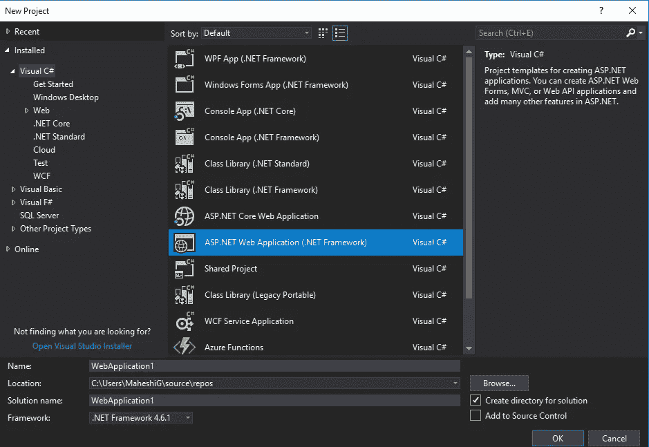

图 1:新 ASP.NET 网络应用程序

现在，您将看到一个包含一些模板的窗口。创建 API 时，我们可以从这些模板中进行选择。

# 在模板选择窗口中选择 Web API

在模板选择窗口中选择“ **Web API** ”，如图[图 2](#c3e7) 所示。确保认证设置为“**无认证。**

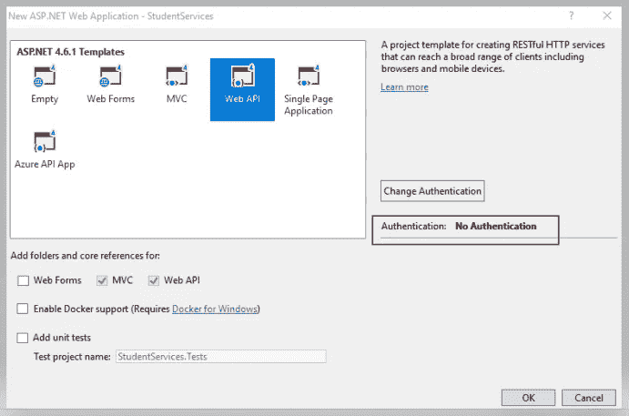

图 2: Web API 模板

# 创建一个表并将数据插入数据库表

让我们创建一个名为" **StudentDetails，**"的数据库，并将我们的表命名为" **Student。**

现在，我们回到我们的 Visual Studio 项目。如您所见，我们已经成功创建了空的 Web API 项目。

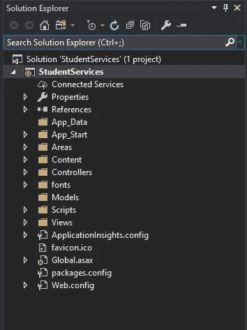

图 3: Web API 项目

# **添加 Web 服务**

现在，我们将创建一个 web 服务，它将包含从 SQL SERVER 检索数据的 ADO.NET 实体数据模型。

让我们添加一个新项目。为此，右键单击解决方案→添加→新项目。

选择类库(。NET 标准)，我们姑且将其命名为“ **StudentDataAccess。**

删除 class1.cs 文件，因为我们不需要这个自动生成的类。

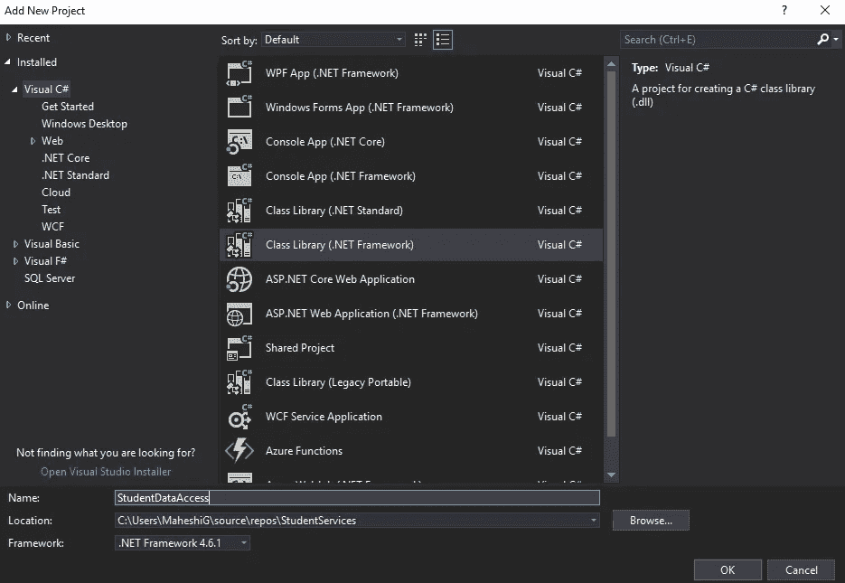

图 4: StudentDataAccess 项目

# **添加一个 ADO.NET 实体数据模型**

正如我之前提到的，我们必须创建一个包含实体数据模型的 web 服务。所以现在我们要给“**StudentDataAccess”**项目添加一个 ADO.NET 实体数据模型。

***注意:*** *我去给“****【StudentDataAccess】****项目添加一个 ADO.NET 实体数据模型的时候，ADO.NET 数据模型不见了。*

*我是这样克服这个问题的:工具→获取工具和功能→选择单个组件选项卡。请确保您选择了 SQL Server 数据工具、实体框架 6 工具组件。然后，修改改动，推出 VS 2017。*

*如果选择类库(。NET Standard)模板。请确保选择类库(。NET Framework)模板。*

现在让我们添加 ADO.NET 数据实体模型。

右键单击“StudentDataAcess”项目→添加→新建项目→ADO.NET 实体数据模型。将其命名为**“studentdata model。”**

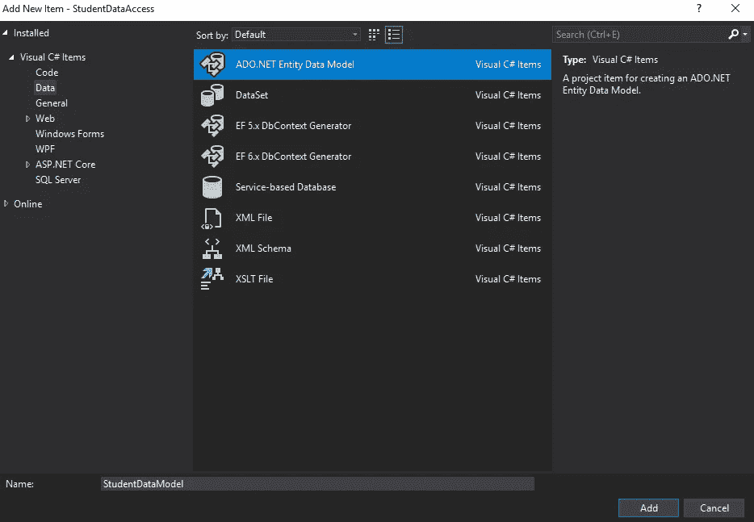

图 5:ADO.NET 实体数据模型

接下来，将出现下面的屏幕。因此，我们将选择第一个选项，即“来自数据库的 EF Designer”

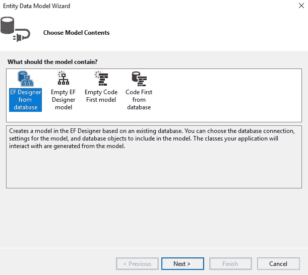

图 6:数据库中的 EF 设计器

# 创建与 SQL Server 的新连接

现在，我们将创建一个与 SQL server 的新连接，并将它引用到我们的数据库。

单击“新建连接”按钮，选择“Microsoft SQL Server”作为数据源。然后，单击继续。

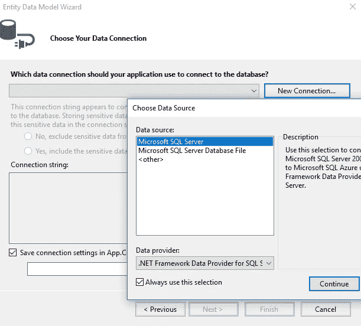

图 7:创建一个新的连接。

现在您将看到一个连接属性窗口。

在这里，选择您的服务器名称、正确的身份验证(Windows/SQL Server)以及检索数据所需的正确数据库。比如，“ **StudentDetails。**”

使用“测试连接”按钮测试连接。

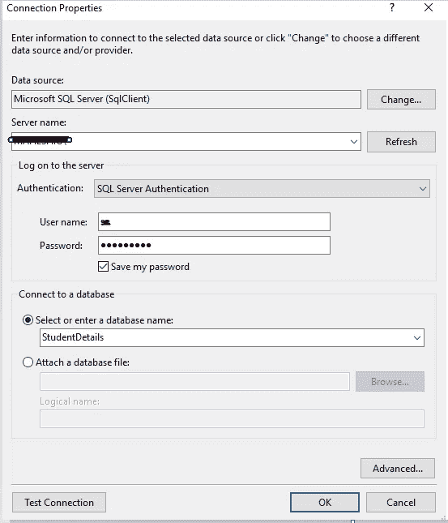

图 7:连接属性

# **从数据库生成实体**

这里，实体框架将在“**StudentDataAcess”**类库项目的 APP.config 文件中看到一个名为“ **StudentDetailsEntities** 的连接字符串。

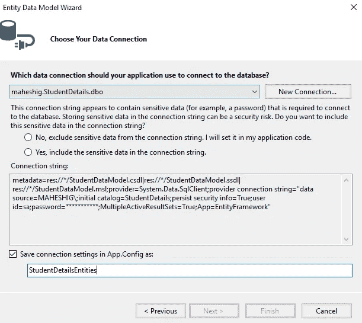

图 8:学生详细信息

确保在实体数据模型向导中选择了正确的数据库对象和设置。该模型将被创建为**“StudentDetailsModel”**

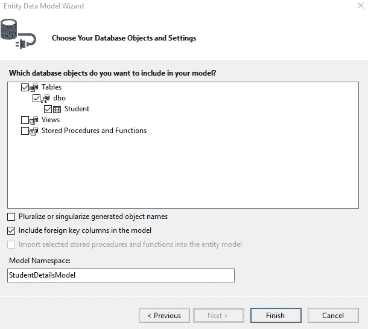

图 10:选择正确的数据库对象和设置。

现在您可以看到" **StudentDetailsModel"** 已经成功创建。点击文件**studentdetailsmodel . edmx .**然后，你会看到学生实体及其属性。

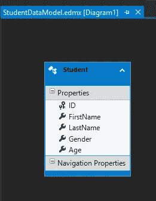

图 11: StudentDetailsModel.edmx 文件

您可以在 App.config 文件中看到连接字符串。这里的连接字符串是“ **StudentDetailsEntities，**”，它包含了“**学生**”表。

我们必须在我们的 Web API 项目中使用这个类库。

右键单击**学生服务项目中的引用。**

在这里，你会看到“ **StudentDataAccess** ”类库项目。(在将 StudentDataAcess 项目作为对 StudentServices 项目的引用添加之前，先构建该项目。)

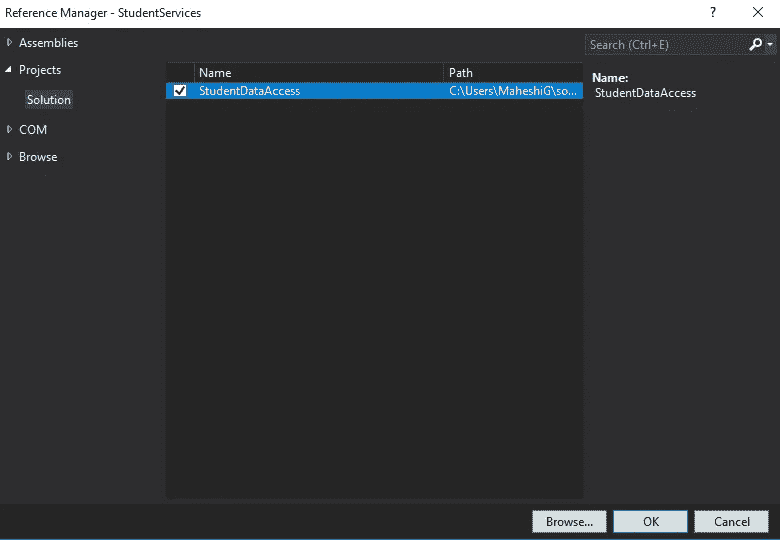

图 12:添加 StudentDataAccess 类库作为引用。

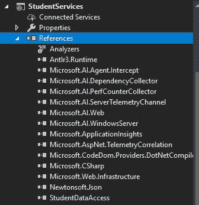

# **添加控制器**

下一步是向我们的 Web API 项目添加一个控制器。因此，右键单击控制器文件夹，然后单击添加控制器。

对于 MVC 和 Web API 控制器，您将获得不同的模板选项。让我们选择“Web API 2 控制器—空”模板。

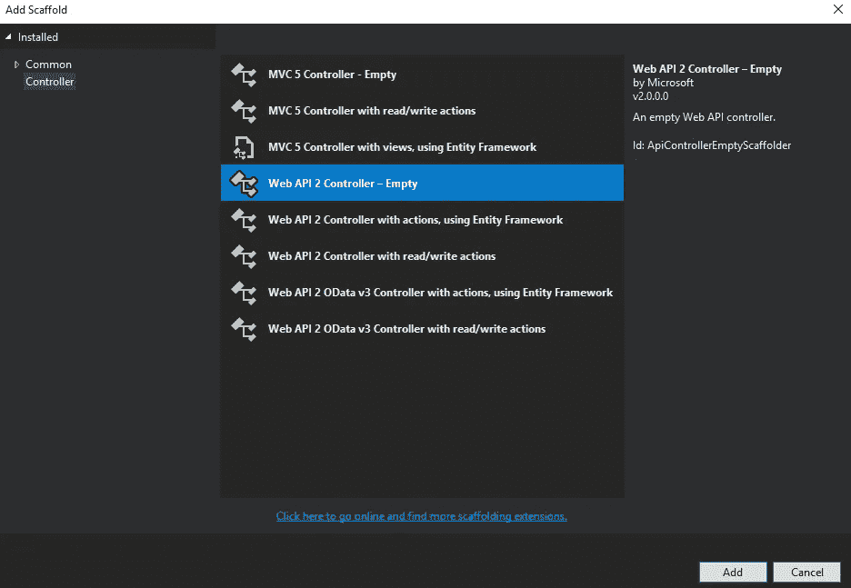

图 13:选择 Web API 2 控制器-空模板。

将控制器命名为" **StudentController。**

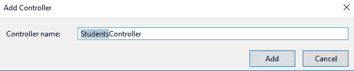

图 14:学生控制器。

现在您已经成功地创建了控制器，我们将添加一个命名空间 StudentDataAccess 作为我们的类库名称“StudentDataAccess”现在，在我们的控制器类中，我们将添加一个 GET 方法来响应 GET HTTP 动词。这将返回 [IEnumerable 对象](https://docs.microsoft.com/en-us/dotnet/api/system.collections.generic.ienumerable-1?view=netframework-4.7.2)。

双击文件 Student.cs，然后您将看到与我们的 Student 选项卡中的列相对应的属性；e.

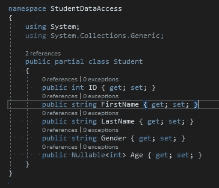

图 15: Student.cs

# 编写响应 HTTP GET 谓词的 GET 方法

所以下一步，我们需要创建 DbContext 类的一个实例。可以看到 StudentDataModel.context.cs 文件。StudentDetailsEntities 继承自 DbContext 类。

这是 StudentDetailsEntities 类，它为我们管理数据库和检索实体。因此，在我们的控制器类中，让我们使用 StudentDetailsEntities。它将返回学生列表，如下所示:

1.  退回所有员工。

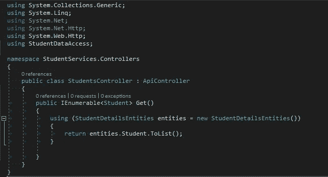

图 16:学生控制器. cs 控制器

2.按 ID 返回特定的雇员

让我们将这一行添加到控制器类中。这里，我们将返回类型更改为“Student ”,因为我们想要返回那个学生。我在每个学生 ID 中都使用了 lambda 表达式。该 ID 等于我们在 GET 参数中使用的 ID。

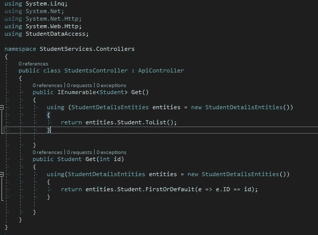

图 17:从 ID 返回一个雇员

现在我们已经完成了所有的实现，让我们试着构建并运行我们的项目。

# **运行项目**

现在，构建解决方案并运行应用程序。

您将得到如下错误。

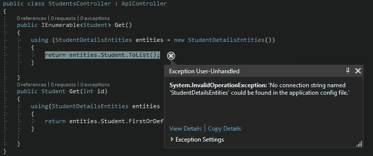

图 18:在配置文件中没有找到名为 StudentDetailsEntities 的连接字符串。

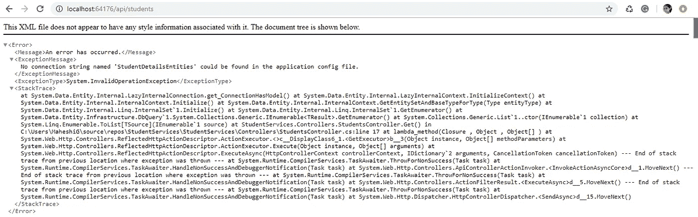

图 19:错误

这就是你需要如何纠正这个问题。

我们在 App.config 中有一个名为 StudentDetailsEntities 的连接字符串，但问题是 StudentDetailsEntities 在实体框架查找 web.config 时不在 web.config 中。

因此，从 app.config 文件中复制该连接字符串行，并粘贴到我们的 web.config 文件中。然后，重新加载应用程序。

```
<connectionStrings>
<add name=”StudentDetailsEntities” connectionString="your connection string />
</connectionStrings>
```

输出将如下所示。

## **显示所有学生**

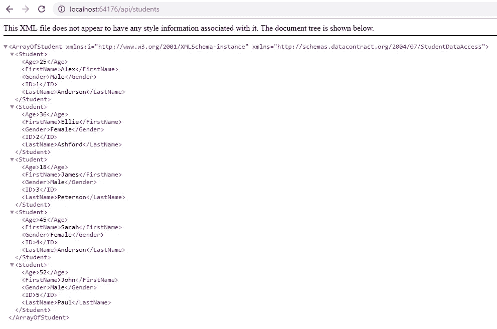

图 20:学生详细信息(检索所有学生)。

## **显示学生 ID**

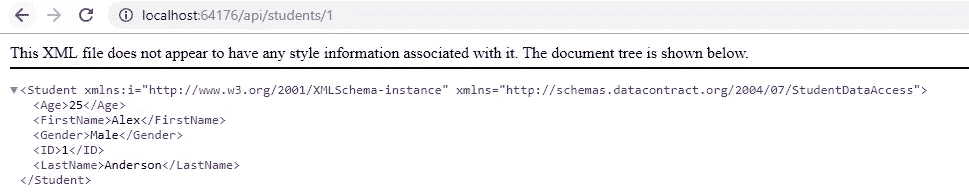

图 21:检索学生的详细信息。

# **总结**

现在，我们已经使用带有实体框架的 ASP.NET Web API 创建了 restful API，并且我们已经从 SQL server 检索了数据。