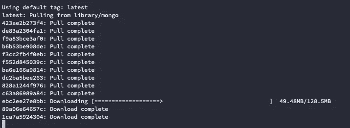
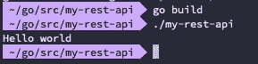
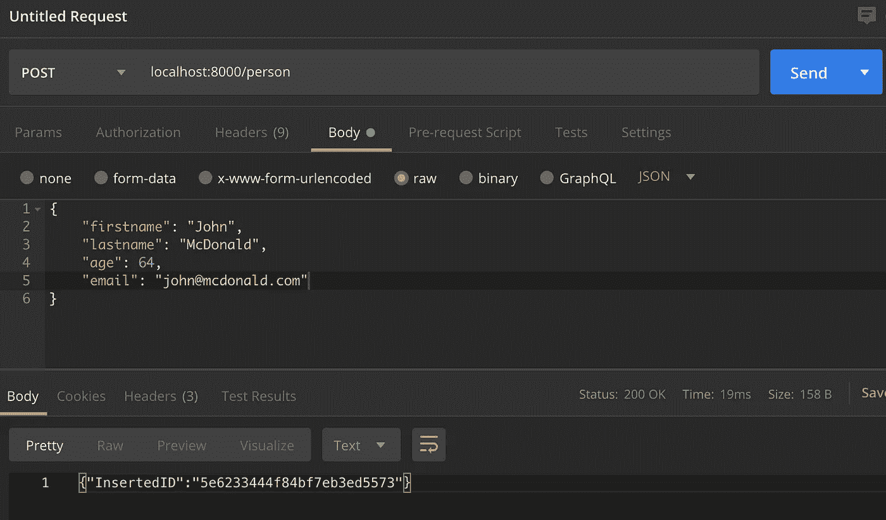
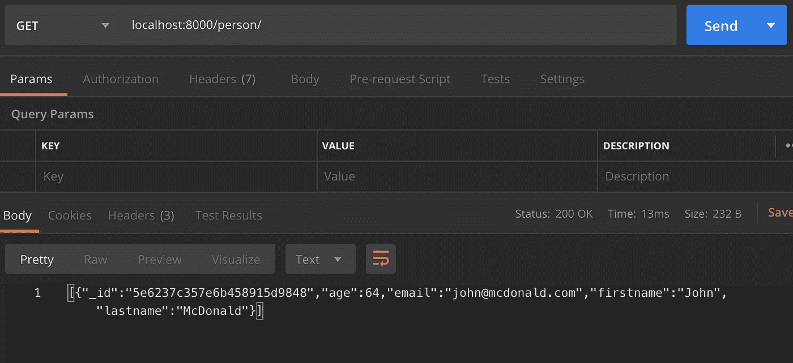
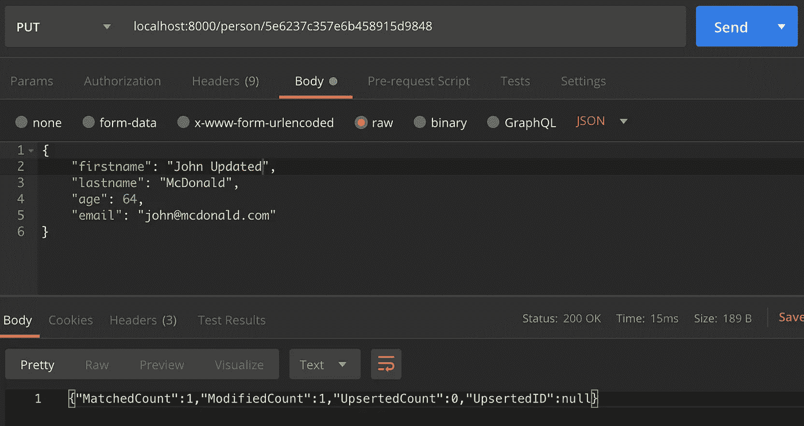
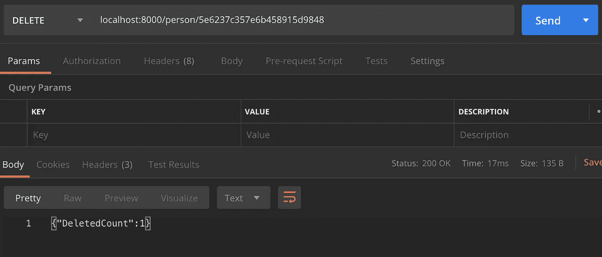

# 如何用 Go 和 MongoDB 构建 RESTful API

> 原文：<https://betterprogramming.pub/building-a-restful-api-with-go-and-mongodb-93e59cbbee88>

## 让我们使用纤程来构建一个 API


[叶维克](https://unsplash.com/@yipvick?utm_source=unsplash&utm_medium=referral&utm_content=creditCopyText)在 [Unsplash](https://unsplash.com/s/photos/fiber?utm_source=unsplash&utm_medium=referral&utm_content=creditCopyText) 上的照片

在本教程中，我们将学习如何用[纤程](https://github.com/gofiber/fiber)构建一个 RESTful API，这是一个据说是最快的 Go 框架之一。我们还将使用 MongoDB 来存储数据。

> Fiber 是一个受 Express 启发的 web 框架，构建在 Fasthttp 之上，fast http 是 Go 最快的 HTTP 引擎。旨在以零内存分配和性能为目标，为快速开发提供便利。

我假设你已经安装了 Go。如果没有，这很简单——只需下载软件包并[按照说明](https://golang.org/dl/)进行操作。

我们开始吧！

# 通过 Docker 安装和启动 MongoDB

我们将使用 MongoDB 作为数据库，为了简单起见，我们将使用 Docker 映像。

首先，[下载安装 Docker](https://www.docker.com/products/docker-desktop) 。

然后我们需要得到 MongoDB 图像。打开您的终端并键入以下内容:

```
docker pull mongo
```



下载完成后，只需使用以下命令启动 docker 容器:

```
docker run --name mongo-db -p 27017:27017 -d mongo:latest
```

端口参数`-p 27017:27017`非常重要。它告诉 Docker 容器公开这个端口，以便从容器外部访问。否则，您将无法从应用程序连接到数据库。

就是这样。随着容器的运行，我们现在可以使用 URL `mongodb://localhost:27017`访问 MongoDB 实例。

# 创建 Go 项目

既然我们已经运行了`DataBase`,是时候开始创建我们的应用程序了。

在`$HOME/go/src directory`中创建一个文件夹。在本教程中，我们称之为`my-rest-api`。

```
mkdir my-rest-api
```

在这个文件夹中，为了告诉 Go 我们将使用 [Go 模块](https://blog.golang.org/using-go-modules)，我们需要运行以下命令:

```
go mod init my-rest-api
```

该命令将创建`go.mod`文件。这个文件保存了这个应用程序中使用的包的信息。Go `Modules`是在 Go 版本 1.11 中引入的，它给了我们一个处理包的简单方法。

现在，创建`main.go`文件，这个文件将是我们的应用程序及其 main 方法的入口点。

这个文件只打印文本“Hello world”现在回到控制台，构建并运行您的 go 应用程序，只是为了测试它是否工作正常。

```
$ go build
$ ./my-rest-api
```

第一个命令构建应用程序并生成一个应用程序名的文件——在我们的例子中是`my-rest-api`。第二个命令运行它。它应该打印文本“Hello world”如果印出来，都是好的。



# 获取 Go 库

现在我们开始获取构建项目所需的库。我们将使用 Fiber 作为 web 框架，使用 MongoDB 作为数据库。

```
$ go get github.com/gofiber/fiber$ go get go.mongodb.org/mongo-driver/mongo
```

这些命令将下载库并将它们存储在我们的 Go 目录中，所以从现在开始我们可以在任何需要的项目中使用它们。

请注意，当我们在项目根目录下运行这些命令时，Go 将使用这些包更新我们的`go.mod`文件，并生成一个`go.sum`文件，其中包含每个下载包的校验和。

# 设置 HTTP 路由

现在我们已经运行了 MongoDB 实例，创建了 Go 项目并下载了依赖项，是时候开始编写 API 本身了。

首先，导入纤程库，就在包声明之后。

```
import “github.com/gofiber/fiber”
```

然后写主要方法:

```
func main() {
  app := fiber.New()
  app.Get("/person/:id?", getPerson)
  app.Post("/person", createPerson)
  app.Put("/person/:id", updatePerson)
  app.Delete("/person/:id", deletePerson)
  app.Listen(port)
}
```

main 函数实例化一个 Fiber 实例，声明将提供哪些路由及其处理程序，并开始监听端口 8000。

这些处理程序是接收一个`fiber.Ctx`作为参数的函数。这个对象保存了关于请求和响应的所有信息，并具有我们可以用来与它们进行交互的函数。

```
func getPerson(c *fiber.Ctx) {}func createPerson(c *fiber.Ctx) {}func updatePerson(c *fiber.Ctx) {}func deletePerson(c *fiber.Ctx) {}
```

# 正在连接到 MongoDB

为了避免重复的代码，我们将编写单独的函数来处理与数据库的交互。主要我们需要两个函数——第一个负责与数据库的连接，第二个将返回一个`Collection`对象，我们可以在其中执行操作。

db.go

# 编写处理程序的逻辑

操作是最简单的。

*   `Get`:返回一个或多个结果。
*   `Post`:向数据库添加一个条目。
*   `Put`:更新一个条目。
*   `Delete`:删除一个条目。

唯一有更多逻辑的方法是`GetPerson` ，因为如果传递了`id`，它返回一个结果，否则返回多个结果。

在函数之前，我们声明我们的常数。这是避免输入错误的好方法，也很实用——如果我们需要更改这些值，我们只需在一个地方更改它们。

```
const dbName = “personsdb”const collectionName = “person”const port = 800
```

这是我们将用来在数据库上持久化的`Person`结构:

```
type *Person* struct {_id *string* `json:”id,omitempty”`FirstName *string* `json:”firstname,omitempty”`LastName *string* `json:”lastname,omitempty”`Email *string* `json:”email,omitempty”`Age *int* `json:”age,omitempty”`}
```

# 邮政

由于 MongoDB 的工作方式，我们将从`POST`方法开始。只有在插入第一个文档时，数据库才真正创建，因此我们至少需要插入一个人来创建数据库本身。

在上下文变量中，我们可以通过函数`Body`访问请求的主体，所以我们需要调用它并解析到我们的`Person`对象。然后我们调用 MongoDB 将其插入数据库。如果有错误，我们返回状态代码 500，这意味着“内部服务器错误”，并发送 MongoDB 返回的错误描述。如果插入操作成功运行，我们解析对 JSON 的响应，并将其与响应一起发送回去。

创建人

下面可以看到响应，是插入文档的`id`。



# 得到

在我们插入第一个`Person`之后，我们可以用`GET`方法检索它。

我们声明它的路由的方式是，它可以有一个`id`作为参数，也可以没有——这就是为什么我们在路由声明中把`?`放在`:id`之后。

```
app.Get("/person/:id?", getPerson)
```

我们可以使用函数`Params()` 访问 URL 参数，传递参数的名称。在我们的例子中，那是它的`id`，所以我们称之为`c.Params("id")`。因为这里的参数是可选的，我们需要检查它是否被传递。如果是，我们把它作为过滤器传递给我们对数据库的查询，如果不是，我们检索所有没有过滤器的结果。

GetPerson



# 放

更新几乎与创建功能相同。区别在于我们发送到 MongoDB 的方式。

更新人员

MongoDB 返回给我们的也不一样。现在，它返回关于找到和更新了多少文档的信息。



## 删除

最后是删除功能，这也很简单。

删除人员

这次 MongoDB 向我们返回已删除文档的数量。



# 结论

你可以在 GIT 上看到[完整的代码。](https://github.com/ednofedulo/go-rest-api)