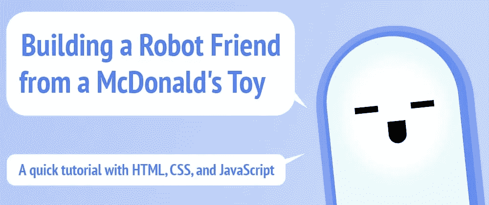
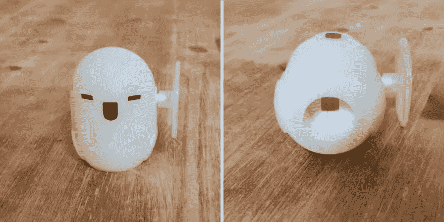
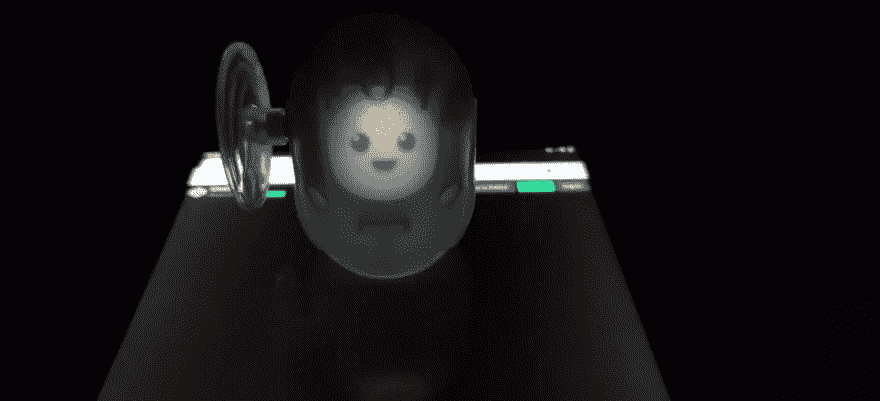

# 使用 HTML、CSS 和 JavaScript 构建一个机器人朋友

> 原文：<https://betterprogramming.pub/building-a-robot-friend-from-a-mcdonalds-toy-b023589fd031>

## 一个简单的麦当劳玩具如何成为儿童的一个简单的网络开发项目



作者图片

> *注意:你不需要麦当劳的玩具来构建这个游戏并玩它，但是拥有这个玩具会给这个项目增加一个额外的有趣因素:)*

# 玩具

前几天，我的妻子在麦当劳给我们的孩子买了快乐套餐，我讨厌承认这一点，但最喜欢这个玩具的人是我。

这是一个简单的玩具。一个很傻的东西:一个带笑脸的机器人模样的东西(我甚至不知道宣传的是什么电影/游戏)，一边有一个旋转手柄，底部有一个洞:



一开始我以为是个夜光玩具…其实不是。

这个玩具还有更多的功能:它可以与麦当劳的应用程序“互动”。于是，我下载了这款应用，并进行测试。功能很简单:

1.  将玩具放在手机顶部(特定位置)
2.  调暗房间的灯光
3.  在弹出的选项中选择
4.  机器人“活了过来”,所以你可以和它互动。

当然，机器人没有活过来。在现实中，玩具是半透明的，底部有一个洞和一些镜子(？)内部，因此通过正确使用灯光并将玩具放在手机上的特定位置，该应用程序可以将图像反射到玩具的屏幕/脸上。

我喜欢它。它有一些电子鸡混合了大英雄 6 的大白氛围。它可爱、巧妙、简单……如此简单，令人遗憾的是，它仅限于餐厅应用程序中的几个广告选项。这个基本想法似乎很容易开发。那么，如果……？

# 第一版

我打开浏览器，进入[密码本](https://codepen.io/)。我在编辑器上快速输入了四个 HTML 元素:

```
<div class="face">
  <div class="eye"></div>
  <div class="eye"></div>
  <div class="mouth"></div>
</div>
```

然后添加了一些基本的样式。没什么特别的:

```
html, body {
  background: #000;
}

.face {
  position: relative;
  width: 1.25in;
  height: 1.25in;
  overflow: hidden;
  margin: 5vh auto 0 auto;
  background: #fff;
  border-radius: 100% / 30% 30% 60% 60%;
}

.eye {
  position: absolute;
  top: 40%;
  left: 25%;
  width: 15%;
  height: 15%;
  background: black;
  border-radius: 50%;
}

.eye + .eye {
  left: 60%;
}

.mouth {
  position: absolute;
  top: 60%;
  left: 40%;
  width: 20%;
  height: 12%;
  background: black;
  border-radius: 0 0 1in 1in;
}
```

> *注:我选了* `[*in*](https://developer.mozilla.org/en-US/docs/Learn/CSS/Building_blocks/Values_and_units)` [*单位(英寸)*](https://developer.mozilla.org/en-US/docs/Learn/CSS/Building_blocks/Values_and_units) *，所以对所有设备都是绝对的。我不得不发挥一点实际价值:我开始与 1 英寸，但它似乎有点少；我移到了 1.5 英寸，但那太大了。最后，我满足于 1.25 英寸，但它可能会更小一点，更适合这个特殊的玩具。*

总共花了 5-10 分钟。它不是交互式的，也不是动画，但结果看起来(在玩具上)与应用程序上的结果相似:



你好啊。

# 第一次故障和纠正

谁会说这么简单的东西会有问题呢？但是它发生了！有几件事从一开始就引起了我的注意:

*   照片被翻转了
*   该图在手机上缩放效果不佳
*   浏览器栏太亮了

我认为第一个是因为玩具内部使用了镜子，这将使屏幕上的左侧成为玩具上的右侧，反之亦然。虽然在显示人脸时这不会是一个大问题，但如果我想显示文本或图片，这可能会有问题。

解决方案是通过使用值为-1 的`[scaleX](https://developer.mozilla.org/en-US/docs/Web/CSS/transform-function/scaleX())` [变换来翻转面部:](https://developer.mozilla.org/en-US/docs/Web/CSS/transform-function/scaleX())

```
.face {
  ...
  transform: scaleX(-1)
}
```

在头部指定一个视口宽度解决了移动设备上的升级问题。使用`[viewport](https://developer.mozilla.org/en-US/docs/Web/HTML/Viewport_meta_tag)` [元标记](https://developer.mozilla.org/en-US/docs/Web/HTML/Viewport_meta_tag)很容易:

```
<meta name="viewport" 
      content="width=device-width, initial-scale=1" />
```

最后，浏览器顶栏太亮了。这通常不是问题，但考虑到玩具需要调暗灯光才能看得更清楚，这是一个问题，因为它可能会分散注意力。

幸运的是，可以用`[theme-color](https://developer.mozilla.org/en-US/docs/Web/HTML/Element/meta/name/theme-color)` [元标记](https://developer.mozilla.org/en-US/docs/Web/HTML/Element/meta/name/theme-color)来指定该条的颜色:

```
<meta name="theme-color" content="#000" />
```

浏览器的顶栏现在是黑色的(与主体背景颜色相同)，使其与页面更加流畅，并消除了恼人的差异。

# 第一个动画

在那一点上，机器人太简单了。动画会使它变得可爱和富有表现力，而 CSS 就是这份工作的语言！

我一开始做了两个动画:眨眼和嘴巴说话。

有许多方法可以使眼睛睁开和闭上(眨眼或眨眼)。一个简单的方法是将不透明度设置为 0，然后再设置为 1。这样，眼睛会消失一小段时间，然后又回来，这就给人以眨眼的印象。

```
@keyframes blink {
  0%, 5%, 100% { opacity: 1; }
  2% { opacity: 0; }
}
```

这是一个基本的动画，也可以通过将 yes 的高度变为零，然后恢复到原始大小来完成(但我不太喜欢这种方法，因为在我看来它看起来很假)。一个更好的方法可能是动画剪辑路径。只要点数匹配，浏览器就允许剪辑路径的过渡和动画。

```
@keyframes blink {
  0%, 10%, 100% { 
    clip-path: polygon(0% 0%, 100% 0%, 100% 100%, 0% 100%);
  }
  5% { 
    clip-path: polygon(0% 50%, 100% 50%, 100% 50%, 0% 50%);
  }
}
```

我没有选择剪辑路径选项，因为如果我想稍后制作眼睛的动画来展示不同的表情，那看起来会很奇怪。

还有一种选择是将眼睛的高度改为 0，然后恢复到正常大小。然而，那会给人一种眨眼的感觉(这是我最终选择的，尽管它可能不是最好的选择。)

然后，我还通过制作嘴巴张开和闭合的动画来模拟玩具说话。我把嘴的大小改为 0，然后恢复到原来的大小:

```
@keyframes talk {
  0%, 100% { height: 12%; }
  50% { height: 0%; }
}

.mouth {
  ...
  animation: talk 0.5s infinite;
}
```

# 让玩具说话

到目前为止，一切都是 HTML 和 CSS。但是使用 JavaScript 和[语音合成 API](https://developer.mozilla.org/en-US/docs/Web/API/SpeechSynthesis) ，这个玩具将能够说话。我已经做过类似的事情[创建一个教学助理](https://dev.to/alvaromontoro/using-js-speech-recognition-to-build-a-virtual-assistant-1957)或者一个[支持语音的搜索框](https://www.youtube.com/watch?v=trGQYj1C3lc)，所以我有一些经验。

我添加了这个`talk`函数，它接受一个字符串，浏览器会读取它:

```
function talk(sentence, language = "en") {
  let speech = new SpeechSynthesisUtterance();
  speech.text = sentence;
  speech.lang = language;
  window.speechSynthesis.speak(speech);
}
```

我添加了一个可选的`language`参数，如果我想在未来使用玩具说西班牙语或另一种语言(多语言玩具和游戏的胜利！).

需要考虑的一件重要事情是，语音合成`speak()`需要用户激活才能工作(至少在 Chrome 中是这样)。这是一个安全特性，因为网站和开发者正在滥用它，成为一个可用性问题。

这意味着用户/玩家必须与游戏互动才能让机器人说话。如果我想添加一个问候语，这可能是个问题(有很多方法可以绕过它)，但对于游戏的其余部分来说，这应该不是问题，因为它需要用户交互。

还有一个细节:有一个动画可以让机器人的嘴动起来。只在它说话的时候应用不是很棒吗？这其实也很简单！我将动画添加到`.talking`类中，并分别在演讲开始/结束时添加/删除该类。以下是对`talk`功能的更改:

```
function talk(sentence, language = "en-US") {
  let speech = new SpeechSynthesisUtterance();
  speech.text = sentence;
  speech.lang = language;
  // make the mouth move when speech starts
  document.querySelector(".mouth").classList.add("talking");
  // stop the mouth then speech is over
  speech.onend = function() {
    document.querySelector(".mouth").classList.remove("talking");
  }
  window.speechSynthesis.speak(speech);
}
```

# 基本游戏

机器人在页面的顶部，但它没有做太多。所以是时候添加一些选项了！第一件事是包括一个供玩家互动的菜单。菜单将会在页面的底部，为玩具和菜单留出足够的空间，以免相互混淆。

```
<div id="menu" class="to-bottom">
  <button>Jokes</button>
</div>
```

```
.to-bottom {
  position: fixed;
  left: 0;
  bottom: 5vh;
  width: 100%;
  display: flex;
  align-items: flex-end;
  justify-content: center;
}

button {
  margin: 0.5rem;
  min-width: 7rem;
  height: 3.5rem;
  border: 0;
  border-radius: 0.2rem 0.2rem 0.4rem 0.4rem;
  background: linear-gradient(#dde, #bbd);
  border-bottom: 0.25rem solid #aab;
  box-shadow: inset 0 0 2px #ddf, inset 0 -1px 2px #ddf;
  color: #247;
  font-size: 1rem;
  text-shadow: 1px 1px 1px #fff;
  box-sizing: content-box;
  transition: border-bottom 0.25s;
  font-family: Helvetica, Arial, sans-serif;
  text-transform: uppercase;
  font-weight: bold;
}

button:active {
  border-bottom: 0;
}
```

这个结果看起来有点过时(抱歉，我不是一个好的设计师)，但是它符合我的要求:


至于笑话，为了简单起见，我把它们放在一个数组的数组里(对不起，数据结构教授)。然后创建了一个函数，在父数组中随机选取一个元素并读取元素，在元素之间添加一个短暂的停顿([使用](https://developer.mozilla.org/en-US/docs/Web/API/setTimeout) `[setTimeout()](https://developer.mozilla.org/en-US/docs/Web/API/setTimeout)` [表示延迟响应](https://developer.mozilla.org/en-US/docs/Web/API/setTimeout))。否则，我将需要一个额外的用户操作来继续阅读)。

代码如下所示:

```
const jokes = [
  ["Knock, knock", "Art", "R2-D2"],
  ["Knock, knock", "Shy", "Cyborg"],
  ["Knock, knock", "Anne", "Anne droid"],
  ["Why did the robot go to the bank?", "He'd spent all his cache"],
  ["Why did the robot go on holiday?", "To recharge her batteries"],
  ["What music do robots like?", "Heavy metal"],
  ["What do you call an invisible droid?", "C-through-PO"],
  ["What do you call a pirate robot?", "Argh-2D2"],
  ["Why was the robot late for the meeting?", "He took an R2 detour"],
  ["Why did R2D2 walk out of the pop concert?", "He only likes electronic music"],
  ["Why are robots never lonely?", "Because there R2 of them"],
  ["What do you call a frozen droid?", "An ice borg"]
];

function tellJoke() {
  // hide the menu
  hide("menu");
  // pick a random joke
  const jokeIndex = Math.floor(Math.random() * jokes.length);
  const joke = jokes[jokeIndex];
  // read the joke with pauses in between
  joke.map(function(sentence, index) {
    setTimeout(function() { talk(sentence); }, index * 3000);
  });
  // show the menu back again
  setTimeout("show('menu')", (joke.length - 1) * 3000 + 1000);
}
```

你可能已经注意到了，我添加了几个额外的函数:`show()`和`hide()`，它们添加和删除了“hidden”类，所以我可以稍后用 CSS 将它们制作成动画，并从视图框架中删除它们(我想防止用户在按钮上点击两次。)他们的代码对于本教程来说并不重要，但是您可以在 CodePen 上的[演示中查看。](https://codepen.io/alvaromontoro/pen/VwWpZjP)

# 让游戏更容易上手

到目前为止，游戏是基本的和可用的。用户点击一个选项，机器人用语音回复。但是当用户失聪时会发生什么呢？他们会错过整个游戏的要点，因为这是所有的发言！

解决这个问题的方法是在机器人每次说话时添加字幕。这样，更多的人就能接触到这个游戏。

为了做到这一点，我为字幕添加了一个新元素，并将`talk`功能扩展了一点:在演讲开始时显示字幕，在演讲结束时隐藏字幕(类似于嘴的运动):

```
function talk(sentence, language = "en-US") {
  let speech = new SpeechSynthesisUtterance();
  speech.text = sentence;
  speech.lang = language;
  // show subtitles on speech start
  document.querySelector("#subtitles").textContent = sentence;
  document.querySelector(".mouth").classList.add("talking");
  speech.onend = function() {
    // hide subtitles on speech end
    document.querySelector("#subtitles").textContent = "";
    document.querySelector(".mouth").classList.remove("talking");
  }
  window.speechSynthesis.speak(speech);
}
```

# 更多游戏选项

扩展游戏很容易:在菜单中添加更多选项和一个处理它们的函数。我确实增加了两个选项:一个是琐事问题(口语)，另一个是旗帜问题(也是琐事，但这次是图像)。

两者的工作方式大致相同:

*   以文本形式显示问题
*   显示四个可能有答案的按钮
*   选择一个选项后显示结果

主要区别在于，旗帜问题将始终具有相同的文本，旗帜将显示在机器人的脸上(作为不同的东西。)但总的来说，这两个选项的功能是相似的，它们共享相同的 HTML 元素，只是在 JavaScript 中的交互略有不同。

第一部分是添加 HTML 元素:

```
<div id="trivia" class="to-bottom hidden">
  <section>
    <h2></h2>
    <div class="options">
      <button onclick="answerTrivia(0)"></button>
      <button onclick="answerTrivia(1)"></button>
      <button onclick="answerTrivia(2)"></button>
      <button onclick="answerTrivia(3)"></button>
    </div>
  </section>
</div>
```

大部分的样式已经准备好了，但是还需要添加一些额外的规则(完整的例子见[完整的演示](https://codepen.io/alvaromontoro/full/VwWpZjP))。所有的 HTML 元素都是空的，因为它们填充了问题的值。

为此，我使用了以下 JS 代码:

```
let correct = -1;
const trivia = [
  {
    question: "Who wrote the Three Laws of Robotics",
    correct: "Isaac Asimov",
    incorrect: ["Charles Darwin", "Albert Einstein", "Jules Verne"]
  },
  {
    question: "What actor starred in the movie I, Robot?",
    correct: "Will Smith",
    incorrect: ["Keanu Reeves", "Johnny Depp", "Jude Law"]
  },
  {
    question: "What actor starred the movie AI?",
    correct: "Jude Law",
    incorrect: ["Will Smith", "Keanu Reeves", "Johnny Depp"]
  },
  {
    question: "What does AI mean?",
    correct: "Artificial Intelligence",
    incorrect: ["Augmented Intelligence", "Australia Island", "Almond Ice-cream"]
  },
];

// ...

function askTrivia() {
  hide("menu");
  document.querySelector("#subtitles").textContent = "";
  const questionIndex = Math.floor(Math.random() * trivia.length);
  const question = trivia[questionIndex];

  // fill in the data
  correct = Math.floor(Math.random() * 4);
  document.querySelector("#trivia h2").textContent = question.question;
  document.querySelector(`#trivia button:nth-child(${correct + 1})`).textContent = question.correct;
  for (let x = 0; x < 3; x++) {
    document.querySelector(`#trivia button:nth-child(${(correct + x + 1) % 4 + 1})`).textContent = question.incorrect[x];
  }

  talk(question.question, false);
  show('trivia');
}

function answerTrivia(num) {
  if (num === correct) {
    talk("Yes! You got it right!")
  } else {
    talk("Oh, no! That wasn't the correct answer")
  }
  document.querySelector("#trivia h2").innerHTML = "";
  document.querySelector(".face").style.background = "";
  hide("trivia");
  show("menu");
}
```

不正确答案放在按钮上的方式很不理想。它们的顺序总是一样的！这意味着，如果用户稍微注意一下，他们就可以通过查看答案来找出哪个是正确的。对我来说幸运的是，这是一个给孩子们玩的游戏，所以他们可能不会意识到这个模式…希望如此。

标志版本带来了一些可访问性挑战。如果玩家是盲人呢？然后他们就看不到旗子了，这个游戏对他们来说就没有意义了。解决方案是添加一些视觉上隐藏的(但屏幕阅读器可以访问的)描述标志的文本，并放在问题的后面。

# 下一步是什么？

我用他们的玩具做了一个麦当劳游戏的克隆，花了大约几个小时。(麦当劳，雇佣我吧！:P)它是基本的(并不是说原著要复杂得多)，但是可以很容易地扩展。

有一个最初的问题:不是每个人都有玩具可以玩。没有它你仍然可以玩游戏(我需要添加一个选项来撤销角色的翻转)，但是它失去了一些有趣的因素。一个选择是创造我的玩具。我将需要探索它(如果你不能使用它，有一个 3D 打印机有什么好处:P)

另一个很酷的改进游戏的方法是在动作中加入更好的过渡。例如，当它讲一个敲门的笑话时，增加更长的停顿，眼睛带着灿烂的微笑从一边移到另一边，就像在期待着对方的“谁在那里？”或者当从面部改变到不同的图像如旗帜时的毛刺动画。那些微观互动和动画会有很大帮助。

除此之外，游戏很容易扩展。如果我把它变得更加模块化，就可以很容易地在菜单上增加新的选项，用更多的迷你游戏和乐趣来扩展游戏。唯一的限制是我们的想象力。

**如果你有孩子(或学生)，这是一个与他们一起开发的优秀项目**:它很简单，如果他们正在学习 web 开发，它会很棒，它有一个*的惊喜因素*，会给他们留下深刻印象。至少，它对我的孩子有效。

下面是包含完整代码的完整演示(比这里解释的多一点):

*原载于 2021 年 12 月 4 日 https://alvaromontoro.com**[*。*](https://alvaromontoro.com/blog/67994/building-a-robot-friend-from-a-mcdonalds-toy)*