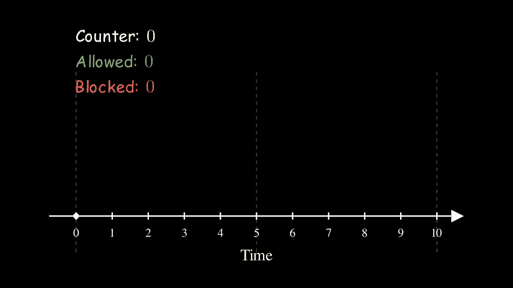
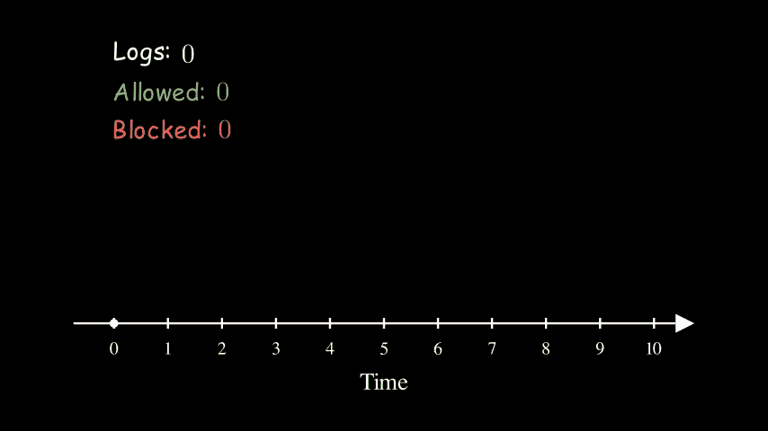
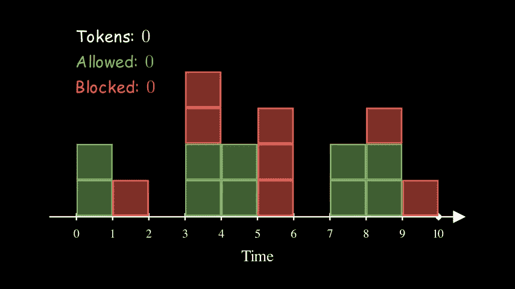

# 构建具有速率限制的安全多租户系统

> 原文：<https://betterprogramming.pub/building-a-safe-multi-tenant-system-with-rate-limiting-6114e5df3f3d>

## 什么是限速，如何正确使用


图为[梅尔·巴兰德](https://unsplash.com/@mael_balland?utm_source=unsplash&utm_medium=referral&utm_content=creditCopyText)在 [Unsplash](https://unsplash.com/s/photos/market?utm_source=unsplash&utm_medium=referral&utm_content=creditCopyText)

启动您的 web 服务后，您如何保护它免于过载？本文将讨论使用一种称为速率限制的常见技术来保护您的服务的选项。

我们有时想要阻塞请求有许多不同的原因。仅举几个例子:

*   我们希望防止嘈杂的邻居问题，这样那些产生过多请求的流氓客户端就不会给其他客户端带来问题。
*   机器人正在攻击我们的公共终端，窃取数据，我们希望阻止它们。

不管是什么原因，在这篇文章中，我们将探讨如何实施速率限制来防止这些不必要的情况发生。

我们将讨论三个主题:

1.  我们用什么来识别客户？
2.  一些必须知道的限速算法；
3.  使用多台应用服务器进行纵向扩展。

# 限速目标

在讨论速率限制算法之前，我们必须知道如何识别用户——我们应该对谁进行速率限制？

## 基于 IP 地址的速率限制

IP 地址是一个数字标签，我们用它来识别互联网上的设备。对我们来说，评估 IP 地址的限制听起来很自然。

问题是——有可能伪造 IP 地址吗？嗯，是的，但它不是微不足道的。

为了客户端和服务器建立连接，客户端和服务器需要经历一个[三次握手过程](https://www.geeksforgeeks.org/tcp-3-way-handshake-process/):

1.  客户端向服务器发送一个`SYN`包来开始连接
2.  服务器向客户机发回一个`SYN-ACK`包，确认它已经准备好建立连接
3.  客户端收到包并发回另一个`ACK`来启动连接

步骤 2 的问题是，如果客户端使用假 IP 地址发起连接，则无法成功建立网络连接。

出于这个原因，欺骗 IP 地址仅用于 [DOS 攻击](https://en.wikipedia.org/wiki/SYN_flood)，其目的是关闭服务，而不是窃取数据。这是一个独立的话题，我们今天不会在这里讨论。

对于其他合法的用例，为什么不总是根据 IP 地址进行速率限制呢？

IP 地址的另一个限制是它们不是唯一的。我们有众所周知的 [IPv4 地址耗尽](https://en.wikipedia.org/wiki/IPv4_address_exhaustion)问题。多个用户可以共享同一个 IP 地址。同一 ISP(互联网服务提供商)背后的用户可以共享同一个公有 IP。如果用户在 VPN 上，也会发生同样的情况。最后，对于移动用户，移动服务提供商也有一个有限的已知 IP 地址列表。

由于这个原因，基于 IP 地址实现速率限制可能不太有效，因为 IP 不能唯一地识别单个用户，而是一小群用户。

## 基于用户 ID 的速率限制

除了 IP 地址，我们还可以考虑基于用户 ID 的速率限制。

显然，这只有在系统需要登录时才有意义。例如，如果用户要求通过第二因素身份认证登录，那么我们可以可靠地识别用户。但是如果我们有一个不需要用户认证的面向公众的 API 端点，那么这就不是一个选项。

## 基于 API 密钥的速率限制

对于关键服务，我们可以为每个客户分配一个 API 密钥。为每个 API 键分配不同的访问速率也很常见，例如每天 300 个请求。

与用户 id 相比，使用 API 密钥会给用户带来更多的麻烦。因此，它也只对某些应用程序有意义。这些应用程序通常访问更有价值的数据或服务，它们通常带有价格标签。这里有几个例子:

*   [用于地图和导航的 Mapbox API](https://docs.mapbox.com/help/glossary/access-token/)
*   [Tinyurl](https://tinyurl.com/app/dev) 用于网址缩短
*   [云自然语言 API](https://cloud.google.com/natural-language/docs/) 用于自然语言处理

# 速率限制算法

在本节中，我们将讨论几种常用的速率限制算法、它们的差异和权衡:

*   固定窗口计数器
*   滑动原木
*   滑动窗口计数器
*   令牌桶

## 固定窗口计数器

我们为每个时间窗口的每个客户端记录一个计数器。每当 er 允许一个请求时，我们就撞击计数器，如果计数器达到极限，就阻塞请求。

这是一个每 5 秒钟 5 个请求的例子。每个框代表一个客户端请求。绿色方框表示允许，而红色方框表示阻止。在时间 5，当它进入新的时间窗口时，我们将计数器重置为 0。



## 滑动原木

不难看出，上面的固定窗口计数器算法并不是很准确。有两个明显的缺点:

*   对于具有持续高请求量的客户。请求可能在窗口开始时被允许；在窗户的尽头被挡住了。
*   对于有峰值流量的客户，我们可能会在短时间内收到大量流量。例如，如果一个客户端在一个窗口结束时发出 5 个请求，在下一个窗口开始时发出 5 个请求，那么服务器可以在很短的时间内收到 10 个请求(2x)。

为了解决这个问题，我们可以使用滑动日志算法。我们跟踪请求的时间戳列表，而不是跟踪计数器。

这里是同样的例子，每 5 秒钟 5 个请求。在时间 5，日志计数器从 5 减少到 3，因为前两个请求已经过期。



与固定窗口计数器相比，这种方法的一个缺点是它需要更多的存储器。如果请求率非常高，那么使用这种方法可能没有意义。

例如，假设我们有 100 万个客户端，我们希望允许每个客户端每天有 1000 个请求。不考虑哈希映射的开销，跟踪这些请求所需的内存为:

```
1 million * 1 thousand * 4 bytes = 4 gigabytes.
```

## 滑动窗口计数器

为了利用固定窗口和滑动窗口计数器的优点，我们可以使用这两者的混合方法。

继续上一节的例子。我们可以将窗口(一天)分成 24 个更小的窗口，每个窗口代表一个小时。现在，我们只需要记录 24 个计数器，而不必为每个客户端记录 1000 个时间戳。

为了检查我们是否应该允许新的请求，我们需要对所有的 24 个计数器求和，看看总和是否小于 1 千(极限)。

## 令牌桶

令牌桶算法类似于上面的固定窗口计数器算法，固定窗口计数器向上计数，而令牌桶向下计数。

对于每个客户端，我们创建一个带有令牌的桶。每有一个请求，我们就把令牌减一。当桶中不再有给定客户端的令牌时，我们阻塞请求。同时，代币以某个预定的速率被重新填充。

这是一个每 2 秒钟用 2 个代币重新装满一个桶的例子。桶的大小是 5。有趣的是，对于固定窗口计数器和滑动日志，这种配置的有效率与上面的其他两个动画相同。它们都是 1 QPS ( [查询/秒](https://en.wikipedia.org/wiki/Queries_per_second))。


到目前为止，桶从未满过(有 5 个代币)。这是因为我们的请求率一直很高。想象一下，如果服务器停止接收请求一段时间，桶最终会被填满。桶的大小本质上控制了我们允许的流量峰值。



总体而言，令牌桶算法更加灵活。它也没有预先定义的窗口，因此可以更好地分散来自多个客户端的请求高峰。

另一方面，由于它需要更多的写操作来更新令牌计数，因此计算开销更大。

令牌桶算法在业界被广泛使用。例如， [DynamoDB 使用令牌桶进行速率限制读取容量单位(RCU)](https://www.youtube.com/watch?v=yvBR71D0nAQ) 。

# 存储状态

在上面的讨论中，我们假设我们只有一个应用服务器，并将所有信息存储在内存中。在上一节中，我们假设我们只有一个应用服务器，并且我们将所有信息存储在该服务器的内存中。然而，在现实世界中，这种情况很少发生。在本节中，我们将讨论当我们有多台服务器时不同的纵向扩展选项。

## 在应用服务器中存储状态

通常，我们在应用服务器前面有一个负载平衡器。负载平衡有多种方法。出于本文的目的，我们将讨论两个:

*   一系列
*   粘性会话

关于粘性部分的更多信息，在下面的 AWS 文档中有很好的解释:[应用负载平衡器的粘性会话](https://docs.aws.amazon.com/elasticloadbalancing/latest/application/sticky-sessions.html)。关于循环法和不同变体的更多信息，“谷歌网站可靠性工程”一书[第 20 章:数据中心的负载平衡](https://sre.google/sre-book/load-balancing-datacenter/)有更多有见地的细节。

简而言之，这两种方法的区别在于请求是如何被路由的。如果我们有一个客户端发出 1000 个请求，我们有 10 台服务器。使用循环法，每台服务器大约会收到 100 个请求。使用粘性会话，来自该客户端的所有 1000 个请求都将被路由到同一个服务器。

对于循环调度，一种方法是将限制除以服务器数量。例如，如果我们希望将客户端的速率限制在 1000 QPS，而我们有 10 台服务器，则每台服务器可以独立地将客户端的速率限制在 100 QPS。现在，这不会给我们确定的结果，因为一个请求可能被一个服务器阻止，被下一个服务器接受。然而，这是一个非常好的近似，我们仍然可以保持简单的实现。

或者，如果我们确实想保持计数器同步，我们可以考虑使用一些分布式消息队列、领导者-追随者架构、 [gossip 协议](https://en.wikipedia.org/wiki/Gossip_protocol)等。

有了粘性会话，就更简单了。我们可以继续将计数器存储在应用服务器中，因为理想情况下，每个服务器都处理来自客户端子集的请求。

## **在外部数据存储器中存储状态**

除了将数据存储在应用服务器中，我们还可以将信息存储在单独的数据存储中，比如 [Redis](https://youtu.be/HnSb8DFU5UA) 。这样做有多种好处:

*   因为速率限制是一个独立的部分，所以更容易推理。
*   如果应用服务器停止运行，我们不会丢失任何数据。我们可以更准确地执行我们的限速政策。

然而，使用外部存储也有其利弊。

*   我们引入另一个失败点。如果我们的外部存储存在连接问题，该怎么办？在这种情况下，我们应该阻止还是允许请求？
*   这可能会导致延迟增加。网络调用比访问本地内存慢。最重要的是，让多个服务器访问相同的计数器，我们需要花更多的时间来处理竞争情况。

# 结论

在这篇文章中，我们讨论了速率限制的各个方面。

我们介绍了可用于识别客户机的不同属性:IP 地址、用户 ID 和 API 密钥。这些都是站在客户的角度看问题。但是我们也可以从服务器的角度来考虑同样的问题——在性能开始下降之前，服务器可以承受多少负载？这通常被称为甩负荷。对于那些想了解更多的人，这里有一个关于这个主题的有趣帖子:[使用减载来避免过载](https://aws.amazon.com/builders-library/using-load-shedding-to-avoid-overload/)。

然后我们讨论了 4 种速率限制算法，从最简单的固定窗口计数器到更复杂的令牌桶。为了完整起见，指出这里没有提到的另一种算法也很重要，即漏桶算法。它类似于令牌桶。对于那些有兴趣了解更多的人来说，[维基百科对其进行了详尽的解释](https://en.wikipedia.org/wiki/Leaky_bucket)。

最后，我们简要地讨论了我们可以采取的方法，以便在多个服务器之间扩展和协调速率限制工作。

使用分布式系统令人着迷的一点是，几乎没有绝对最优的解决方案。虽然这个话题从表面上看起来微不足道，但总会有取舍。

限速的问题也是如此。到处都有多种选择。全面理解它们是很有用的，这样我们就可以为我们的应用选择最佳选项。

# 下一步是什么

想玩更多不同类型的速率限制算法？上面模拟的源代码发表在 [GitHub](https://github.com/yzhong52/RateLimitingAnimations) 上。请随意更改配置，并更多地使用它们。

今天到此为止。感谢阅读，并希望它有所帮助！