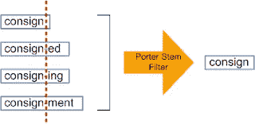
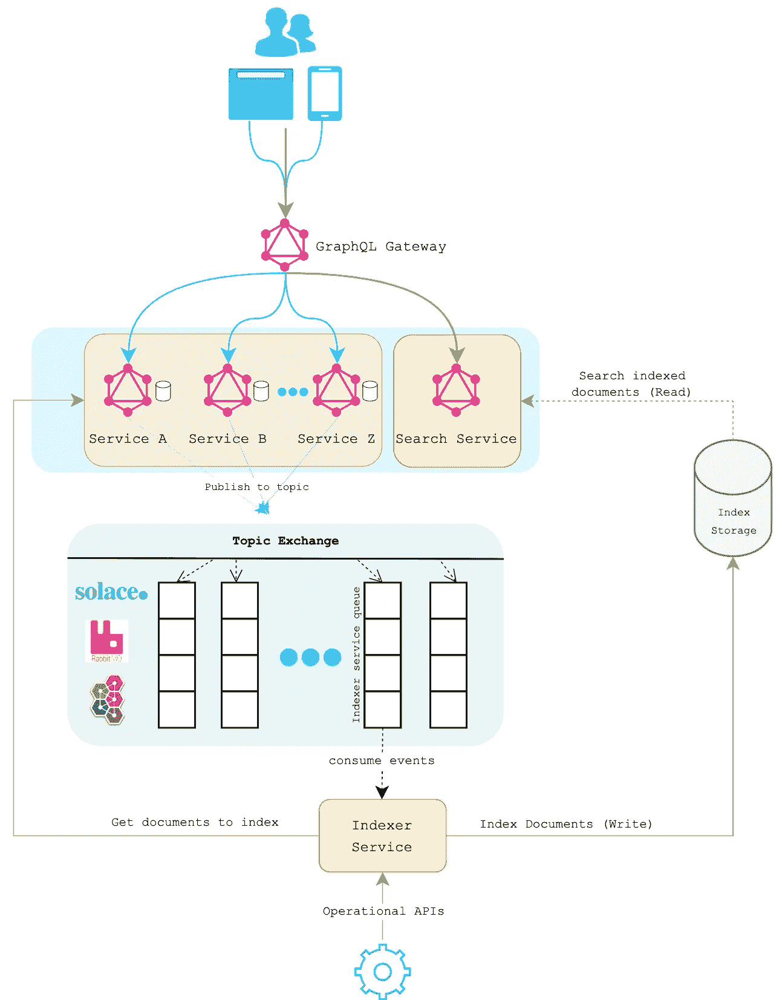

# 利用 Postgres 的全文搜索构建可扩展的事件驱动搜索架构

> 原文：<https://betterprogramming.pub/building-a-scalable-event-driven-search-architecture-with-postgres-full-text-search-4780b87a34ef>

## 用事件驱动架构设计基于 Postgres 的全文检索


全文搜索

各种规模和复杂性的软件项目都面临着构建可伸缩搜索解决方案的挑战。谁没见过使用 RDBMS SQL 语句运行搜索的应用程序？你可能想知道这是不是一个好的解决方案。嗯，看情况。

使用 SQL 执行搜索对于您的用例来说已经足够了，但是随着项目的增长和更多高级功能(同义词、多语言搜索，甚至启用机器学习等)的出现。)时，关系数据库可能就不够了。

PostgreSQL 支持全文搜索。全文索引允许对文档进行预处理，并保存索引以供以后快速搜索。

在某些情况下，PostgreSQL 全文搜索可能就足够了，当然应该考虑使用。出于这个原因和其他原因，许多项目开始使用他们的数据库，随着时间的推移，他们转向像 ElasticSearch 或 Solr 这样的搜索引擎。

> “……全文搜索是指在全文数据库中搜索单个计算机存储的文档或集合的技术……”
> 
> —维基百科

最近，我开始研究全文搜索选项。用例是在由三个可搜索字段组成的文档中搜索包含文档 ID 的字符串，这三个字段是标题和描述(使用全文搜索)以及文档 ID。搜索应该在不超过 200 毫秒的时间内运行超过一百万个文档。

# 术语

## 堵塞物

这是一个将单词简化为词干，然后添加到后缀、前缀或词根的过程，称为引理，以确保该单词的变体在搜索过程中与结果匹配。例如，`Managing`、`Manager`、`Management`可以来源于单词`Manag`，搜索单词`manag`将返回包含该单词任何变体的结果。[在线斯特梅尔工具](https://toolsaur.com/en/porter-stemmer)



来源:[https://thinkinfo . com/difference-between-stemming-and-lemmatizing-and-where-to-use/](https://thinkinfi.com/difference-between-stemming-and-lemmatizing-and-where-to-use/)

## NGram

它就像一个在单词上移动的滑动窗口——一个特定长度的连续字符序列。例如，术语`word`将变成`{'w', 'wo, 'wor', 'ord', 'rd'}`。NGram 可以用来搜索单词的各个部分，甚至是两部分之间的部分。`NGram`最常用的类型是`Trigram`。

## 模糊

“模糊”是指在比较两个字符串时，解决方案不寻找完美的逐位匹配。相反，它们允许一些不匹配(或“模糊”)。例如，搜索单词`succesful`也会返回包含`successful`的结果。常见的应用包括拼写检查和垃圾邮件过滤。

## 类似

两个词的相似性可以通过计算它们共有的`trigrams`的数量来衡量。这个简单的想法对于衡量很多自然语言中单词的相似度非常有效。

## 等级

排名试图测量文档与特定查询的相关程度，以便当有许多匹配时，最相关的文档可以首先显示。Postgres 支持排名和加权排名。通常，权重用于标记文档中特殊区域的单词，如标题或初始摘要，以便它们可以比文档正文中的单词更重要或更不重要。

# 让我们停一会儿

在我们进一步讨论之前，在匆忙实现全文搜索之前，有几点值得考虑。

## 了解数据

在实现全文搜索之前，我们应该知道数据是什么样的，并理解业务需求。

## 数据量

关于数据大小，需要考虑不同的因素，包括存储、保留策略、速度、索引等。可以说，无论数据大小如何，您都需要这种规划，但是必须承认两件事:

1.  规模增加了复杂性。
2.  较小的规模意味着对架构错误(长时间运行的查询、丢失索引等)更宽容。)

关于浏览大数据集所需的技术流程，大小很重要。这关系到数据的规划和处理。这关系到工具的选择和数据库的选择。

## 业务需求和功能

我们必须非常清楚我们希望我们的搜索引擎实现的目标。我们的搜索引擎应该覆盖什么样的信息需求？谁使用搜索引擎？

除了全文搜索，我们还应该提供哪些功能？哪些字段应该被索引/搜索？应该支持哪些搜索类型？此外，除了搜索，我们是否希望允许其他功能，如过滤？

最后，这将我带到最后一点，定义我们的关键性能指标(KPI)来衡量我们的搜索实现的成功。

## KPI

KPI 是由软件测试团队测量和分析的详细规范，以确保过程符合业务目标。此外，他们帮助团队在产品性能不符合既定目标的情况下采取必要的措施。

我们的目标是在搜索结果的顶部向客户展示最佳匹配结果。在大多数情况下，如果想要的结果不在搜索页面的前 X 个结果中，或者不在搜索结果的前三页中，客户就会离开。

我们知道单个客户不能拥有超过 50 万个文档；平均而言，客户拥有 50K 个文档。此外，作为一项业务要求，搜索响应时间不得超过 200 毫秒。因此，我们决定使用一百万个文档，同时保持 200 毫秒的响应时间作为我们性能测试的基线。

# 为什么是 Postgres 而不是 ElasticSearch？

ElasticSearch 仅针对搜索进行了优化，但设置和维护基础设施可能非常耗时。除此之外，自己设置它需要专用的服务器或服务，这比 PostgreSQL 选项更昂贵。此外，在 ElasticSearch 中，模式更改需要完全重建索引。默认情况下，返回的结果按相关性排序，最相关的文档排在最前面。但是，按字段值排序也是可能的。ElasticSearch 还支持按字段过滤和开箱即用的分页。

我们认为团队已经熟悉 Postgres，它已经集成到我们的产品中，使它成为一个更便宜和更快的选择，因为它不需要任何额外的设置和维护。我们知道数据量会随着时间的推移而增长。然而，我们也意识到，随着当前数据的增长，我们的索引和搜索仍将在 [ElasticSearch](https://elasticsearch-benchmarks.elastic.co/index.html#tracks/pmc/nightly/30d) 的范围内。尽管 PostgreSQL 速度较慢，结果可能稍差，并且可能受到容量的限制，但在相当大的范围内，它仍然可能“足够好”。

# 体系结构



图一。基于事件驱动架构的 Postgres 全文搜索

[](/cqrs-software-architecture-pattern-the-good-the-bad-and-the-ugly-e9d6e7a34daf) [## CQRS 软件架构模式:好的、坏的和丑陋的

### 用 CQRS 和事务发件箱模式设计可伸缩架构

better 编程. pub](/cqrs-software-architecture-pattern-the-good-the-bad-and-the-ugly-e9d6e7a34daf) 

## 索引服务(写)

索引服务使用包含需要索引的文档数据的事件。任何需要其文档可被搜索的服务都需要发布符合由索引服务维护的预定义模式的事件。

```
{
 updated_on: number;
 document_id: string;
 document_type: string;
 document_title: string;
 document_description: string;
 customer_id: string;
 metadata: object; 
}
```

除了消费事件之外，索引服务还提供操作 API，如运行真空、健康检查、重新索引单个或多个文档、同步等。

## 搜索服务(阅读)

搜索服务(不言自明)负责搜索我们产品支持的所有类型的文档。它提供了分页、排序(默认是根据相关性)和过滤等功能。

## 读写分离

分成两个微服务背后的动机，一个微服务用于索引文档。另一个用于搜索文档，允许我们适当地缩放。索引服务应该比搜索服务更加努力。我们不希望大量文档的索引影响最终用户的搜索功能。因此，让它单独部署而不共享相同的资源和连接池是我们要走的路。

# 索引存储

在研究了如何在 Postgres 全文搜索过程中优化我们的查询之后，我们得到了以下结果:

*   我们在表中添加了一个新列`ts`，用于存储预处理后的搜索文档(即词位列表)。`ts`是一个[生成的列](https://www.postgresql.org/docs/current/ddl-generated-columns.html)(Postgres 12 中的新列)，自动与源数据同步。然后我们在类型为`tsvector`的`ts`列上创建了一个 [GIN 索引](https://www.postgresql.org/docs/current/textsearch-indexes.html)。
*   为了支持模糊搜索，我们使用了`pg_trgm` Postgres 扩展，并在表中添加了一个`words`列来存储可搜索的文本。该列存储可搜索字段的串联字符串。
*   最后，`pg_trgm`扩展提供了 GiST 和 GIN 索引操作符类。该索引允许我们在`words`文本列上创建一个索引，用于快速相似性搜索。

# 基准测试

我们在具有以下规格 CPU i9 2.3 GHz (4 个内核/线程)和 8GB RAM 的计算机上运行了基准测试。

我们用 350 万个文档填充了索引存储。我们对一个拥有一百万个索引文档的客户进行了基准测试。

我们测试了下面的查询，它使用 [pgbench](https://www.postgresql.org/docs/current/pgbench.html) 工具返回 436 行。

我们能够实现每秒 170 次交易。

```
scaling factor: 1
query mode: simple
number of clients: 20
number of threads: 20
duration: 60 s
number of transactions actually processed: 10187
latency average = 58.925 ms
initial connection time = 19.787 mstps = 169.707403 (without initial connection time)
```

然而，大量数据存储在数据库中，随着数据的增长，性能和可扩展性会受到影响。分区通过将大表分成较小的表来解决这个问题，减少了内存交换问题和表扫描，并提高了性能。

在对索引存储表进行分区之后，我们在查询性能上实现了将近 60%的提高。

```
scaling factor: 1
query mode: simple
number of clients: 20
number of threads: 20
duration: 60 s
number of transactions actually processed: 14936
latency average = 46.390 ms
initial connection time = 26.722 ms
tps = 248.933333 (without initial connection time)
```

下面是用`EXPLAIN ANALYZE`运行查询的样子:

```
With partitioning
"Planning Time: 0.230 ms"
*"Execution Time: 25.808 ms"*Without partitioning
"Planning Time: 0.204 ms"
*"Execution Time: 32.868 ms"*
```

# 结论

Postgres 提供了广泛的工具来支持全文搜索。在本文中，您已经看到了我们如何通过将读写分离来将全文搜索集成到我们的产品中，以及一些 FTS 功能是如何工作的。您还了解了如何利用带有 GIN 索引的`SearchVectorField` ( `tsvector`)类来优化性能，以及如何结合表分区来进一步扩展。

如果你已经有 Postgres 作为你的堆栈的一部分，在使用一个需要更多关注操作复杂性的外部/昂贵的替代方案之前，值得考虑对它进行试验。

因此，如果您的项目没有数千万条记录或非常大规模的数据，Postgres 全文搜索将是一个很好的选择。

# 进一步阅读

*   [Postgres 分区](https://hevodata.com/learn/postgresql-partitions/)
*   [Postgres 全文搜索控件](https://www.postgresql.org/docs/current/textsearch-controls.html)
*   [Postgres pg_trgm 和三元模型概念](https://www.postgresql.org/docs/9.1/pgtrgm.html)
*   [Postgres 中的全文搜索优化](https://www.alibabacloud.com/blog/optimizations-with-full-text-search-in-postgresql_595339)
*   [带 pg_trgm 的 Postgres 模糊搜索](https://towardsdatascience.com/postgres-fuzzy-search-with-pg-trgm-smart-database-guesses-what-you-want-and-returns-cat-food-4b174d9bede8)

感谢阅读！