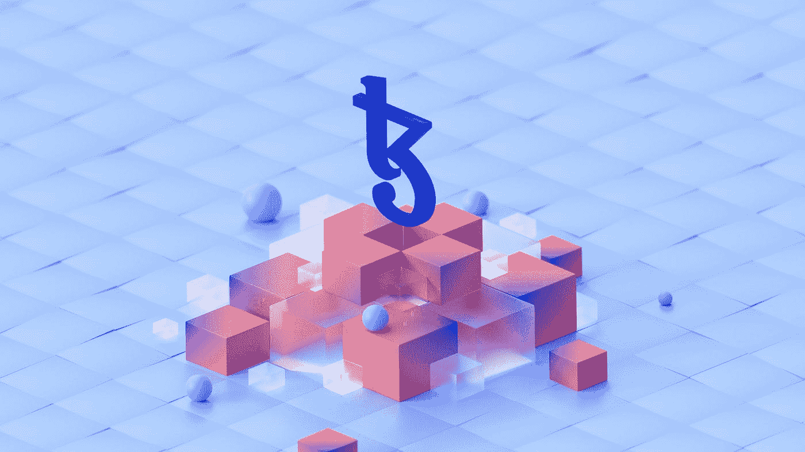
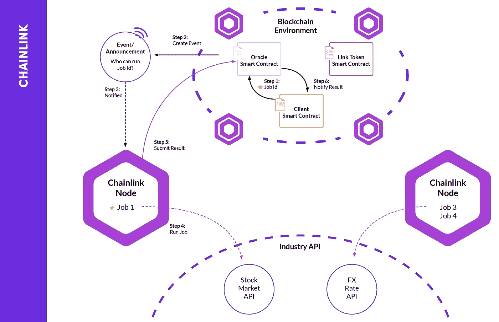
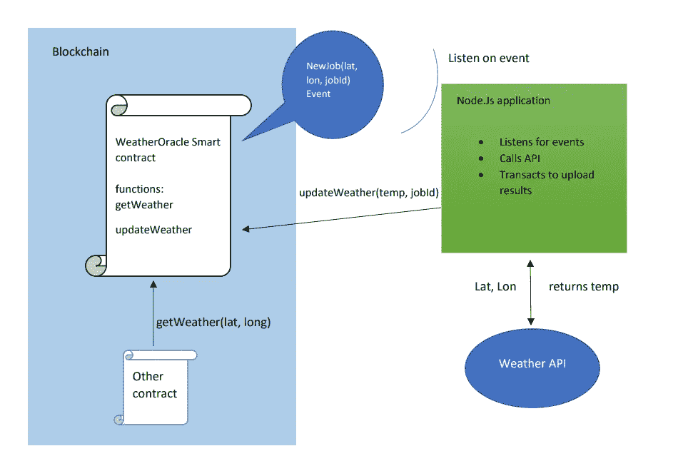

# 用 Solidity 和 Node.js 搭建一个简单的区块链 Oracle

> 原文：<https://betterprogramming.pub/building-a-simple-blockchain-oracle-with-solidity-and-node-js-29eacdad31f1>

## 通过使用 solidity 和 node.js 构建一个简单的天气预报，了解区块链 oracle 如何将 web 2.0 数据引入 web 3.0



由[泰佐斯](https://unsplash.com/@tezos?utm_source=medium&utm_medium=referral)在 [Unsplash](https://unsplash.com?utm_source=medium&utm_medium=referral) 上拍摄的照片

[区块链上的甲骨文](https://chain.link/education/blockchain-oracles)是允许区块链世界与网络其余部分的数据接口的框架，我们称之为 web 2.0 世界。随着智能合约应用的不断扩展，处理独特用例所需的数据种类也将不断增加。

事实是，web 2.0 和 web 3.0 是两个不同的网络，目前大多数有用的数据都存储在 web 2.0 上。通过创建一套协议使智能合约能够访问这些数据，新一代的网络、系统设计和区块链将会出现。在我的上一篇文章中，我大致写了这个问题:

[](/a-web-2-0-developers-guide-to-web-3-0-18447da4325d) [## Web 3.0 的 Web 2.0 开发者指南

### 了解区块链和 Web 3.0 如何塑造后端软件开发的下一个迭代

better 编程. pub](/a-web-2-0-developers-guide-to-web-3-0-18447da4325d) 

当前的协议已经倾向于 oracle 的概念来构建混合系统，这些系统依赖于智能合约和链外 API 来桥接 web 2.0 数据以及其他区块链。最突出的 oracle 是 [Chainlink](https://www.investopedia.com/chainlink-link-definition-5217559) ，它提供定价数据、到其他区块链的连接、对大多数 API 的访问，以及各种其他数据源。

其他主要的例子包括令牌桥，它允许在链外服务的帮助下在链之间移动令牌和数据。随着时间的推移，更多独特的神谕可能会出现。

目前，像 [Singularity NET](https://singularitynet.io/aboutus/) 这样的组织正在致力于构建神谕，这些神谕可以创建市场，并方便地访问提供服务的 API，比如这个具体例子中的人工智能推理。

在本文中，我的目标是通过浏览当前用例的一般架构，并使用 solidity 和 node.js 构建一个简单的链上天气 oracle 来给出 oracle 概念的一般定义，以进一步形象化该协议如何工作。

# 事件驱动的 Oracle 设计



来自[https://www . kaleido . io/区块链-blog/how-chain link-works-under-covers](https://www.kaleido.io/blockchain-blog/how-chainlink-works-under-the-covers)

当处理使用链外服务来代表智能合约执行某些操作的问题时，要记住的最重要的事情是，在智能合约和服务之间没有正式的消息传递过程。根据这一假设，我们知道智能契约不能“推送”，因此服务必须侦听、观察或拉取。

只有两个链上项目是服务能够观察的，状态变量和事件。观察状态变量很麻烦，因为它需要与契约进行许多交互。另一方面，事件不需要直接交互。

智能合约事件是这样发出的:

```
emit newEvent(block.timestamp)
```

一个事件可以被看作是由开发人员定义的智能合约操作的日志。就像其他类型的日志一样，其他服务可以订阅这个提要来观察特定类型的事件，从它们的参数中收集数据，并对它们做任何想做的事情。任何有权访问区块链的人都可以看到这些日志，并且可以通过 web3.js.

这样的库进行访问。鉴于这种独特的通信系统，智能合同可以廉价地“通知”外部世界的服务事件，或者在 oracle 案例中需要完成的作业。理解事件和链上链下消息传递是 oracle 设计中最重要的部分。

一旦服务发现了一个新事件，触发了它的动作，它就可以获取事件中有价值的数据和一个惟一的作业 id，并像任何其他程序一样执行离线动作。

一旦任务完成，服务可以使用 web3 库来处理合同。典型的事务可以“上传”带有作业 id 的请求/事件的结果，因此智能契约可以继续处理它计划对这些离线数据做的任何事情。将所有这些放在一起看起来像这样:

1.Oracle smart contract 发出一个事件，其中包含有关作业的信息。

2.离线 oracle 服务监听事件，并在事件被触发时提取信息。

3.离线 oracle 与任何服务或数据交互以接收结果。

4。oracle 与 oracle smart contract 进行离线交易，以更新作业数据。

5.智能合约生态系统将数据用于任何需要它的地方。

当然，这是对 oracle 设计的过度简化，如 Chainlink，它包括许多节点和共识协议，以确保 oracle 数据是分散的。虽然有趣且重要，但简单的理解将是构建该概念的最佳背景。

# 构建简单的 Oracle

为了形象化 oracle 的概念，我们可以构建一个简单的单一服务、单一节点 oracle，让这个概念不那么令人生畏。

我选择了像天气这样的服务，因为输入数据很容易传输，而且 API 非常丰富。考虑到我们对事件驱动的 oracle 的理解，我们的系统设计应该是这样的



天气预报系统图

如您所见，我们有一个 solidity 契约和一个 node.js 程序，因此该设计的要求很简单:

1.  可靠智能合同
2.  节点. js
3.  Web3.js
4.  一个天气 API(使用 [OpenWeather](https://openweathermap.org/current) )

首先，我们可以进入智能合同:

我已经一行一行地提供了更详细的行内注释，但是总结一下我们的合同是使用几个映射来保存`jobIds(true = complete, false = incomplete)`的状态和作业的结果。

契约提供了一个函数来触发作业`getWeather`，它将位置数据作为参数，创建一个作业 id，并发出一个包含相关位置和作业信息的事件。

这个 oracle 的一个重要特性是 updateWeather 函数上的操作符修饰符。如果只允许服务与此函数交互，则需要此修饰符，否则任何人都可以更新作业数据。

现在我们有了区块链 oracle 合同，可以在 node.js 中构建一个离线数据提供程序，如下所示:

除了注释中的细节，总结一下 node.js 服务，web3 提供者被设置为使用我们的网络正在使用的任何 URL 提供者。注意，交互的钱包地址必须是一个操作者，我们必须确保我们的 web3 提供者包括该帐户。

使用我们订阅的 web3 库收听事件。对于新事件，代码使用内置的 API 接口和事件参数来获取我们请求的天气数据。

根据该调用的结果，`web3`库通过我们的 contracts abi 调用`updateWeather`函数，将结果上传到合同。一旦成功，初始设计要求都已满足，智能合同可以访问该作业的结果，以满足任何需要。虽然这是一个简单的例子，但它可能会让你感觉到如何为独特的用例构建简单的链外接口。

# 结论

总之，区块链甲骨文公司准备向 web 2.0 数据源开放 web 3.0 世界。这反过来允许 web 3.0 开始实现更多的优势。事件驱动的 oracle 设计创建了一个将智能合约功能与传统软件工程技术相结合的框架。

随着这一概念的扩展，一个完整的生态系统可能会出现，允许最平滑的数据访问网络，因为 solidity 使与其他智能合约(未来的 API)的交互变得非常简单。

对这个生态系统做出贡献可能会有很大的机会，从一个像天气这样简单的应用程序开始是深入探索并发现新事物的第一步

```
**Want to Connect?**Connect with me on [LinkedIn](https://www.linkedin.com/in/ian-rowan/) to share ideas and opportunities!
```

# 资源

[1][https://chain.link/education/blockchain-oracles](https://chain.link/education/blockchain-oracles)

[2][https://medium . com/better-programming/a-we b-2-0-developers-guide-to-we b-3-0-18447 da 4325d](https://medium.com/better-programming/a-web-2-0-developers-guide-to-web-3-0-18447da4325d)

[3][https://www . investopedia . com/chain link-link-definition-5217559](https://www.investopedia.com/chainlink-link-definition-5217559)

[4][https://www . kaleido . io/区块链-blog/how-chain link-works-under-the-covers](https://www.kaleido.io/blockchain-blog/how-chainlink-works-under-the-covers)

[5][https://openweathermap.org/current](https://openweathermap.org/current)