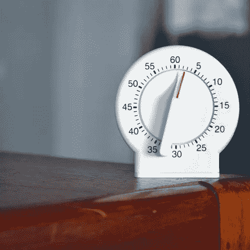

# 用 React 构建一个简单的倒计时器

> 原文：<https://betterprogramming.pub/building-a-simple-countdown-timer-with-react-4ca32763dda7>

## 如何为密室逃脱游戏创建计时器



照片由 [Marcelo Leal](https://unsplash.com/photos/vZawEq0Eexo) 从 [Unsplash](https://unsplash.com/photos/vZawEq0Eexo) 拍摄

我正在 React 中开发一个游戏，在这个游戏中，你为了逃离房间而与时间赛跑。这个游戏的核心有一个简单的概念:如果你没有在时间用完之前离开房间，你就输了。

总而言之，创建一个计时器并不是最复杂的问题，但是它提出了一些我最初没有想到的有趣的障碍。因此，我想记下我的一步一步的过程。

# 我想要什么

我决定为我的游戏设置一个三分钟的计时器。当你点击“开始游戏”时，我需要游戏板出现，还有一个显示`Time Remaining: 3:00`的计时器。我要这个马上开始倒计时。一旦开始，我不想让它停下来，直到它读到`0:00`。一旦发生这种情况，我希望组件转而渲染`Times Up!`。

# 我需要什么

马上，我知道我想让它成为一个独立的组件。这样，每次更新计时器时，只会重新呈现计时器。我将把这个组件称为`Timer`，我将把它渲染成我的游戏室的兄弟。现在，我不需要将任何道具传递给这个组件。但是如果我要增加难度，我想我可以把开始时间传递给这个组件。目前，我希望游戏总是持续三分钟，所以我不会担心这一点。

我知道这个组件需要状态管理，所以我需要构建一个类组件的基本结构。

显然，这除了在页面上显示一个静态语句`Time Remaining: 3:00`之外什么也不会做，但是这是一个很好的起点。为了不断更新时间，我知道我需要在状态中设置它。我不能将`3:00`存储在状态中，并期望能从中减去 1 以得到`2:59`。有几个原因可以解释为什么这样做不行，但最简单的一个原因是`3:00`不是一个数字。因此，它必须以字符串的形式保存在 state 中，因此，我不能以这种方式递减它。

这意味着我将需要一个`minutes`键和一个`seconds`键，而不是只有一个`time`键。

```
state = {
  minutes: 3,
  seconds: 0
}
```

到目前为止足够简单，虽然现在我应该在我的渲染中使用这个新创建的状态。

```
render() {
  const { minutes, seconds } = this.state return (
    <div>
      <h1>Time Remaining: { minutes }:{ seconds }</h1>
    </div>
  )
}
```

在渲染上述内容时，我注意到了第一个小障碍。在初始渲染时，我们将看到`Time Remaining: 3:0`。不理想。我选择在 return 语句中用一个简单的三元组来处理这个问题。

```
{ minutes }:{ seconds < 10 ? `0${ seconds }` : seconds }
```

这将确保秒始终显示为两位数。完美！现在让我们开始让这个时钟滴答作响。

# 滴答滴答

我希望组件一挂载，计时器就开始倒计时，我知道我希望计时器每秒钟递减一次。这意味着我需要在一个`componentDidMount`中使用一个`setInterval`。`setInterval`将负责设置我的`seconds`的状态，使其等于比之前的状态少 1。这应该是这样的:

```
componentDidMount() {
  this.myInterval = setInterval(() => {
    this.setState(({ seconds }) => ({
      seconds: seconds - 1
    }))
  }, 1000)
}
```

好了，这是一个开始。但是因为我们从零秒开始计时，我们立即进入负数，这不是我们在这里想要的。在`setInterval`内部，我需要设置一个 if 语句，检查状态是否被设置为负数。如果是，我需要将我的`seconds`的状态设置为 59，而不是那个负数。除了把秒变回 59，我还应该借此机会减少我的分钟数。

对于分钟，我将再次需要说明当这些进入负片时发生了什么，但它与秒钟略有不同。一旦我的计时器到了零分钟，它仍然需要倒数最后一分钟的秒数。一旦这些秒过了零，我们不想从分钟中减去一秒，然后将秒重置为 59——我们希望计时器停止。我们可以通过清除间隔来解决这个问题。

```
componentDidMount() {
  this.myInterval = setInterval(() => {
    const { seconds, minutes } = this.state if (seconds > 0) {
      this.setState(({ seconds }) => ({
        seconds: seconds - 1
      }))
    } if (seconds === 0) {
      if (minutes === 0) {
        clearInterval(this.myInterval)
      } else {
        this.setState(({ minutes }) => ({
          minutes: minutes - 1,
          seconds: 59
        }))
      }
    }
  }, 1000)
}
```

完美！组件一安装，我们的倒计时就开始了，然后当它到达`0:00`时就结束了。这几乎正是我们一直在寻找的。我只需要解决一个问题——当计时器到达`0:00`时，从屏幕上移除计时器，转而呈现`Times Up!`。

为此，我们只需要在我的 return 语句中添加另一个简单的三元组来检查分钟和秒钟是否都设置为零。

另一件要考虑的事情是我们在`componentDidMount`中设置间隔。因此，如果这个组件被卸载，计时器将继续计时。这没什么大不了的，因为我们已经将它设置为在超时后停止，但是如果计时器被卸载，它也应该停止。添加一个简单的`componentWillUnmount`来清除间隔将为我们处理这个问题。

在所有这些之后，下面是我最后得到的代码:

总而言之，这是一个相当简单的组件，我想把它包含在我的项目中，但它带来了一些障碍，这是我第一次想到如何在我的游戏中实现该功能时没有预料到的。