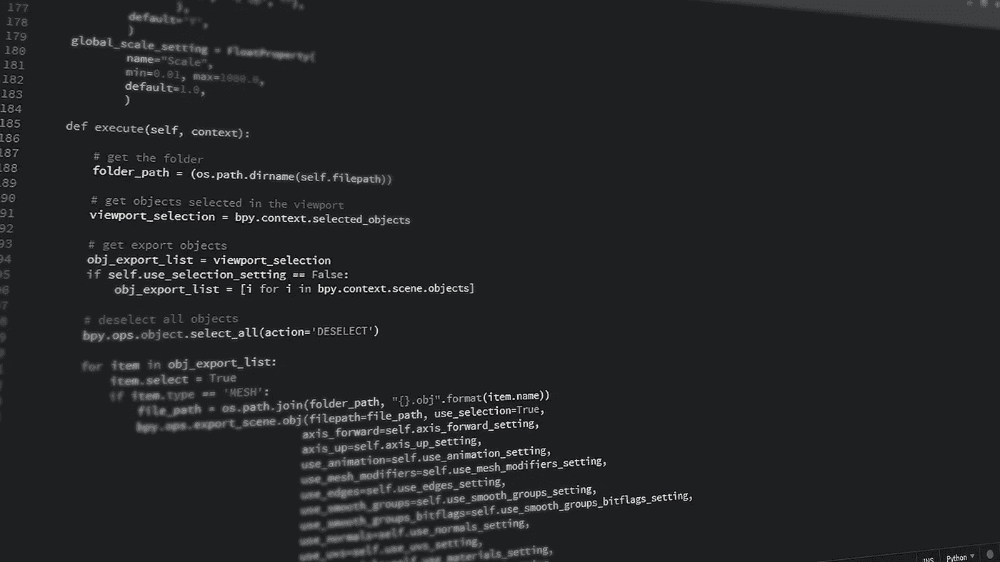

# 用 Python 构建一个简单的猜谜游戏

> 原文：<https://betterprogramming.pub/building-a-simple-guessing-game-in-python-e39058a8cbcf>

## 完全的初学者指南

学分:[约翰逊·马丁](https://pixabay.com/photos/code-programming-python-1084923/)

在这一块，你将学习如何用 Python 制作一个简单的高低猜谜游戏。

# 概念

用户将猜测一个数字。如果他们的猜测正确，他们就赢了。如果不正确，程序会告诉他们根据数字猜高或低。这将重复进行，直到用户获胜。

# Python 3 入门

首先，如果你还没有安装 Python，你需要在你的电脑上安装它。你可以从 Python 网站来做这件事。对于本教程，您需要最新版本的 Python 3。(版本 3.x.x)

确保选中将 Python 添加到 PATH 变量的复选框。如果不这样做，程序就很难运行。

现在，在你的设备上打开一个文本/代码编辑器。我个人用[括号](http://brackets.io/)。Windows 预装了记事本。Mac OS 包括“文本编辑”。Linux 用户可以使用 [Vim](https://www.vim.org/) 。

打开文本编辑器后，保存一个新文件。我会把它命名为`main.py`，但是你可以随便叫它什么，只要它以`.py`结尾。

# 编码

本教程的说明将作为注释包含在代码本身中。在 Python 中，注释以`#`开始，一直延续到行尾。

另外，你可以随意修改你程序中的任何内容。

例如，您可以使正确的数字介于 1 和 100 之间，而不是 1 和 10 之间。你可以改变程序在`print()`函数中所说的内容。无论你想要什么，现在都是你的代码了。

# 运行您的程序

根据您的操作系统，打开命令提示符(Windows/Linux)或终端(Mac)。按顺序尝试以下每个命令。如果 Python 安装正确，至少其中一个应该可以工作。

确保用 Python 文件的完整路径替换了`C:/Users/username/Desktop/main.py`。

一旦你的程序运行，测试它！摆弄几下。完成后，您可以通过按向上箭头键复制上一个命令，然后按 Enter 键来再次运行它。

如果你对本教程有任何疑问，请告诉我，我会尽力帮助你。下面是没有任何注释的代码版本。

# 资源

*   [下载 Python](https://www.python.org/downloads/)
*   [括号代码编辑器](http://brackets.io/)
*   [包含主代码的 GitHub gist】](https://gist.github.com/bsoyka/e2a3361d3a5691f3fce80694b2543574)
*   [包含命令的 GitHub gist】](https://gist.github.com/bsoyka/72c8091ad2ef171a362916c826adacb8)
*   [GitHub gist 包含不带注释的主代码](https://gist.github.com/bsoyka/a253dd91974d2b91010c85064480e4cb)