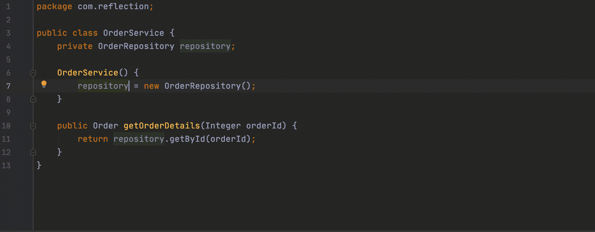
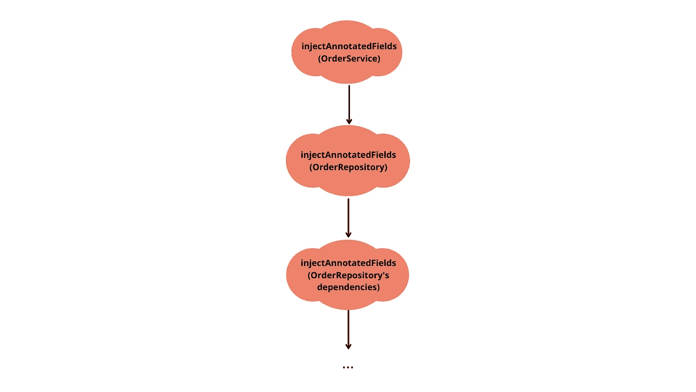

# 用 Java 构建一个简单的类似 Spring 的依赖注入框架

> 原文：<https://betterprogramming.pub/building-a-simple-spring-like-dependency-injection-framework-in-java-5d91254d2dbf>

## 结合反射和注释来构建强大的库和框架


照片由[Unsplash](https://unsplash.com/@ourlifeinpixels?utm_source=unsplash&utm_medium=referral&utm_content=creditCopyText)上的我们的生活像素

像 Spring，Hibernate 等框架。让 java 程序员的生活变得简单。这些框架给了我们很多超能力。例如，你可以在 spring 中用一个`Autowired`注释神奇地注入对象。

使用 hibernate，您可以简单地在关系数据库中持久化对象，这是一个完全不同的范例。

这个魔法的背后是什么？

嗯，所有这些都是通过 java 反射和注释实现的。

像 Intellij Idea 和 Eclipse 这样的 ide 在幕后使用反射来为我们提供所有的智能。Spring、Hibernate 和 Lombok 等框架也使用反射和注释来加速和简化 Java 编程。

在本文中，我们将拿出我们的魔棒，学习如何施咒凭空构建对象——我们将在反射和注释的帮助下创建一个类似 Spring 的迷你版依赖注入框架。

目的是让你习惯于反射和注释，并且给你足够的实践理解来自己构建这种框架。给你的下一个项目加点魔法。

# 反思与注释初级读本

## 反思:

Java 反射 API 允许我们检查和改变类、接口、字段和方法的运行时属性。这些都捆绑在`[java.lang.reflect](https://docs.oracle.com/en/java/javase/11/docs/api/java.base/java/lang/reflect/package-summary.html)`包中。

反思的中坚力量是`java.lang.Class`。正在运行的 Java 应用程序中的所有类和接口都有一个该类的对应实例。`Class` 当类被加载到 JVM 中时，实例被自动构造。

创建`Class`实例有多种方法。

我们可以使用`forName()`类的静态方法。

```
Class<?> clazz = Class.forName("java.lang.String")
```

另一种方式是通过调用对象上的`getClass()`方法。

```
Class<?> clazz = object.getClass()
```

类对象提供了多种方法来访问类的运行时信息。这里有一些例子。

我们不可能在这篇博客中涵盖所有的功能。你可以参考这里了解更多:[https://www.baeldung.com/java-reflection](https://www.baeldung.com/java-reflection)。

## **注释:**

注释用于定义类、方法、字段等的附加元数据信息。，可以在运行时通过反射读取。注释本身对程序的执行方式没有任何影响。

Java 中有一些内置的注释。一些例子。我们还可以创建自定义注释。在下一节中，我们将看到如何使用自定义注释和反射来编写强大的代码。

# **搭建框架**

这里有一个简单的例子让我们开始。我们有一个`OrderService`类，它提供一个 API 来使用订单 id 获取订单细节。`OrderService`在内部使用`OrderRepository`类从数据存储中获取细节。

让我们测试一下代码是否有效。

到目前为止，一切顺利！我们得到了预期的产量。

```
Id: 1, description: Special Order, price: 10.0
```

后来，您遇到了[依赖注入](https://en.wikipedia.org/wiki/Dependency_injection#:~:text=In%20software%20engineering%2C%20dependency%20injection,object%20is%20called%20a%20service.)模式，并了解了它的好处。现在您想在这个项目中引入 DI，并围绕它构建一个轻量级框架。

那么我们该如何着手呢？我们应该删除依赖关系的所有直接实例化，而是让框架创建和注入依赖关系。

首先，让我们移除`OrderService`中`OrderRepository`的实例化，并用`SimplyAutoWired`注释来注释该字段。我们期待框架为我们注入`OrderRepository`。



现在声明自定义注释`SimplyAutoWired`。使用 ***@interface* 关键字声明注释。**

你注意到它上面的两个附加注释了吗？这些应用于其他注释的内置注释被称为[元注释](https://dzone.com/articles/what-are-meta-annotations-in-java)。

第一个注释声明我们只能将`SimplyAutoWired`应用于字段，第二个注释指定它具有运行时可见性。注释没有任何方法，它只是一个简单的标记。

现在我们已经准备好了注释，让我们创建一个类`ApplicationContext`，它将负责实例化和组装对象。

我们希望实现这样的目标。

```
ApplicationContext applicationContext = new ApplicationContext();
orderService = **applicationContext.getInstance(OrderService.class);**
```

我们正在使用该类的`getConstructor`方法获取该类的公共默认构造函数。通过使用构造函数，我们创建了一个实例。

现在我们将实现`injectAnnotatedFields`方法，它将实例化并注入类中用我们的`SimplyAutoWired`注释标注的字段。

这里我们可以通过使用 Java 的反射 API 来读取自定义注释。使用字段类中的`isAnnotationPresent()`方法，我们检查字段是否用`SimplyAutoWired`注释进行了注释。

字段可能是私有的，所以在用它的实例设置字段之前，我们将*可访问的*标志设置为真。现在，我们将递归调用`injectAnnotatedFields`。



最后，我们可以使用`applicationContext`来获得一个实例`OrderService`。

# 进一步增强

到目前为止，我们已经看到了如何创建定制注释。我们还看到了如何将它们与反射 API 一起使用，以便于框架创建实例并将依赖项注入其中。

现在我们将放一些铃铛和哨子。

根据 [Spring 文档](http://docs.spring.io/spring/docs/3.0.0.M3/reference/html/ch04s12.html)Spring bean 在默认情况下是单件的。

然而，每次调用`getInstance`方法时，我们都在创建新的实例，这是低效的。

此外，DI 框架还应该在*创建*、*编排*和*销毁方面对对象的生命周期拥有完全的控制权。*

所以我们会做以下改进。

1.  创建一次对象，然后重用它们。
2.  当应用程序启动时，通过定位和注册所有组件来控制对象的创建。

但是首先，我们需要告诉框架，它应该注册哪些组件，应该在哪些包中搜索。

为了显示要注册哪些类，我们将创建一个新的注释`@SimpleComponent`。

```
@SimpleComponent
class OrderService {
  ...
}
```

为了存储要扫描的包的值，我们将添加另一个注释`@ComponentScan`。以前，我们只见过没有方法的注释。但是像任何其他接口一样，注释也可以有方法。此外，注释的所有属性都被定义为方法。

该注释声明了一个名为“value”的字符串属性。

这一次，我们使用了一个名为`@Repeatable`的新的元注释，它规定了该注释可以多次应用于同一个声明。

为了使用`Repeatable`，我们需要一个容器注释来存储数组值*。在这种情况下，我们将使用`ComponentScans`。*

现在让我们把所有东西放在一起。首先，我们将创建一个用`ComponentScan`注释的配置文件，并将要扫描的包作为其值。

然后，它将被传递给`ApplicationContext`。

```
ApplicationContext applicationContext = new ApplicationContext(ApplicationConfig.class);
```

在`ApplicationContext`中，我们现在将使用一个映射来存储和重用创建的实例。

在应用程序启动时，我们将创建对象。首先，从`ComponentScan`注释中获取要扫描的包。然后获取包中的所有类。之后，遍历每个类，检查是否用`Component`进行了注释。如果它被注释，创建一个实例并将对象存储在映射中。

为了可读性，我在这里不为`findClasses`添加代码。你可以在这里阅读代码。

现在重构剩余的方法，从地图中获取对象。

我们简单的依赖注入框架已经准备好了！

这篇文章的源代码可以在 GitHub 项目上找到。

# 我们今天学到了什么

我们已经创建了一个像 Spring 这样的迷你依赖注入框架，并且在这个过程中学习了反射和注释处理的基础知识。

DI 框架的实际实现要比这复杂得多。

这篇博客的目的只是让你了解如何将反射和注释结合起来构建像这样强大的库和框架。

*如果你喜欢读这篇文章，你可能也会发现下面的文章值得你花时间去读:*

[](/exploring-the-template-method-pattern-through-jdbctemplate-4ee02ec9fcad) [## 通过 JdbcTemplate 探索模板方法模式

### 模板方法模式的基础以及 JdbcTemplate 如何实现该模式

better 编程. pub](/exploring-the-template-method-pattern-through-jdbctemplate-4ee02ec9fcad)