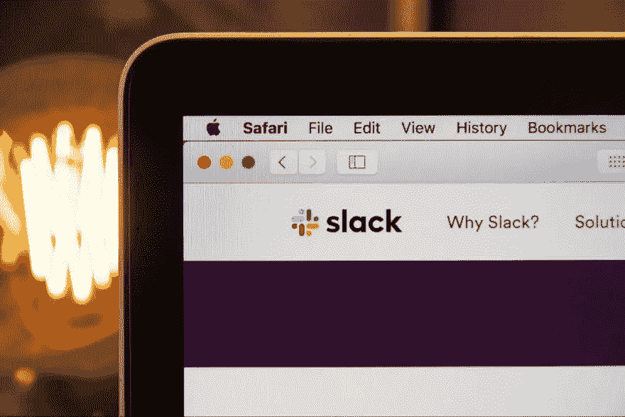
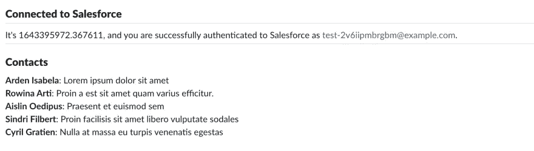

# 设计具有本地 SFDC 集成的 Slack 应用程序的用户界面

> 原文：<https://betterprogramming.pub/building-a-slack-app-with-native-sfdc-integration-1b2dee945650>

## 从 Salesforce 获取数据，并使用 Block Kit 框架将其呈现在 UI 中



*照片由* [*斯蒂芬·菲利普斯——Hostreviews.co.uk*](https://unsplash.com/@hostreviews?utm_source=unsplash&utm_medium=referral&utm_content=creditCopyText)*上* [*下*](https://unsplash.com/s/photos/slack?utm_source=unsplash&utm_medium=referral&utm_content=creditCopyText)

这篇文章是我们基于视频系列[的系列文章的延续，视频系列解释了如何构建与 Salesforce APIs 集成的 Slack 应用](https://www.youtube.com/playlist?list=PLgIMQe2PKPSKcl26YQoKCR7F3CwIc8kxi)。

借助来自 Salesforce 的 [Slack Starter Kit](https://github.com/developerforce/salesforce-slack-starter-kit) ，Slack 应用程序开发人员可以将 Salesforce 身份验证、目录层次结构、可重用代码和部署等常见问题转移到 Heroku。最终结果是花在争论代码上的时间更少，而花在为应用程序构建功能上的时间更多。

[在我们的上一篇文章](/building-a-slack-app-with-native-sfdc-integration-bc91050d063e)中，我们熟悉了初学者工具包，并设置了我们的开发环境来构建一个基本的 Slack 应用程序。在本帖中，我们将继续构建 Slack 应用，重点关注 Slack 初学者工具包如何简化每个 Slack 应用的两个基本组件的开发:

1.  倾听用户互动
2.  绘制用户界面

# 响应事件

如果您曾经使用 JavaScript 或 CSS 开发过前端 web 应用程序，您可能对事件处理的基本原则很熟悉。在这种情况下，事件被定义为用户在你的网站上采取的行动。比如鼠标指针点击链接会发出一个`onclick`事件；链接到一段文本上的指针发出`onhover`；一个键盘按键发出`onkeypressed`；诸如此类。

在 Slack 中，你可以收听大量的[事件](https://api.slack.com/interactivity/handling)，从单个事件(当一条消息被发布或被锁定时)到全局变化(当频道名称或可见性改变时)到管理事件(当一个应用被安装或一个新的表情符号被上传时)。发出事件的完整列表确实令人印象深刻。监听事件的过程如下:

*   首先，你的应用需要定义一个 webhook URL。这是您的服务器上的一个路径，可以从 Slack 接收 POST 请求。
*   接下来，在您的应用程序清单中，您确定想要捕获的事件。
*   当安装应用程序的工作空间中发生事件时，会向应用程序发送一个 JSON 有效负载。每个事件都有自己独特的有效载荷。

当你的应用程序从 Slack 接收到事件时，你可以做任何你想做的事情:响应用户，弹出一个对话框询问更多信息，或者只是将一些信息存储在你的数据库中。只有一点需要记住:[你必须在三秒钟内对懈怠做出反应](https://api.slack.com/interactivity/handling#acknowledgment_response)。

这是为了让 Slack 知道你的应用已经收到了它的有效载荷，并且正在处理一个响应。你可以在后台完成这项工作——也许是在不同的线程上，需要多长时间都可以——但前提是你要让 Slack 知道一切都是`200 OK`。

让我们看看事件处理在实践中是如何工作的。前往你的应用清单，向下滚动到页面底部，靠近`settings`键。它应该是这样的:

```
settings:
  event_subscriptions:
    request_url: https://<your-app-name>.herokuapp.com/slack/events
    bot_events:
      - app_home_opened
  interactivity:
    is_enabled: true
    request_url: https://<your-app-name>.herokuapp.com/slack/events
```

这个部分标识了一旦事件发生，Slack 应该将它的有效负载发送到哪里。`bot_events`键已经定义了一个要监听的事件， [app_home_opened](https://api.slack.com/events/app_home_opened) ，一旦你的应用在 Slack 中打开就会被触发。

现在，在 IDE 中打开初学者工具包的本地副本；导航至`apps/slack-salesforce-starter-app/listeners/events/app-home-opened.js`。正如我们在上一篇文章中看到的，初学者工具包有一个自以为是的目录结构，以解决应该在哪里进行修改的任何模糊问题。

在这种情况下，events 文件夹负责定义我们所有的事件响应，就像 shortcuts 文件夹在前一篇文章中定义我们的 slack 命令一样。搜索下列行的第一个匹配项:

```
client.views.publish
```

顾名思义，这个函数使用 Slack SDK 来调用 API`[named views.publish](https://api.slack.com/methods/views.publish)`[。这个事件的主视图是由一个名为`authorization_success_screen`的函数创建的，这个函数可以在`apps/slack-salesforce-starter-app/user-interface/app-home/auth-success.js`中找到。](https://api.slack.com/methods/views.publish)

让我们对这些文件做一些修改。在第 16 行，添加这一行来获取事件的时间戳:

```
let event_ts = event.event_ts;
```

更改两个`authorization_success_screen`调用，将该变量作为新参数包含进来:

```
view: authorization_success_screen(
  currentuser.username,
  event_ts
)
```

最后，打开`auth-success.js`，更改方法签名以包含 event_ts，并修改显示的字符串以包含以下信息:

```
'use strict';const { HomeTab, Blocks } = require('slack-block-builder');const authorization_success_screen = (username, event_ts) => { // preceding code remains unchanged Blocks.Section({
           text: `It's ${event_ts}, and you are successfully authenticated to Salesforce as ${username}.`
       })
   );
// continued code remains unchanged
```

提交此更改，并像以前一样将其部署到 Heroku:

```
$ git add .
$ git commit -m "Add event timestamp"
$ git push heroku main
```

部署完成后，导航至左侧松弛菜单中的应用选项卡。您应该看到一个不同的字符串，它显示了您打开应用程序时的时间戳。

# 创建用户界面

每当你的应用程序需要一个集中的位置来获取数据时，响应`app_home_opened`可能是一个有用的事件。因此，我们的下一步将是从 Salesforce 获取数据，并将其呈现在我们的 Slack UI 中。

为了设计和展示布局，Slack 提供了一个名为 [Block Kit](https://api.slack.com/block-kit) 的系统。正如 HTML 是 web 的标记语言，Visualforce 是 Salesforce 的标记语言，Block Kit 是 Slack 的标记语言——除了它使用 JSON。例如，以下是 Block Kit 中设计的按钮的外观:

```
{
  "type": "button",
  "text": {
    "type": "plain_text",
    "text": "Save"
  },
  "style": "primary"
}
```

Block Kit 确保每个 Slack 应用程序都有一致的用户界面。因此，您可以使用的 UI 元素非常有限。

使用 Block Kit 时，您可以在 JSON 中设计布局。然后，使用 Slack API 将 JSON 发布到通道、选项卡或直接消息。

我们已经有了一个收听事件和呈现文本的系统，所以让我们在这个基础上再接再厉。不过，在我们使用 Slack 之前，让我们向新的 Salesforce 组织添加一些数据。要直接启动您的浏览器到您的 Salesforce 组织，您可以运行以下命令:

```
sfdx force:org:open
```

在设置菜单中，搜索[数据导入向导](https://help.salesforce.com/s/articleView?id=sf.importing.htm&type=5)。选择 CSV 作为数据类型，然后将下面几行复制粘贴到名为 data.csv 的新文件中:

```
Contact First Name, Contact Last Name, Contact Description
Arden, Isabela, Lorem ipsum dolor sit amet
Rowina, Arti, Proin a est sit amet quam varius efficitur.
Aislin, Oedipus, Praesent et euismod sem
Sindri, Filbert, Proin facilisis sit amet libero vulputate sodales
Cyril, Gratien, Nulla at massa eu turpis venenatis egestas
```

将此文件作为数据源上传。导入这些数据应该只需要一两分钟。如果您想更加确定并验证这些姓名是否存在，可以导航到 Contacts 选项卡。

接下来，我们将进行类似于之前添加事件时间戳时所做的更改。一个名为`conn`的变量可供使用，它充当到 Salesforce 的连接。我们可以用它来查询联系人数据，这也是我们希望在 Slack 中显示的内容。

导航到`apps/slack-salesforce-starter-app/user-interface/app-home/auth-success.js`。我们将`await`解析这个函数中的承诺，我们将包含现有的`conn`变量作为新的参数:

```
view: await authorization_success_screen(
                   currentuser.username,
                   event_ts,
                   conn
               )
```

再次打开`auth-success.js`并修改方法签名以包含`conn`。您还需要将函数声明为`async`:

```
'use strict';const { HomeTab, Blocks } = require('slack-block-builder');const authorization_success_screen = async (username, event_ts, conn) => {// continued code remains unchanged for now
```

接下来，通过这个连接，我们将向 Salesforce 发出一个查询，以获取我们新创建的联系人记录。然后，我们将在 Slack 应用程序的 Home 选项卡中显示它们。

由于我们已经连接到 Salesforce，获取数据就像发出 SQL 查询一样简单。将这段代码放在定义`homeTab`变量的地方之前:

```
const result = await conn.query(
  `SELECT Name, Description FROM Contact`
);
let records = result.records;let fields = records.map((record) => {
  return `*${record.Name}*: ${record.Description}`;
});
```

然后，在 blocks 方法调用的底部，添加这几行代码，它们代表您用 Block Kit 构建的 UI:

```
Blocks.Section({
  text: `It's ${event_ts}, and you are successfully authenticated to Salesforce as ${username}.`
}),
Blocks.Header({ text: 'Contacts' }),
Blocks.Divider(),
Blocks.Section({
  text: fields.join('\n')
})
```

如果您导航回 Slack 应用程序的主页选项卡，您将看到您组织的联系人列表！



# 了解更多信息

我们已经构建了一个 Slack 应用程序，它从 Salesforce 获取数据，并使用一个名为 Block Kit 的框架在 UI 中呈现这些数据。在我们的下一篇文章中，我们将从 Slack *发回*数据给 Salesforce！

在此之前，您可能需要熟悉 Block Kit 的工作原理。Slack 提供了 [Block Kit Builder](https://www.google.com/url?q=https://app.slack.com/block-kit-builder&sa=D&source=docs&ust=1642619847313479&usg=AOvVaw2XYSjzDa5SC3NPKL7hyOgo) ，这是他们 UI 元素的游乐场。在引擎盖下，Slack Starter Kit 使用[块构建器](https://www.blockbuilder.dev/)来简化我们使用的 UI 组装。