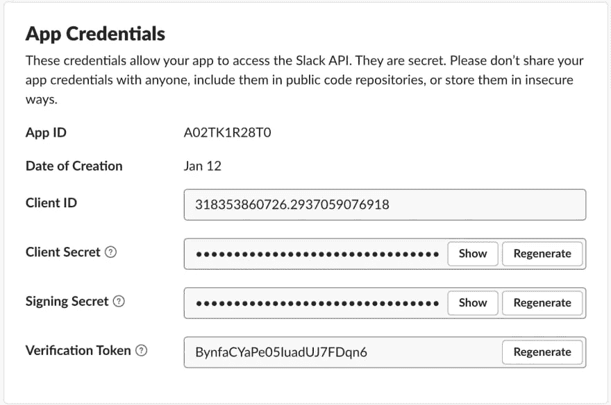
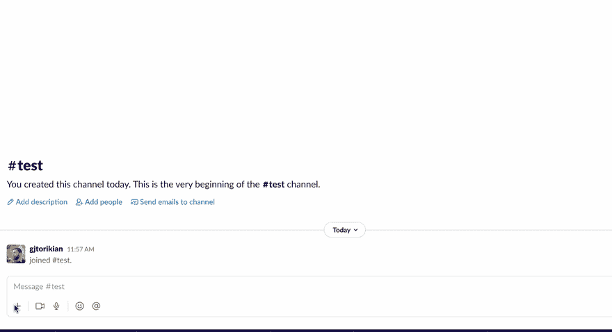

# 设置具有本地 SFDC 集成的 Slack 初学者工具包

> 原文：<https://betterprogramming.pub/building-a-slack-app-with-native-sfdc-integration-bc91050d063e>

## 构建自己的 Slack 应用程序


企业依赖 Slack 进行沟通，Salesforce 进行数据管理。正如所料，Slack 中的对话并不总是与 Salesforce 记录的变化相关联。能够在这两个服务之间共享数据可以通过消除在它们之间切换的需要来提高团队的生产力。

2021 年 12 月，Salesforce 制作了[一个视频系列，解释如何使用他们的 API 构建 Slack 应用](https://www.youtube.com/playlist?list=PLgIMQe2PKPSKcl26YQoKCR7F3CwIc8kxi)。在任何平台之上进行构建都是令人生畏的:您必须了解身份验证是如何工作的，您可以调用的方法，您可以监听的事件，等等。Slack 有[优秀的文档](https://api.slack.com/docs)和一个 SDK， [Bolt](https://api.slack.com/tools/bolt) ，它减少了许多样板逻辑，让你更快地从想法变成实际的应用。

Salesforce 的人做得更好。考虑到 Bolt 的开发原理和工装，他们开发了 [Slack Starter Kit](https://github.com/developerforce/salesforce-slack-starter-kit) 。这是一个自以为是的脚手架框架，旨在轻松构建与 Salesforce 数据集成的 Slack 应用程序。

在这一系列文章中，我们将向您展示如何使用 Slack Starter Kit 和 Bolt 创建一个应用程序，允许用户查看和更改 Salesforce 记录—完全在 Slack 中。

到本系列结束时，我们将拥有一个与 Salesforce 平台通信的全功能 Slack 应用程序。在这第一篇文章中，我们将浏览 SDK 并为将来的工作设置您的开发环境！

# 先决条件

开始之前，请确保您的计算机上安装了以下软件:

1.  [sfdx CLI](https://developer.salesforce.com/tools/sfdxcli)—这是一款由 Salesforce 设计的工具，用于简化平台交互。
2.  最近版本的[节点](https://nodejs.org/en/) ( > = 14.0)
3.  Heroku CLI 以及一个现有的 Heroku 帐户
4.  可以安装应用程序的宽松工作空间
5.  现有的 Salesforce [开发中心](https://developer.salesforce.com/docs/atlas.en-us.packagingGuide.meta/packagingGuide/dev_hub_intro.htm)

我们将首先创建一个 Slack 应用程序，它将在构建我们的应用程序之前为我们提供令牌和其他特定于 Slack 的信息。为此:

1.  导航到[https://api.slack.com/apps](https://api.slack.com/apps)并点击**创建新应用**。
2.  在弹出的提示中，从头选择**。**
3.  **将应用程序的名称设置为`SFDCContactEditor`，并选择可以安装应用程序的工作区。**

**就是这样！如果向下滚动，您将看到您的应用凭据。我们将在下一节提到这些。**

****

**在左侧导航栏上，单击应用清单。您的应用程序清单定义了一些关于您的应用程序的元数据，例如它请求的权限和它处理的事件。将以下 YAML 粘贴到该框中，覆盖默认情况下的内容:**

```
_metadata:
  major_version: 1
  minor_version: 1
display_information:
  name: SFDCContactEditor
features:
  app_home:
    home_tab_enabled: true
    messages_tab_enabled: false
    messages_tab_read_only_enabled: true
  bot_user:
    display_name: SFDCContactEditor
    always_online: true
  shortcuts:
    - name: Whoami
      type: global
      callback_id: who_am_i
      description: shows Salesforce org details
oauth_config:
  scopes:
    bot:
      - chat:write
      - chat:write.public
      - commands
      - users:read
settings:
  event_subscriptions:
    request_url: https://heroku-app.herokuapp.com/slack/events
    bot_events:
      - app_home_opened
  interactivity:
    is_enabled: true
    request_url: https://heroku-app.herokuapp.com/slack/events
  org_deploy_enabled: false
  socket_mode_enabled: false
  token_rotation_enabled: false
```

**点击**保存更改**。如果您收到一个关于 URL 未被验证的错误，不要担心，我们将很快解决这个问题！**

**接下来，克隆 [Slack Starter Kit](https://github.com/developerforce/salesforce-slack-starter-kit) ，然后导航到`scripts`目录:**

```
git clone https://github.com/developerforce/salesforce-slack-starter-kit
cd salesforce-slack-starter-kit/scripts
```

**用`npm install`在那里安装依赖项；然后弹出一个文件夹，安装那些依赖项:**

```
npm install
cd ..
npm install
```

# **浏览 Salesforce 初学者工具包**

**Salesforce 初学者工具包可用并安装了其依赖项后，是时候看看初学者工具包能做些什么了。**

**初学者工具包的主要目标是为构建、测试和部署与 Salesforce 集成的 Slack 应用程序设置环境。它通过以下方式做到这一点:**

*   **建立 [Salesforce 临时组织](https://developer.salesforce.com/docs/atlas.en-us.sfdx_dev.meta/sfdx_dev/sfdx_dev_scratch_orgs_create.htm)**
*   **在 Heroku 上设置和部署一个示例应用程序**
*   **使用 Bolt 抽象出身份验证的细节**
*   **建立一个更倾向于约定而不是配置的项目结构**

**让我们来看看实际情况。首先，通过运行`sfdx auth:web:login`确保您通过了 Salesforce 开发中心的身份验证。然后，运行`node scripts/deploy.js`，CLI 提示符将接管。您将被要求提供一些信息:**

*   **对于 Heroku 应用程序名称，我们将使用`sfdc-contact-editor`。请确保为您的 Heroku 应用程序选择一个唯一的名称，因为应用程序名称在所有 Heroku 应用程序中必须是唯一的。**
*   **对于 Slack Bot 令牌，请转到 Slack 应用概述中的 OAuth & Permissions 页面，并将 Bot 用户 OAuth 令牌复制粘贴到终端中。**
*   **对于 Slack 签名密码，请返回 Slack 网站基本信息页面的应用证书部分。将提供的签名密码复制粘贴到终端中。**
*   **提供您现有开发中心别名的名称。**
*   **你可以随意命名你的暂存组织——默认的`scratchorg`就可以了！**

**现在，拿一杯饮料，坐下来，因为初学者工具包为您设置了一些帐户。它创建了一个全新的 scratch org 和一个新的 Heroku 应用程序，并为部署的应用程序定义了一些基本的环境变量。**注意**:如果你收到一个关于丢失`OrgCreateCommand`的故障，确保你已经启用[开发中枢](https://developer.salesforce.com/docs/atlas.en-us.sfdx_dev.meta/sfdx_dev/sfdx_setup_enable_devhub.htm)。如果你在推送 Heroku 时收到一个关于缺少公钥或权限的失败消息，运行`heroku keys:add`。**

**一段时间后，您会收到以下消息:**

```
Done deploying Heroku app sfdc-contact-editor
```

**为了验证应用程序是否已配置和部署，您可以执行两个单独的步骤。首先，在终端窗口中运行以下命令:**

```
sfdx force:org:open
```

**导航到[管理连接的应用](https://help.salesforce.com/s/articleView?id=sf.connected_app_overview.htm&type=5)，您应该会看到一个名为“Slack 连接应用”的应用。这是初学者工具包为您的 Slack 应用程序创建的 Salesforce 平台策略。**

**接下来，转到[https://dashboard.heroku.com/](https://dashboard.heroku.com/)，你应该会看到你的全新应用程序列在那里。**

**现在我们已经有了一个应用程序的生产版本，我们需要对我们的 Slack 配置再做一次修改，将两者结合起来。打开你的[应用清单](https://api.slack.com/reference/manifests)并找到标识你的 Heroku 端点的两个行:**

```
request_url: [https://heroku-app.herokuapp.com/slack/events](https://heroku-app.herokuapp.com/slack/events)
```

**用 Heroku 应用程序的实际名称替换`heroku-app`占位符。点击**保存更改**。Slack 将通知您您的请求 URL 未通过验证；点击**验证**以实现这一点！**

# **看着它工作**

**让我们尝试与我们的应用程序交互，以确保一切都正确连接。请记住:我们有一个运行在 Heroku 上的生产应用程序，它拦截用户的松弛活动并与 Salesforce 通信。我们还没有添加任何自己的功能；初学者工具包预先配置了一切。**

**首先，[将应用添加到你的空闲工作区](https://slack.com/help/articles/202035138-Add-apps-to-your-Slack-workspace)。您将被要求通过 Salesforce 进行身份验证；点击按钮进行操作。然后，进入任何空闲房间，运行 app 提供的`whoami` [快捷键:](https://slack.com/help/articles/360004063011-Work-with-apps-in-Slack-using-shortcuts)**

****

**瞧啊。**

**接下来，让我们快速了解一下初学者工具包的内容。在 IDE 中打开项目，并导航到`salesforcelib`文件夹。在这里，有一个文件叫做`connect.js`。这是整个 Salesforce 身份验证发生的地方。我们不需要对这个文件做任何事情，但是知道对我们来说抽象掉了多少是有用的。**

**接下来，打开`listeners`文件夹。该文件夹包含所有用于监听和响应 Slack 事件的应用程序逻辑。打开`shortcuts`，然后打开`whoami.js`。这个文件包含了我们刚刚发布的快捷方式的所有功能。有两件重要的事情需要指出:**

1.  **函数中调用的第一个方法是`ack`。Slack 要求应用程序在事件发生后三秒内确认事件，而`ack`负责将消息发送给 Slack。**
2.  **在下一行—`const conn = context.sfconnection`—我们从 Salesforce 获取连接信息。**

**最后，让我们看看用户界面文件夹。正如您可能已经猜到的，这个文件夹包含了我们的 Slack 应用程序的所有 UI 定义。(在我们的下一部分中，我们肯定会更深入地研究如何构建 UI。)在这里，打开 modals 文件夹，然后打开`whoami-response.js`。初学者工具包负责设计和提示我们看到的 UI 模式的实际定义。我们唯一可以自定义的是文本框文本。让我们厚着脸皮在这句话的末尾加上一个感叹号:**

```
Successfully connected to salesforce instance ${instanceurl}. Authenticated with user ${username}!
```

**让我们将此应用程序部署到生产现场！如果你不知道怎么做，你应该熟悉一下这篇关于部署到 Heroku 的文章。然而，简而言之，我们需要做的就是将我们提交的更改推送到我们的 Heroku 遥控器:**

```
$ salesforce-slack-starter-kit (main): git add apps/slack-salesforce-starter-app/user-interface/modals/whoami-response.js
$ salesforce-slack-starter-kit (main): git commit -m "Add an exclamation point" > salesforce-app@1.0.0 precommit
> lint-staged✔ Preparing...
✔ Running tasks...
✔ Applying modifications...
✔ Cleaning up...
[main 44aac80] Add an exclamation point
 1 file changed, 1 insertion(+), 1 deletion(-)
$ git push heroku main
```

**当 Heroku 完成时，您可以返回 Slack，发出相同的`whoami`快捷方式，并实时查看您的新更改。**

# **了解更多信息**

**无论您是经验丰富的开发人员还是刚刚入门，Slack Starter Kit 都可以为您节省大量时间。在我们短暂的相处中，我们能够:**

*   **创建新的 Salesforce 环境**
*   **创建新的 Slack 应用程序**
*   **将 Slack 应用程序部署到 Heroku**
*   **连接斯莱克，赫罗库和销售力量**
*   **发布时差快捷方式并查看结果**

**初学者工具包通过为我们自动完成大部分工作，从本质上解决了许多关于身份验证和 API 令牌的问题。每个应用程序都需要配置这些方面，由于初学者工具包使这些重复的过程变得更容易，我们现在可以专注于最重要的事情:开发一个令人难以置信的 Slack 应用程序。**

**有了这个基础，我们准备在下一期中继续构建它！我们将进一步了解初学者工具包的体系结构，并添加一个我们自己的新命令。**