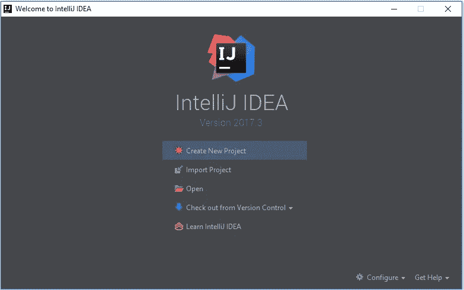
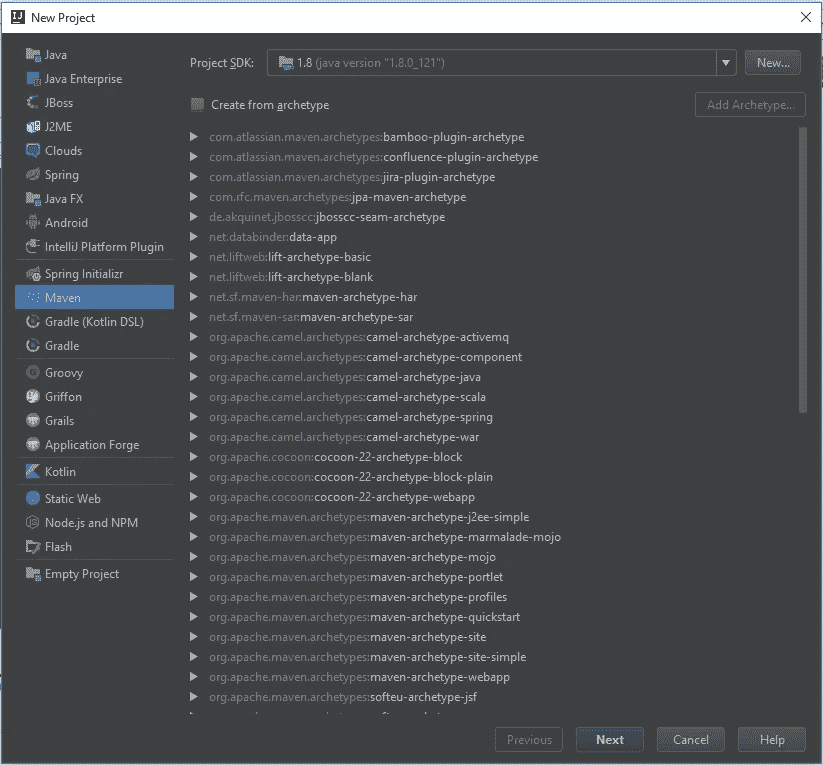
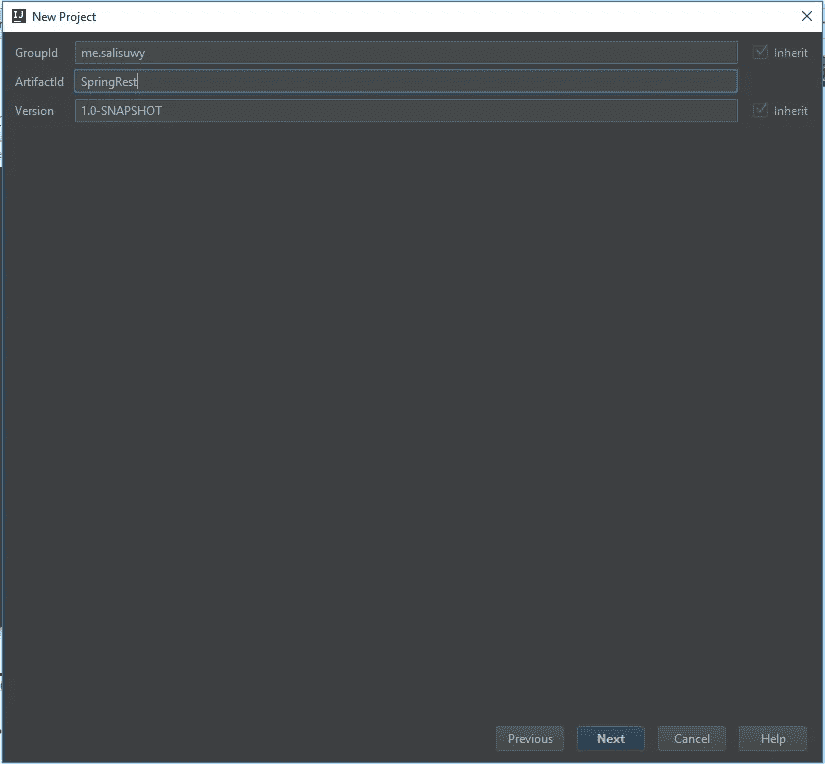
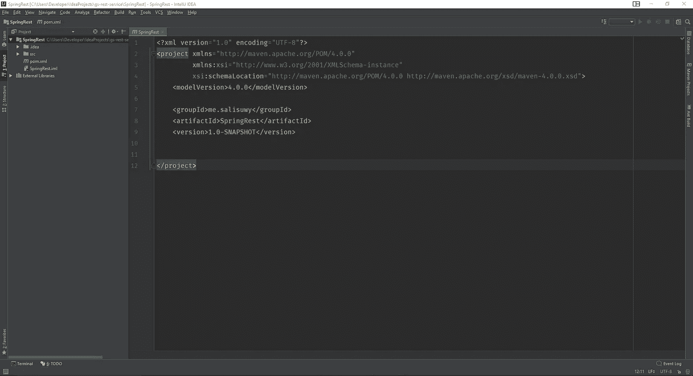
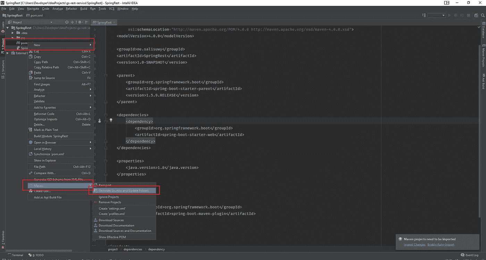
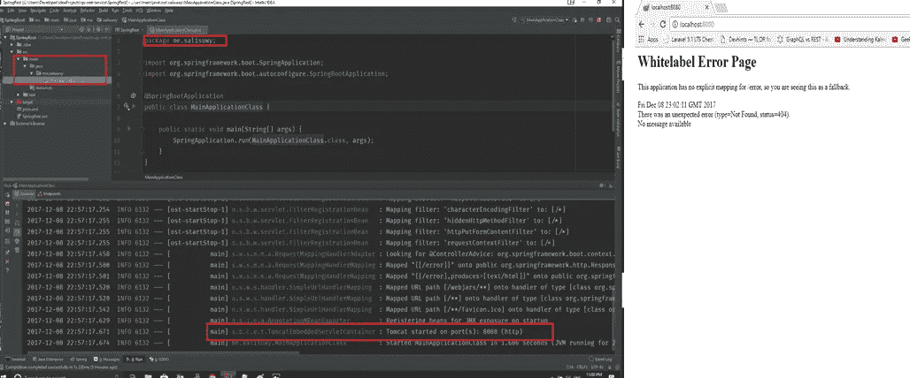
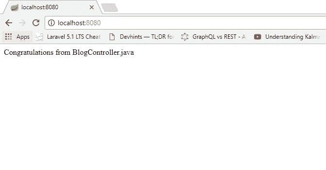

# 构建 Spring Boot REST API —第 1 部分:设置应用程序

> 原文：<https://betterprogramming.pub/building-a-spring-boot-rest-api-a-php-developers-view-part-i-6add2e794646>

## 看看 Spring Boot，看看它能提供什么

几天前，我和一位正在使用 [Spring Boot](https://spring.io/projects/spring-boot) 和 [Hibernate](https://hibernate.org/) 进行 web 项目的同事进行了一次对话。

我感到惊讶的是，当有很多更容易使用的 web 框架，提供几乎相同的性能时，有人仍然可以将 Java 技术用于 web 应用程序。

我自己是从 JavaServer Pages (JSP)开始我的 web 开发的，五年多以前，由于与 JSP 相比，用 PHP 编写一个功能性应用程序所需的灵活性和时间很少，我转而使用 PHP。

尽管如此，我的这位同事更关心企业的可接受性、标准、集成和安全性。

所以，我决定去 Spring Boot 看看，看看它能提供什么。虽然一开始看起来很混乱，但并没有我想象的那么难。

我不喜欢的一点是注释。值得庆幸的是，我不需要全部记住，我只需要知道它们的功能，并在我的桌面上放上[注释秘籍](https://jrebel.com/rebellabs/spring-framework-annotations-cheat-sheet/)。

长话短说，在查看了在线文档和一些示例代码后，我能够构建一个 REST API，尽管它没有我在 [Laravel](https://laravel.com/) 中所能做到的那么快。

在本教程中，我将向您展示如何在 Spring Boot 构建 REST API。

# 我们将会建造什么

我们将为博客文章构建一个 REST API。它允许用户搜索博客、获取所有博客、获取单个博客、创建博客、更新和删除现有博客。

# 要求

*   对 Java 编程语言有很好的理解。
*   [Maven](https://maven.apache.org/) 基础知识。

# 所需工具

*   Java 开发工具包(JDK) 1.7 以上
*   [IntelliJ IDEA](https://www.jetbrains.com/idea/) ， [NetBeans](https://netbeans.org/) ， [Eclipse](https://www.eclipse.org/) ，或者 [Spring Tool Suite](https://spring.io/tools) (我将使用 IntelliJ IDEA)。

# 入门指南

创建 Spring Boot 应用程序至少有三种方式(即 Spring Boot 初始化器、命令行工具(CLI)和带 IDE 的 Maven)。我将只讲述如何使用 Maven 创建应用程序。

打开 IntelliJ IDEA，点击“新建项目”。

选择“Maven 项目”。

填写所需信息。

`GroupId`是你唯一的组织名称(大多数情况下，人们使用他们公司的反向域名如“com.mycompany”)，`ArtifactId`是项目的唯一名称，`Version`是项目的版本号。

完成设置后，您应该有一个包含 Maven 配置文件`pom.xml`的空项目。

因为 Maven 是一个依赖项管理器，所以您可以向它添加所有的项目依赖项。

现在，我们只需要 Spring Boot。将下面的代码复制并粘贴到`pom.xml`文件中

*   `<parent>`标签告诉 Maven 继承`spring-boot-starter-parent`的属性，比如端口号、配置等。这些都是 Spring 提供的。
*   标签包含了所有的项目依赖关系。目前，我们只有一个依赖项`spring-boot-starter-web`。在一个完整的应用程序中，可以有更多，例如 MySQL、socket、JSON 库等。
*   `<build>`包含构建插件，比如`spring-maven-plugin`。

更新 Maven 存储库以下载依赖项。

我们现在已经完成了配置。让我们开始编码吧

# 主类

对于任何要运行的 Java 应用程序，都需要至少有一个“主类”。创建一个类并命名为`MainApplicationClass.java`。

确保您的类在包中，否则它可能不会运行。另外，注意我的包名(`me.salisuwy`)，它可能与你的不同。

向该类添加`@SpringBootApplication`注释，使其成为一个 Spring Boot 应用程序。您现在可以运行应用程序了。

祝贺您，您已经创建了一个 Spring Boot 应用程序。

嘿，等一下。为什么`localhost:8080`显示错误？这是因为我们没有控制器来处理 HTTP 请求。

# 控制器，MVC 中的 C

控制器处理来自用户的所有 HTTP 请求，并返回适当的响应。在某些语言中，路由文件将 HTTP 请求映射到适当的控制器。让我们创建一个控制器。

创建`BlogController.java`。

*   `@RestController`注释告诉 Spring 这个类是一个控制器。
*   `@RequestMapping(“/”)`注释表示任何请求(`GET`、`POST`、`PUT`等)。)到根`URL(/)`将由`index()`方法处理。响应类型为`String`。

`@RequestMapping`注释的其他变体有`@GetMapping`、`@PostMapping`等。分别用于处理`GET`和`POST`请求。

# 下一步是什么

点击阅读[下一篇教程，我们将在其中为该应用添加额外的功能。](https://medium.com/@salisuwy/building-a-spring-boot-rest-api-part-ii-7ff1e4384b0b)

# 源代码

[GitHub 上的完整源代码](https://github.com/salisuwy/building-spring-boot-resp-api-v1)。