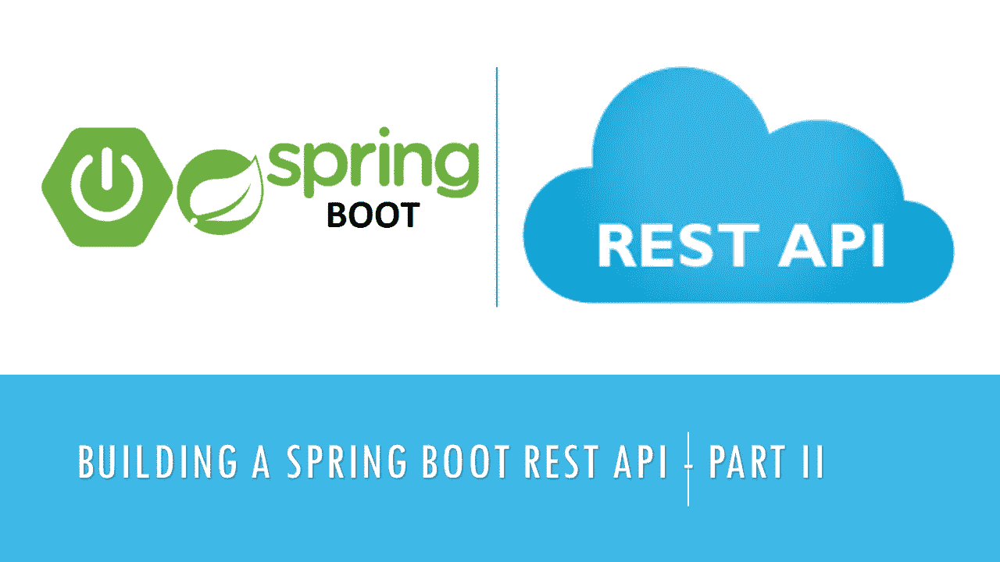
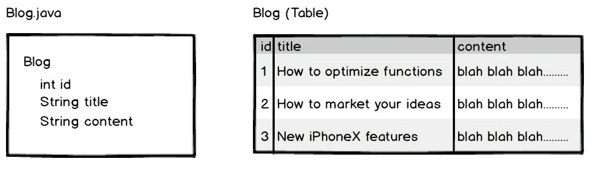
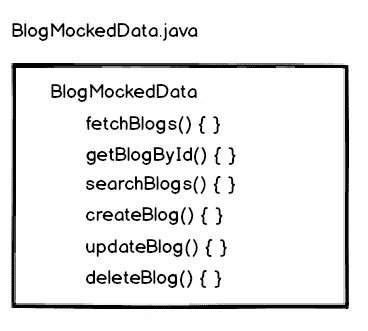
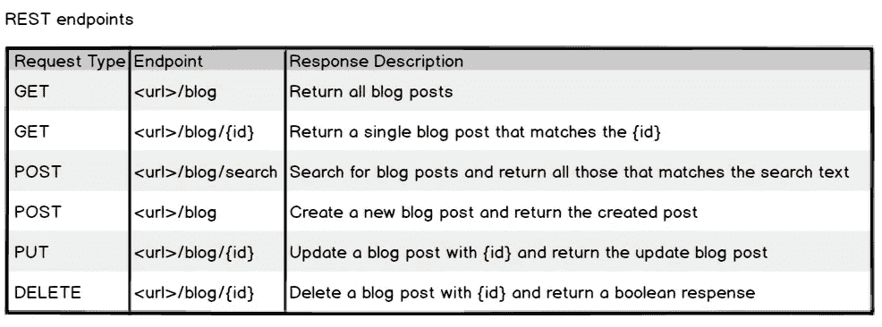
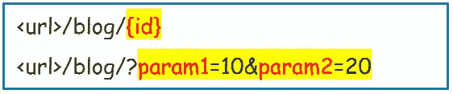
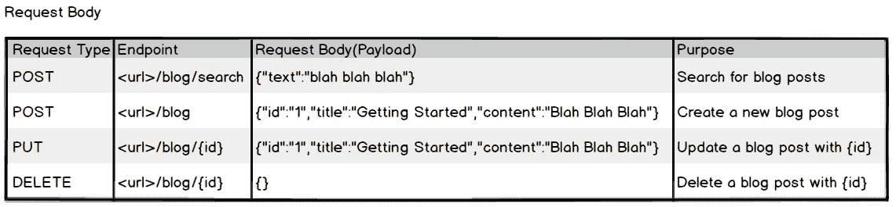
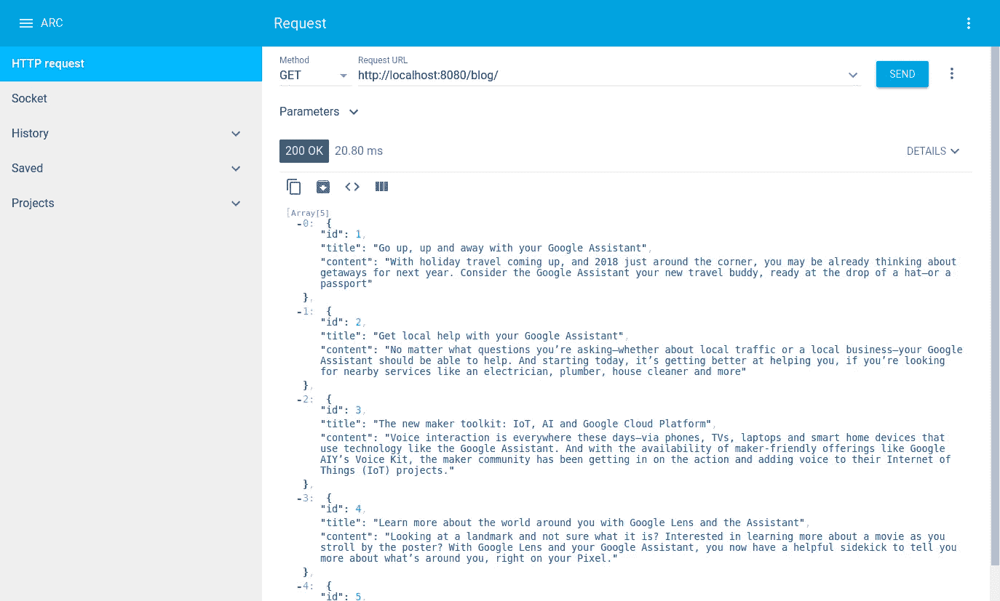
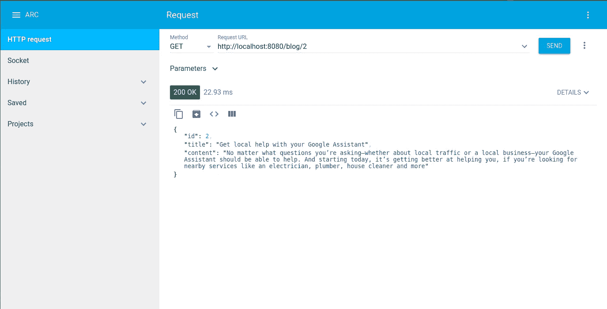
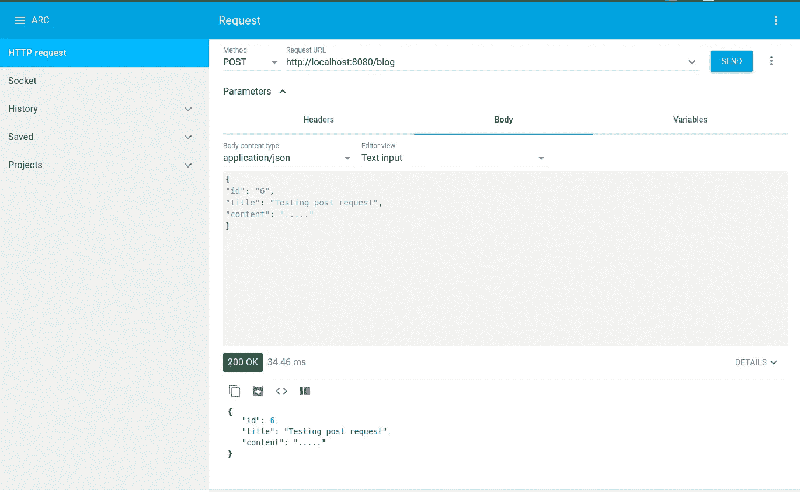

# 构建 Spring Boot REST API —第 2 部分:使用控制器和响应

> 原文：<https://betterprogramming.pub/building-a-spring-boot-rest-api-part-ii-7ff1e4384b0b>

## 扩展博客控制器以包含所需的功能



在[之前的教程](https://medium.com/@salisuwy/building-a-spring-boot-rest-api-a-php-developers-view-part-i-6add2e794646)中，我们用一个虚拟控制器建立了一个 [Spring Boot](https://spring.io/projects/spring-boot) 应用程序。

在本教程中，我们将扩展“博客控制器”以包含所需的功能。

# 博客项目类别

“博客控制器”的功能是保存、更新、删除和获取博客条目。因此，我们需要一个包含博客属性的博客条目类。这些属性应该与“博客表”中的列相对应。



*   该类还必须有一个默认的构造函数。注意我有两个，在这种情况下。
*   我还实现了一个`toString()`方法来打印类内容。

# 博客数据

理想情况下，个人博客文章将从数据库表中获取，类似于上面所示。

在这一点上，我们不会使用数据库。将创建一个模拟数据库功能的类，稍后用实际的实现替换它



*   该类将包含一个硬编码的博客文章列表。
*   该类必须是单例的，以便更改可以跨不同的 HTTP 请求持久化。

单身什么？根据 Wikipedia，singleton 是面向对象编程中使用的一种设计模式，允许一个类只有一个实例。

换句话说，如果一个类是单例的，那么在整个应用程序生命周期中，你只能拥有这个类的一个实例。

在 Java 中，通过创建一个返回该类实例的静态方法来实现 singleton。

静态方法检查该类是否已经实例化并返回现有实例，否则它创建该类的新实例并返回它。

```
private static BlogMockedData instance = null;
public static BlogMockedData getInstance(){
   if(instance == null){
       instance = new BlogMockedData();
   }
   return instance;
}
```

因此，每当我们需要一个`BlogMockedData`的实例时，我们就像这样实例化它:

```
BlogMockedData blogMockedData = BlogMockedData.getInstance();
```

不是这样的:

```
BlogMockedData blogMockedData = new BlogMockedData();
```

注意，`delete()`方法从`for-loop`之外的博客列表中删除了该项，这是为了避免`java.util.ConcurrentModificationException`。

# 休息端点

在修改控制器以使用`BlogMockedData`类之前，让我们先看看 REST 端点。



# 处理不同的请求类型

用于处理不同 HTTP 请求类型的 Spring Boot 注释:

*   `@RequestMapping` —用于处理任何请求类型。
*   `@GetMapping` —用于获取请求。
*   `@PostMapping` —用于发布请求。
*   `@PutMapping` —对于看跌请求。
*   `@PatchMappin` g —用于补丁请求。
*   `@DeleteMapping` —用于删除请求。

要发出 POST 请求，处理请求的方法将被注释如下:

```
@RequestMapping(value = "path", method = RequestMethod.*POST*)
public returnType methodName(){...}
```

或者像这样:

```
@PostMapping("path")
public returnType methodName(){...}
```

# 路径变量和请求参数



路径变量是请求 URL 中的变量，用`@PathVariable`标注，例如`id`。

```
@GetMapping("/blog/**{id}**")
public returnType methodName(**@PathVariable** String **id**)
{
  ......
}
```

请求参数是请求 URL 中带有注释`@RequestParam`的键值对，例如`param1`和`param2`。

```
@GetMapping("/blog")
public returnType methodName(**@RequestParam** String **param1, @RequestParam** String **param2**)
{
  ......
}
```

# 请求正文

POST、PUT 和 DELETE 请求可以包含一个称为“请求体”的有效负载。有效载荷包含可以存储或更新的数据。有效载荷通常是 JSON 格式的。



请求体的注释是`@RequestBody`。由于请求体是一个键-值对，将其声明为`Map<String, String>`是明智的。

```
@PostMapping("/blog")
public Blog create(@RequestBody Map<String, String> body){...}
```

要提取相应的键及其值:

```
String id = body.get("id");
String title = body.get("title");
String content = body.get("content");
```

# 控制器

查看修改后的控制器，第 11 行是获得`BlockMockedData`单例实例的地方。

# 快速笔记

我采用这种方法是为了确保这些步骤解释清楚，并且您理解正在发生的事情。

在[下一篇教程](https://medium.com/@salisuwy/building-a-spring-boot-rest-api-part-iii-integrating-mysql-database-and-jpa-81391404046a)中，我们将重构代码并集成 MySQL 数据库。

# 结果(截图)



REST 请求和响应

# 下一步是什么

点击阅读[下一篇教程，其中我们添加了对 MySQL 数据库和 Java 持久 API (JPA)的支持。](https://medium.com/@salisuwy/building-a-spring-boot-rest-api-part-iii-integrating-mysql-database-and-jpa-81391404046a)

# 源代码

[你可以从 GitHub](https://github.com/salisuwy/building-spring-boot-resp-api-v2) 下载源代码。