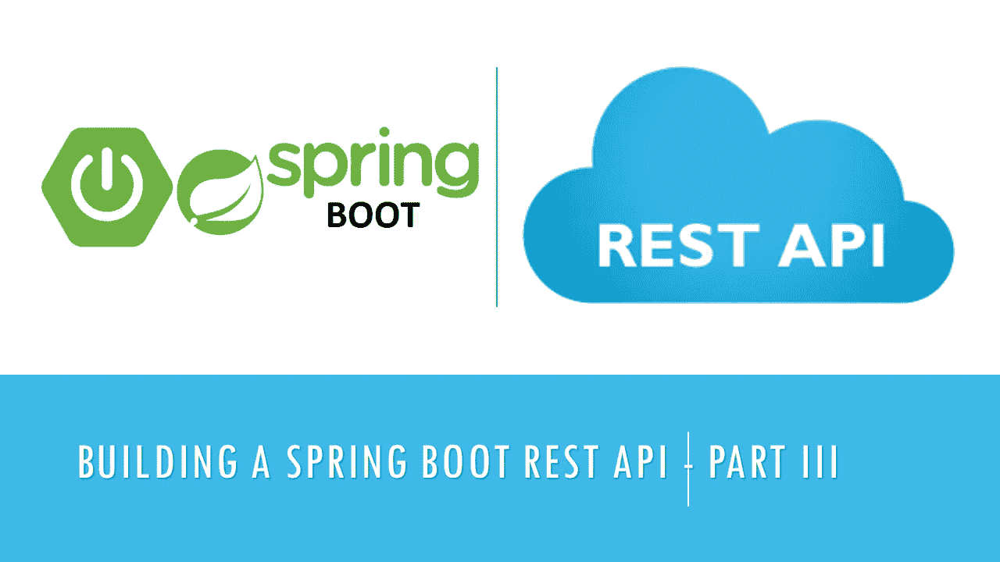
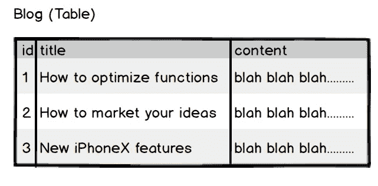
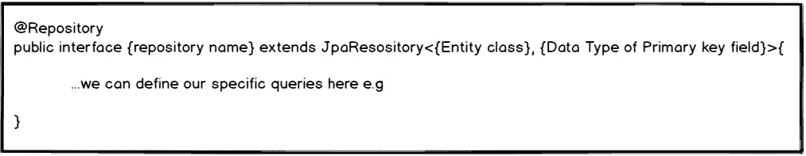
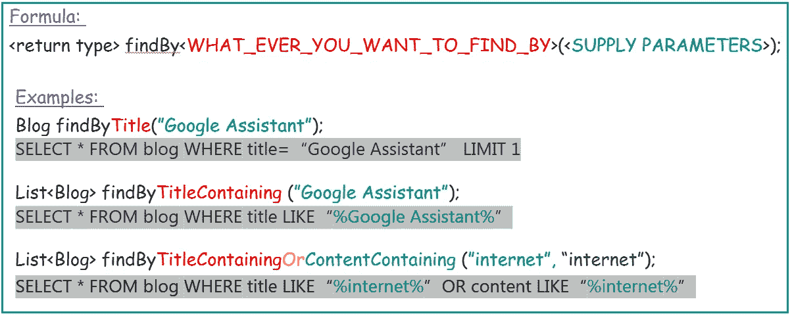
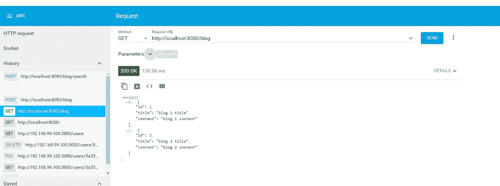
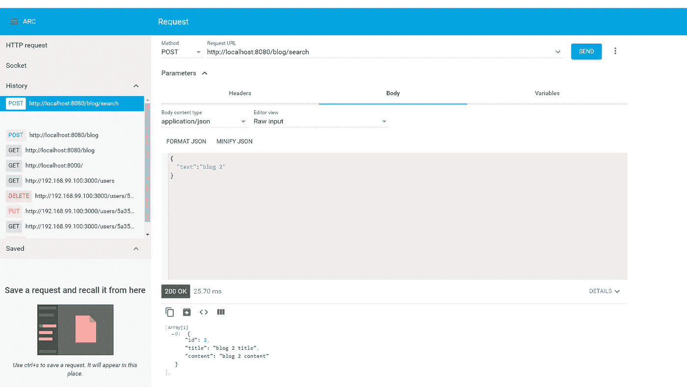

# 构建 Spring Boot REST API —第 3 部分:集成 MySQL 数据库和 JPA

> 原文：<https://betterprogramming.pub/building-a-spring-boot-rest-api-part-iii-integrating-mysql-database-and-jpa-81391404046a>

## 最后一部分:MySQL 数据库集成和查询数据库的 Java 持久性 API



在[之前的教程](https://medium.com/@salisuwy/building-a-spring-boot-rest-api-part-ii-7ff1e4384b0b)中，我们已经看到了如何使用硬编码的模拟数据发送请求并从控制器获得响应。

在本节中，将集成 MySQL 数据库和用于查询数据库的 [Java 持久性 API](https://docs.oracle.com/javaee/6/tutorial/doc/bnbpz.html) (JPA)。把 JPA 想象成一个对象关系映射(ORM)库，类似于[雄辩](https://laravel.com/docs/5.8/eloquent)、[教条](https://www.doctrine-project.org/)、 [E](https://docs.microsoft.com/en-us/dotnet/csharp/programming-guide/concepts/linq/) 实体框架等。

# 设置 MySQL 数据库

首先，我们需要安装 MySQL 并创建一个表。



表结构

打开 MySQL 终端并运行以下命令来创建数据库和 blogs 表:

```
**CREATE** DATABASE restapi;**USE** restapi;**CREATE TABLE** blog (
  id **INT**(6) UNSIGNED AUTO_INCREMENT **PRIMARY KEY**,
  title **VARCHAR**(500) **NOT NULL**,
  content **VARCHAR**(5000) **NOT NULL** );
```

# 应用程序配置

将 [Spring Boot](https://spring.io/projects/spring-boot) 应用程序连接到 MySQL 数据库:

*   将所需的依赖项(如 MySQL 库)添加到`pom.xml`文件中。这些依赖项是连接到数据库所需的 Java 库。
*   向应用程序提供数据库连接属性。这些属性包括数据库连接字符串、端口、用户名、密码等。
*   创建一个与数据库对话的类。这个类通常被称为“存储库类”。

# 添加 MySQL 依赖项

要将 Spring Boot 应用程序连接到 MySQL 数据库，需要使用`mysql-connector-java`库。

类似地，Spring JPA 需要`spring-boot-starter-data-jpa`库。稍后我们将更多地讨论 JPA。

将下面的代码复制并粘贴到`pom.xml`文件中的 dependencies 标记内。

```
<dependency>
    <groupId>org.springframework.boot</groupId>
    <artifactId>spring-boot-starter-data-jpa</artifactId>
</dependency>
<dependency>
    <groupId>mysql</groupId>
    <artifactId>mysql-connector-java</artifactId>
</dependency>
```

`pom.xml`文件现在应该是这样的:

# 设置连接属性

要将 Spring Boot 应用程序连接到数据库，我们需要向应用程序提供数据库 URL、用户名和密码。

为此，只需在`resources`文件夹中创建一个文件`application.properties`，并将下面的代码粘贴到其中:

```
spring.datasource.url=jdbc:mysql://localhost:3306/restapi
spring.datasource.username=root
spring.datasource.password=
```

*   `spring.datasource.url`:包含 MySQL 连接字符串。
*   `spring.datasource.username`:是 MySQL 用户名。
*   `spring.datasource.password`:是 MySQL 密码。

确保更改以上属性以反映您的 MySQL 设置。

# 与数据库对话:创建存储库类

既然我们已经准备好了数据库，安装了依赖项，并提供了连接属性，接下来要做的就是创建一个与数据库对话的类。这个类通常被称为*库*。

*   首先，我们创建一个扩展`JpaRepository`的接口。`JpaRepository`为我们提供了一些现成的功能，比如获取所有记录、单个记录、保存、更新、删除等。
*   向接口添加注释`@Repository`,告诉 Spring 这是一个存储库。



创建存储库的公式

上图显示了存储库的一般结构。所以，来看看我们的`BlogRepository`是什么样子的。

这是什么？

```
List<Blog> findByTitleContainingOrContentContaining(String text, String textAgain);
```

我知道这一开始可能会让人困惑，但我们以后会谈到它。现在，忘记`findByTitleContainingOrContentContaining`方法

# 将博客转换为实体(@Entity)

在上一个教程中，我们用表中的字段创建了一个博客类`Blog.java`。如您所知，`Blog.java`的每个实例都应该是我们表中的一个条目(即一行)。

为了告诉 spring`Blog.java`是一个条目，我们需要向该类添加一个`@Entity` 注释。

从上面的表结构来看，`id`列是主键和自动生成的字段。为了告诉 Spring`id`是主键，我们将注释`@Id`放入该字段。

`@GeneratedValue(strategy = GenerationType.AUTO)` 告诉 Spring 该字段是自动生成的，不会由用户提供，而是由数据库生成。

我们还在类中添加了另一个构造函数，只有“标题”和“内容”。当我们向控制器提供表单数据时，将使用这个构造函数。

由于 id 是自动生成的，我们不需要提供它。因此，从构造函数中排除。

我们可以添加到类中的另一个注释是:

```
@Table(name = “Blog”)
```

如果您的表名不同于类名，这是必需的。

如果字段的名称不同于表列的名称，我们还可以向字段添加列注释。

```
@Column(name="title")
private String title;
```

# 自动布线，单一选择

在之前的教程中，我们创建了`BlogMockedClass.java`并使其成为单例。如果你不明白什么是独生子女，可以查一下我的[以前的 tutoria](https://medium.com/@salisuwy/building-a-spring-boot-rest-api-part-ii-7ff1e4384b0b) l。

Spring 提供的一个解决方案是`@Autowired`注释。如果我们用`@Autowired`注释一个类，Spring 会自动解析实例，并将其注入声明它的类中。因此，我们不需要自己获得 singleton 实例。

例如，我们需要在`BlogController`类中有一个`BlogRepository`的实例。因此，我们需要做的就是:

```
@Autowired
BlogRespository blogRespository;
```

通过这样做，我们可以在控制器中的任何地方使用`blogRepository`，而不必实例化它。

# 控制器

现在来看看我们的控制器是什么样子的。我们将从之前的教程中删除`BlogMockedData`,并使用我们在上面创建的存储库。

您可能注意到的第一个变化是我们现在使用了`BlogRepository`和`@Autowired`注释。

方法的定义保持不变，但是实现发生了变化。

你可能会注意到`blogRepository`有方法，比如`findAll`、`findOne`、`save`、`delete`，这些我们在`BlogRepository.java`中没有定义。

这些方法是由我们扩展的`JpaRepository`提供的。

`findAll()`返回表格中的所有行。这相当于:

```
SELECT * FROM blog
```

`findOne(**param**)`返回一个与`param`主键字段匹配的项目。

```
SELECT * FROM blog WHERE id=**param** LIMIT 1
```

`save(**blog**)`将条目保存到数据库中。如果提供了新的博客条目，该函数将创建新的记录，如果提供了现有的博客条目，该函数将更新现有的记录。

```
INSERT INTO blog(title, content) VALUES (**blog.title**, **blog.content**)
```

或者:

```
UPDATE blog SET title=**blog.title**, content=**blog.content** WHERE id=**blog.id**
```

`delete(**param**)`根据提供的`id`删除表格中的条目。

```
DELETE FROM blog WHERE id=**param**
```

# 自定义 JPA 查询

虽然 JPA 为我们提供了开箱即用的默认 CRUD 操作(即`findAll`、`findOne`、`save`、`delete`)，但它留给我们来定义我们的定制查询。

在 JPA 中定义定制查询非常容易。让我们来看一些示例查询:



*   `findBy`子句是主要的查询关键字。接下来是“栏目名称”，然后是查询`Constrain`，如`Contains`、`Containing`、`GreatherThan`、`LessThan`等。
*   `And`和`Or`作为连接词连接两个或多个查询条件，类似于 MySQL 的`AND`和`OR`。

```
MORE EXAMPLES:
-----------------------------------------------------------------JPA:       findByIdGreatherThan(20)   
SQL:       WHERE id > 20
-----------------------------------------------------------------JPA:       findByIdGreatherThanAndTitleContaining(20, "google")
SQL:       WHERE id > 20 AND title LIKE "%google%"
-----------------------------------------------------------------
JPA:       findByIdGreaterThanEqualOrTitle(5, "google api")
SQL:       WHERE id >= 5 OR title = "google api"
```

[你可以在这里阅读更多关于 JPA 查询的内容](https://docs.spring.io/spring-data/jpa/docs/current/reference/html/)。

# 结果:REST 控制器输出



# 最后一个音符

我们已经看到了如何集成 MySQL 数据库和 Java 持久 API。希望你喜欢这个教程。如果你有任何问题，请在评论区告诉我。

# 源代码

[GitHub 上的完整源代码](https://github.com/salisuwy/building-spring-boot-resp-api-v3)。