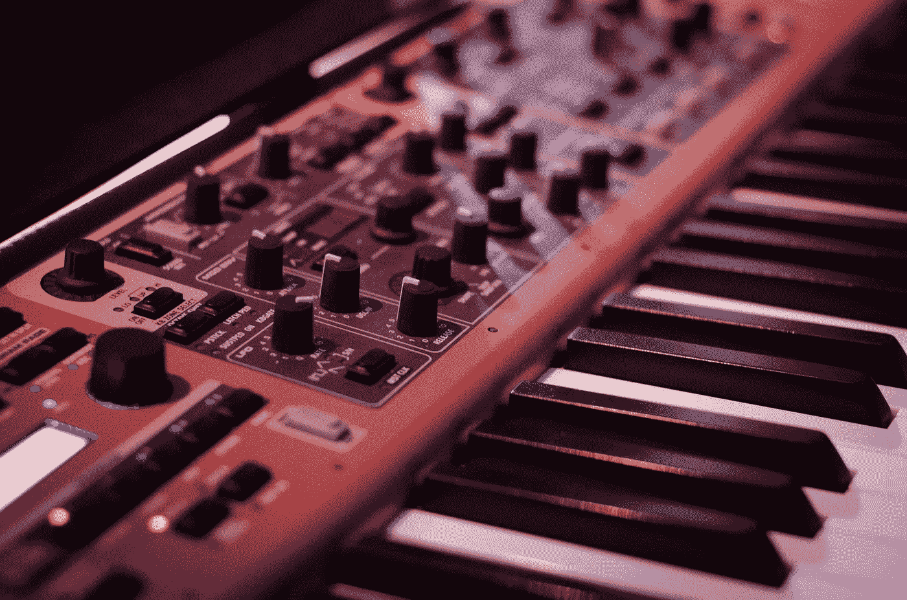
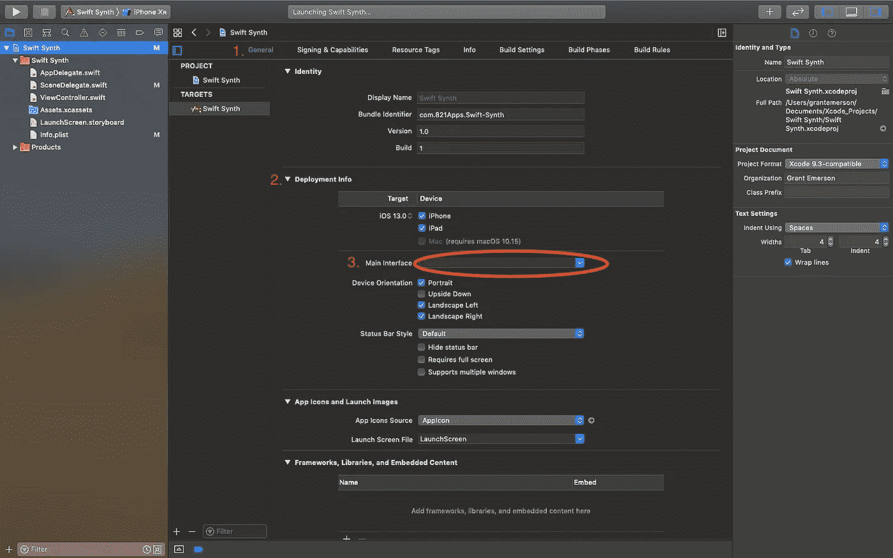
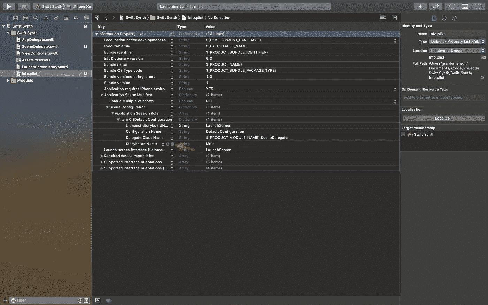

# 在 Swift 中构建合成器

> 原文：<https://betterprogramming.pub/building-a-synthesizer-in-swift-866cd15b731>

使用 AVAudioEngine 制作音频波形



一个随机合成器…

在 WWDC 19 期间，苹果通过一个短视频悄悄宣布了对 AVAudioEngine 的一些更新。

这些更新包括两个全新的 AVAudioNodes，称为 AVAudioSinkNode 和 AVAudioSourceNode。在这篇文章中，我们将重点讨论如何使用 AVAudioSourceNode 为 iOS 构建音乐合成器。

在苹果的幻灯片中，他们将这两个新节点共同定义为“*的包装器，这是一个用户定义的块，允许应用程序发送或接收来自 AVAudioEngine 的音频。*“在我们的例子中，我们将向音频信号处理网络的输出端发送音频数据。AVAudioSourceNode 提供了一个尾部闭包表达式，它接受四个参数。我们只需要最后两个，它们的类型是 AVAudioFrameCount 和 UnsafeMutablePointer(指向一个音频缓冲区列表)。闭包的返回类型是 OSStatus，它将用于指示合成器振荡器的 DSP(数字信号处理)代码是否运行顺畅。

AVAudioSourceNode 可以在实时和手动渲染模式下使用，这意味着它可以用来将音频直接写入音频文件，或者在我们的情况下，在现场环境中创建声音。

最后，苹果给了我们一个极其重要的警告:你在 AVAudioSourceNode 的块*中写的代码必须是实时兼容的*。这意味着在音频线程上，不应该初始化任何对象，也不应该分配任何内存。音频节目实时性尤其重要，因为音频编码的滞后会导致缓冲不足或溢出，从而产生咔哒声和爆裂声。这些咔哒声在现场表演中是毁灭性的，因为它们不仅会损害用户的听力，还会损害用户的扬声器。

现在，介绍完毕，让我们开始构建合成器吧！

我们将建立的应用程序的快速视频。

要跟随本教程，您需要 Xcode 11 或更高版本。如果你想在一个设备上而不是模拟器上运行你完成的应用，那个设备需要安装 iOS 13 或更高版本。

一旦你的 Xcode 是最新的，打开它并导航到**文件- >新建- >项目**。选择 **iOS** 和**单视图应用**。将**产品名称**设置为“Swift Synth”或任何您喜欢的名称。点击下一个的**，导航到您想要保存应用程序的目录，然后点击**创建**。**

让我们来做一些维护。在本教程中，我将以编程方式设计 UI。如果你喜欢，可以随意使用故事板——无论哪种方式都应该很容易理解。

项目应该已经打开到项目设置。如果您不想使用故事板，向下滚动到**常规**中的**部署信息**选项卡，并清除**主界面**右侧的文本字段。接下来，在**项目导航器**中找到 **Main.storyboard** 文件并将其删除。最后，我们需要进入 **Info.plist** 文件，删除属于**故事板名称**的字段。



按照以下步骤清除主界面。



单击箭头所指处的减号按钮，删除指示的字段。您必须通过结构向下钻取，才能到达指定的字段。

iOS 13 和 Xcode 11 的更新之一是引入了 SceneDelegate.swift，它管理你的应用程序中的各种`UIScene`**，并专门与顶级`UIWindowScene` 进行交互，以管理多个窗口。**

**为了在配置时设置根视图控制器，我们现在使用`scene willConnectTo session: UISceneSession`函数。首先，我们应该尝试将场景投射到一个`UIWindowScene`。如果成功，我们可以继续初始化`SceneDelegate`的`window`属性。**

**我们将把 windowScene 的`coordinateSpace` 的`bounds` 传递到包含一帧的初始化器中。接下来，将窗口的`windowScene`属性设置为我们之前创建的`windowScene`常量。将窗口的`rootViewController`设置为`ViewController`。**

**最后，确保调用 window 上的`makeKeyAndVisible`方法来呈现 UI。为了确保一切正常，构建并运行应用程序。您应该会看到一个空白屏幕，并且控制台中没有错误。**

**现在，打开 ViewController.swift。为了清楚起见，command 单击类名并从下拉列表中选择 rename 选项。在文本框中键入 SynthViewController 以重命名文件和类。当编程一个新的视图控制器时，我喜欢做的第一件事是用标记注释把它去掉:**

**首先创建应用程序的音频部分会更容易。创建一个新的 Swift 文件(**File->New->File**)，命名为 **Synth** 。通过导入`AVFoundation`和`Foundation`开始:**

```
**import** AVFoundation**import** Foundation
```

**然后创建一个名为 **Synth** 的类，并用相同的标记注释将其删除。您还需要创建一个初始化器，尽管我们稍后会修改它的参数:**

**我们将通过在 Synth 的定义中添加一个静态共享实例属性，使其成为一个`singleton`。这将允许我们从任何视图控制器轻松访问它:**

**现在，我们将添加一些与合成器实际音频相关的属性。第一个是`volume`属性，它允许我们模拟合成器的开关。我们合成器中最重要的变量是引擎，这是一个音频引擎。音频引擎将承载我们添加到信号链中的音频节点。最后三个是时间变量，我们将在后面详细讨论。**

**要初始化这些属性，先去初始化器，从初始化`audioEngine`开始。接下来，创建两个引用`audioEngine`的`mainMixerNode`和`outputNode`的常量。**

**第一次提到的`mainMixerNode`是连接到`outputNode`的单例。它充当源节点和`outputNode`之间的中介。**

**然后通过调用`outputNode`上总线 0 的`inputFormat`函数创建一个`format`常量。该格式将为我们提供正在使用的设备的默认音频设置。例如，我们可以通过访问格式的`sampleRate`属性来设置我们的`sampleRate`属性。如果采样率的概念对你来说是新的，我建议你快速绕道，在 youtube 上查看音频程序员关于音频软件基础的[视频](https://www.youtube.com/watch?v=PLuBamvtBZU)。**

**接下来，将`deltaTime`浮子设置为比`sampleRate`高出一个。增量时间是每个样本被保持的持续时间。例如，如果`sampleRate`是 44，100 Hz，你可以用一秒钟除以 44，100 来表示每个样本。**

**我们现在已经到了可以开始投入`AVAudioSourceNode`的时候了。**

**首先在`Synth`类定义之外定义一个叫做`Signal`的`typealias`。`Signal`将是一个闭包类型，它接受一个浮点数来表示时间，并返回一个用于音频样本的浮点数:**

```
**typealias** Signal = (Float) -> (Float)
```

**现在，在`Synth` 内部添加一个名为`signal`的`Signal`类型的变量。**

**接下来，添加一个类型为 `AVAudioSourceNode`的`sourceNode`变量。确保`lazily`初始化`sourceNode`，因为我们将在其尾随闭包中引用`self` 。您可以按 enter 键来自动完成一个基本的闭包结构。对于这两个参数，键入下划线，因为它们不是必需的。**

**最后两个应该命名为`frameCount`和`audioBufferList`。在这个块中，首先在初始化器中将一个名为`ablPointer`的指针定义为`UnsafeMutableAudioBufferListPointer`。`audioBufferList`保存了一个音频缓冲结构数组，我们将用自定义波形填充它。音频中使用缓冲区，使应用程序有 1/44，100 秒以上的时间在渲染块中生成样本。音频缓冲区通常包含 128 到 1024 个样本。**

**接下来，我们创建一个 for 循环来遍历 0 和我们的`frameCount`变量之间的索引值。**

**在音频中，帧是同时发生的样本集。在立体声音频中，每帧包含两个样本，一个用于左耳，另一个用于右耳。在我们的例子中，我们将把两个样本设置为相同的值，因为我们的合成器是单声道的。**

**在 for 循环内部，我们将通过用 Synth 的 time 属性调用我们的信号闭包来获得`sampleVal`，然后用`deltaTime`推进时间。**

**指向一个数组，这意味着我们可以这样对待它，并在一个嵌套的 for 循环中遍历它的内容。**

**对于每一个`buffer` 元素，我们必须将其转换为一个浮点指针。然后，我们可以在当前帧索引缓冲区，并将其设置为之前找到的`sampleVal`。**

**最后，如果一切顺利，不要忘记返回`noErr`。**

**我们现在可以回到初始化器，完成 Synth 的设置。**

**首先向转义`Signal`类型的名为`signal` 的初始化器添加一个参数。然后，在初始化器中，将`self.signal`设置为`signal`参数。**

**创建一个类型为`AVAudioFormat`的`inputFormat`——用格式的属性填充参数，并将通道限制为一个。然后，将`sourceNode` 附加到`audioEngine`上，为其引入音频图。**

**我们现在可以使用`inputFormat`将`sourceNode`连接到`mainMixer`。**

**最后一步是将`mainMixer`连接到`outputNode`上。您可以将`mainMixer`的`outputVolume`设置为初始值 0，因为在没有用户首先请求的情况下，它不应该发出声音。**

**最后，我们需要调用`audioEngine`上的`start`方法来初始化硬件 I/O 节点。这个函数可能会抛出一个错误，所以您需要使用 try 关键字处理该行，并将整个语句包装在 do-catch 块中。**

**既然我们已经很好地封装了 Synth 的所有属性，我们将需要一个公共的访问器方法来设置 Synth 的信号。**

```
// MARK: **Public Functions****public** **func** setWaveformTo(**_** signal: **@escaping** Signal) { **self**.signal = signal}
```

**为了开始制作音频，我们需要制作一组符合`Signal`类型的闭包表达式。让我们首先创建一个名为`Oscillator`的 swift 文件。请随意将`Signal`的 typealias 移到这个文件中，因为它应该很合适。**

**首先创建一个名为`Oscillator`的结构。给`Oscillator`添加两个静态浮点变量，分别叫做振幅和频率，分别给它们初始值 1 和 440 (Concert A)。**

```
**import** Foundation**struct** Oscillator { **static** **var** amplitude: Float = 1 **static** **var** frequency: Float = 440}
```

**让我们从构建正弦振荡器开始，因为它是最简单的。**

**在`Oscillator`中，创建一个名为`sine`的常量静态闭包表达式，带有一个用于时间的 Float 参数和一个用于它将输出的样本的 Float 返回类型。在闭合块内，计算 2 * pi * `Oscillator.frequency` * `time`的正弦。然后将输出乘以`Oscillator.amplitude`并返回结果。**

**如果你学过三角学，你会知道正弦是时间的周期函数，周期等于(2 * pi)除以 b，其中 b 是时间或 x 在被传递到函数之前要乘以的因子。在我们的例子中，b 等于(2 * pi * `Oscillator.frequency`)。这意味着我们的正弦波的周期是(1 / `Oscillator.frequency`)。这非常有意义，因为我们的频率是以赫兹或每秒周期数为单位的。如果正弦波每秒有 440 个周期，则每个周期被分配 1/440 秒。**

**我们要建立的下一个振荡器是三角波。这也将是一个常量静态闭包表达式，具有相同的参数。**

**对于三角波，我们把它分成三个部分:初始倾斜、转折点和后倾斜。我们首先通过用 1 除以`Oscillator.frequency`来计算三角波的周期。但是，因为标准库中没有内置三角形函数，所以我们必须计算当前样本相对于当前周期的位置。**

**我们可以通过将经过的总的`time`的浮点余数除以`period`来找到`currentTime`常数。例如，如果`time`当前等于 17.5，而`period`是 5，则 17.5 / 5 的余数将是 2.5。**

**有了这些信息，我们可以创建一个`value`常量来保存当前周期的进度百分比。这个百分比是用`currentTime` (2.5)除以`period` (5)得到的。这表明我们正好完成了电流波形的 50%。**

**我们可以使用`value`常数来计算`result`样本值。如果`value`小于 0.25，我们在三角形的前四分之一，从 0 到 1 倾斜。出于这个原因，我们将`result`设置为等于电流`value`的 4 倍。如果`value`大于或等于 0.25 且小于 0.75，波形从 1 下降到-1。`Result`将相等的值乘以 4 再减去 2。我们从上一个 if 语句中知道(值* 4)在 1 处结束，因此我们将从(2–1 = 1)处开始，这是峰值。最后一条 else 语句的工作方式与前两条相似。最后一步是将`result` 转换回一个`Float`并乘以`Oscillator.amplitude`。**

**接下来我们要构建的两个振荡器是锯齿波和方波。遵循与之前相同的约定，这两个都是静态闭包表达式。**

**我们还将重复使用三角波中应用的相同数学方法来查找锯齿波和方波中每个样本的位置。在锯齿振荡器中，百分比值将简单地乘以 2(0–2)。最后的`result`将是该值减 1(-1–1)并乘以`Oscillator.amplitude`。**

**在方波中，如果值小于 0.5，闭包返回负的`Oscillator.amplitude`。否则，它简单地返回`Oscillator.amplitude`。这种只有两种状态的限制产生了突然的高能跃迁，增加了一系列高次奇次谐波。**

**最后，我们将创建一个`whiteNoise` 振荡器。这是迄今为止最容易编程和理解的方法，因为它只是随机的`Float`样本值。**

**随着 Swift 4.2 的发布，像`Float`这样的原始数值类型有了一个新的静态方法，叫做 random(in:)。有了这个新功能，我们可以简单地传入一个从-1 到 1 的封闭范围(…)并乘以`Oscillator.amplitude`来获得样本。**

**太棒了，我们成功了！**

**我们现在有一个完全用 Swift 构建的 5 波形振荡器。让我们回到`SynthViewController`，这样我们可以给它一个合适的用户界面。**

**首先，我们需要一个`UISegmentedControl`在我们的波形之间切换。我用的方形图标可以在这里找到[。我没有创建这些图标，所以在没有从 NounProject 上的](https://drive.google.com/drive/folders/1Po35zw-zJwqVwSuzSNpqbc4xBha_19wv?usp=sharing)[这个艺术家页面](https://thenounproject.com/marcogaltarossa/)购买之前，请不要将它们用于商业用途。**

**我们将添加的另一个组件是 UILabel，用于显示产生的电流波形的频率和幅度。我们将惰性地初始化这些私有变量，这样我们可以在闭包表达式中访问 self，如下所示:**

**然后我们可以创建两个新的私有函数，名为`setUpView`和`setUpSubviews`。它们都将在我们的应用程序生命周期开始时在`viewDidLoad`函数中被调用。**

**让我们实现作为选择器添加到`waveformSelectorSegmentedControl`中的`updateOscillatorWaveform`函数。**

**首先，为了在`UISegmentedControl`的索引值和振荡器类型之间建立接口，在 Oscillator.swift 文件中创建一个名为`Waveform`的`Int`类型的枚举。**

**然后添加以下案例:`sine`、`triangle`、`sawtooth`、`square`、`whiteNoise`。它们应该完全按照*的顺序排列，*只要你完全按照我在`waveformSelectorSegmentedControl`声明中写的方式复制`images` 数组。**

```
**enum** Waveform: Int { **case** sine, triangle, sawtooth, square, whiteNoise}**struct** Oscillator {
...
```

**`updateOscillatorWaveform` 的实际实现会涉及到用`waveformSelectorSegmentedControl`的`selectedSegmentIndex` 属性调用`Waveform` 上的`rawValue`初始化器。**

**然后，可以用产生的`waveform`定义一个 switch 语句。对于五种情况中的每一种，用各自的`Oscillator`波形调用`Synth.shared.setWaveformTo`。**

**我们还应该快速实现一个`setPlaybackStateTo(state:)`函数来打开和关闭我们的 synth。该函数将简单地接受一个名为`state`的布尔值，并使用三元运算符将`Synth.shared.volume`设置为 0.5 或 0。**

**最后，我们使用已经包含在`UIViewController`中的触摸相关方法，允许用户操纵振荡器的音高。**

**就是这样！构建它，并在 iOS 13 设备或模拟器上运行应用程序来测试它。**

**我希望您在学习如何在 Swift 中构建 synths 的过程中度过了愉快的时光。如果你有任何错误或者我犯了任何错误，请在下面留下你的评论。**

**如果你想下载最终的 Xcode 项目，你可以在 Github [这里](https://github.com/GrantJEmerson/SwiftSynth)找到。此外，我在本教程中使用的许多代码都是在苹果的示例项目[中找到的。如果你想了解更多关于 AVAudioEngine 的新内容，你可以在这里找到 WWDC 的视频](https://developer.apple.com/documentation/avfoundation/audio_track_engineering/building_a_signal_generator)。**

**下次见！**