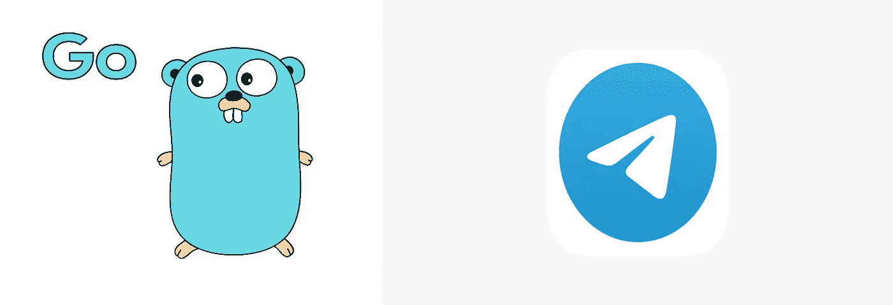
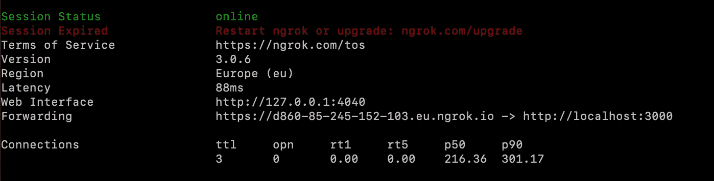
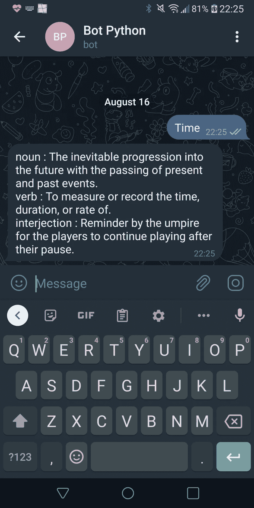
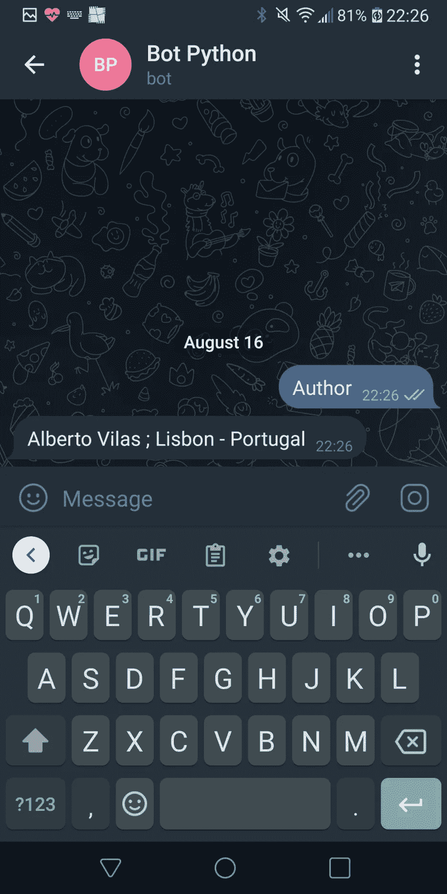

# 使用 Golang 构建电报机器人

> 原文：<https://betterprogramming.pub/building-a-telegram-bot-using-golang-dictionary-bot-497f810b491f>

## 创建一个字典机器人



在本教程中，您将学习如何轻松地在您的机器人和 Golang 程序之间进行通信。

# 目标

您的机器人将处理两种用例:

*   字典:你发送一个单词，机器人会根据这个单词的词性分类，回复不同的意思
*   作者信息:响应作者信息请求

# 创建内部电报机器人

你应该做的第一件事是在你的电报账户中创建这个机器人。要做到这一点，你需要通过聊天电话`BotFather`在你的电报中搜索，并在为你的机器人选择名称后给他们发送消息`/newbot`，然后你会收到一个令牌。这个令牌非常重要，它就像一个控制你的机器人的密码。

# 第一步

Telegram 有服务器，这些服务器作为聊天和应用程序之间的中间件，就像一个邮局，但这里没有邮政编码，而是有一个 T2。在以后的另一篇教程中，我可以更深入地探讨这一点，但是现在，这是您唯一需要知道的事情。

你应该为你的机器人创建一个处理程序，因为他需要知道应该如何回复。因此，我们将构建一个结构来处理来自电报和处理程序的请求。

在这里，您可以看到请求中包含的其他字段:[https://core.telegram.org/bots/api#update](https://core.telegram.org/bots/api#update)

你要把`YOUR_TOKEN`换成`BotFather`提供给你的令牌，所以`“bot” + YOUR_TOKEN`。

但是……他会怎么做呢？

很容易理解，每次处理程序被触发，这意味着，如果你在与你的机器人的聊天中发送消息(是的，你应该与你创建的机器人打开聊天)，他会回答你:Hello World。

# 部署你的“Hello World”机器人

我非常感谢本教程的作者[https://www.sohamkamani.com/golang/telegram-bot/](https://www.sohamkamani.com/golang/telegram-bot/),因为他帮助我理解了如何构建和部署一个机器人。

1.  从这里安装`ngrok`https://ngrok.com/download[和](https://ngrok.com/download)
2.  安装后，在终端上运行:

```
ngrok http 3000
```

3.现在，您应该能够看到您的公共 IP:



在这种情况下是:[https://d860-85-245-152-103 . eu . ngrok . io](https://d860-85-245-152-103.eu.ngrok.io)

4.打开一个新终端并运行:

```
curl -F "url=[https://d860-85-245-152-103.eu.ngrok.io](https://d860-85-245-152-103.eu.ngrok.io)"  [https://api.telegram.org/bot+YOUR](https://api.telegram.org/bot+YOUR)_TOKEN/setWebhook
```

(应在“bot”后添加您的私有令牌)

运行后，您应该会看到:

```
{"ok":true,"result":true,"description":"Webhook was set"}
```

创建一个公共 IP 并连接到您的本地 IP 3000 非常快速简单。这不是一个生产解决方案，因为`ngrok`仅允许您在 2 小时内使用免费层拥有相同的公共 IP。但无论如何，对你的发展真的很有用。

# **测试你的机器人**

去你的聊天机器人那里写点东西，机器人会回复你“你好”。

# 字典用例

我们将使用免费的字典 API，[https://dictionaryapi.dev/](https://dictionaryapi.dev/)。这是一个真正完整的 API，它为我们提供了关于含义、同义词、反义词、词性等信息。要使用它，我们应该创建一个对 API 的请求，如下例所示:

> 例如，要获得英语单词`hello`的定义，您可以发送请求到
> 
> `[https://api.dictionaryapi.dev/api/v2/entries/en/hello](https://api.dictionaryapi.dev/api/v2/entries/en/hello)`

对于本教程，我决定只使用该词的含义，但我们的想法是为语音案例的每个部分获得一个定义，例如，如果我们选择单词`TIME`，API 会找到 3 个语音部分，每个部分的第一个定义是:

*   `noun`:随着现在和过去事件的过去，不可避免地向未来发展。
*   `verb`:测量或记录时间、持续时间或速率。
*   `interjection`:裁判员提醒运动员暂停后继续比赛。

因此，在这种情况下，消息应该显示如下:

```
noun : The inevitable progression into the future with the passing of present and past events.
verb : To measure or record the time, duration, or rate of.
interjection : Reminder by the umpire for the players to continue playing after their pause.
```

执行此操作的代码:

在这段代码中，我们有 3 个函数和 1 个结构，如果你看看我以前的帖子，你会看到如何从 Json 创建一个快速结构:

[](https://medium.com/@anv7345/json-to-golang-struct-fastest-way-3fd11774fdaf) [## JSON 到 GOlang 结构(最快的方法)

### 将 Json 转换成 Golang Struct，这是最快也是最简单的方法

medium.com](https://medium.com/@anv7345/json-to-golang-struct-fastest-way-3fd11774fdaf) 

我将解释这段代码的流程:

1.  `wordsPlay(chatID int64, string_input string)` 这是这个用例的主要功能。创建请求的 url。
2.  `getWordData(url string)`接收 URL 并请求 API，在接收到结果后从先前定义的`Response` struct 创建一个 Struct。
3.  主函数(`wordsPlay`)检查字典 API 的结果是否有效，如果无效，则发送一条消息。

```
“Meaning not found for the word: “+string_input
```

如果结果有效，那么调用函数来格式化输出。

`4\. formatResponse(response Response)`接收响应对象，然后使用找到的每个词类的含义创建一个字符串，使用下面的代码:

```
for _, element := range response[0].Meanings {elem_str = element.PartOfSpeech + " : " + element.Definitions[0].Definition + "\n"str_response += elem_str}
```

5.使用`chat_id`(来自请求体，在处理函数中)向机器人发送响应

为了实现这一点，我们需要更新`Handler`代码，但是让我们实现`Author`用例。对于这个简单的例子，我们只想回复 bot 作者的名字和位置。

# Bot 代码最终版本

为了实现这一点，我们需要为这些函数创建条目。这意味着我们需要定义什么时候我们应该调用“`wordsPlay`”或“`author`”，你可以检查，截图后，完整的代码。



# 完整代码

注意:代码附带了一些日志，你可以删除它们，我将在另一个教程中解释我们如何为你的代码库创建漂亮简单的日志。

# 你的下一步

您可以创建一个机器人来提高您的写作技能，为此，您将从该 API 中检索同义词，然后当您需要编写大量文本并避免过多重复时，您可以检查一些单词的同义词。

```
**Want to Connect?**Github: [https://github.com/albertonvilas/](https://github.com/albertonvilas/)Linkedin: [https://www.linkedin.com/in/albertovilas/](https://www.linkedin.com/in/albertovilas/)
```