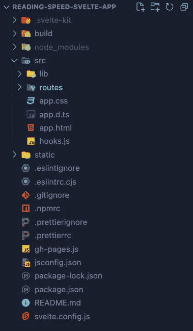

# 通过构建一个小巧的应用程序来计算你的阅读速度

> 原文：<https://betterprogramming.pub/building-a-tiny-svelte-app-64066a70074a>

## 一个单一服务的应用程序，让你看到以一定速度阅读是什么感觉

照片由[帕特里克·福尔](https://unsplash.com/es/@patrickian4?utm_source=medium&utm_medium=referral)在 [Unsplash](https://unsplash.com?utm_source=medium&utm_medium=referral) 上拍摄

我决定最终尝试一下苗条身材。我最近看了一部关于框架起源及其创造者 Rich Harris 的纪录片。那个医生让我很兴奋，所以我决定试一试。

在浏览了他们的介绍教程后，我做了一个小小的单一服务应用程序，让你看看以一定速度阅读是什么感觉。

你可以在这里查看[演示，在这里](https://yarocruz.github.io/reading-speed-svelte-app/)查看[源代码。](https://github.com/yarocruz/reading-speed-svelte-app)

***注意—*** *如果你像我一样决定使用*[*Sveltekit*](https://kit.svelte.dev/)*(而不是 Vite)来引导应用程序，如果你计划用 Github 页面托管它，那么在尝试构建站点时可能会遇到问题。*

# **我做的假设**

您的系统中安装了节点/NPM，您熟悉 NPM 安装包系统，并且您知道一些 JavaScript。

# **启动 App**

从终端类型:

这将创建具有以下文件夹结构的项目:

# 主要逻辑

app 的主要逻辑会写在`routes`文件夹的`index.svelte`文件中。在`index.svelte`文件中，删除标记中的所有`section`标签——尽管保留了`<svelte:head>`标签。

# 在