# 使用蚂蚁设计系统构建树表

> 原文：<https://betterprogramming.pub/building-a-treetable-using-ant-design-system-8048cb93afe3>

## 构建树表组件的 10 个步骤


照片由 [Prateek Katyal](https://unsplash.com/@prateekkatyal?utm_source=medium&utm_medium=referral) 在 [Unsplash](https://unsplash.com?utm_source=medium&utm_medium=referral) 上拍摄|图像高度改变

[表](https://en.wikipedia.org/wiki/Table_(information))，也称为数据网格，是行和列中的数据排列，或者可能是更复杂的结构。它是用户界面的重要组成部分。

TreeTable 是支持树状层次结构的表的扩展，通常位于第一列。作为树，层次结构是由父子关系决定的。

我们已经介绍了具有排序、过滤、分页、行选择、无限滚动和更多特性的 Ant 表。在本文中，我们将使用它的嵌套表功能构建一个 TreeTable。构建需要十个步骤，你可以一直向下滚动到最后查看最终的源代码。

# 建立工作环境

我们使用 [Create React App](/an-in-depth-guide-for-create-react-app-5-cra-5-b94b03c233f2) 作为探索 TreeTables 的基础。以下命令创建一个 React 项目:

```
% yarn create react-app react-tree-table
% cd react-tree-table
```

我们安装了三个额外的软件包:

```
% yarn add antd styled-components unique-names-generator
```

*   `[antd](/understanding-the-ant-design-system-a-ui-design-for-enterprises-39afdb188b06)` : Ant Design System 是企业级 UI 设计语言和 React UI 库的开源代码。我们使用`antd`的 Table 组件来构建一个 TreeTable。
*   `[styled-components](/styled-components-a-css-in-js-approach-755f6a196c42)`:这是一个 React 特有的 CSS-in-JS 样式化解决方案，用 JavaScript 编写 CSS 代码来样式化组件。我们使用`styled-components`来设计 TreeTable 的样式。
*   `[unique-names-generator](https://github.com/andreasonny83/unique-names-generator)`:这是一个生成独特且容易记忆的名字字符串的工具。我们使用`unique-names-generator`来生成树表内容。

安装后，这些包成为`package.json`中`[dependencies](/package-jsons-dependencies-in-depth-a1f0637a3129)`的一部分:

```
"dependencies": {
  "antd": "^5.0.0",
  "styled-components": "^5.3.6",
  "unique-names-generator": "^4.7.1"
}
```

工作环境已经准备好构建一个 TreeTable。

# 第一步:制作一个平板桌子

TreeTable 首先是一个表。让我们从下面的平面表开始:


作者图片

该表有四列:

*   `Name`:这是一个由颜色、形容词和动物连接而成的名字。名称由`uniqueNamesGenerator`生成。

```
const createName = () =>
  uniqueNamesGenerator({
    dictionaries: [colors, adjectives, animals],
    style: 'capital',
    separator: ' ',
  });
```

*   `County`:由`uniqueNamesGenerator`生成的国家名称。

```
const createCountryName = () =>
  uniqueNamesGenerator({
    dictionaries: [countries],
    style: 'capital',
  });
```

*   `Add`:增加动作是在当前行下增加一个子节点。此时，它是一个没有任何动作的纯链接。

```
render: () => <a>Add a child</a>
```

*   `Remove`:删除当前行及其子行的操作。此时，它是一个没有任何动作的纯链接。

```
render: () => <a>Remove the node</a>
```

我们构建一个方法`createNewRow`来生成一个新行，它有三个属性`key`、`name`和`country`。

```
const createNewRow = () => {
  const name = createName();
  return {
    key: name,
    name,
    country: createCountryName(),
  };
};
```

方法`createTableData`用于生成具有指定行数的表格数据(`rowCount`)。

```
const createTableData = (rowCount) =>
  Array(rowCount)
    .fill(1)
    .map(() => createNewRow());
```

将`src/App.js`修改如下:

*   在第 40 行，创建了包含 10 行的初始表。
*   在第 42–64 行，定义了表`columns`。
*   在第 67–71 行，app 返回一个表格组件，关闭`pagination`(第 68 行)，设置`columns`(第 69 行)和`dataSource`(第 70 行)。

执行`yarn start`，我们看到一个平面表。

# 步骤 2:实现添加子操作

要有一个 TreeTable，我们需要实现`Add a child`动作。单击单元格时，会在当前行下创建一个子节点。

下面是修改后的`columns`表:

*   在第 14–25 行，添加了`onCell`属性，为单元格设置属性。道具之一可以是`onClick`回调(第 16–23 行)。它还将当前行的`record`作为参数传入(第 14 行)。
*   在`antd`中，如果其`record`的`children`属性是一个记录数组(对于动态加载可以是一个空数组)，则一个表格行是一个父行。
*   在第 18 行，`record.children`被设置为`[]`，如果它还没有初始化的话。
*   在第 21 行，新生成的行被添加到`record.children`。正如我们通过改变`record.children`来改变`tableData`一样，调用`setTableData`来更新引用。

执行`yarn start`。单击第一行的`Add a child`，我们会看到一个`+`图标出现。表示`Tomato Outdoor Impala`是父母。

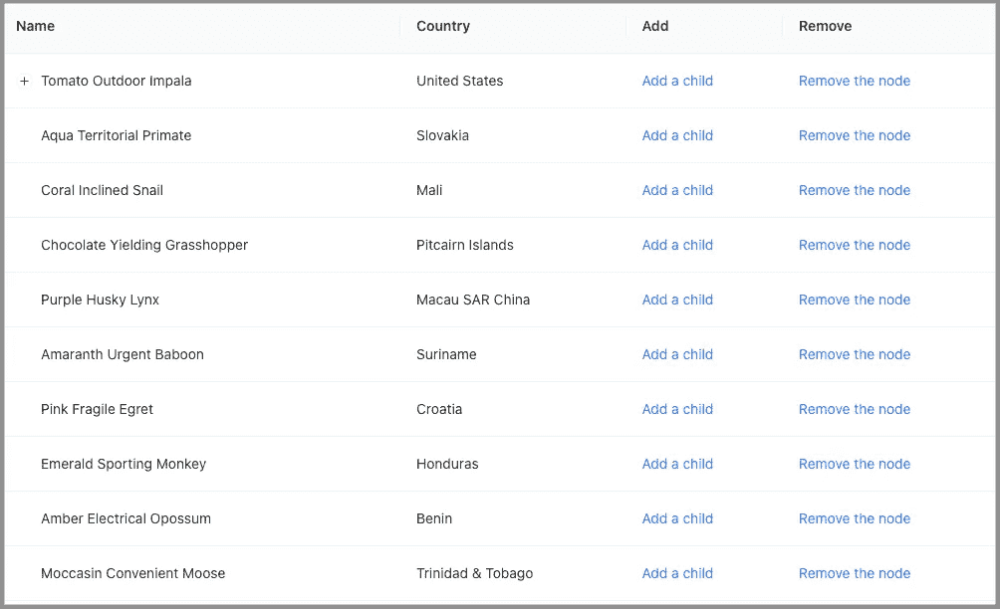

作者图片

再次点击第一行的`Add a child`，没有任何反应。新添加的孩子隐藏在`+`图标后面。

我们希望展开一个父节点，使新添加的行可见。这就引出了下一步。

# 步骤 3:展开活动父节点

我们如何展开父节点？

Table 有一个`expandable`属性来控制打开哪些父表。`expandable`是一个子表，甚至可以有一个独立的列标题。对于 TreeTable，不需要子表的列标题。相反，以下配置属性是相关的:

*   `defaultExpandAllRows`:指定是否初始展开所有行，默认值为 false。
*   `defaultExpandedRowKeys`:指定初始展开的行键，类型为`string[]`。
*   `expandedRowClassName`:指定展开行的`className`，类型为`function(record, index, indent): string`。
*   `expandedRowKeys`:指定节点打开的行键，类型为`string[]`。
*   `expandIcon`:定制行扩展图标，类型为`function({ expanded, onExpand, record })): ReactNode`。
*   `indentSize`:指定一个子树的缩进大小，类型为`number`。
*   `onExpand`:点击行扩展图标时调用的回调函数。其类型为`function(expanded, record)`。
*   `onExpandedRowsChange`:是一个回调函数，当展开的行发生变化时调用。它的型号是`function(expandedRows)`。

在 TreeTable 中，`expandedRowKeys`用于控制树节点是否展开。在`expandedRowKeys`中有键的行被展开。否则，这些行将被折叠。因为我们控制了`expandedRowKeys`，所以每当用户单击一个行扩展图标时，它的值都需要被管理。

```
expandable={{
  expandedRowKeys,
  onExpandedRowsChange: (expandedRows) => {
    setExpandedRowKeys(expandedRows);
  },
}}
```

下面是改进后的`src/App.js`:

*   在第 8 行，创建了州名`expandedRowKeys`。
*   在第 32 行，新添加的孩子的父关键字被添加到`expandedRowKeys`。
*   在第 52–57 行，定义了表格的`expandable`属性。

执行`yarn start`。每当我们添加一个子节点时，父节点就会自动展开。

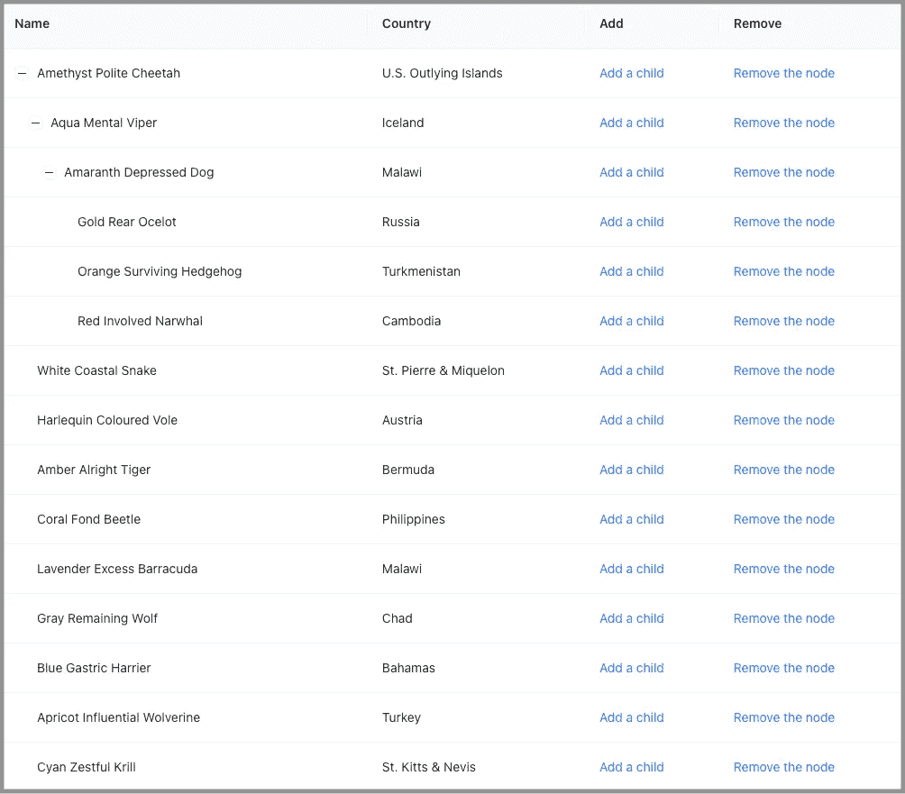

作者图片

我们可以看到更多的孩子。但是，加了几个孩子之后，我们就搞不清哪个是新加的了。TreeTable 需要进一步改进。

# 第 4 步:突出显示新添加的孩子

有许多方法可以设置行的样式。为了简单起见，我们使用表的`rowSelection`来突出显示新添加的行。如果配置了工作台的`rowSelection`属性，则选中的行会高亮显示。在`rowSelection`的众多道具中，我们设定了其中的两个:

*   `selectedRowKeys`:指定选中的行键，类型为`string[]`。
*   `type`:指定类型，不是`checkbox`就是`radio`。默认值为`checkbox`。

我们为`rowSelection`选择`radio`，因为`radio`不允许多选。

```
rowSelection={{ selectedRowKeys, type: 'radio' }}
```

这纯粹是黑。或者，我们可以使用`className`突出显示该行。可以根据其键是否等于将在下一步中定义的`newRowKey`来有条件地设置`className`。

下面是修改后的`src/App.js`:

*   在第 9 行，创建了状态`selectedRowKeys`。
*   在第 34 行，新创建的子密钥被添加到`selectedRowKeys`。
*   在第 52 行，定义了表格的`rowSelection`属性。
*   在第 59 行，当用户单击行扩展图标时，清除高亮显示。

执行`yarn start`。新添加的孩子被突出显示。

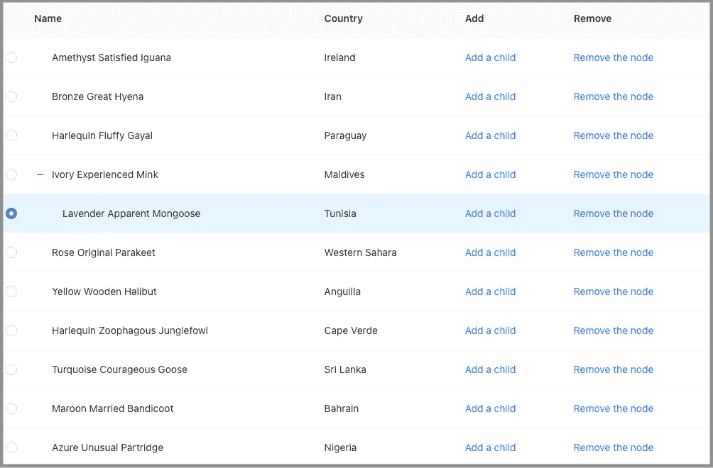

作者图片

如果我们继续添加更多的孩子，最终，新添加的孩子就看不见了。

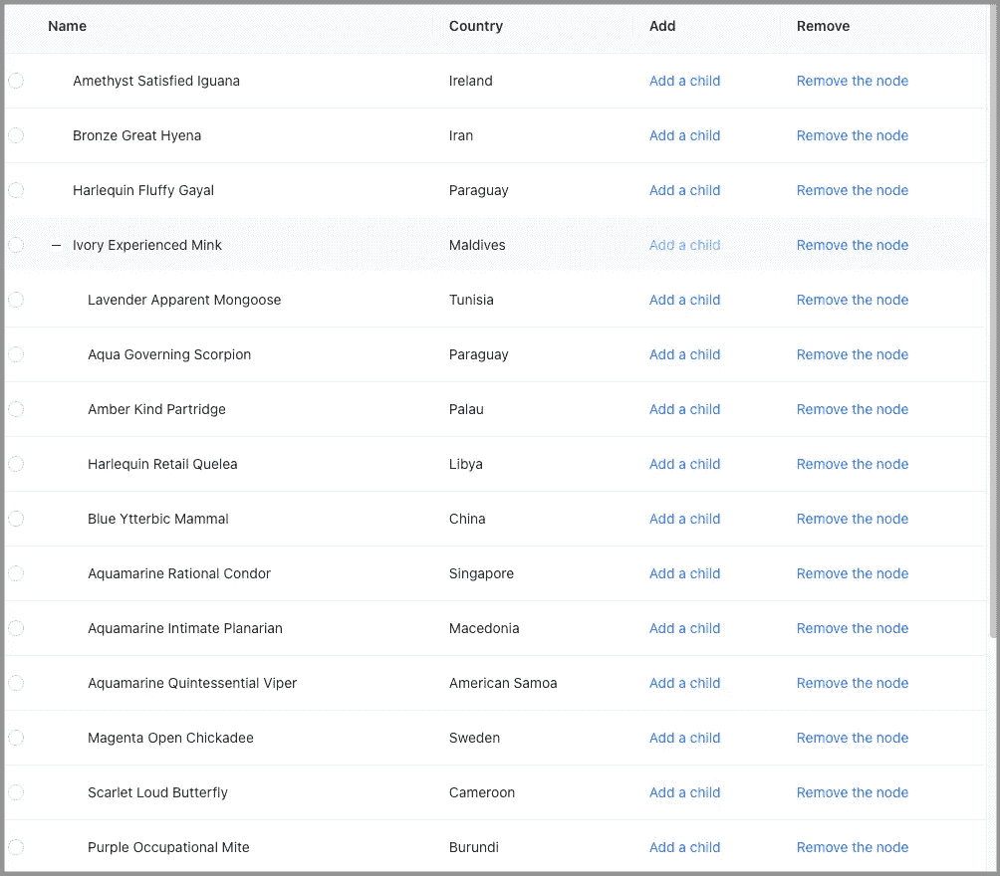

作者图片

我们需要另一项改进。

# 步骤 5:将新添加的孩子滚动到视图中

JavaScript 元素有一个方法`scrollIntoView()`，该方法滚动其祖先的容器以使元素可见。

它有三种格式:

*   `scrollIntoView()`:没有参数，滚动到祖先容器的顶部。
*   `scrollIntoView(alignToTop)` : `alignToTop`为布尔值。如果为 true，则滚动到祖先容器的顶部。否则，它将滚动到祖先容器的底部。
*   `scrollIntoView(scrollIntoViewOptions)` : `scrollIntoViewOptions`是具有以下属性的对象:
    –`behavior`:定义过渡动画，可以是`auto`或`smooth`，默认值为`auto`。
    –`block`:定义垂直对齐，可以是`start`、`center`、`end`或`nearest`，默认值为`start`。
    –`inline`:定义水平对齐，可以是`start`、`center`、`end`或`nearest`，默认值为`nearest`。

`scrollIntoView(true)`相当于`scrollIntoViewOptions({block: "start", inline: "nearest"})`。`scrollIntoView(false)`相当于`scrollIntoViewOptions({block: "end", inline: "nearest"})`。

使用`scrollIntoView`，可以将新添加的孩子滚动到视图中。

下面是修改后的`src/App.js`:

*   在第 9 行，创建了状态`newRowKey`。
*   在第 12-19 行，当`newRowKey`改变时`useEffect`被调用。它找到新添加的行元素(第 14–16 行)，并调用`scrollIntoView`(第 17 行)将其滚动到视图中。
*   在第 44 行，用新添加的孩子的`key`更新`newRowKey`。
*   在第 71 行，在行扩展改变时清除`newRowKey`。

执行`yarn start`。持续点击行上的`Add a child`、`Olive Personal Owl`，新添加的孩子总是在视野中。

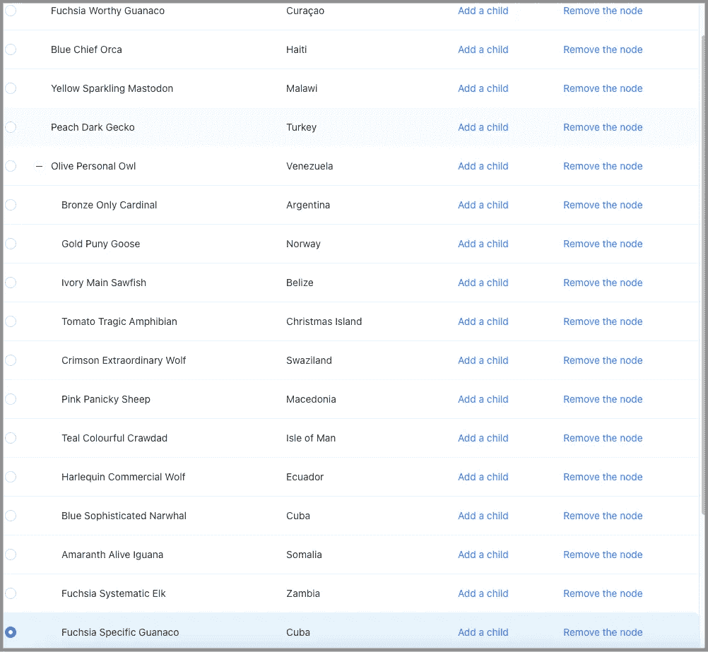

作者图片

# 步骤 6:实现删除节点操作

我们有`Add a child`在工作。下一步是让`Remove the node`发挥作用。

`removeRowFromTableData`是一个从输入列表`data`中删除带有特定`key`的行的方法。这种方法有两个用例:

*   如果某行没有父行，则该行将从表数据中删除。在这种情况下，数据是`tableData`。
*   如果某行有父行，则该行将从其父行的子列表中移除。这种情况下，数据是`record.parent.children`。

```
const removeRowFromTableData = (data = [], key) => {
  if (key) {
    const index = data.findIndex((item) => item.key === key);
    if (index !== -1) {
      data.splice(index, 1);
    }
  }
};
```

下面是修改后的表格`columns`:

*   要知道`record.parent`,`Add`列`onCell`的`onClick`回调(第 14–29 行)为新添加的孩子(第 21 行)保存了一个父引用。
*   在第 36–55 行，`Remove`列添加了`onCell`属性。它的回调函数`onClick`处理移除操作。如果`record`有一个父节点，它将从父节点的子节点列表中移除(第 41 行)。否则，从`tableData`(第 46 行)中删除。
*   在第 42–44 行，它删除了一个空的`children`。这将删除父节点的扩展图标。
*   在第 48–52 行，组件的状态被更新:
    –`tableData`被更新为一个新的引用(第 48 行)。
    –`expandedRowKeySet`通过删除`record.key`(第 49–50 行)进行更新。
    –`newRowKey`更新为`undefined`(第 51 行)。
    –`selectedRowKeys`更新为`[]`(第 52 行)。

执行`yarn start`。点击某一行上的`Remove the node`，该行及其子行(如果有)将被删除。

# 步骤 7:为可树表的子对象实现有角度的线条

这是一个展开了多个父节点的树表。

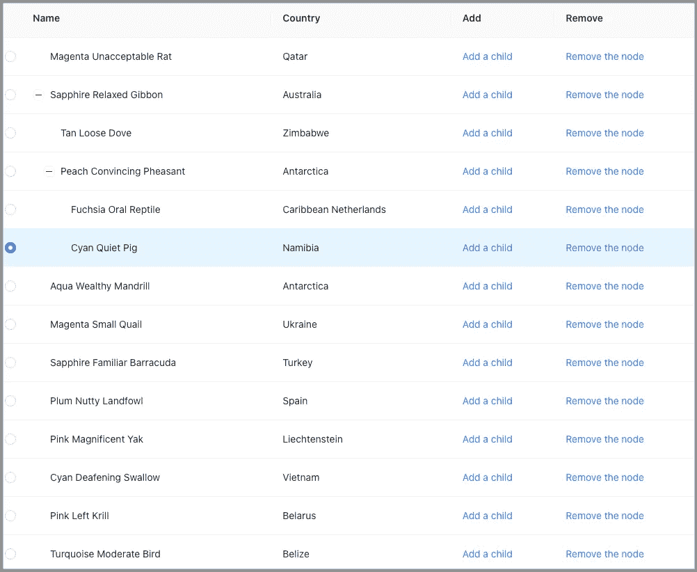

作者图片

当列表很长时，将父母和他们的孩子联系起来可能并不简单。我们想要添加从父母指向他们的孩子的有角度的线。

这里是图标，`EnterOutlined`。

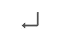

作者图片

我们沿着 x 轴翻转它，以显示从父节点到每个子节点的关联。


作者图片

这里是`src/App.js`与角度线的变化:

*   在第 8–22 行，定义了一个`Container`来托管第 60 行的表。`Container`确保内容不换行。如果溢出部分没有足够的空间，它将被隐藏并显示一个椭圆。
*   在第 24–33 行，图标`EnterOutlined`沿 x 轴翻转成一条有角度的线。
*   在第 46–51 行，`render`被添加到`Name`列。如果`record`有一个父节点，那么`FlippedEnterIcon`会被添加到名字的前面(第 48 行)。

执行`yarn start`。使用有角度的线，父子关系看起来更清晰。

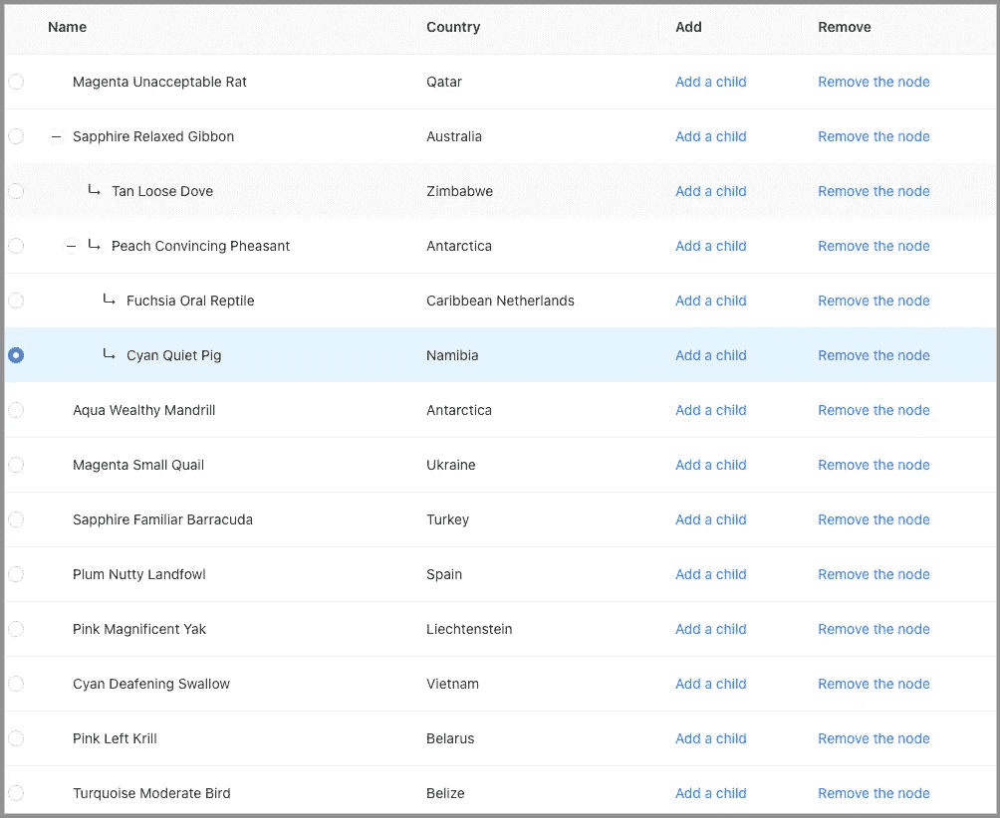

作者图片

# 步骤 8:实现 TreeTable 的总计数

对于部分展开的 TreeTable，很难判断有多少行(节点)。如果显示总数会有所帮助。

我们需要一种计算计数的方法。

```
const getTableRowCount = (data = []) =>
  data.reduce(
    (count, item) =>
      item.children ? count + getTableRowCount(item.children) + 1 : count + 1,
    0
  );
```

下面是更新后的`App`组件:

*   在第 6 行，创建了状态`tableNodeCount`。
*   在第 10 行，当`tableData`改变时`useEffect`被调用。它重新计算计数并更新`tableNodeCount`。
*   在第 18–22 行，定义了表格的`footer`属性，其中显示`tableNodeCount`(第 20 行)。
*   在第 34 行，最大垂直高度被设置为`700px`，以保持`footer`可见。

执行`yarn start`。将显示总计数，无论树节点是展开还是折叠，总计数都不会改变。

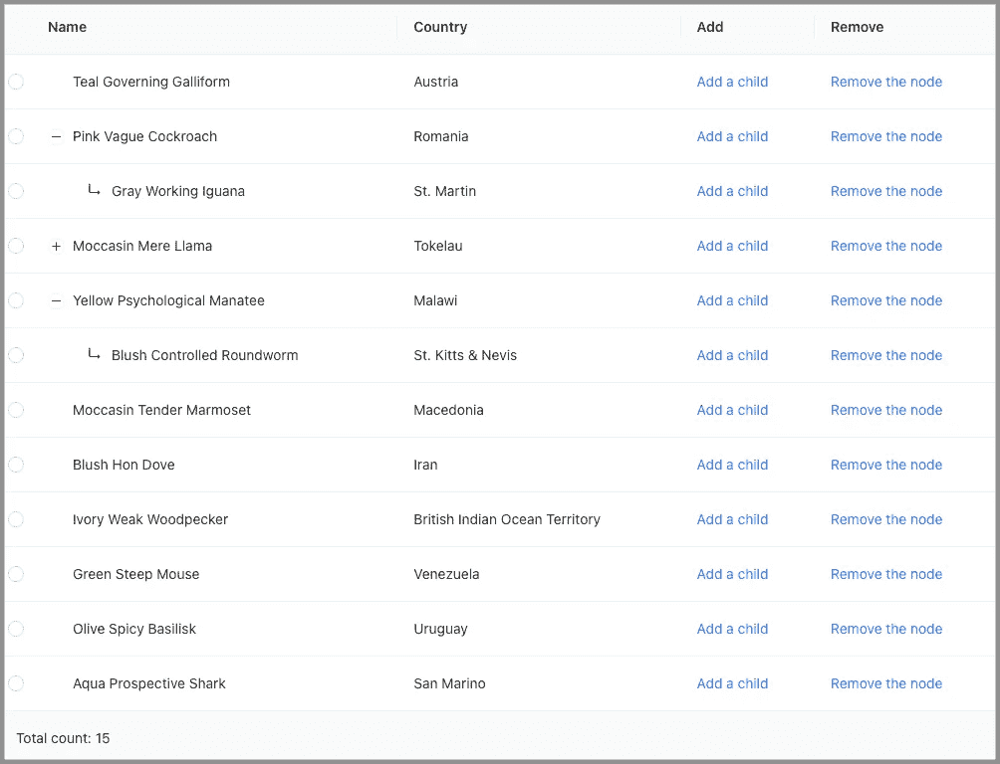

作者图片

# 步骤 9:实现全部打开和全部折叠按钮

树表中还缺少什么吗？

是的，如果我们有`Open All`和`Collapse All`按钮来一键打开或折叠所有的树节点就好了。

点击`Collapse All`按钮清除所有状态。

```
<ButtonAction
  onClick={() => {
    setExpandedRowKeys([]);
    setSelectedRowKeys([]);
    setNewRowKey();
  }}
>
  Collapse All
</ButtonAction>
```

`Open All`按钮需要一个方法来获取所有的父节点键。

```
const getAllParentNodeKeys = (data = []) =>
  data.reduce(
    (list, item) =>
      item.children
        ? [...list, item.key, ...getAllParentNodeKeys(item.children)]
        : list,
    []
  );
```

那么它可以定义如下:

```
<ButtonAction
  onClick={() => {
    setExpandedRowKeys(getAllParentNodeKeys(tableData));
    setSelectedRowKeys([]);
    setNewRowKey();
  }}
>
  Open All
</ButtonAction>
```

以下是完整的`src/App.js`:

*   在第 29–31 行，它设计了一个动作按钮，在左侧有一个`10px`间距。
*   在第 184–206 行，`footer`包括`Open All`按钮(第 187–195 行)和`Collapse All`按钮(第 196–204 行)。

执行`yarn start`。`Open All`和`Collapse All`按钮在`footer`可用，连同总计数。

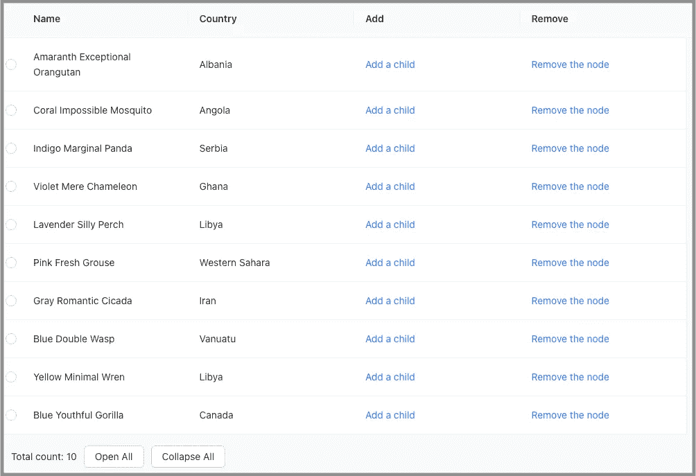

作者图片

# 第十步:分解成不同的文件

上面的 TreeTable 代码可以工作，但是它违反了设计原则，关注点分离。我们应该将长的`src/App.js`分成不同的部分，每一部分解决一个单独的问题。

我们把上面的`src/App.js`分解成三个文件。

```
src
├── App.js
├── TreeTable.js
└── utils.js
```

*   `src/App.js`:这是一个使用 TreeTable 组件的应用程序。

*   `src/utils.js`:这是一个提供帮助器方法的 util 集合。

*   `src/TreeTable`:是 TreeTable 实现。

完整的示例位于[这个资源库](https://github.com/JenniferFuBook/react-tree-table)中，这里有一个[故事书链接](https://jenniferfubook.github.io/react-tree-table/?path=/story/tree-table-story--tree-table-story)用于现场演示。

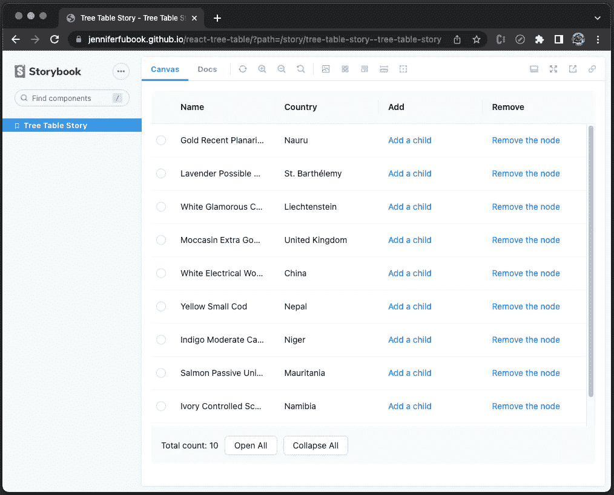

作者图片

[本文](/build-advanced-react-input-fields-using-styled-components-and-storybook-js-a231b9b2438#e765-bf98276875df)描述了如何设置 storybook 来显示组件，以及如何通过 GitHub 页面将它放到网上。

# 结论

使用 Ant Design System 的嵌套表功能构建一个树表需要十个步骤。TreeTable 可以在当前行下添加子级。添加子节点时，父节点将自动打开。新添加的孩子被突出显示(从单选按钮中选择)并滚动到视图中。删除一行将删除该行及其所有子行(如果有)。

TreeTable 页脚显示节点总数，无论这些树节点是打开的还是折叠的。页脚也有按钮`Open All`和`Collapse All`所有树节点。

感谢阅读。

> 感谢李依琳、S·斯里拉姆、苏什米塔·艾萨、彭德里·拉克西米·普拉桑纳和悉达多·钦塔帕利与我一起在“树桌”上工作。

```
**Want to Connect?**

If you are interested, check out [my directory of web development articles](https://jenniferfubook.medium.com/jennifer-fus-web-development-publications-1a887e4454af).
```