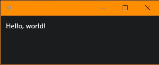
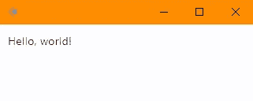
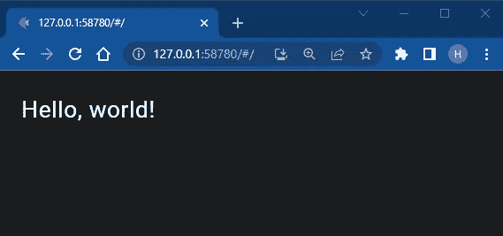
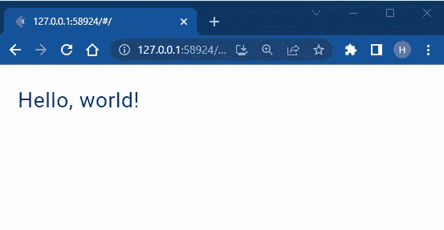
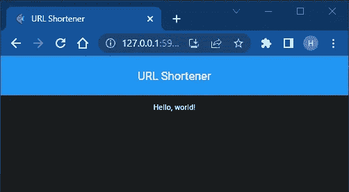
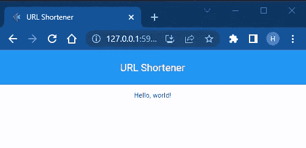
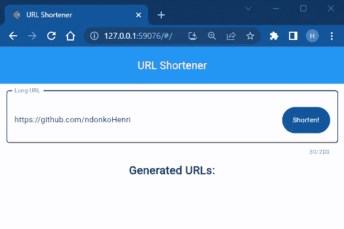
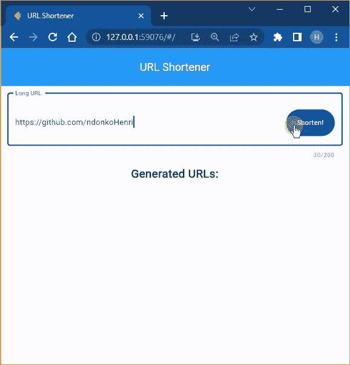

# 用 Flet Python 框架构建 URL Shortener Flutter App

> 原文：<https://betterprogramming.pub/building-a-url-shortener-flutter-app-with-flet-python-framework-fffa1d98a53e>

## 用 Python 构建跨平台的 Flutter 应用


[斯蒂夫·约翰森](https://unsplash.com/@steve_j?utm_source=medium&utm_medium=referral)在 [Unsplash](https://unsplash.com?utm_source=medium&utm_medium=referral) 上拍照

在我的上一篇文章中，我们看了如何用 Flet 构建一个 Markdown 编辑器 flutter 应用程序。

今天，我们将使用 Flet 来构建一些非常不同且有用的东西。URL/链接缩短应用程序。向下滚动到本文末尾，查看最终结果。:)

# 项目的依赖项

对于这个项目，我们只需要两个 python 包: [Flet](https://flet.dev/docs/guides/python/getting-started#installing-flet-module) 和 [Pyshorteners](https://pyshorteners.readthedocs.io/en/latest/index.html) 。

Flet 将是负责 UI 构建和渲染的前端人员，而 Pyshorteners 将是负责缩短给定 URLs 链接的后端人员。

由此，您已经可以理解 Flet 可以与您选择的任何 Python 库(在我们的例子中是 pyshorteners)相结合。

# 安装我们的依赖项

请确保您已经安装了 [Python](https://www.python.org/) (最好是 3.7 或更高版本)，然后在您的终端/命令行中运行这两个命令:

```
pip install flet
pip install pyshorteners
```

我建议您在虚拟环境中这样做。

安装完成后，创建一个新文件并随意命名(例如:my-url-shortener)并运行这个基本的“Hello，World！”使用您最喜欢的 IDE 编写代码，以确保一切顺利。

```
import flet as ft

def main(page: ft.Page):
    page.add(ft.Text(value="Hello, world!"))

ft.app(target=main)
```



你好世界——黑暗模式



Hello World —灯光模式

在本文中，我将用别名`ft`导入 Flet，就像 Numpy 通常的别名`np`或熊猫`pd`一样。

该代码块的执行会打开一个包含呈现输出的本机窗口。因为我们将处理链接，所以让我们在 web 浏览器中呈现输出。为此，修改最后一行代码，如下所示:

```
ft.app(target=main, view=ft.WEB_BROWSER)  # add 'port' parameter to specify the port to be used
```



浏览器中的 Hello World 黑暗模式



浏览器中的 Hello World 轻量模式

# 用户界面(UI)

这个项目的用户界面将是简单明了的。我们需要一个文本字段来获取用户输入(网址/链接)，并有一个按钮来验证输入。
该输入将被发送到后端进行处理，输出将作为文本显示在屏幕上。

我们还将有一个按钮来复制生成的缩短链接，另一个按钮用于在浏览器选项卡中打开/查看链接。很刺激，对吧？

# 应用程序基础

让我们给我们的应用程序一个标题，并添加一个应用程序栏。

```
import flet as ft

def main(page: ft.Page):
    page.title = "URL Shortener"   # title of application/page
    page.horizontal_alignment = "center"     # center our page's content (remove or change at wish)

    page.appbar = ft.AppBar(
        title=ft.Text("URL Shortener", color=ft.colors.WHITE),    # title of the AppBar, with a white color
        center_title=True,          # we center the title
        bgcolor=ft.colors.BLUE,     # a color for the AppBar's background
    )

    page.add(ft.Text(value="Hello, world!"))    # some placeholder content (nothing will be shown without this line)

ft.app(target=main, view=ft.WEB_BROWSER)  # add 'port' parameter to specify the port to be used
```



浏览器中带有标题和应用程序栏的 Hello World 黑暗模式



浏览器中带有标题和应用程序栏的 Hello World 光模式

在执行你的程序后，你应该会看到类似上面的图片。

因为默认情况下 [Flet 使用你系统的主题](https://flet.dev/docs/controls/page#theme_mode)。为了保持一致，我们使用灯光主题。所以，让我们显式地设置`theme_mode`。

```
#...
def main(page: ft.Page):
    page.theme_mode = "light"    # there are only 3 possible values: "dark", "light" and "system"
    #...
```

我省略了一些代码行(使用#…)以节省空间。

# 获取用户的输入

我前面提到过，我们将为此使用一个文本字段。

让我们创建一个，将其存储在名为`text_field`的变量中，并将其添加到我们的页面/UI 中。

```
 # ...
    page.appbar = ft.AppBar(
        # ...
    )

    text_field = ft.TextField(
        value='https://github.com/ndonkoHenri',  # a test link
        label="Long URL",  # the field's label
        hint_text="type long url here",  # the field's hint-text
        max_length=200,  # the maximum length of inputted links
        keyboard_type="url",  # the field's  keyboard type
        suffix=ft.FilledButton("Shorten!"),  # a button in the field, to shorten the inputted links
    )

    page.add(
        text_field,
        ft.Text("Generated URLs:", weight="bold", size=23)
    )  # add our text field to the page/UI

# ...
```

现在执行程序后，您应该会看到类似下面的内容:



用户输入集合的文本字段

# 输出显示

在继续之前，让我们在 Flet 下面导入 pyshorteners 并初始化它。

```
import flet as ft
import pyshorteners  # pip install pyshorteners

shortener = pyshorteners.Shortener()    # create an instance (initialization)
# ...
```

现在，当缩短一个输入的长 URL 时，我们将显示一个包含三个主要内容的`Row`:一个缩短的链接、一个复制按钮和一个在浏览器标签中打开缩短的链接的按钮。

这个`Row`会显示几次，所以我们需要创建一个隔离的可重用的组件。我们将创建一个 Python 类，并把它放在`shortener`变量下面。

```
# ...

class ShortLinkRow(ft.Row):
    # a row containing the shortened url, and two buttons ('copy', and 'open in browser')

    def __init__(self, shortened_link, link_source):
        """
        We create a new class called `ShortenedLinkRow` that inherits from `ft.Row`.
        The constructor takes two arguments/parameters: `shortened_link` and `source`.

        :param shortened_link: the shortened link
        :param link_source: the service hosting the shortened_link
        """
        super().__init__()  # required when overwriting the constructor

        self.tooltip = link_source  # set the tooltip of the row itself to the link provider/source
        self.alignment = "center"   # center the contents of this row

        # the controls/content of our Row
        self.controls = [
            ft.Text(value=shortened_link, size=16, selectable=True, italic=True),
            ft.IconButton(
                icon=ft.icons.COPY, # the icon to be showed
                on_click=lambda e: self.copy(shortened_link),   # when this button is clicked, call the `copy` method, passing the shortened link as parameter
                bgcolor=ft.colors.BLUE_700,
                tooltip="copy"  # to be showed when hovering on this button
            ),
            ft.IconButton(
                icon=ft.icons.OPEN_IN_BROWSER_OUTLINED, # the icon to be showed
                tooltip="open in browser",  # to be showed when hovering on this button
                on_click=lambda e: e.page.launch_url(shortened_link)    # when this button is clicked, open a browser tab with that shortened link
            )
        ]

    def copy(self, value):
        """
        It copies the given value to the clipboard, and opens a Snackbar to inform the user.
        :param value: The value to be copied to the clipboard
        """
        self.page.set_clipboard(value)
        self.page.show_snack_bar(
            ft.SnackBar(
                ft.Text("Link copied to clipboard!"),
                open=True
            )
        )
```

完成这些后，我们现在需要监听文本字段中的事件，以便我们可以在适当的时候显示输出。

我们将听到“提交”按钮的点击声，并在文本字段成为焦点时按下键盘上的“Enter”键。当其中一个事件发生时，Flet 将运行一个名为`shorten`的特定函数，我们稍后将创建这个函数。

对您的`text_field`变量进行如下修改:

```
text_field = ft.TextField(
        # ...
        suffix=ft.FilledButton("Shorten!", on_click=shorten),   # the function to be called when this button will be clicked
        on_submit=shorten  # the function to be called once the user presses the Enter keyboard key to submit entry
    )
```

现在让我们创建回调函数，并将其添加到主函数中。

```
# ...(below page.appbar assignment)

def shorten(e):
    """Grabs the URL in the textfield, and displays shortened versions of it."""

    user_link = text_field.value     # retrieve the content of the textfield

    if user_link:  # if the textfield is not empty
        # if the entered text in the textfield is not a valid URl, the program may break, hence the need to catch that
        try:
            page.add(ft.Text(f"Long URL: {user_link}", italic=False, weight='bold'))
            page.add(ShortLinkRow(shortened_link=shortener.tinyurl.short(user_link), link_source="By tinyurl.com"))
            page.add(ShortLinkRow(shortened_link=shortener.chilpit.short(user_link), link_source="By chilp.it"))
            page.add(ShortLinkRow(shortened_link=shortener.clckru.short(user_link), link_source="By clck.ru"))
            page.add(ShortLinkRow(shortened_link=shortener.dagd.short(user_link), link_source="By da.dg"))

        except Exception as exception:  # the error might be that a url shortening service from pyshorteners failed to shorten our url
            print(exception)
            # inform the user that an error has occurred
            page.show_snack_bar(
                ft.SnackBar(
                    ft.Text("Sorry, but an error occurred. Please retry, or refresh the page."),
                    open=True
                )
            )

    else:  # if the textfield is empty (no text)
        # inform the user
        page.show_snack_bar(
            ft.SnackBar(
                ft.Text("Please enter a URL in the field!"),
                open=True
            )
        )
# ...
```

如果你迷路了，请检查这个[要点以获得完整的代码](https://gist.github.com/ndonkoHenri/7a11c1d6bd39e6d06619d3c76e01b9af)。以下是最终结果的截图:



我为你在这里部署了这个应用的在线版本[。测试一下，让我知道你的印象。](https://url-shorten.fly.dev/)

请注意，您最终可以[将该应用打包为独立的可执行文件](https://flet.dev/docs/guides/python/packaging-desktop-app)或[将其部署在 web 上](https://ndonkohenri.medium.com/deploying-a-flet-app-for-free-on-cloudflare-pages-e56ecc6ce450)。这正是 Flet 的跨平台特性。

# 轮到你了

要使该项目更好或更先进，请尝试以下方法:

*   添加垂直滚动页面的可能性
*   公开更多来自 pyshorteners 的 [URL 缩短 API(在本文中我只公开了四个，但有十多个可用)](https://pyshorteners.readthedocs.io/en/latest/apis.html)
*   [更改应用程序中使用的字体](https://flet.dev/docs/controls/page#fonts)。

如果卡住了可以用[这个](https://github.com/ndonkoHenri/Flet-Samples/tree/master/URL%20shortener)作为参考/解决方案。请让我知道你是否试过或有任何问题。我很乐意帮忙。

感谢阅读！